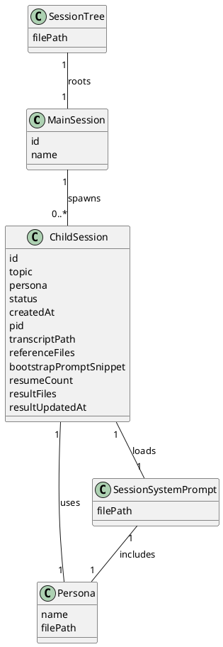
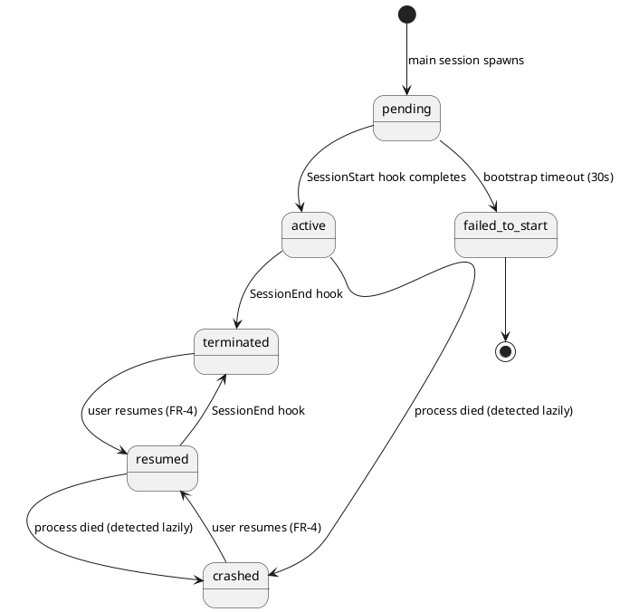
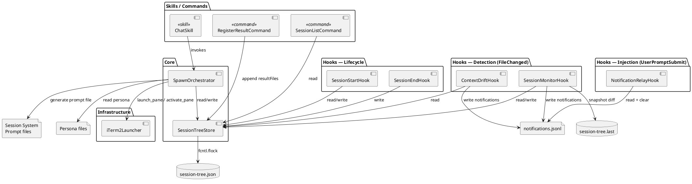
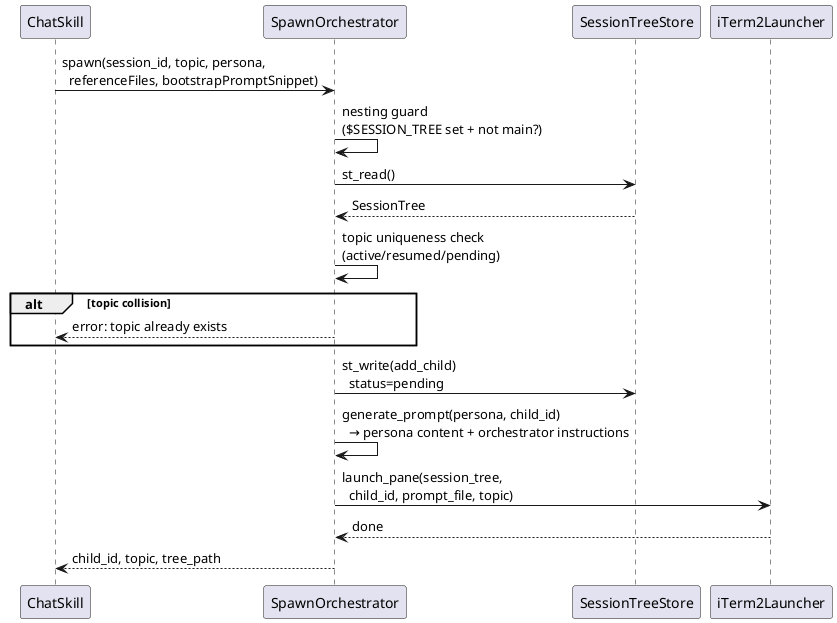
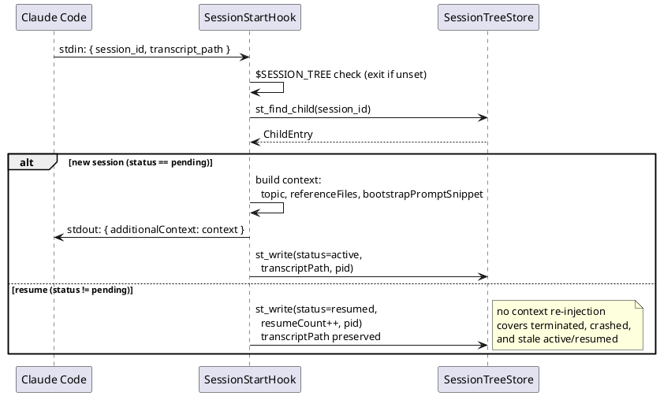

# Specification: Agent Orchestrator
> Source: [agent-orchestrator.usecase.md](./agent-orchestrator.usecase.md)

## Overview
An agent orchestrator that enables the main session to spawn, manage, and collect results from child sessions — each a dedicated interactive conversation running in a separate iTerm2 tab. Child sessions are user-facing interactive sessions, not background automation. Each child session is configured with a persona (pre-made prompt file) that determines its conversational stance, combined with orchestrator instructions for result delivery behavior.

The orchestrator extends Claude Code's interactive session model with a two-level session hierarchy. Components collaborate through a file-based data store (`session-tree.json`) and Claude Code's hook infrastructure. All inter-session communication flows through `session-tree.json` — no direct IPC, no sockets, no shared memory.

### Notification mechanism

Several FRs reference "hook notification" or "injecting context." The mechanism uses a two-stage pipeline:

1. **Detection stage (FileChanged hook):** Detects changes and writes notifications to a queue file (`notifications.jsonl`). Also outputs a `systemMessage` via universal JSON output for immediate user visibility. FileChanged hooks do **not** support `additionalContext` — they cannot inject context into Claude's conversation directly.
2. **Injection stage (UserPromptSubmit hook — NotificationRelayHook):** On each user message, reads the notification queue, injects accumulated notifications into Claude's context via `additionalContext`, then clears the queue.

This means notifications reach the user immediately (via `systemMessage`) but reach Claude on the next user message (via `additionalContext`). Accepted trade-off for the hook model constraints.

**Exception:** SessionStart hooks **do** support `additionalContext` directly — used by SessionStartHook for initial context injection on new sessions.

This is distinct from the `bootstrapPromptSnippet` field in session-tree.json, which stores a free-form context fragment assembled into the child session's prompt at startup.

## Technology Stack

| Category | Choice | Rationale |
|----------|--------|-----------|
| Language | Python | Hook scripts, skill scripts — consistent with existing codebase |
| Runtime | uv | Script execution per CLAUDE.md convention |
| Session management | Claude Code CLI | `--session-id`, `--resume`, `--append-system-prompt-file` (verified: used in existing `spawn_session.py`) |
| Terminal | iTerm2 (`it2` CLI + `iterm2` Python API) | Session creation and activation (verified: used in existing `iterm2_launcher.py`) |
| File locking | `fcntl.flock()` | Concurrent session-tree.json access (verified: used in existing `session_tree.py`) |

---

## Functional Requirements

### Use Case Reference

| FR | UC Source | Title |
|----|----------|-------|
| FR-1 | UC-2, UC-14 | Child session spawn with context handoff |
| FR-2 | UC-6 | Control session termination |
| FR-3 | UC-8, UC-9, UC-10 | Result file registration and delivery |
| FR-4 | UC-11 | Resume child session |
| FR-5 | UC-19 | List child sessions |
| FR-6 | UC-20 | Detect context drift |
| FR-7 | UC-21 | Monitor session-tree changes |

**Removed from previous spec (not in UC scope):**
- Old FR-16 (conversation-first behavioral layer) — not an orchestration capability; delivered separately as a persona file
- Old FR-18 (child session result delivery on termination) — deprecated; replaced by FR-2/FR-3
- Old FR-19 (child session conversation history investigation) — not in UC scope

### [FR-1]. Child session spawn with context handoff
> Use Case: [UC-2], [UC-14]

**Type:** Non-UI

**Trigger:**
1. User requests via natural language (e.g., "open a session to discuss this design")
2. Main session LLM suggests and user approves
3. User invokes `/chat` skill

**Input:**
- Topic (required) — serves as the session name for identification; must be unique among non-terminated child sessions
- Persona (required) — one of the pre-made persona prompt files (e.g., `discuss`)
- Reference file paths (optional)
- Context summary — main session LLM compiles from current conversation (relevant artifacts, problem statement, constraints, prior decisions)

**Processing:**
1. Main session generates a child session ID (UUID)
2. If an `active`, `resumed`, or `pending` child session with the same topic already exists, prompt the user to choose a different name or reuse the existing session (→ FR-4 resume). Terminated, crashed, and failed_to_start entries do not block the topic name.
3. Create `session-tree.json` with `mainSession` entry if it doesn't exist (first spawn)
4. Generate a Session System Prompt file at `.claude/sessions/<main-id>/<child-id>.prompt.txt`:
   - Persona content (from pre-made file, e.g., `prompts/discuss.txt`)
   - Orchestrator instructions (result delivery behavior: identify deliverables before ending, notify user of key outputs)
5. Record child entry (id, topic, persona, reference files, bootstrap prompt snippet, status=pending) to `session-tree.json`
6. Launch a new Claude Code session in a new iTerm2 tab via `it2` CLI with `SESSION_TREE=<path>` and `--session-id <uuid>` and `--append-system-prompt-file <combined-prompt>`
7. Child session's SessionStart hook fires:
   - Reads its own entry from session-tree.json (matches by session_id from stdin)
   - Injects context into conversation (reference files, summary) via hook stdout
   - Writes back transcriptPath, pid, status=active
8. Main session confirms the child session reached `active` status (via session-tree.json). If not reached within 30s, FR-7's handshake timeout marks it `failed_to_start` and notifies the user.
9. User is notified that the session is ready

**Output:** An interactive child session running in a new iTerm2 tab with persona + context pre-loaded. The main session continues without blocking.

**Error handling:**
- iTerm2 not running → error message to user
- Conversation ID unavailable → abort spawn, inform user
- Persona file not found → inform user, ask to pick another
- Topic collision with non-terminated session → prompt user to rename or resume existing
- Child session doesn't reach `active` within 30s → FR-7 marks `failed_to_start`, user notified
- Spawn attempted from a child session (`$SESSION_TREE` is set and current session is not the main session) → reject with error: child sessions cannot spawn further children

**Dependencies:** None (foundational FR)

### [FR-2]. Control session termination
> Use Case: [UC-6]

**Type:** Non-UI

**Trigger:** User indicates they want to end the child session conversation

**Processing:**
1. Child session LLM (guided by orchestrator prompt instruction in Session System Prompt) summarizes what was accomplished
2. Child session LLM prompts user to identify deliverables (→ FR-3) if any files were created or modified
3. User confirms termination
4. Session ends (Ctrl+D or exit)
5. SessionEnd hook marks status=terminated in session-tree.json
6. The status change in session-tree.json triggers the FileChanged hook on the main session (FR-7), which notifies the main session of the termination and any registered result files

**Orchestrator prompt instruction** (baked into Session System Prompt from FR-1):
- When user signals wrap-up, summarize accomplishments before ending
- If files were created or modified during the session, ask the user if any should be registered as deliverables
- Never prevent the user from ending — the user always has final say

**Output:** Session terminated; main session notified

**Error handling:**
- User closes terminal without graceful flow (Ctrl+D mid-conversation) → SessionEnd hook still fires, marks terminated; unregistered deliverables can be recovered by resuming the session (FR-4) and registering then

**Dependencies:** [FR-1] (child session must exist), [FR-3] (result registration)

### [FR-3]. Result file registration and delivery
> Use Case: [UC-8], [UC-9], [UC-10]

**Type:** Non-UI

> **Note:** UC-8 describes automatic background tracking where "no file change is missed." This FR intentionally replaces that with LLM-assisted recall at wrap-up + manual `/register-result`. Completeness is best-effort — context compaction may cause the LLM to forget files from early in a long session. This trade-off was chosen to avoid the complexity of real-time PostToolUse tracking.

**Trigger:** LLM invokes `/register-result` during child session (typically at wrap-up, but can be invoked anytime)

**Input:** One or more file paths to register as deliverables

**Processing:**
1. `/register-result` skill script receives file paths as arguments
2. Script appends file paths to `resultFiles` in the child entry of session-tree.json (deduplicated)
3. Script updates `resultUpdatedAt` in session-tree.json child entry
4. The session-tree.json change triggers the FileChanged hook on the main session (FR-7), which reads the updated child entry and notifies the main session of new deliverables

**Orchestrator prompt instruction** (in Session System Prompt from FR-1):
- At wrap-up, recall files you created or modified and suggest them as deliverables
- On user approval, invoke `/register-result <file1> <file2> ...`
- User can also explicitly request registration anytime during the session

**Output:** Main session notified of registered deliverables with file paths

**Error handling:**
- No arguments provided → inform user of usage: `/register-result <file1> [file2] ...`
- File path doesn't exist → warn user, skip that path
- session-tree.json write failure → notify user
- Context compaction causes LLM to forget early files → accepted trade-off; user can manually specify files

**Dependencies:** [FR-1] (child session must exist)

### [FR-4]. Resume child session
> Use Case: [UC-11]

**Type:** Non-UI

**Trigger:** User requests by session name (e.g., "reopen design-review")

**Input:** Child session topic (name)

**Processing:**
1. Main session looks up `topic` in session-tree.json `children[]`
2. If not found → show available sessions (→ FR-5 list), ask user to pick
3. If session is `active` or `resumed` (still running) → inform user the session is already running and activate its existing iTerm2 session (tab or pane, via iTerm2 Python API) instead of launching a duplicate
4. If multiple terminated matches → disambiguation list (topic, createdAt, status)
5. Launch iTerm2 tab: `SESSION_TREE=<path> claude --resume <child-id> --append-system-prompt-file <child-id>.prompt.txt`
6. SessionStart hook fires (source: `resume`):
   - Updates status to `resumed` and increments `resumeCount`
   - Updates `pid`
   - Does NOT re-inject context (already in conversation history)
   - Does NOT update `transcriptPath` (same transcript file, appended to)
7. User is notified the session is ready

**Output:** Resumed child session with full conversation history, in a new iTerm2 tab.

**Error handling:**
- Topic not found → show available sessions
- Session already active → inform user, activate existing iTerm2 session
- Transcript missing → inform user, cannot resume
- Session System Prompt file missing → regenerate from persona + orchestrator instructions

**Dependencies:** [FR-1] (child session must have been spawned previously)

### [FR-5]. List child sessions
> Use Case: [UC-19]

**Type:** Non-UI

**Trigger:** User invokes `/sessions` in the main session

**Input:** None

**Processing:**
1. `/sessions` skill script reads session-tree.json
2. Formats and outputs all child entries

**Output:** Formatted list:

```
Child Sessions:

  design-review    active      2026-04-04 10:00
    Persona: discuss
    References: design-doc.md, requirements.md
    Results: (none)

  api-spec         terminated  2026-04-03 15:30  (resumed 2x)
    Persona: review
    References: api-design.md
    Results: api-spec.md, endpoints.md

  auth-flow        crashed     2026-04-04 09:00
    Persona: discuss
    References: auth-flow.usecase.md
    Results: (none)
```

Fields per entry: topic, status, createdAt, resumeCount (if > 0), persona, referenceFiles, resultFiles

**Error handling:**
- session-tree.json doesn't exist → "No child sessions yet"
- No children entries → "No child sessions yet"

**Dependencies:** [FR-1]

### [FR-6]. Detect context drift
> Use Case: [UC-20]

**Type:** Non-UI

**Trigger:** A file listed in the child session's `referenceFiles` is modified externally (by another session, editor, or tool)

**Processing:**
1. FileChanged hook fires in the child session (matcher omitted or `".*"` — matches all files; regex on basename)
2. Hook script checks `$SESSION_TREE` — exits early if not set (main session)
3. Reads `session_id` from stdin, looks up own entry in session-tree.json via `$SESSION_TREE`
4. Compares `file_path` from stdin against `referenceFiles`
5. If no match → exit (irrelevant file change)
6. If match → writes notification to queue file, outputs `systemMessage` for immediate user visibility. Claude receives the notification on the next user message via NotificationRelayHook.

**Output:** User is notified immediately via `systemMessage`. Claude is notified on next user message via `additionalContext` (NotificationRelayHook). User decides how to proceed.

**Error handling:**
- session-tree.json unreadable → exit silently, no notification
- `referenceFiles` empty → exit early (nothing to watch)

**Dependencies:** [FR-1] (child session with referenceFiles)

### [FR-7]. Monitor session-tree changes
> Use Case: [UC-21] (primary), also serves as the notification hub for [FR-2] (termination) and [FR-3] (deliverable registration)

**Type:** Non-UI

> **Note on UC-21:** UC-21 mentions notifying the user of "any partial output that was produced." This FR intentionally excludes partial output — the notification only reports that the session ended unexpectedly. The user can resume the session (FR-4) to inspect what was produced.

**Trigger:** Main session's FileChanged hook on session-tree.json fires (any session-tree.json modification)

**Processing:**
1. FileChanged hook (matcher: `session-tree.json`) fires on any session-tree.json change in the main session
2. **Change detection:** Hook maintains a snapshot file (`session-tree.last`) alongside session-tree.json. Reads current state and compares against the snapshot. Only emits notifications for state transitions since the last invocation. Updates the snapshot after processing.
3. **Crash detection (UC-21):** Scans all `active` and `resumed` entries:
   - `kill -0 <pid>` fails → mark `crashed`, notify. Note: PID reuse by an unrelated process is a theoretical false-negative risk, accepted for a single-user system.
4. **Handshake timeout (UC-21):** Scans all `pending` entries:
   - `createdAt` older than 30s → mark `failed_to_start`, notify
   - Note: if no subsequent session-tree.json modification occurs within 30s of spawn, the timeout is not detected until the next user action that modifies session-tree.json (e.g., `/sessions`, spawning another child). Accepted limitation.
5. **Termination notification (FR-2):** Detects status change to `terminated` (comparing against snapshot):
   - If `resultFiles` exist → "Session `<topic>` terminated. Results: file1.md, file2.md"
   - If no `resultFiles` → "Session `<topic>` terminated. No result files registered. You can resume it to register deliverables."
6. **Deliverable notification (FR-3):** Detects `resultUpdatedAt` change (comparing against snapshot) → read updated `resultFiles`, notify of new deliverables
7. Writes notifications to queue file, outputs `systemMessage` for immediate user visibility. Claude receives notifications on the next user message via NotificationRelayHook.

**Output:** Main session user is informed immediately via `systemMessage`. Claude is informed on next user message via `additionalContext` (NotificationRelayHook). Actionable context:
- Crash/timeout → user knows to resume or move on
- Termination with results → user knows deliverables are available
- Termination without results → user knows they can resume to register
- New deliverables → user knows what was registered mid-session

**Error handling:**
- Detection is lazy — only fires on session-tree.json changes. If no other session activity triggers a write, the crash goes undetected until user queries `/sessions` (FR-5) or spawns/resumes a session.

**Dependencies:** [FR-1]

### session-tree.json Discovery

The main session locates its session-tree.json via the `${CLAUDE_SESSION_ID}` skill template variable (official Claude Code variable, available in all sessions; verified: used in existing `/chat` skill and [Claude Code docs](https://code.claude.com/docs/en/skills.md#available-string-substitutions)). All slash commands (`/chat`, `/sessions`, resume) derive the path: `.claude/sessions/${CLAUDE_SESSION_ID}/session-tree.json`. This is the same session ID that hooks receive via `session_id` in stdin JSON.

### session-tree.json Schema

```json
{
  "mainSession": {
    "id": "<main session UUID>",
    "name": "<user-assigned name; optional, reserved for future use>"
  },
  "children": [
    {
      "id": "<child session UUID>",
      "topic": "<session name>",
      "status": "pending | active | terminated | crashed | failed_to_start | resumed",
      "createdAt": "<ISO 8601>",
      "pid": 12345,
      "persona": "<persona name>",
      "transcriptPath": "<from SessionStart hook>",
      "resultFiles": ["<registered deliverables>"],
      "resultUpdatedAt": "<ISO 8601>",
      "referenceFiles": ["<file paths>"],
      "bootstrapPromptSnippet": "<free-form context text from main session, assembled by SessionStart hook into the injected prompt>",
      "resumeCount": 0
    }
  ]
}
```

### Open Questions
- None at this time

---

## Domain Model

### Domain Glossary

| Concept | Definition | Key Attributes | Related FRs |
|---------|-----------|----------------|-------------|
| Main Session | A session started by the user from CLI (`claude`); root of a session tree | id, name | FR-1, FR-4, FR-5, FR-7 |
| Child Session | A session spawned from a main session; always belongs to exactly one main session. No nesting — child sessions cannot spawn further children | id, topic, persona, status, createdAt, pid, transcriptPath, referenceFiles, bootstrapPromptSnippet, resumeCount, resultFiles, resultUpdatedAt | FR-1, FR-2, FR-3, FR-4, FR-5, FR-6, FR-7 |
| Session Tree | A persistent manifest that records one main session and all its child sessions, serving as the single source of truth for session discovery, status tracking, and inter-session notification trigger. Stored at `.claude/sessions/<main-id>/session-tree.json` | filePath | FR-1, FR-3, FR-4, FR-5, FR-6, FR-7 |
| Persona | A pre-made prompt file that determines a child session's conversational stance (e.g., `discuss.txt`). One of the two ingredients of a Session System Prompt | name, filePath | FR-1 |
| Session System Prompt | A dynamically generated per-session file that merges a Persona with orchestrator instructions (result delivery behavior, wrap-up guidance). Loaded via `--append-system-prompt-file` at session launch and resume | filePath | FR-1, FR-2, FR-4 |

**Removed from previous domain model:**
- Interactive Prompt — replaced by Persona + Session System Prompt
- Injected Skill — replaced by Persona
- Session Change Record — removed; `resultFiles` stays in session-tree.json child entry

### Concept Relationships



- **SessionTree → MainSession (1:1)**: A session tree always has exactly one main session.
- **MainSession → ChildSession (1:0..*)**: A main session spawns zero or more child sessions. No nesting.
- **ChildSession → Persona (1:1)**: Every child session uses exactly one persona.
- **ChildSession → SessionSystemPrompt (1:1)**: Every child session loads a Session System Prompt at launch and resume.
- **SessionSystemPrompt → Persona (1:1)**: The Session System Prompt includes the persona content plus orchestrator instructions.

### State Transitions

#### Child Session



- **pending**: Child entry created in session-tree.json, iTerm2 tab launched, SessionStart hook not yet completed.
- **active**: SessionStart hook completed — transcriptPath and pid recorded, user is interacting.
- **terminated**: SessionEnd hook fired. Result files, if any, have been registered before termination. Not a final state — can be resumed.
- **crashed**: FileChanged hook (FR-7) lazily detected that the child process is no longer alive (`kill -0 <pid>` fails) while status was `active` or `resumed`. Not a final state — can be resumed.
- **failed_to_start**: FileChanged hook (FR-7) lazily detected that status remained `pending` for longer than 30 seconds. Final state — cannot be resumed (no transcript exists).
- **resumed**: User resumed a terminated or crashed session via FR-4. `resumeCount` incremented. Behaves like `active` — session is running, user is interacting.

Main Session and Session Tree do not have domain-level state transitions.

---

## Architecture

### External Dependencies

| External System | Used By | Purpose |
|----------------|---------|---------|
| iTerm2 (`it2` CLI + `iterm2` Python API) | FR-1, FR-4 | Terminal pane creation, existing session activation |
| Claude Code CLI | FR-1, FR-4 | Session start (`--session-id`), resume (`--resume`), prompt loading (`--append-system-prompt-file`) |

All inter-session communication flows through `session-tree.json` — no direct IPC, no sockets, no shared memory.

### Component Overview



### Components

#### SessionTreeStore

**Responsibility:** Data access layer for session-tree.json. Provides atomic read-modify-write with file locking.

**Data:** `session-tree.json`, `session-tree.last` (snapshot for SessionMonitorHook)

**Public API:**

| Operation | Caller(s) | Description |
|-----------|-----------|-------------|
| `st_read()` | All components | Shared-lock read; returns empty SessionTree if file absent |
| `st_write(transform)` | SpawnOrchestrator, Hooks, RegisterResultCommand | Exclusive-lock atomic read-modify-write |
| `st_find_child(id)` | Hooks | Convenience: `st_read().find_child(id)` |

**Spec changes from current code:**
- `ChildEntry` schema: `skill` → `persona`, `resultPatterns` removed, `resumeCount` / `resultUpdatedAt` / `bootstrapPromptSnippet` added
- `status` enum: `resumed` and `failed_to_start` added

#### SpawnOrchestrator

**Responsibility:** Child session creation flow — topic uniqueness check, entry registration, Session System Prompt generation, iTerm2 launch. Also handles resume flow dispatch.

**File:** `skills/chat/scripts/spawn_session.py`

**Spawn flow (FR-1):**



**Resume flow dispatch (FR-4):**

| Child status | pid alive? | Action |
|---|---|---|
| `active` / `resumed` | Yes | `activate_pane(topic)` — focus existing pane |
| `active` / `resumed` | No | `launch_pane(resume=True)` — status is stale, actually crashed |
| `terminated` / `crashed` | — | `launch_pane(resume=True)` |
| `failed_to_start` | — | Resume not possible (no transcript) — inform user and offer to create new session with same topic (uniqueness check already excludes `failed_to_start`) |

**Interface (CLI args):**

| Parameter | Required | Description |
|-----------|----------|-------------|
| `--session-id` | Yes | Main session ID (`${CLAUDE_SESSION_ID}`) |
| `--topic` | Yes | User-provided session name |
| `--persona` | Yes | Persona file name (e.g., `discuss`) |
| `--reference-files` | No | Comma-separated file paths |
| `--bootstrap-prompt-snippet` | No | LLM-generated context summary |

**`generate_prompt()` (internal function):** Reads the persona file from `prompts/<persona>.txt`, appends orchestrator instructions (result delivery behavior, wrap-up guidance), writes the combined file to `.claude/sessions/<main-id>/<child-id>.prompt.txt`.

#### iTerm2Launcher

**Responsibility:** iTerm2 terminal operations — create panes, activate existing panes.

**File:** `hooks/lib/iterm2_launcher.py`

**Interface:**

| Function | Input | Description |
|----------|-------|-------------|
| `launch_pane(*, session_tree, session_id, prompt_file, title, plugin_dir?, resume=False)` | session params | Creates vertical split pane. `resume=False` → `claude --session-id`, `resume=True` → `claude --resume` |
| `activate_pane(topic)` | topic name | Iterates all iTerm2 tabs/panes, finds pane where `name == topic`, calls `async_activate()` |

#### SessionStartHook

**Responsibility:** Child session bootstrap on startup and resume.

**File:** `hooks/session_start_bootstrap.py`

**Trigger:** SessionStart (every session start; no-op unless `$SESSION_TREE` is set and session_id matches a child entry)



#### SessionEndHook

**Responsibility:** Marks child session as terminated.

**File:** `hooks/session_end_collector.py`

**Trigger:** SessionEnd (child sessions only — `$SESSION_TREE` guard)

**Processing:** Sets `status = "terminated"` for the matching child entry. The session-tree.json change triggers SessionMonitorHook (FR-7) on the main session side.

**No spec changes from current code.**

#### SessionMonitorHook

**Responsibility:** Main session notification hub — detects child session status changes via snapshot diffing. Writes notifications to queue file + outputs `systemMessage` for immediate user visibility.

**File:** `hooks/session_monitor.py`

**Trigger:** FileChanged (matcher: `session-tree.json`) on main session

**Detections:**

| Condition | Action | Notification |
|-----------|--------|-------------|
| `active`/`resumed` + pid dead | → `crashed` | "Session X crashed" |
| `pending` + >30s | → `failed_to_start` | "Session X failed to start" |
| status → `terminated` (with results) | — | "Session X terminated. Results: ..." |
| status → `terminated` (no results) | — | "Session X terminated. No results. Resume to register." |
| `resultUpdatedAt` changed | — | "Session X registered new deliverables: ..." |

**Output:** Writes notifications to `notifications.jsonl` (for NotificationRelayHook to inject into Claude context). Also outputs `systemMessage` in JSON stdout for immediate user visibility.

**Spec changes from current code:**
- Crash detection: add `resumed` status (not just `active`)
- Deliverable notification: detect via `resultUpdatedAt` change (not just active status + resultFiles diff)
- Notification delivery: `additionalContext` → notification queue file + `systemMessage` (FileChanged does not support `additionalContext`)

#### ContextDriftHook

**Responsibility:** Detects when a referenced file is modified externally. Writes notification to queue file + outputs `systemMessage` for immediate user visibility.

**File:** `hooks/context_drift.py` (new)

**Trigger:** FileChanged (matcher omitted or `".*"` — matches all files; regex on basename) on child sessions

**Processing:**
1. `$SESSION_TREE` check → exit if unset
2. `st_find_child(session_id)` → get referenceFiles
3. Compare `file_path` from stdin against referenceFiles
4. If match → write notification to queue file, output `systemMessage`: "Referenced file \<name\> has been modified externally."
5. If no match → exit

**Matcher:** Omitted or `".*"` (regex on basename — matches all files). Script-side filtering against referenceFiles. Matcher cannot be per-session, so broad match + script comparison is the chosen trade-off.

**Main session exclusion:** Main session's session_id is `mainSession.id`, which `st_find_child()` won't find → early exit.

#### NotificationRelayHook

**Responsibility:** Reads notification queue and injects unread notifications into Claude's context via `additionalContext`. Uses a cursor file for crash-safe delivery tracking.

**File:** `hooks/notification_relay.py` (new)

**Trigger:** UserPromptSubmit (every user message, in both main and child sessions)

**Processing:**
1. Determine queue and cursor file paths:
   - If `$SESSION_TREE` is set → child session: `<session-tree-dir>/<session_id>.notifications.jsonl` / `.cursor`
   - If `$SESSION_TREE` is not set → main session: `.claude/sessions/<session_id>/notifications.jsonl` / `.cursor`
2. Read cursor file → `lastLine` (default 0 if absent)
3. Read queue file from line `lastLine + 1` onward
4. If no new entries → exit
5. Combine `message` fields from all new entries
6. Output `{ "additionalContext": "<combined messages>" }` to stdout
7. Update cursor file with new `lastLine`

**Queue file paths:**

| Session | Queue | Cursor |
|---|---|---|
| Main | `.claude/sessions/<main-id>/notifications.jsonl` | `.claude/sessions/<main-id>/notifications.cursor` |
| Child | `.claude/sessions/<main-id>/<child-id>.notifications.jsonl` | `.claude/sessions/<main-id>/<child-id>.notifications.cursor` |

**Interface:**

| Operation | Direction | Input | Output |
|---|---|---|---|
| hook trigger | Claude Code → NotificationRelayHook | stdin: `{ session_id }` | stdout: `{ additionalContext }` (if unread entries exist) |

**Error handling:**
- Queue file unreadable or absent → exit silently
- Cursor file absent → start from line 0 (read all)
- Queue file locked by writer → retry once, then skip

### Notification Queue Schema

Two separate schemas for main and child session queues.

**Main session notifications** (written by SessionMonitorHook):

```jsonl
{"ts": "2026-04-06T10:00:00Z", "type": "crash", "childId": "uuid", "topic": "design-review", "message": "Session design-review crashed — process no longer alive"}
{"ts": "2026-04-06T10:01:00Z", "type": "terminated", "childId": "uuid", "topic": "design-review", "resultFiles": ["spec.md"], "message": "Session design-review terminated. Results: spec.md"}
```

| Field | Required | Description |
|---|---|---|
| `ts` | Yes | ISO 8601 timestamp |
| `type` | Yes | `crash` \| `failed_to_start` \| `terminated` \| `deliverable` |
| `childId` | Yes | Child session UUID |
| `topic` | Yes | Child session topic |
| `resultFiles` | No | Registered deliverable paths (`terminated`, `deliverable` types) |
| `message` | Yes | Human-readable notification text |

**Child session notifications** (written by ContextDriftHook):

```jsonl
{"ts": "2026-04-06T10:00:00Z", "type": "context_drift", "file": "design-doc.md", "message": "Referenced file design-doc.md has been modified externally"}
```

| Field | Required | Description |
|---|---|---|
| `ts` | Yes | ISO 8601 timestamp |
| `type` | Yes | `context_drift` |
| `file` | Yes | Changed reference file path |
| `message` | Yes | Human-readable notification text |

**Cursor file** (`notifications.cursor`):

```json
{"lastLine": 5}
```

**Common contract:** NotificationRelayHook reads only the `message` field from both schemas to compose `additionalContext`.

#### RegisterResultCommand

**Responsibility:** Registers deliverable file paths from a child session into session-tree.json.

**File:** `skills/register-result/SKILL.md` + `scripts/register_result.py`

**Type:** Command (skill with `disable-model-invocation: true`, shell injection)

**SKILL.md:**
```yaml
---
description: Register deliverable files from this child session
disable-model-invocation: true
argument-hint: <file1> [file2] ...
---
!`uv run ${CLAUDE_SKILL_DIR}/scripts/register_result.py ${CLAUDE_SESSION_ID} $ARGUMENTS`
```

**Script interface:**
- `sys.argv[1]` → session_id (from `${CLAUDE_SESSION_ID}`)
- `sys.argv[2:]` → file paths
- `os.environ["SESSION_TREE"]` → session-tree.json path

**Processing:** Validates file existence, appends to `resultFiles` (deduplicated), updates `resultUpdatedAt`. The session-tree.json change triggers SessionMonitorHook (FR-7).

**Error handling:**
- `$SESSION_TREE` unset → "This command is only available in child sessions"
- No arguments → "Usage: /register-result \<file1\> [file2] ..."
- File doesn't exist → warn, skip that path

**Replaces:** `post_tool_result_collector.py` (PostToolUse hook with resultPatterns — to be removed)

#### SessionListCommand

**Responsibility:** Lists all child sessions and their status.

**File:** `skills/sessions/SKILL.md` + `scripts/list_sessions.py`

**Type:** Command (skill with `disable-model-invocation: true`, shell injection)

**SKILL.md:**
```yaml
---
description: List child sessions and their status
disable-model-invocation: true
---
!`uv run ${CLAUDE_SKILL_DIR}/scripts/list_sessions.py ${CLAUDE_SESSION_ID}`
```

**Script interface:**
- `sys.argv[1]` → session_id (derives session-tree.json path: `.claude/sessions/<id>/session-tree.json`)

**Output format:** See FR-5 for the formatted list structure.

**Error handling:**
- session-tree.json doesn't exist → "No child sessions yet"
- No children entries → "No child sessions yet"

#### ChatSkill

**Responsibility:** Multi-step conversational flow for spawning a child session. LLM-orchestrated — gathers topic, persona, reference files, generates context summary, then invokes SpawnOrchestrator.

**File:** `skills/chat/SKILL.md` + `scripts/spawn_session.py`

**Type:** Skill (LLM reasoning required)

**Spec changes from current code:**
- Step 2: `skill` selection → `persona` selection (from pre-made persona files)
- Step 5: `result patterns` selection → removed
- Execute args: `--skill` → `--persona`, `--result-patterns` removed, `--additional-context` → `--bootstrap-prompt-snippet`
- Nesting guard: reject `/chat` in child sessions (`$SESSION_TREE` set + not main session)

---

## Revision History

### Revision 0 — 2026-03-30

Initial spec based on STORY-based requirements (STORY-7 through STORY-18). Covered FR-16 through FR-23 with full domain model and architecture. See git history for details.

### Revision 1 — 2026-04-04

#### Decisions Made
- Realigned spec to new use case document (agent-orchestrator.usecase.md revision 12, 10 UCs)
- Renumbered all FRs from FR-1 to FR-7 (clean numbering)
- Replaced skill injection with persona selection — child sessions use pre-made persona prompt files loaded via `--append-system-prompt-file`
- Session System Prompt file generated dynamically at spawn: persona + orchestrator instructions
- Removed `resultPatterns` — result file identification is purely conversational (LLM recall at wrap-up + `/register-result` slash command)
- Removed per-session `<session-id>.json` (Session Change Record) — `resultFiles` stays in session-tree.json child entry
- Session resume reuses entry (status → `resumed`, `resumeCount` incremented) instead of creating new entry
- Resume does not re-inject context — conversation history already has it
- Context drift detection via broad FileChanged matcher + script-side filtering against referenceFiles
- Unexpected session end notification is crash-only — no partial output, just "session X ended unexpectedly"

#### Change Log

| Section | Change | Reason | Source |
|---------|--------|--------|--------|
| Requirements | Replaced STORY-based FRs with UC-based FRs (FR-1~7) | New use case document with different scope and numbering | agent-orchestrator.usecase.md rev 12 |
| FR-1 | `skill` → `persona`; dynamic Session System Prompt generation | Persona-based model replaces skill injection | co-think interview |
| FR-1 | Removed `resultPatterns` from input and schema | Deprecated — LLM-based identification replaces automatic matching | co-think interview |
| FR-1 | Added topic uniqueness check | UC-2 step 3 requires name collision handling | agent-orchestrator.usecase.md |
| FR-1 | Added session-tree.json initialization on first spawn | Reviewer: missing creation step | spec-review rev 1 |
| FR-1 | Added spawn timeout (30s) referencing FR-7 | Reviewer: no timeout for active confirmation | spec-review rev 1 |
| FR-2 | New FR for session termination | UC-6 not covered by previous spec as standalone FR | agent-orchestrator.usecase.md |
| FR-2 | Clarified notification mechanism references FR-7 | Reviewer: vague "FileChanged hook notifies" | spec-review rev 1 |
| FR-3 | Merged UC-8/9/10 into single FR with `/register-result` | File tracking, identification, and delivery collapse into one wrap-up flow | co-think interview |
| FR-3 | Added note about UC-8 completeness guarantee relaxation | Reviewer: UC-8 promises "no file change missed" but FR-3 accepts loss | spec-review rev 1 |
| FR-3 | Added no-arguments error handling | Reviewer: missing edge case | spec-review rev 1 |
| FR-4 | New FR for session resume | UC-11 added in usecase revision 11 | agent-orchestrator.usecase.md |
| FR-4 | Added `resumeCount` field, `resumed` status | Track resume history without creating new entries | co-think interview |
| FR-4 | Added active session check (already running) | Reviewer: missing edge case for duplicate resume | spec-review rev 1 |
| FR-5 | New FR for listing sessions via `/sessions` | UC-19 added in usecase revision 11 | agent-orchestrator.usecase.md |
| FR-6 | New FR for context drift detection | UC-20 added in usecase revision 12 | agent-orchestrator.usecase.md |
| FR-6 | FileChanged hook with script-side filtering | Static matchers can't be per-session; broad matcher + referenceFiles check | co-think interview |
| FR-6 | Clarified notification via hook stdout, not schema field | Reviewer: `additionalContext` naming collision | spec-review rev 1 |
| FR-7 | Rewritten from old FR-23 | UC-21 — simplified to crash notification only | co-think interview |
| FR-7 | Added note about UC-21 partial output exclusion | Reviewer: UC-21 mentions partial output but FR-7 excludes it | spec-review rev 1 |
| FR-7 | Added PID reuse caveat | Reviewer: kill -0 false negative risk | spec-review rev 1 |
| FR-7 | Expanded to cover all session-tree.json status changes (not just crashes) | Consolidates notification logic in one FR | spec-review rev 1 |
| Schema | `additionalContext` → `bootstrapPromptSnippet` | Reviewer flagged naming collision with hook stdout mechanism; renamed to clarify it's a snippet assembled by the SessionStart hook into the injected prompt | spec-review rev 1 + co-think interview |
| Schema | Added `persona`, `resumeCount`, `resultUpdatedAt`; removed `skill`, `resultPatterns` | Reflects new FR decisions | co-think interview |
| Overview | Added hook notification mechanism section | Reviewer: "Session Monitor" undefined, inconsistent terminology | spec-review rev 1 |
| Tech Stack | Added verification notes for CLI flags | Reviewer: unverified technical claims | spec-review rev 1 |
| Removed | Old FR-16 (conversation-first) | Not an orchestration capability — delivered as persona file | agent-orchestrator.usecase.md |
| Removed | Old FR-18 (result delivery) | Fully deprecated, replaced by FR-2/FR-3 | co-think interview |
| Removed | Old FR-19 (history investigation) | Not in new UC scope | agent-orchestrator.usecase.md |
| Domain Model | Written: 5 concepts, relationships, state transitions | Reflects new FRs | co-think interview |
| Domain Model | ChildSession glossary + class diagram: added pid, referenceFiles, createdAt, persona | Reviewer: missing attributes used by FRs | spec-review rev 1 pass 2 |
| FR-7 | Renamed to "Monitor session-tree changes" | Reviewer: title didn't match expanded scope (notification hub) | spec-review rev 1 pass 2 |
| FR-7 | Added snapshot mechanism (`session-tree.last`) | Reviewer: no change detection → re-notification problem | spec-review rev 1 pass 3 |
| FR-7 | Added handshake timeout single-child limitation note | Reviewer: unreachable timeout scenario | spec-review rev 1 pass 3 |
| FR-7 | Added actionable notification patterns (terminated with/without results) | Distinguishes graceful vs incomplete termination for user | co-think interview |
| FR-1 | Added no-nesting enforcement in error handling | Reviewer: Domain Model constraint not enforced | spec-review rev 1 pass 2 |
| FR-1 | Uniqueness check scoped to active/resumed/pending only | failed_to_start entries should not block topic name | co-think interview |
| FR-4 | Active session: activate existing iTerm2 session instead of duplicate | Reviewer: tab switching mechanism undefined | spec-review rev 1 pass 3 |
| Schema | Added session-tree.json Discovery section (`${CLAUDE_SESSION_ID}`) | Reviewer: main session can't find session-tree.json | spec-review rev 1 pass 3 |
| Schema | `mainSession.name` noted as optional, reserved for future use | Reviewer: field origin undefined | spec-review rev 1 pass 3 |
| Tech Stack | Added iTerm2 Python API alongside `it2` CLI | Reviewer: tab activation requires Python API | spec-review rev 1 pass 3 |
| Architecture | Deferred | Needs update to reflect new FRs | — |

#### Open Items

| Section | Item | What's Missing | Priority |
|---------|------|---------------|----------|
| FR-1 | Orchestrator instructions | Exact prompt text for Session System Prompt not written | Medium |
| FR-2 | Orchestrator instructions | Exact prompt text for wrap-up behavior not written | Medium |

#### Next Steps
- Define exact orchestrator instruction prompt text
- Implement: update `session_tree.py` (schema changes), update `/chat` skill (persona instead of skill), create `/register-result` command, create `/sessions` command, create context drift hook, create notification relay hook, remove `post_tool_result_collector.py`

#### Interview Transcript
<details>
<summary>Q&A</summary>

**Q:** Topic을 session name으로 쓸지, 별도 name 필드를 둘지?
**A:** Separate name은 필요 없음. Topic이 name 역할을 하고 uniqueness check만 추가.

**Q:** resultPatterns 유지할지?
**A:** 없애는 게 좋겠음. Child session 종료 전에 사용자가 알려주거나, child session이 사용자에게 물어보면 됨.

**Q:** Skill injection vs persona?
**A:** Skill injection 제거. Persona 기반으로. `--append-system-prompt-file`로 persona 넣어주고, orchestrator instructions도 함께.

**Q:** `--append-system-prompt-file` 두 개 넣을 수 있는지?
**A:** 불가. 프롬프트 파일 하나만 명시 가능. 두 instruction을 담은 file을 동적으로 만들어 load.

**Q:** FR-2 session termination — Stop hook으로 deliverable 미등록 체크할지?
**A:** Prompt instruction이면 충분. Stop hook 불필요.

**Q:** Graceful flow 없이 종료 시 deliverable 유실?
**A:** Child session을 resume하여 파일명 기록하면 됨.

**Q:** 파일 변경 추적 방식 — real-time PostToolUse vs LLM recall at wrap time?
**A:** LLM이 wrap 시 작성한 파일만 적어주면 됨. Compaction은 어쩔 수 없음.

**Q:** LLM이 session 관리파일에 직접 기록?
**A:** 불가. Bridge 역할의 slash command 필요.

**Q:** Slash command vs 다른 방법?
**A:** Slash command가 가장 좋음.

**Q:** FR-3 — single command vs two commands (track + register)?
**A:** Single command (`/register-result`)로 충분.

**Q:** Resume 시 새 entry vs 기존 entry 재사용?
**A:** 기존 entry 재사용. Status를 `resumed`로 변경.

**Q:** Resume count 어떻게 추적?
**A:** 별도 `resumeCount` 필드.

**Q:** Resume 시 additionalContext 재주입?
**A:** 불필요. Conversation history에 이미 있음.

**Q:** FR-5 (`/sessions`) 출력에 포함할 정보?
**A:** Topic, status, createdAt, resumeCount, persona, referenceFiles, resultFiles.

**Q:** FR-6 context drift — FileChanged hook의 session_id 의미?
**A:** Hook이 실행되는 session의 ID. Child session의 `$SESSION_TREE`로 session-tree.json 찾아서 referenceFiles 비교.

**Q:** FR-7 unexpected session end — partial output 알려줄지?
**A:** 불필요. 그냥 종료됐다고만 알려주면 됨.

**Q:** FR-7 — 비정상 종료인지, 정상 종료인지 어떻게 구분?
**A:** crashed만 비정상. Ctrl+D는 정상 종료. resultFiles 유무로 사용자가 resume 여부 판단.

**Q:** failed_to_start는 terminal state인지? 동일 토픽으로 재생성 가능?
**A:** Terminal state. 동일 토픽으로 새 session 생성 가능 — uniqueness check는 active/resumed/pending만 체크.

**Q:** `additionalContext` → `bootstrapPromptSnippet` 이름 변경 이유?
**A:** session-tree.json의 `additionalContext`는 SessionStart hook이 prompt에 조합하는 snippet. Hook API의 `additionalContext`와 역할이 다름. `bootstrapPromptSnippet`이 정확.

**Q:** Session System Prompt이란?
**A:** Persona + orchestrator instructions를 합친 동적 생성 파일. `--append-system-prompt-file`로 로드.

**Q:** Main session이 session-tree.json을 어떻게 찾는지?
**A:** `${CLAUDE_SESSION_ID}` skill template variable로 `.claude/sessions/<id>/session-tree.json` 경로 유도. 기존 `/chat` skill에서 이미 사용 중.

</details>

<!-- references -->
[UC-2]: ./agent-orchestrator.usecase.md
[UC-6]: ./agent-orchestrator.usecase.md
[UC-8]: ./agent-orchestrator.usecase.md
[UC-9]: ./agent-orchestrator.usecase.md
[UC-10]: ./agent-orchestrator.usecase.md
[UC-11]: ./agent-orchestrator.usecase.md
[UC-14]: ./agent-orchestrator.usecase.md
[UC-19]: ./agent-orchestrator.usecase.md
[UC-20]: ./agent-orchestrator.usecase.md
[UC-21]: ./agent-orchestrator.usecase.md
