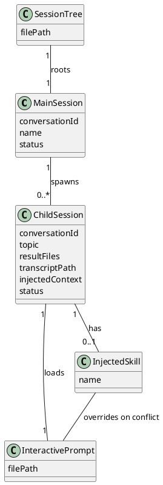
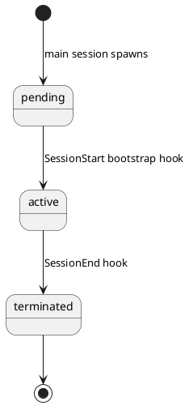

# Conceptual Model: interactive agent/prompt use cases
> Source: [2026-03-28-1030-agent-orchestrator.requirement.md](./2026-03-28-1030-agent-orchestrator.requirement.md), [2026-03-27-1500-agent-orchestrator.story.md](./2026-03-27-1500-agent-orchestrator.story.md)

## Overview
The agent orchestrator domain centers on a two-level session hierarchy. A **Main Session** (user-started from CLI) can spawn zero or more **Child Sessions** (dedicated interactive conversations in separate iTerm2 tabs). This parent-child grouping is called a **Session Tree**, persisted as `session-tree.json`. Each child session loads an **Interactive Prompt** for its conversational stance and may optionally have an **Injected Skill** that determines its dialogue mode. Inter-session communication — context injection, result registration, termination notification — is handled through Claude Code's hook infrastructure, not modeled as a separate domain concept.

## Domain Glossary

| Concept | Definition | Key Attributes | Related FRs |
|---------|-----------|----------------|-------------|
| Main Session | A session started by the user from CLI (`claude`); root of a session tree | conversationId, name, status | [FR-17], [FR-19] |
| Child Session | A session spawned from a main session; always belongs to exactly one main session | conversationId, topic, injectedSkill, resultFiles, transcriptPath, injectedContext, status | [FR-17], [FR-18], [FR-19] |
| Session Tree | A persistent manifest that records one main session and all its child sessions, serving as the single source of truth for session discovery, status tracking, and result file lookup. Stored at `.claude/sessions/<main-conversation-id>/session-tree.json` | filePath | [FR-17], [FR-18], [FR-19] |
| Interactive Prompt | A system prompt that establishes the LLM's conversational stance (conversation first, action later). Delivered as `interactive-child.txt` (for child sessions) and `interactive.txt` / `interactive.md` (for main session). Child sessions load `interactive-child.txt` at startup | filePath | [FR-17] |
| Injected Skill | A Claude Code skill injected into a child session's system prompt at startup, determining the session's dialogue mode (e.g., co-think-*, spark-*). When loaded alongside the Interactive Prompt, the Injected Skill's instructions take precedence on conflict | name | [FR-17] |

## Concept Relationships

- **SessionTree → MainSession (1:1)**: A session tree always has exactly one main session.
- **MainSession → ChildSession (1:0..*)**: A main session spawns zero or more child sessions. No nesting — child sessions cannot spawn further children.
- **ChildSession → InteractivePrompt (1:1)**: Every child session loads the interactive prompt at startup.
- **ChildSession → InjectedSkill (1:0..1)**: A child session may optionally have one skill injected at startup.
- **InjectedSkill → InteractivePrompt (overrides on conflict)**: When both are loaded, the skill's instructions take precedence.

## State Transitions

### Child Session

- **pending**: Child session entry created in session-tree.json, iTerm2 pane launched, but bootstrap hook has not yet completed.
- **active**: SessionStart bootstrap hook has completed — transcriptPath and pid recorded, user is interacting with the session.
- **terminated**: SessionEnd hook has fired (including Ctrl+D). Status updated in `session-tree.json`. Result file paths, if any, have been recorded before termination.

Main Session and Session Tree do not have domain-level state transitions.

## Spec Feedback

- [FR-17], [FR-18], [FR-19]: `session.json` renamed to `session-tree.json` throughout; context file replaced with hook-based context injection recorded in `session-tree.json` — applied directly to requirement file and GitHub issues #17, #18, #19 (no feedback issue needed)

## Interview Transcript

Full Q&A

### Round 1
**Q:** The specs use "main session" and "child session" — are these two distinct concepts, or one concept ("Session") with a role/type distinction?
**A:** Session is the base concept — one Claude lifecycle (SessionStart → SessionStop). Main session is user-started from CLI. Child session is spawned from within a main session.

### Round 2
**Q:** Is a child session always tied to exactly one main session, or could a child session itself spawn further children?
**A:** No further children. Strictly two-level.

### Round 3
**Q:** The Session Registry (session.json) — is "Session Registry" or "Session Manifest" the right term?
**A:** Session File is better. → Later revised to **Session Tree** to reflect the main-to-children relationship. The file is called `session-tree.json`.

### Round 4
**Q:** Should each child entry in the session tree be its own concept (Child Session Record)?
**A:** Focus on Session itself, not a separate record concept.

### Round 5
**Q:** Session attributes breakdown — Main Session has name, Child Session has skill, resultFiles, transcriptPath, etc.?
**A:** The injected context (reference file paths, context summary) must be recorded in session-tree.json. Not a separate file, but tracked data within the Session Tree.

### Round 6
**Q:** Should Hook be a domain concept?
**A:** No — Claude Code infrastructure that the orchestrator configures and uses.

### Round 7
**Q:** Is Result File its own concept or just an attribute?
**A:** Just a file path representing session output — an attribute of Child Session.

### Round 8
**Q:** Is Transcript its own concept or just an attribute?
**A:** A Claude Code concept, just referenced as a path attribute on Child Session.

### Round 9
**Q:** Should Session remain in the glossary as a shared concept for Main Session and Child Session?
**A:** No — it's self-evident that both have conversationId and status. Just keep Main Session and Child Session.

### Round 10
**Q:** Relationships — should Session Tree separately "contain" children, or is that redundant with Main Session "spawns" children?
**A:** One relationship is enough. Session Tree roots a Main Session (1:1), Main Session spawns Child Sessions (1:0..*). Children are reachable through the main session.

### Round 11
**Q:** Child Session states — are active and terminated enough, or are intermediate states needed (e.g., "creating", "results registered")?
**A:** Two states only. No intermediate states needed — result files are just recorded as attributes. Main Session has no separate state transitions.

### Round 12 (Review — Session Tree definition)
**Q:** Session Tree definition is vague — should it describe its role as single source of truth for discovery, status, and result lookup?
**A:** Accepted.

### Round 13 (Review — Interactive Prompt)
**Q:** Should Interactive Prompt be a glossary concept?
**A:** Yes — added as a concept. FR-16 is done but child sessions load it, so it belongs in the model.

### Round 14 (Review — Injected Skill)
**Q:** Should Skill be a glossary concept? Risk of confusion with Claude Code's Skill concept.
**A:** Named "Injected Skill" to distinguish from Claude Code's general Skill concept. It's a Claude Code skill injected into a child session's system prompt at startup.

<!-- references -->
[STORY-7]: https://github.com/studykit/studykit-plugins/issues/7
[STORY-9]: https://github.com/studykit/studykit-plugins/issues/9
[STORY-10]: https://github.com/studykit/studykit-plugins/issues/10
[STORY-12]: https://github.com/studykit/studykit-plugins/issues/12
[STORY-13]: https://github.com/studykit/studykit-plugins/issues/13
[STORY-14]: https://github.com/studykit/studykit-plugins/issues/14
[STORY-15]: https://github.com/studykit/studykit-plugins/issues/15
[FR-16]: https://github.com/studykit/studykit-plugins/issues/16
[FR-17]: https://github.com/studykit/studykit-plugins/issues/17
[FR-18]: https://github.com/studykit/studykit-plugins/issues/18
[FR-19]: https://github.com/studykit/studykit-plugins/issues/19
