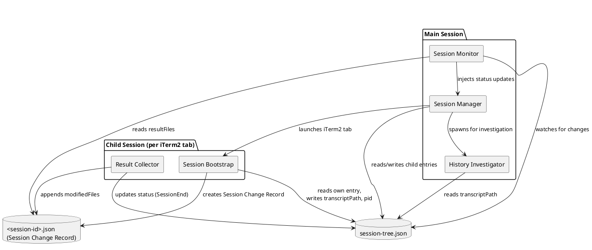
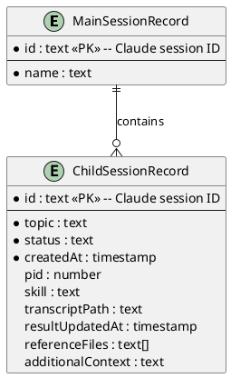
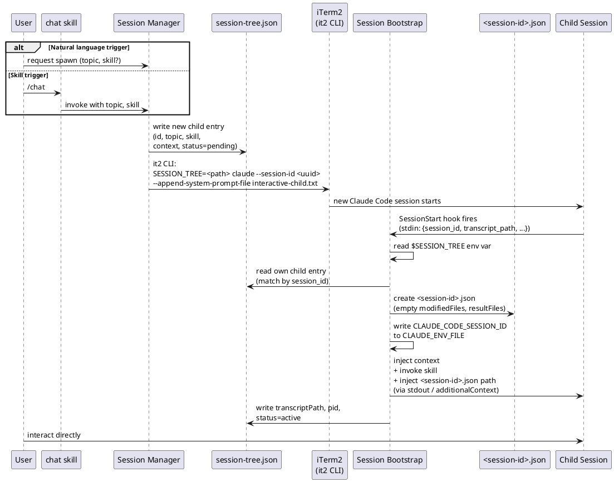
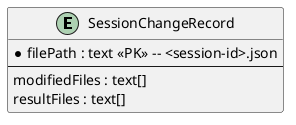
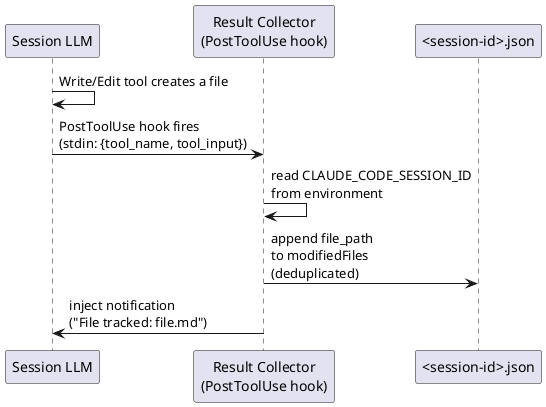
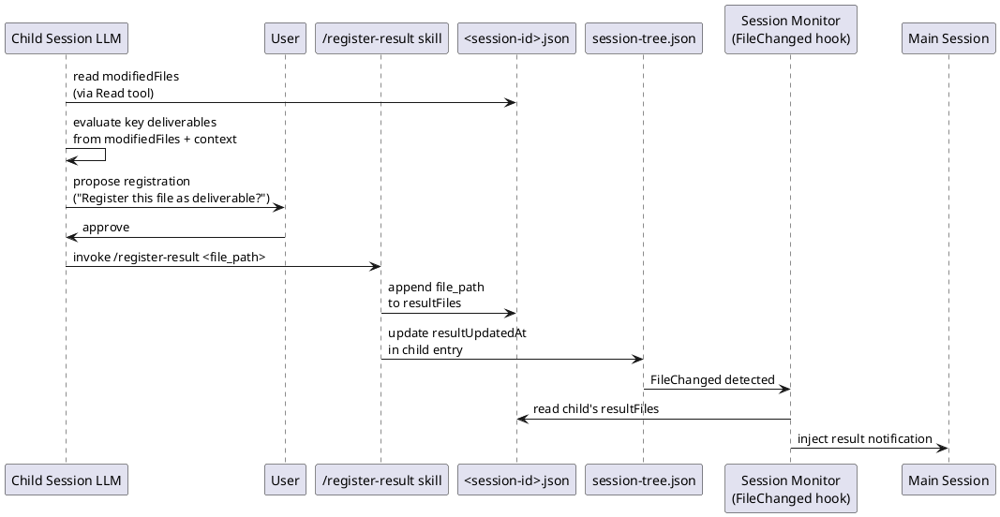
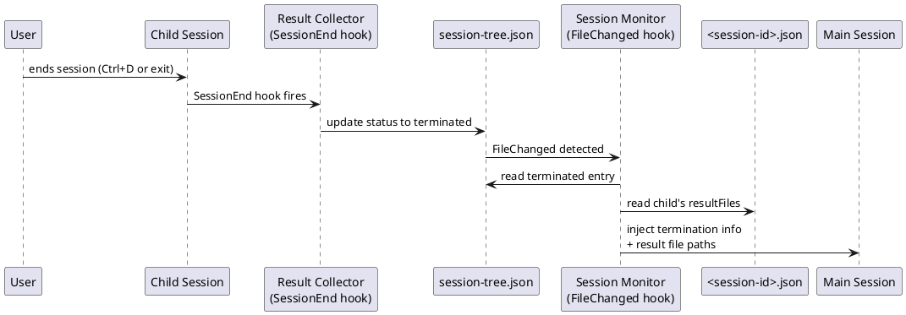
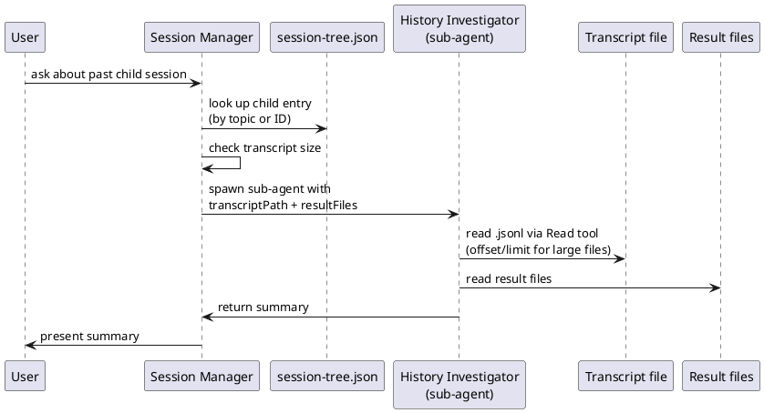

# Architecture: interactive agent/prompt use cases
> Source: [2026-03-27-1500-agent-orchestrator.story.md](./2026-03-27-1500-agent-orchestrator.story.md), [2026-03-28-1030-agent-orchestrator.requirement.md](./2026-03-28-1030-agent-orchestrator.requirement.md), [2026-03-29-1500-agent-orchestrator.domain.md](./2026-03-29-1500-agent-orchestrator.domain.md)

## Overview
The agent orchestrator extends Claude Code's interactive session model with a two-level session hierarchy. Five components collaborate through two file-based data stores (`session-tree.json` and per-session `<session-id>.json`) and Claude Code's hook infrastructure. The **Session Manager** in the main session spawns child sessions in iTerm2 tabs. The **Session Bootstrap** hook initializes every session with a Session Change Record and environment setup — for child sessions, it additionally injects context and skill. The **Result Collector** hooks track file modifications in the Session Change Record and handle child session termination. The **Session Monitor** hook on the main session side watches for manifest changes and injects status updates. The **History Investigator** sub-agent reads past child session transcripts on demand.

All inter-session communication flows through `session-tree.json` — no direct IPC, no sockets, no shared memory. Hooks read and write the manifest; the main session LLM and child session LLM never communicate directly. Per-session file tracking and result registration use `<session-id>.json` (Session Change Record), with `resultUpdatedAt` in session-tree.json as the cross-session notification trigger.

### Hook Communication Model

Claude Code hooks receive session metadata via **stdin JSON** (including `session_id` and `transcript_path`) and inject information back into the conversation via **stdout** or a structured `additionalContext` JSON field. Environment variables (`$SESSION_TREE`, `$CLAUDE_CODE_SESSION_ID` via `CLAUDE_ENV_FILE`) supplement stdin for cross-session context that hooks cannot derive from their own session alone.

## Component Diagram



> **Note:** Session Bootstrap and Result Collector are shown under "Child Session" but both also run in the main session. Their child-session behavior is architecturally richer (context injection, termination handling), so the grouping reflects the primary context. In the main session, Session Bootstrap only creates the Session Change Record and exposes `CLAUDE_CODE_SESSION_ID`; Result Collector only tracks file modifications.

**Session Manager** — orchestration logic in the main session. Creates child entries in session-tree.json, launches iTerm2 tabs, and coordinates investigation requests. iTerm2 tab creation uses `it2` CLI (iTerm2 shell integration). Spawn is triggered via the `chat` skill, which receives the main session's `session_id` through the `${CLAUDE_SESSION_ID}` skill template variable.

**Session Bootstrap** — SessionStart hook for all sessions. Creates the Session Change Record (`<session-id>.json`) and exposes `CLAUDE_CODE_SESSION_ID` via `CLAUDE_ENV_FILE`. For child sessions (when `$SESSION_TREE` is set), additionally locates session-tree.json, reads its own entry by matching `session_id` from stdin JSON against `id`, injects context (reference files, summary) and skill into the conversation via stdout, then writes back its transcriptPath and pid.

**Result Collector** — PostToolUse and SessionEnd hooks. PostToolUse hook fires in all sessions — receives `tool_input.file_path` via stdin JSON and appends all Write/Edit file paths to `modifiedFiles` in the session's `<session-id>.json` without filtering. Injects a short notification into context on new file addition. SessionEnd hook fires in child sessions only (when `$SESSION_TREE` is set) — marks the session as terminated in session-tree.json.

**Session Monitor** — FileChanged hook on the main session (matcher: `session-tree.json`). Detects session-tree.json modifications and injects child session status changes (termination, new result files) into the main session's conversation context via stdout. On termination or `resultUpdatedAt` change, reads the child's Session Change Record for `resultFiles`.

**History Investigator** — sub-agent spawned by the main session on demand. Reads a child session's transcript and result files, returns a summary.

## Components

### Session Manager

**Responsibility:** Core orchestration — spawns child sessions, maintains session-tree.json, serves as the entry point for all session lifecycle operations in the main session.

**Data store:** Yes — `session-tree.json` at `.claude/sessions/<main-conversation-id>/`. Created lazily on first child spawn — the directory and manifest do not exist until the user requests the first child session.

#### DB Schema



The session-tree.json file contains one MainSessionRecord and zero or more ChildSessionRecords. This is a single JSON file, not a relational database — the ERD captures the logical structure.

- **MainSessionRecord**: identifies the main session. `name` is user-assigned for search/identification.
- **ChildSessionRecord**: one per spawned child session. `id` is the PK — the Claude session ID, generated at spawn time and used as the `--session-id` for the child Claude Code process. `status` is `pending` (spawned, bootstrap not yet complete), `active` (bootstrap complete, session running), `terminated`, `crashed`, or `failed_to_start`. `pid` is the child Claude Code process ID, recorded by the Session Bootstrap for crash detection. `transcriptPath` is initially null, filled by the Session Bootstrap hook. `resultUpdatedAt` is updated when `/register-result` writes to the child's Session Change Record — serves as the FileChanged trigger for Session Monitor. `referenceFiles` and `additionalContext` capture the injected context from the main session at spawn time.

#### Information Flow

##### Story: STORY-9 — Spawn a dedicated child session



The spawn flow has two entry points: (1) natural language — the LLM suggests spawning and the user approves, (2) the `chat` skill — the user invokes `/chat` directly. Both paths converge at the Session Manager, which generates a child session ID (UUID), writes the entry to session-tree.json with `id` set to the generated UUID (Claude session ID), and launches an iTerm2 tab via `it2` CLI with `SESSION_TREE=<path> claude --session-id <uuid> --append-system-prompt-file interactive-child.txt`. The child session's SessionStart hook receives `session_id` and `transcript_path` via stdin JSON, reads the `$SESSION_TREE` environment variable to locate session-tree.json, finds its own entry by matching `session_id` against `id`, creates the Session Change Record (`<session-id>.json`), exposes `CLAUDE_CODE_SESSION_ID` via `CLAUDE_ENV_FILE`, injects the context (and skill if specified) via stdout, and writes back its transcriptPath and pid to the manifest.

##### Story: STORY-15 — Skill injection at child session startup

Skill injection is part of the STORY-9 spawn flow. The Session Manager includes the skill name in the child entry. The Session Bootstrap reads it and invokes the skill (e.g., `/workflow:co-think-requirement`) as part of context injection. No separate information flow — it's embedded in the bootstrap sequence above.

### Session Bootstrap

**Responsibility:** Initializes all sessions with a Session Change Record and environment setup. For child sessions, additionally injects context from the session tree and optionally invokes a skill.

**Data store:** Yes — `<session-id>.json` (Session Change Record) at `.claude/sessions/<main-id>/<session-id>.json`. Created on session startup for both main and child sessions.

#### DB Schema



The Session Change Record is a per-session JSON file. One exists for each session (main or child).

- **modifiedFiles**: all file paths written or edited during the session, appended by the Result Collector's PostToolUse hook. Deduplicated — each path appears at most once.
- **resultFiles**: key deliverable paths registered explicitly via `/register-result` skill (on LLM nudge with user approval, or direct user instruction).

**Identification mechanism:** For child sessions — launched with `SESSION_TREE=<path>` environment variable and `--session-id <uuid>` CLI flag. The SessionStart hook receives `session_id` via stdin JSON, reads `$SESSION_TREE` to locate the manifest, and matches its entry by `session_id` against `id`. For main sessions — no `$SESSION_TREE` set; the hook only creates the Session Change Record and exposes `CLAUDE_CODE_SESSION_ID`.

#### Information Flow

##### Story: STORY-9 — Spawn a dedicated child session

See Session Manager's STORY-9 sequence above. The Bootstrap is the child-side participant that reads context from session-tree.json, creates the Session Change Record, and injects context.

### Result Collector

**Responsibility:** Tracks file modifications in the Session Change Record during any session's lifetime. For child sessions, additionally handles termination status updates.

**Data store:** No (writes to `<session-id>.json` and session-tree.json, both owned by other components)

#### Information Flow

##### Story: STORY-16 — Session file change tracking



The PostToolUse hook fires in all sessions (main and child). It receives `tool_name` and `tool_input` via stdin JSON. When the tool is `Write` or `Edit`, it reads `CLAUDE_CODE_SESSION_ID` from the environment to locate `<session-id>.json`, and appends `tool_input.file_path` to `modifiedFiles`. No filtering — all file modifications are tracked. A short notification is injected into the conversation context on new file addition.

This flow does not touch session-tree.json and does not trigger Session Monitor. File tracking is local to the session's own change record.

##### Story: STORY-17 + STORY-18 — LLM-based result file identification + delivery



The LLM evaluates key deliverables based on: files written by a skill as final output, files the user explicitly identifies, or files the LLM judges as key deliverables from conversation context. When judged as a key deliverable, the LLM proposes registration to the user. On approval, the `/register-result` skill appends the file path to `resultFiles` in the Session Change Record and updates `resultUpdatedAt` in the child entry of session-tree.json. This triggers Session Monitor, which reads the child's Session Change Record for `resultFiles` and notifies the main session.

##### Story: STORY-12 — Child session result file accessible to main session



On child session termination, the SessionEnd hook updates the child's status to `terminated` in session-tree.json. The Session Monitor detects this, reads the child's Session Change Record for `resultFiles`, and injects the termination notification with result file paths into the main session's conversation context.

### Session Monitor

**Responsibility:** Watches session-tree.json for changes on the main session side and injects relevant updates into the main session's conversation context. Reads child Session Change Records for result file details.

**Data store:** No

#### Information Flow

##### Story: STORY-12 — Child session result file accessible to main session

See Result Collector's STORY-12 sequence above. The Session Monitor detects the termination status change, reads the child's Session Change Record, and injects the notification into the main session.

##### Story: STORY-17 + STORY-18 — LLM-based result file identification + delivery

See Result Collector's STORY-17+18 sequence above. The Session Monitor detects the `resultUpdatedAt` change in session-tree.json, reads the child's Session Change Record for `resultFiles`, and notifies the main session.

### History Investigator

**Responsibility:** Reads and summarizes past child session transcripts and result files on demand.

**Data store:** No

**Transcript access:** Reads the `.jsonl` transcript file directly via the Read tool. For large transcripts, uses offset/limit to read in chunks. No session resume — read-only access to the raw file.

#### Information Flow

##### Story: STORY-13 — Child session conversation history investigation



The user asks about a past child session. The Session Manager finds the child entry in session-tree.json, checks the transcript size, and either reads directly or spawns a sub-agent (History Investigator) to read and summarize the transcript and result files.

## Concurrency and Error Handling

### File locking

All reads and writes to session-tree.json must be wrapped in a file lock to prevent update-lost anomalies. The lock scope covers the entire read-modify-write cycle. The implementation uses Python's `fcntl.flock()` with `LOCK_SH` (shared) and `LOCK_EX` (exclusive) on a `.lock` file adjacent to session-tree.json:

```python
import fcntl

# shared lock for reads
with open(lock_path) as lf:
    fcntl.flock(lf, fcntl.LOCK_SH)
    data = json.loads(path.read_text())
    fcntl.flock(lf, fcntl.LOCK_UN)

# exclusive lock for read-modify-write
with open(lock_path) as lf:
    fcntl.flock(lf, fcntl.LOCK_EX)
    data = json.loads(path.read_text())
    transform(data)
    path.write_text(json.dumps(data, indent=2) + "\n")
    fcntl.flock(lf, fcntl.LOCK_UN)
```

This applies to all components that write to session-tree.json: Session Manager, Session Bootstrap, and Result Collector. The shared library (`hooks/lib/session_tree.py`) exposes `st_read()` for shared-lock reads and `st_write(transform)` for exclusive-lock read-modify-write operations.

Session Change Records (`<session-id>.json`) do not require cross-session locking — each session writes only to its own file. The `/register-result` skill writes to `<session-id>.json` and then to session-tree.json (`resultUpdatedAt`); the session-tree.json write uses the same `st_write()` lock.

### Crash detection

If a child session crashes (process killed, terminal closed abnormally), the SessionEnd hook never fires and the entry remains `active`. The Session Monitor detects this by checking `kill -0 <pid>` against the child's recorded PID. When the process is no longer alive and status is still `active`, the Session Monitor updates it to `crashed` and injects a notification into the main session.

The Session Bootstrap records `os.getppid()` (the parent PID, i.e., the Claude Code process) into the child entry during initialization. Since the hook runs as a child process of the Claude Code process, `os.getppid()` points to the Claude Code process — if this process dies, the Session Monitor's `kill -0` check (via `os.kill(pid, 0)`) will fail.

### Bootstrap handshake timeout

Covers the case where the child process starts but the Bootstrap hook never completes — status remains `pending`. The Session Monitor checks for entries where `status == "pending"` AND `createdAt` is older than 30 seconds. When detected, status is updated to `failed_to_start` and a notification is injected into the main session.

This is distinct from crash detection: crash detection checks `active` entries with a recorded PID, while handshake timeout checks `pending` entries where the Bootstrap never ran.

## Consistency Check

### Cross-diagram consistency

All five components (Session Manager, Session Bootstrap, Result Collector, Session Monitor, History Investigator) appear in both the component diagram and at least one sequence diagram. Both data stores — session-tree.json and `<session-id>.json` (Session Change Record) — are referenced consistently across component and sequence diagrams.

### Domain model coverage

| Domain Concept | Component(s) | Notes |
|---|---|---|
| Main Session | Session Manager, Session Bootstrap, Result Collector | Main session is the execution context for Session Manager, Session Monitor, and History Investigator. Session Bootstrap and Result Collector also run in main sessions (Session Change Record creation, file tracking) |
| Child Session | Session Bootstrap, Result Collector | Child session is the execution context; Bootstrap initializes it with context/skill, Result Collector manages its file tracking and termination |
| Session Tree | Session Manager (data store) | session-tree.json schema matches the domain model's SessionTree concept |
| Session Change Record | Session Bootstrap (creates), Result Collector (writes modifiedFiles), `/register-result` skill (writes resultFiles) | Per-session `<session-id>.json` — both main and child sessions have exactly one |
| Interactive Prompt | Session Bootstrap | Loaded via `--append-system-prompt-file` at spawn; Bootstrap adds context on top |
| Injected Skill | Session Bootstrap | Skill name stored in session-tree.json, invoked by Bootstrap during initialization |

All six domain concepts are housed in at least one component.

**Cross-component relationships:**
- Session Tree → Main Session (1:1): Session Manager creates exactly one MainSessionRecord per session-tree.json
- Main Session → Child Session (1:0..*): Session Manager creates ChildSessionRecords; no nesting enforced by the two-level design
- Child Session → Interactive Prompt (1:1): enforced by the spawn command always including `--append-system-prompt-file interactive-child.txt`
- Child Session → Injected Skill (1:0..1): `skill` field in ChildSessionRecord is nullable
- Injected Skill overrides Interactive Prompt on conflict: this is a behavioral rule within the prompt content, not an architectural flow — the Interactive Prompt already contains the precedence rule ("Skills override this prompt")
- Main Session → Session Change Record (1:1): Session Bootstrap creates `<main-id>.json` on main session startup
- Child Session → Session Change Record (1:1): Session Bootstrap creates `<child-id>.json` on child session startup. On result file registration, `resultUpdatedAt` in the child entry of session-tree.json is updated to trigger main session notification via FileChanged hook

**State transitions:**
- Child Session `pending → active`: managed by Session Bootstrap's SessionStart hook — confirms the child process started and writes back transcriptPath and pid
- Child Session `active → terminated`: managed by Result Collector's SessionEnd hook writing to session-tree.json
- Child Session `active → crashed`: detected by Session Monitor via `kill -0 <pid>` when the child process is no longer alive and SessionEnd was never called
- Child Session `pending → failed_to_start`: detected by Session Monitor when status is still `pending` and `createdAt` is older than 30 seconds (bootstrap never completed)

### Story coverage

| Story | Sequence Diagram(s) | Component(s) Involved |
|---|---|---|
| STORY-7 | *(no diagram — behavioral prompt, already implemented as FR-16)* | Session Bootstrap loads the Interactive Prompt via `--append-system-prompt-file` during STORY-9 spawn flow |
| STORY-9 | Session Manager / STORY-9 | Session Manager, Session Bootstrap |
| STORY-10 | *(no diagram — see note below)* | — |
| STORY-12 | Result Collector / STORY-12 | Result Collector, Session Monitor |
| STORY-13 | History Investigator / STORY-13 | History Investigator, Session Manager |
| STORY-14 | *(no diagram — behavioral rule in Interactive Prompt, FR-16)* | — |
| STORY-15 | *(embedded in STORY-9 spawn flow)* | Session Manager, Session Bootstrap |
| STORY-16 | Result Collector / STORY-16 | Result Collector |
| STORY-17 | Result Collector / STORY-17+18 | Result Collector (Session Change Record), Session Monitor, `/register-result` skill |
| STORY-18 | Result Collector / STORY-17+18 | Result Collector (Session Change Record), Session Monitor, `/register-result` skill |

**STORY-10 note:** STORY-10 (Automated information exchange between sessions) is no longer covered by a dedicated sequence diagram. The result file delivery mechanism has been redesigned: file tracking is now local to each session's Session Change Record (STORY-16), and cross-session notification only occurs on result file registration (STORY-17/18) or session termination (STORY-12). The original STORY-10 flow — where every file modification triggered a cross-session notification via session-tree.json — is replaced by this more targeted notification model. STORY-10's intent ("keep the main session aware of child session progress") is fulfilled by the combination of STORY-12 (termination notification) and STORY-17/18 (result file delivery).

STORY-7 and STORY-14 are behavioral rules delivered by the Interactive Prompt (FR-16, already implemented). They require no architectural components — the prompt file is loaded at child session startup as part of the STORY-9 spawn flow. All orchestrator stories with architectural relevance have sequence diagram coverage.

### Gaps identified and resolved

**Revision 5 changes (result file delivery redesign):**
1. **Session Change Record**: Added `<session-id>.json` as a new data store in the component diagram and all relevant sequence diagrams. Both main and child sessions create one via Session Bootstrap.
2. **Session Bootstrap renamed**: "Child Session Bootstrap" → "Session Bootstrap" — now handles both main and child sessions. Main session path creates Session Change Record and exposes `CLAUDE_CODE_SESSION_ID`. Child session path additionally injects context/skill and writes back to session-tree.json.
3. **Result Collector redesigned**: PostToolUse hook writes to `<session-id>.json` (not session-tree.json). No `resultPatterns` matching — all Write/Edit file paths appended to `modifiedFiles` without filtering. Result file registration moved to `/register-result` skill (FR-22).
4. **session-tree.json schema updated**: Removed `modifiedFiles`, `resultFiles`, `resultPatterns` from ChildSessionRecord. Added `resultUpdatedAt` as the cross-session notification trigger.
5. **Session Monitor updated**: Now reads child's Session Change Record for `resultFiles` on termination or `resultUpdatedAt` change.
6. **STORY-10 coverage**: No longer has a dedicated sequence diagram. The original flow (every file change triggers cross-session notification) is replaced by targeted notifications: STORY-16 (local file tracking), STORY-17/18 (result file delivery via `/register-result`), STORY-12 (termination). STORY-10's intent is fulfilled by this combination.
7. **New sequence diagrams**: STORY-16 (session file change tracking), STORY-17+18 (LLM-based result file identification + delivery).
8. **File locking note**: Session Change Records do not require cross-session locking — each session writes only to its own file.

**Prior revision changes (retained):**
1. **STORY-7 coverage**: No sequence diagram needed — behavioral prompt (FR-16, already implemented). Loaded during the STORY-9 spawn flow.
2. **Component diagram read path**: Session Manager arrow shows "reads/writes child entries".
3. **InjectedSkill override relationship**: Behavioral rule within the Interactive Prompt content, not an architectural information flow.
4. **Crash detection**: `pid` field in ChildSessionRecord and `crashed` status. Session Monitor checks process liveness via `kill -0`.
5. **Concurrent writes**: session-tree.json writes wrapped in Python `fcntl.flock(LOCK_EX)`.
6. **Bootstrap handshake timeout**: `failed_to_start` status for entries where bootstrap never completes (pid remains null after 30s).

## Interview Transcript
<details>
<summary>Full Q&A</summary>

### Round 1 (revision 0–4)
**Q:** (self) What are the natural component boundaries given the file-based, hook-driven architecture?
**A:** Five components: Session Manager, Child Session Bootstrap, Result Collector, Session Monitor, History Investigator. Boundaries align with hook event ownership.

### Round 2 (revision 0–4)
**Q:** (self) Should session-tree.json be its own component or a data store owned by Session Manager?
**A:** Data store owned by Session Manager.

### Round 3 (revision 0–4)
**Q:** (self) Is the Session Monitor a separate component or part of Session Manager?
**A:** Separate — distinct execution context (FileChanged hook, fires asynchronously).

### Round 4 (revision 0–4)
**Q:** (self) How does the Child Session Bootstrap identify its own entry in session-tree.json?
**A:** `SESSION_TREE=<path>` env var + `--session-id <uuid>` CLI flag. SessionStart hook receives `session_id` via stdin JSON.

### Round 5 (revision 0–4)
**Q:** (self) Does STORY-14 need an architectural component?
**A:** No — behavioral rule in Interactive Prompt (FR-16).

### Round 6 (revision 0–4)
**Q:** (self) Should the Result Collector's PostToolUse and SessionEnd hooks be separate components?
**A:** No — same responsibility, same execution context.

### Round 7 (revision 5)
**Q:** Component breakdown for FR-20/21/22/23 — do we need new components or just updated responsibilities?
**A:** Same five components, updated responsibilities. Session Change Record as new data store. `/register-result` and `/session-status` skills are infrastructure, not components.

### Round 8 (revision 5)
**Q:** Does the Bootstrap need to differentiate main vs child sessions, or should it be split?
**A:** No split needed. One SessionStart hook handles both — branches on `$SESSION_TREE`. Main session path is a subset of child session path.

### Round 9 (revision 5)
**Q:** Component name — "Child Session Bootstrap" implies child-only. Rename?
**A:** Renamed to "Session Bootstrap".

### Round 10 (revision 5)
**Q:** Result Collector — should it cover both main and child sessions?
**A:** Yes. PostToolUse fires in both (file tracking). SessionEnd is child-only (needs `$SESSION_TREE`).

### Round 11 (revision 5)
**Q:** Component diagram — Session Bootstrap and Result Collector now serve both session types. Change package grouping?
**A:** Keep under "Child Session" package with a note. Child-session behavior is richer and architecturally more interesting.

### Round 12 (revision 5)
**Q:** STORY-10 — old sequence diagram showed every file change flowing through session-tree.json to Session Monitor. No longer accurate. How to handle?
**A:** STORY-10 is no longer architecturally relevant as a standalone flow. Its intent is covered by STORY-16 (local tracking), STORY-17/18 (result delivery), and STORY-12 (termination). Mark as such with rationale.

</details>

<!-- references -->
[STORY-7]: https://github.com/studykit/studykit-plugins/issues/7
[STORY-9]: https://github.com/studykit/studykit-plugins/issues/9
[STORY-10]: https://github.com/studykit/studykit-plugins/issues/10
[STORY-12]: https://github.com/studykit/studykit-plugins/issues/12
[STORY-13]: https://github.com/studykit/studykit-plugins/issues/13
[STORY-14]: https://github.com/studykit/studykit-plugins/issues/14
[STORY-15]: https://github.com/studykit/studykit-plugins/issues/15
[STORY-16]: https://github.com/studykit/studykit-plugins/issues/20
[STORY-17]: https://github.com/studykit/studykit-plugins/issues/21
[STORY-18]: https://github.com/studykit/studykit-plugins/issues/22
[FR-16]: https://github.com/studykit/studykit-plugins/issues/16
[FR-17]: https://github.com/studykit/studykit-plugins/issues/17
[FR-18]: https://github.com/studykit/studykit-plugins/issues/18
[FR-19]: https://github.com/studykit/studykit-plugins/issues/19
[FR-20]: https://github.com/studykit/studykit-plugins/issues/23
[FR-21]: https://github.com/studykit/studykit-plugins/issues/24
[FR-22]: https://github.com/studykit/studykit-plugins/issues/25
[FR-23]: https://github.com/studykit/studykit-plugins/issues/26
