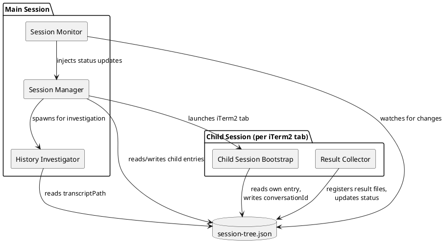
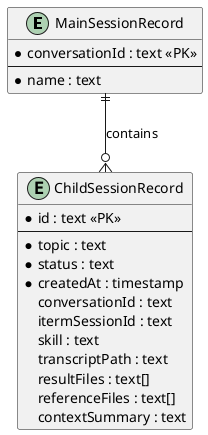
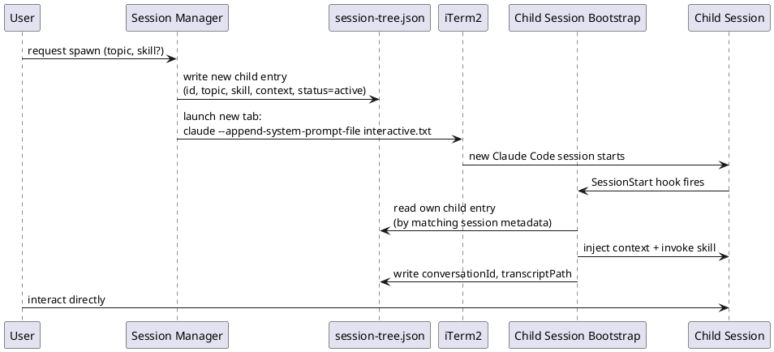
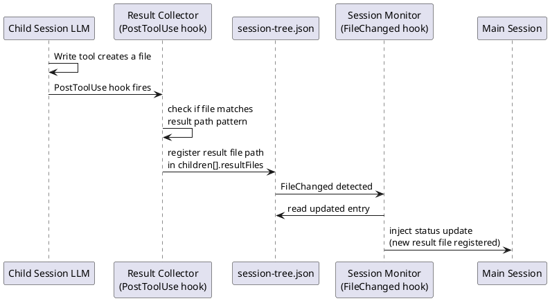
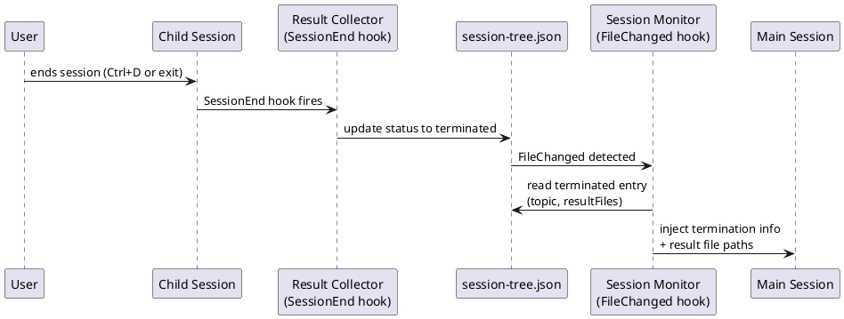
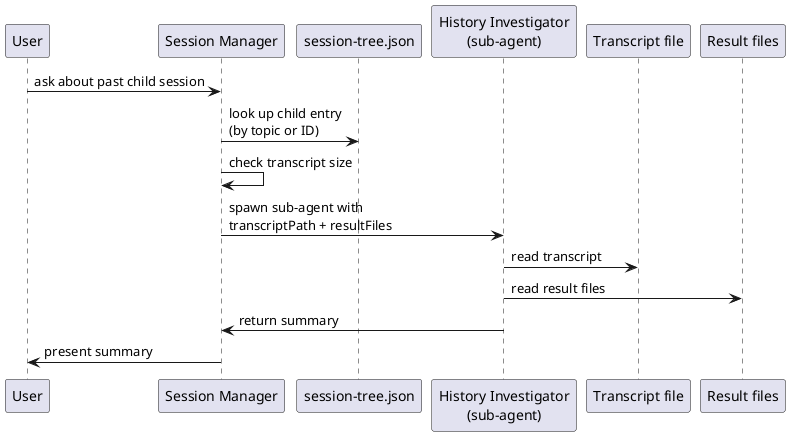

# Architecture: interactive agent/prompt use cases
> Source: [2026-03-27-1500-agent-orchestrator.story.md](./2026-03-27-1500-agent-orchestrator.story.md), [2026-03-28-1030-agent-orchestrator.requirement.md](./2026-03-28-1030-agent-orchestrator.requirement.md), [2026-03-29-1500-agent-orchestrator.domain.md](./2026-03-29-1500-agent-orchestrator.domain.md)

## Overview
The agent orchestrator extends Claude Code's interactive session model with a two-level session hierarchy. Five components collaborate through a shared file-based manifest (`session-tree.json`) and Claude Code's hook infrastructure. The **Session Manager** in the main session spawns child sessions in iTerm2 tabs. The **Child Session Bootstrap** hook initializes each child with context and skill injection. The **Result Collector** hooks register deliverables and handle termination. The **Session Monitor** hook on the main session side watches for manifest changes and injects status updates. The **History Investigator** sub-agent reads past child session transcripts on demand.

All inter-session communication flows through `session-tree.json` — no direct IPC, no sockets, no shared memory. Hooks read and write the manifest; the main session LLM and child session LLM never communicate directly.

## Component Diagram

**Session Manager** — orchestration logic in the main session. Creates child entries in session-tree.json, launches iTerm2 tabs, and coordinates investigation requests.

**Child Session Bootstrap** — SessionStart hook on the child session. Reads its entry from session-tree.json, injects context (reference files, summary) and skill into the conversation, then writes back its conversationId and transcriptPath.

**Result Collector** — PostToolUse and SessionEnd hooks on the child session. Monitors file writes to register result files, and marks the session as terminated on exit.

**Session Monitor** — FileChanged hook on the main session. Detects session-tree.json modifications and injects child session status changes (termination, new result files) into the main session's conversation context.

**History Investigator** — sub-agent spawned by the main session on demand. Reads a child session's transcript and result files, returns a summary.

## Components

### Session Manager

**Responsibility:** Core orchestration — spawns child sessions, maintains session-tree.json, serves as the entry point for all session lifecycle operations in the main session.

**Data store:** Yes — `session-tree.json` at `.claude/sessions/<main-conversation-id>/`

#### DB Schema

The session-tree.json file contains one MainSessionRecord and zero or more ChildSessionRecords. This is a single JSON file, not a relational database — the ERD captures the logical structure.

- **MainSessionRecord**: identifies the main session. `name` is user-assigned for search/identification.
- **ChildSessionRecord**: one per spawned child session. `status` is either `active` or `terminated`. `conversationId` and `transcriptPath` are initially null, filled by the Child Session Bootstrap hook. `resultFiles` accumulates paths during the session lifetime. `referenceFiles` and `contextSummary` capture the injected context from the main session at spawn time.

#### Information Flow

##### Story: STORY-9 — Spawn a dedicated child session

The main session generates a child session ID, writes the entry to session-tree.json, and launches an iTerm2 tab with `claude --append-system-prompt-file`. The child session's SessionStart hook reads its entry, injects the context and skill, and writes back its conversationId and transcriptPath.

##### Story: STORY-15 — Skill injection at child session startup

Skill injection is part of the STORY-9 spawn flow. The Session Manager includes the skill name in the child entry. The Child Session Bootstrap reads it and invokes the skill (e.g., `/workflow:co-think-requirement`) as part of context injection. No separate information flow — it's embedded in the bootstrap sequence above.

### Child Session Bootstrap

**Responsibility:** Initializes a newly spawned child session with context from the session tree and optionally invokes a skill.

**Data store:** No

#### Information Flow

##### Story: STORY-9 — Spawn a dedicated child session

See Session Manager's STORY-9 sequence above. The Bootstrap is the child-side participant that reads context from session-tree.json and injects it.

### Result Collector

**Responsibility:** Registers result files during the child session's lifetime and handles termination status updates.

**Data store:** No (writes to session-tree.json owned by Session Manager)

#### Information Flow

##### Story: STORY-10 — Automated information exchange between sessions

The PostToolUse hook on the child session checks each file write against known result patterns (pre-assigned paths or convention-based patterns). When matched, it appends the path to session-tree.json. The main session's FileChanged hook picks up the change.

##### Story: STORY-12 — Child session result file accessible to main session

On child session termination, the SessionEnd hook updates the child's status to `terminated`. The main session's FileChanged hook detects this and injects the termination notification with result file paths into the main session's conversation context.

### Session Monitor

**Responsibility:** Watches session-tree.json for changes on the main session side and injects relevant updates into the main session's conversation context.

**Data store:** No

#### Information Flow

##### Story: STORY-10 — Automated information exchange between sessions

See Result Collector's STORY-10 sequence above. The Session Monitor is the main-session-side participant that detects FileChanged events on session-tree.json.

##### Story: STORY-12 — Child session result file accessible to main session

See Result Collector's STORY-12 sequence above. The Session Monitor detects the termination status change and injects it into the main session.

### History Investigator

**Responsibility:** Reads and summarizes past child session transcripts and result files on demand.

**Data store:** No

#### Information Flow

##### Story: STORY-13 — Child session conversation history investigation

The user asks about a past child session. The Session Manager finds the child entry in session-tree.json, checks the transcript size, and either reads directly or spawns a sub-agent (History Investigator) to read and summarize the transcript and result files.

## Consistency Check

### Cross-diagram consistency

All five components (Session Manager, Child Session Bootstrap, Result Collector, Session Monitor, History Investigator) appear in both the component diagram and at least one sequence diagram. session-tree.json is the shared data store referenced consistently across all diagrams.

### Domain model coverage

| Domain Concept | Component(s) | Notes |
|---|---|---|
| Main Session | Session Manager | Main session is the execution context for Session Manager, Session Monitor, and History Investigator |
| Child Session | Child Session Bootstrap, Result Collector | Child session is the execution context; Bootstrap initializes it, Result Collector manages its outputs |
| Session Tree | Session Manager (data store) | session-tree.json schema matches the domain model's SessionTree concept |
| Interactive Prompt | Child Session Bootstrap | Loaded via `--append-system-prompt-file` at spawn; Bootstrap adds context on top |
| Injected Skill | Child Session Bootstrap | Skill name stored in session-tree.json, invoked by Bootstrap during initialization |

All five domain concepts are housed in at least one component.

**Cross-component relationships:**
- Session Tree → Main Session (1:1): Session Manager creates exactly one MainSessionRecord per session-tree.json
- Main Session → Child Session (1:0..*): Session Manager creates ChildSessionRecords; no nesting enforced by the two-level design
- Child Session → Interactive Prompt (1:1): enforced by the spawn command always including `--append-system-prompt-file interactive.txt`
- Child Session → Injected Skill (1:0..1): `skill` field in ChildSessionRecord is nullable
- Injected Skill overrides Interactive Prompt on conflict: this is a behavioral rule within the prompt content, not an architectural flow — the Interactive Prompt already contains the precedence rule ("Skills override this prompt")

**State transitions:**
- Child Session `active → terminated`: managed by Result Collector's SessionEnd hook writing to session-tree.json

### Story coverage

| Story | Sequence Diagram(s) | Component(s) Involved |
|---|---|---|
| STORY-7 | *(no diagram — behavioral prompt, already implemented as FR-16)* | Child Session Bootstrap loads the Interactive Prompt via `--append-system-prompt-file` during STORY-9 spawn flow |
| STORY-9 | Session Manager / STORY-9 | Session Manager, Child Session Bootstrap |
| STORY-10 | Result Collector / STORY-10 | Result Collector, Session Monitor |
| STORY-12 | Result Collector / STORY-12 | Result Collector, Session Monitor |
| STORY-13 | History Investigator / STORY-13 | History Investigator, Session Manager |
| STORY-14 | *(no diagram — behavioral rule in Interactive Prompt, FR-16)* | — |
| STORY-15 | *(embedded in STORY-9 spawn flow)* | Session Manager, Child Session Bootstrap |

STORY-7 and STORY-14 are behavioral rules delivered by the Interactive Prompt (FR-16, already implemented). They require no architectural components — the prompt file is loaded at child session startup as part of the STORY-9 spawn flow. All orchestrator stories (STORY-9 through STORY-15) have sequence diagram coverage.

### Gaps identified and resolved

Post-review fixes applied:
1. **STORY-7 coverage**: Added to story coverage table. No sequence diagram needed — it's a behavioral prompt (FR-16, already implemented). The architecture ensures it's loaded during the STORY-9 spawn flow.
2. **STORY-13 participant naming**: Changed "Main Session LLM" to "Session Manager" in the sequence diagram for consistency with the component diagram.
3. **Component diagram read path**: Session Manager arrow updated to "reads/writes child entries" to reflect that it both writes (spawn) and reads (investigation) from session-tree.json.
4. **InjectedSkill override relationship**: Noted as a behavioral rule within the Interactive Prompt content, not an architectural information flow.

## Interview Transcript

Full Q&A

### Round 1
**Q:** (self) What are the natural component boundaries given the file-based, hook-driven architecture?
**A:** Five components emerge from the FR processing steps: Session Manager (main session orchestration + data store), Child Session Bootstrap (SessionStart hook), Result Collector (PostToolUse + SessionEnd hooks), Session Monitor (FileChanged hook on main session), History Investigator (sub-agent for transcript reading). The boundaries align with hook event ownership — each hook-based component handles one or two specific events.

### Round 2
**Q:** (self) Should session-tree.json be its own component or a data store owned by Session Manager?
**A:** Data store owned by Session Manager. Multiple components read/write it, but Session Manager is responsible for creating and maintaining its structure. Other components (Bootstrap, Result Collector) write specific fields but don't own the schema.

### Round 3
**Q:** (self) Is the Session Monitor a separate component or part of Session Manager?
**A:** Separate. Session Monitor is a FileChanged hook — a distinct execution context that fires asynchronously. Session Manager is the LLM-driven orchestration logic. They run in the same main session but have different triggers and responsibilities.

### Round 4
**Q:** (self) How does the Child Session Bootstrap identify its own entry in session-tree.json?
**A:** This is an implementation detail to resolve later. The Bootstrap needs some way to match itself to a ChildSessionRecord — likely via environment variable, iTerm2 session ID, or a temporary marker file. The architecture only requires that the Bootstrap can find its entry.

### Round 5
**Q:** (self) Does STORY-14 (user controls termination) need an architectural component?
**A:** No. STORY-14 is a behavioral rule already implemented in the Interactive Prompt (FR-16). No architectural component needed — the LLM follows the prompt instructions.

### Round 6
**Q:** (self) Should the Result Collector's PostToolUse hook and SessionEnd hook be separate components?
**A:** No. They serve the same responsibility (managing child session outputs) and run in the same execution context (child session). One component with two hook implementations.

<!-- references -->
[STORY-7]: https://github.com/studykit/studykit-plugins/issues/7
[STORY-9]: https://github.com/studykit/studykit-plugins/issues/9
[STORY-10]: https://github.com/studykit/studykit-plugins/issues/10
[STORY-12]: https://github.com/studykit/studykit-plugins/issues/12
[STORY-13]: https://github.com/studykit/studykit-plugins/issues/13
[STORY-14]: https://github.com/studykit/studykit-plugins/issues/14
[STORY-15]: https://github.com/studykit/studykit-plugins/issues/15
[FR-16]: https://github.com/studykit/studykit-plugins/issues/16
[FR-17]: https://github.com/studykit/studykit-plugins/issues/17
[FR-18]: https://github.com/studykit/studykit-plugins/issues/18
[FR-19]: https://github.com/studykit/studykit-plugins/issues/19
