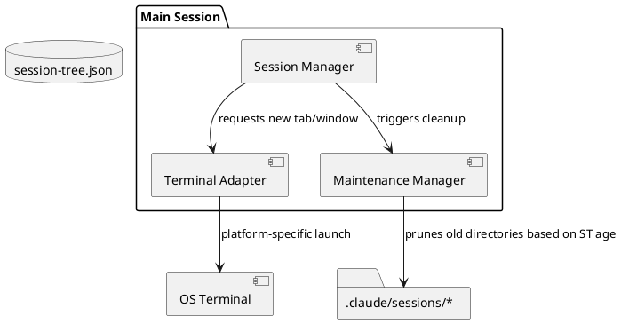

# Supplement: agent orchestrator reliability & maintainability
> Source: [2026-03-29-2100-agent-orchestrator.architecture.md](./2026-03-29-2100-agent-orchestrator.architecture.md)

This supplement addresses identified gaps in session lifecycle management, user visibility, and architectural portability to ensure the orchestrator is production-ready and sustainable.

## 1. Session Lifecycle: Cleanup & Maintenance

### [STORY-20]. Prune old session data
**When** I use the agent orchestrator frequently over several days or weeks,
**I want to** have old session directories and manifests automatically pruned,
**so I can** prevent unbounded disk usage in `.claude/sessions/` without manual intervention.

### [FR-21]. Session directory retention policy
**Trigger:** Main session startup or termination.

**Processing:**
1. **Identify targets**: Scan `.claude/sessions/` for sub-directories (main-conversation-id).
2. **Sort by age**: Use the `createdAt` timestamp from each directory's `session-tree.json`.
3. **Retention logic**:
   - Keep the **last 10** main sessions.
   - OR Keep all sessions created within the **last 7 days**.
   - (User can override via global config if needed).
4. **Delete**: Recursively remove directories that exceed both limits.

---

## 2. UI/UX: Session Dashboard

### [STORY-22]. View session tree status
**When** I have multiple child sessions running or recently terminated,
**I want to** see a summarized list of all active and past sessions in the current tree,
**so I can** quickly track progress and recall which topics have already been explored.

### [FR-23]. Session tree dashboard/listing
**Trigger:** User request (e.g., "List child sessions", "Show session status").

**Processing:**
1. Read `session-tree.json`.
2. Format a table or list showing:
   - Topic (Child ID)
   - Status (active/terminated/crashed)
   - Results (count or summary of resultFiles)
   - Start Time
3. **Summary generation**: Optionally use the main session LLM to provide a 1-sentence summary of the state of the "Mission" based on the accumulated session data.

---

## 3. Reliability: Bootstrap Handshake Timeout

### [FR-24]. Handshake timeout detection
**Trigger:** `Session Monitor` (FileChanged hook) periodic check or main session heartbeat.

**Context:** An entry in `session-tree.json` is `active` but its `pid` and `conversationId` fields are null.

**Processing:**
1. Check the `createdAt` timestamp of the child entry.
2. If `status == "active"` AND `pid == null` AND `current_time - createdAt > 30 seconds`:
   - Update status to `failed_to_start`.
   - Inject a notification into the main session: "Child session [Topic] failed to initialize within 30s. Please check terminal logs."

---

## 4. Architecture: Terminal Adapter Abstraction

### [ARCH-ENH-01]. Terminal Adapter Interface
To ensure portability beyond iTerm2, the `Session Manager` should delegate terminal window/tab creation to a **Terminal Adapter**.

**Interface Definition:**
- `spawn(command: string, env: Record<string, string>, title: string): Promise<TerminalSessionId>`
- `isSupported(): boolean`

**Initial Implementation (iTerm2):**
- Uses AppleScript via `osascript` to create a new tab and execute `command`.

**Future Implementations:**
- `TmuxAdapter`: Creates a new tmux window or pane.
- `WindowsTerminalAdapter`: Uses `wt.exe` CLI.
- `VscodeTerminalAdapter`: Uses VS Code's integrated terminal API (if running inside VS Code).

---

## Updated Component Relationships

