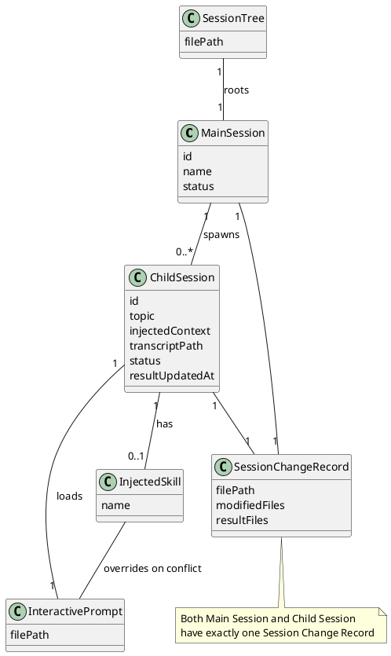
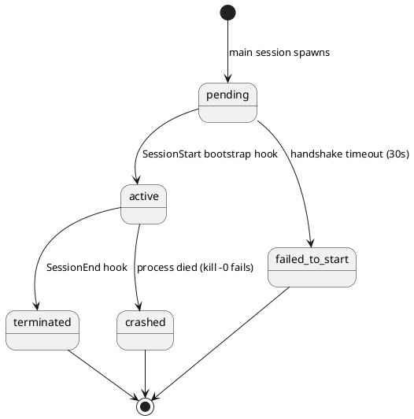
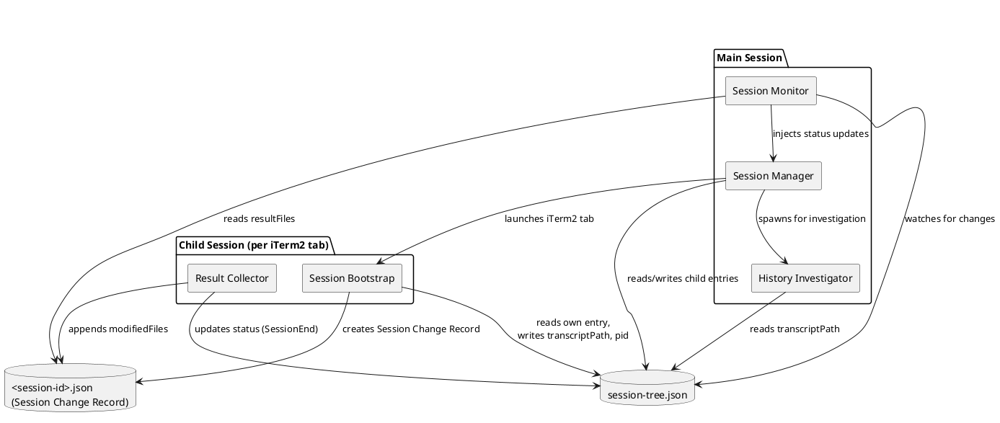
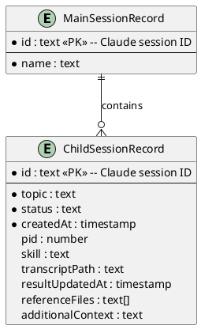
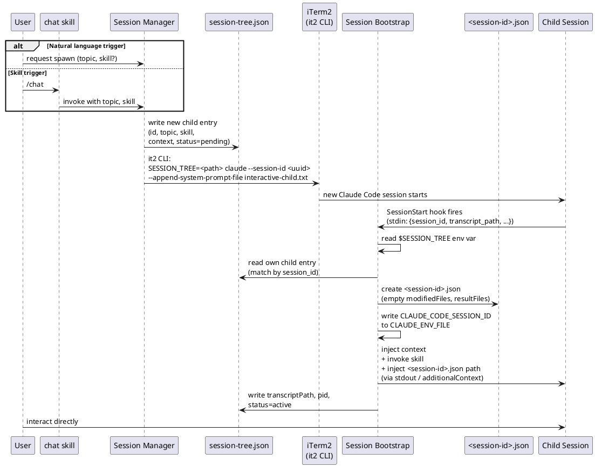
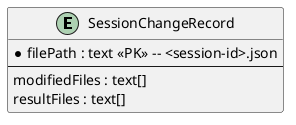
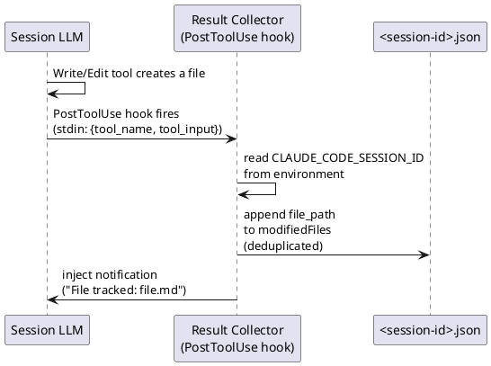
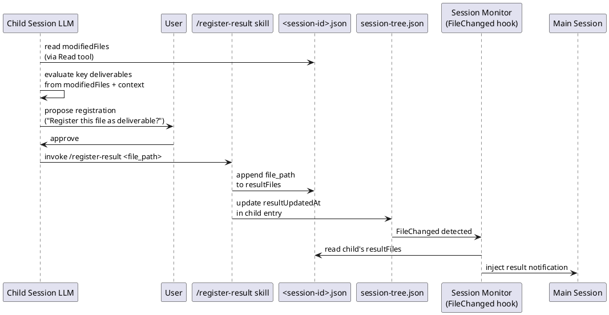
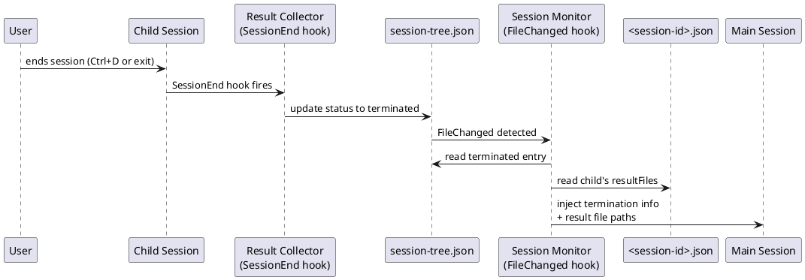
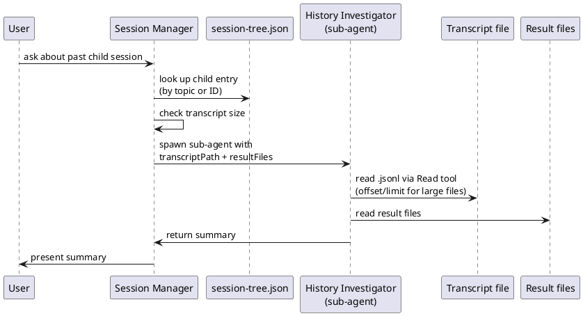

# Specification: interactive agent/prompt use cases
> Source: [2026-03-27-1500-agent-orchestrator.story.md](./2026-03-27-1500-agent-orchestrator.story.md), [2026-03-28-1030-agent-orchestrator.requirement.md](./2026-03-28-1030-agent-orchestrator.requirement.md), [2026-03-29-1500-agent-orchestrator.domain.md](./2026-03-29-1500-agent-orchestrator.domain.md), [2026-03-29-2100-agent-orchestrator.architecture.md](./2026-03-29-2100-agent-orchestrator.architecture.md)

## Overview
Two layers for Claude Code's interactive agent system. First, a thin behavioral layer (conversation-first attitude) that sets the LLM's conversational stance when loaded as a system prompt. Second, an agent orchestrator that enables the main session to spawn, manage, and collect results from child sessions — each a dedicated interactive conversation running in a separate iTerm2 tab. Child sessions are user-facing interactive sessions, not background automation. Result file delivery uses per-session file tracking and LLM+user-driven registration — sessions do not read or modify session-tree.json directly but use skills to access session information.

The agent orchestrator extends Claude Code's interactive session model with a two-level session hierarchy. Five components collaborate through two file-based data stores (`session-tree.json` and per-session `<session-id>.json`) and Claude Code's hook infrastructure. All inter-session communication flows through `session-tree.json` — no direct IPC, no sockets, no shared memory.

---

## Functional Requirements

### Job Stories Reference
1. **[STORY-7]. Conversation-first attitude at session start** — When I start a Claude session to explore an idea or discuss a topic, I want to load a system prompt that instructs the LLM to ask clarifying questions before acting, so I can get results that actually match what I meant, not what the LLM assumed.
2. **[STORY-9]. Spawn a dedicated child session** — When the main session encounters a sub-problem, I want to spawn a child session with the interactive prompt loaded, so I can have specialized conversations in a dedicated session.
3. **[STORY-10]. Automated information exchange between sessions** — When a child session is running, I want hooks to automatically exchange information between sessions, so I can keep the main session aware of child session progress.
4. **[STORY-12]. Child session result file accessible to main session** — When I finish a child session, I want the result file path automatically registered with the main session, so I can reference the output directly.
5. **[STORY-13]. Child session conversation history investigation** — When I want to review a past child session, I want the main session to read that session's history via a sub-agent, so I can understand the reasoning behind the output.
6. **[STORY-14]. User controls session termination** — When I'm in a child session, I want the LLM to suggest wrapping up when appropriate while leaving the final decision to me, so I can keep exploring as long as I need. *(Already covered by [FR-16] — conversation-first behavioral layer includes session termination rules.)*
7. **[STORY-15]. Skill injection at child session startup** — When I create a child session with a specific skill, I want that skill injected at startup, so I can start in the right structured dialogue mode.
8. **[STORY-16]. Session file change tracking** — When files are created or modified during a session, I want all file changes automatically recorded, so I can have a complete record of what the session produced.
9. **[STORY-17]. LLM-based result file identification** — When a child session has been working and producing files, I want the LLM to evaluate which files are key deliverables and suggest them to me, so I can register important outputs without manually tracking every file change.
10. **[STORY-18]. Result file delivery to main session** — When a file is approved as a key deliverable in a child session, I want the main session automatically notified, so I can access child session results from the main session without searching for them.

### Implementation
- [x] [FR-16]. Conversation-first behavioral layer — [92c7b8a]
- [x] [FR-17]. Child session spawn
- [x] [FR-18]. Child session result delivery on termination
- [x] [FR-19]. Child session conversation history investigation
- [ ] [FR-20]. Session file change tracking
- [ ] [FR-21]. LLM-based result file identification
- [ ] [FR-22]. Result file registration
- [ ] [FR-23]. Child session termination notification to main session

### [FR-16]. Conversation-first behavioral layer

> Story: [STORY-7]

**Trigger:** Session start via `--append-system-prompt-file` (interactive.txt) or `--agent` (interactive.md)

**Input:** User messages throughout the session

**Processing:**

**1. Core principle — conversation first, action later**
- Default stance is **conversational**. Never jump to action unless the user explicitly directs it.
- **Action** (requires explicit user direction): any operation that creates, modifies, or deletes files, or executes commands with side effects.
- **Research** (allowed freely): read-only operations — file reads, grep/search, directory listing, web lookups.

**2. Intent-adaptive behavior**

Recognize user intent and adapt:

- **Question** (simple or complex) → Answer directly. Research if needed (read-only operations are OK). No clarification ceremony — do not preface with a summary of understanding or ask whether the user wants an answer.
- **Exploration/discussion** (brainstorm, learning, codebase understanding) → Ask follow-up questions, provide detailed explanations, offer related perspectives. Don't cut the conversation short. No action unless asked.
- **Task** (vague or clear, including direct commands) → Always do a lightweight confirmation before acting: summarize what you're about to do in 1-2 lines and wait for user OK. Then execute. No heavy ceremony — no prescribed mechanics like plan mode or sub-agent spawning.

**3. Session termination**

- The user decides when the conversation ends. The LLM never concludes, wraps up, or suggests ending the session on its own.
- The LLM may suggest next steps or note when a topic seems complete, but the decision to stop is always the user's.

**4. Relationship to skills**

- **Defer structured workflows to skills.** This prompt does not define dialogue methods, steps, or workflow logic. Skills (co-think-*, spark-*, etc.) handle those.
- **Skills override this prompt.** When a skill is loaded alongside this prompt and its instructions conflict, the skill's instructions take precedence. This prompt is a base layer.
- **No obligation to suggest skills.** Whether to suggest a relevant skill when none is loaded is left to the LLM's judgment.

**Output — delivery files:**

Two prompt files with shared core content (the behavioral rules above), split for main vs. child sessions:

1. `plugins/workflow/prompts/interactive.txt` — main session prompt (includes Session Manager instructions)
2. `plugins/workflow/prompts/interactive-child.txt` — child session prompt (same core content, without Session Manager section)

Both files are plain text, loaded via `--append-system-prompt-file`. Delivered as part of the `workflow` plugin.

**Error handling:** N/A (behavioral prompt, no failure modes)

### [FR-17]. Child session spawn

> Story: [STORY-9], [STORY-15]

**Trigger:**
1. User requests via natural language
2. Main session LLM suggests and user approves
3. User invokes via `chat` skill (`/chat`)

**Input:**
- Topic/purpose (required)
- Skill to inject (optional)
- Reference file paths and context summary — main session LLM compiles from current conversation

**Processing:**
1. Main session generates a child session ID and records initial session info (session ID, topic, reference file paths, context summary, skill) to `.claude/sessions/<main-conversation-id>/session-tree.json`
2. Launch a new Claude Code interactive session in a new iTerm2 tab via `it2` CLI (iTerm2 shell integration): `it2 launch -- env SESSION_TREE=<session-tree.json-path> claude --session-id <uuid> --append-system-prompt-file <path-to-interactive-child.txt>`
3. Child session's `SessionStart` hook fires on startup:
   - Reads the child session's entry from `session-tree.json`, identifies its session ID, and outputs the context to stdout (including skill invocation if specified) → automatically injected into the conversation context
   - Updates `session-tree.json` with the child session's transcript path (`transcript_path`) and process ID (`pid`)
5. User interacts with the child session directly — an independent conversation separate from the main session

**Session directory:**
- Location: project root `.claude/sessions/<main-conversation-id>/`

**Proposed `session-tree.json` schema:**
```json
{
  "mainSession": {
    "id": "<main session's Claude session ID>",
    "name": "<user-assigned name for search/identification>"
  },
  "children": [
    {
      "id": "<child session's Claude session ID, generated at spawn and used as --session-id>",
      "topic": "<topic/purpose>",
      "status": "pending | active | terminated | crashed | failed_to_start",
      "createdAt": "<ISO 8601 timestamp>",
      "pid": 12345,
      "skill": "<injected skill name or null>",
      "transcriptPath": "<recorded by SessionStart hook>",
      "resultUpdatedAt": "<ISO 8601 timestamp, updated when resultFiles changes in Session Change Record>",
      "referenceFiles": ["<file paths>"],
      "additionalContext": "<context summary from main session>"
    }
  ]
}
```

**Output:** An interactive child session opens in a new iTerm2 tab. The main session continues without blocking.

**Error handling:**
- iTerm2 not running: error message to user
- Conversation ID unavailable: abort spawn and inform the user — session-tree.json requires the main session's conversation ID as the directory key, so spawning cannot proceed without it
- Specified skill not found: main session LLM or skill verifies the skill exists before spawning. If invalid, inform the user and ask whether to proceed without the skill or specify a different one

**Dependencies:** None (foundational FR)

### [FR-18]. Child session result delivery on termination

> Story: [STORY-10], [STORY-12]

> **Plan Change:** The result file delivery mechanism in this FR has been redesigned. Some parts are deprecated and replaced by new FRs.
>
> **Deprecated:** `resultPatterns`-based automatic matching logic, `resultPatterns` field in session-tree.json
> **Extracted to [FR-23]:** SessionEnd hook (status → terminated), FileChanged hook (main session notification)
> **Replaced by:** [FR-20] (session file change tracking), [FR-21] (LLM-based result file identification), [FR-22] (result file registration), [FR-23] (child session termination notification)

This FR's original processing has been fully redesigned and split into:
- **[FR-20]** — session file change tracking (replaces `children[].modifiedFiles` in session-tree.json)
- **[FR-21]** — LLM-based result file identification (replaces `resultPatterns` automatic matching)
- **[FR-22]** — result file registration via `/register-result` skill (replaces `children[].resultFiles` in session-tree.json)
- **[FR-23]** — child session termination notification (extracted SessionEnd and FileChanged hooks)

See the Plan Change section below and the individual replacement FRs for current behavior.

**Dependencies:** [FR-17]

### [FR-19]. Child session conversation history investigation

> Story: [STORY-13]

**Trigger:** User asks about a past child session's conversation in the main session

**Input:** Child session identifier (topic from `children[].topic` or child session ID from `children[].id`)

**Processing:**
1. Main session locates the child session's transcript path and result file paths from `session-tree.json`. If multiple child sessions share the same topic, present a disambiguation list (topic, createdAt, status) and let the user pick
2. Main session LLM checks the transcript file size. For large transcripts (LLM judgment — e.g., transcript exceeds a few hundred lines), suggest using a sub-agent to read and summarize instead of reading directly — user decides
3. Based on user's choice: read directly or spawn a sub-agent (via Claude Code Agent tool or prompt instruction) to read and summarize the transcript and result files within the main session

**Output:** Answer or summary of the child session conversation

**Error handling:**
- Transcript file not found or deleted: inform user that history is unavailable
- Multiple matching topics: present disambiguation list, do not auto-select

**Dependencies:** [FR-17] (session-tree.json with transcript_path)

### FR-18 Plan Change: Result File Delivery Redesign

FR-20/21/22/23 redesign the result file delivery mechanism from [FR-18] (Child session result delivery on termination).

**Deprecated from FR-18:**
- `resultPatterns`-based automatic matching logic (PostToolUse hook pattern matching → resultFiles registration)
- `resultPatterns` field in session-tree.json

**Retained from FR-18 (extracted to FR-23):**
- SessionEnd hook — updates child session status to `terminated`
- FileChanged hook — detects session-tree.json changes → notifies main session

**Replaced by FR-20/21/22:**
- modifiedFiles tracking → moved to per-session `<session-id>.json` file (FR-20)
- resultFiles registration → LLM judgment + user approval + `/register-result` skill (FR-21, FR-22)

### [FR-20]. Session file change tracking
> Story: [STORY-16]

**Trigger:** Write or Edit tool use in a session

**Input:** file_path used by the tool

**Processing:**
1. SessionStart hook records `CLAUDE_CODE_SESSION_ID` to `CLAUDE_ENV_FILE` to expose as environment variable (both main and child sessions)
2. On session start, create `<session-id>.json` with initial state `{"modifiedFiles": []}` (SessionStart hook)
3. On Write/Edit tool use, PostToolUse hook appends file_path to `modifiedFiles` in `<session-id>.json`
4. Duplicate paths are not added (unique file paths only)
5. On new file addition, inject a short filename-only notification into context (e.g., `File tracked: file.md (5 files tracked)`)
6. File changes from Bash tool are not tracked
7. Main session: no `SESSION_TREE` env var → record to `<main-id>.json`. Child session: `SESSION_TREE` env var present → record to `<child-id>.json`

**`<session-id>.json` schema:**
```json
{
  "modifiedFiles": ["path/to/file1.md", "path/to/file2.py"],
  "resultFiles": ["path/to/deliverable.md"]
}
```

**File location:** `.claude/sessions/<main-id>/<session-id>.json`

**Output:** List of unique file paths modified by the session

**Implementation note:** Rename and repurpose existing `post_tool_result_collector.py`. Remove resultPatterns matching logic, convert to modifiedFiles tracking in `<session-id>.json`.

**Session directory resolution:**
- Child session: `SESSION_TREE` env var points to session-tree.json; the directory containing it is the session directory
- Main session: no `SESSION_TREE` set. SessionStart hook derives the path from `session_id` in stdin JSON: `.claude/sessions/<session_id>/`. The directory is created lazily on first child spawn (FR-17), but the main session's own `<session-id>.json` is created here on startup

**Hook execution order:** Claude Code guarantees SessionStart hooks complete before the first tool use. `CLAUDE_CODE_SESSION_ID` is written to `CLAUDE_ENV_FILE` during SessionStart, so it is available to all subsequent PostToolUse hooks. No race condition.

**Error handling:**
- `<session-id>.json` write failure: ignore, no impact on session

**Dependencies:** [FR-17] (child session spawn)

### [FR-21]. LLM-based result file identification
> Story: [STORY-17]

**Trigger:** LLM judges naturally in the child session conversation flow at these moments:
- Immediately after a skill writes a final output file
- When the user implies task completion
- When the user explicitly names a file as a deliverable

**Input:** Modified file list from `<child-id>.json` + conversation context

**LLM file access:** PostToolUse hook injects a short filename-only notification on new file addition. LLM reads `<child-id>.json` directly via Read tool when the full list is needed. `<child-id>.json` path is injected by SessionStart hook into the prompt.

**Processing:**
1. LLM evaluates key deliverables based on:
   - Files written by a skill as final output (e.g., requirement.md, architecture.md)
   - Files the user explicitly identifies as deliverables
   - Files the LLM judges as key deliverables from conversation context
2. When judged as a key deliverable, propose registration to the user via text (e.g., "Register this file as a key deliverable?")
3. Previously rejected files can be re-proposed if they are central to the session's main work or contain key content
4. Files not in `modifiedFiles` can also be registered if the user specifies them
5. Batch registration of multiple files is allowed
6. On user approval → proceeds to [FR-22]

**Output:** Registration proposal text to the user

**Implementation:** Add judgment criteria and nudge behavior directives to `interactive-child.txt` prompt

**Error handling:**
- `<child-id>.json` missing or read failure: do not nudge (no impact on session)

**Dependencies:** [FR-20] (session file change tracking)

### [FR-22]. Result file registration
> Story: [STORY-18]

**Trigger:** User approves result file registration or directly instructs it

**Input:** File path(s) to register

**Processing:**
1. SessionStart hook records `CLAUDE_CODE_SESSION_ID` to `CLAUDE_ENV_FILE` to expose as environment variable
2. On user approval or direct instruction, invoke `/register-result <file_path>` skill
3. Skill script uses `$CLAUDE_CODE_SESSION_ID` to append file path to `resultFiles` in Session Change Record (`<session-id>.json`). Duplicate paths are not added (deduplicated, same as `modifiedFiles`)
4. If child session (`$SESSION_TREE` set): also updates `resultUpdatedAt` timestamp in the child entry of session-tree.json → existing `session_monitor.py` FileChanged hook notifies main session

**Implementation required:** `/register-result` skill — script that takes file path as argument, appends it to `resultFiles` in `<session-id>.json`, and updates `resultUpdatedAt` in session-tree.json (child session only)

**Output:** Session Change Record `resultFiles` updated; session-tree.json `resultUpdatedAt` updated (child session) → main session FileChanged hook notification

**Error handling:**
- `<session-id>.json` write failure: notify user of failure
- `CLAUDE_CODE_SESSION_ID` not set: registration not possible, notify user

**Dependencies:** [FR-20] (file change tracking), [FR-21] (LLM judgment and nudge), [FR-17] (child session spawn)

### [FR-23]. Child session termination notification to main session
> Story: [STORY-18]

**Trigger:** Child session terminates

**Processing:**
1. SessionEnd hook — updates the corresponding child entry status to `terminated` in `session-tree.json`
2. FileChanged hook — detects session-tree.json change → notifies main session with termination status; main session reads child's Session Change Record for resultFiles

**Output:** Child session termination info injected into main session context

**Implementation required:** `/session-status` skill — queries session status (child session list, status, etc.). Script reads session-tree.json via `$SESSION_TREE` and child Session Change Records for resultFiles.

**Error handling:**
- SessionEnd hook failure: main session can check child session status via `/session-status`

**Dependencies:** [FR-17] (child session spawn)

### Open Questions
- ~~iTerm2 scripting API details for session creation~~ — Resolved: iTerm2 Python API (`iterm2` package) via `iterm2_launcher.py`
- ~~Concurrent `session-tree.json` writes from multiple child sessions (race condition)~~ — Resolved: Python `fcntl.flock()` based shared/exclusive file locking in `session_tree.py`

---

## Domain Model

### Domain Glossary

| Concept | Definition | Key Attributes | Related FRs |
|---------|-----------|----------------|-------------|
| Main Session | A session started by the user from CLI (`claude`); root of a session tree | id (Claude session ID), name, status | [FR-17], [FR-19], [FR-20] |
| Child Session | A session spawned from a main session; always belongs to exactly one main session | id (Claude session ID), topic, injectedSkill, transcriptPath, injectedContext, status, resultUpdatedAt | [FR-17], [FR-18], [FR-19], [FR-20], [FR-21], [FR-22], [FR-23] |
| Session Tree | A persistent manifest that records one main session and all its child sessions, serving as the single source of truth for session discovery, status tracking, and change notification trigger. Stored at `.claude/sessions/<main-conversation-id>/session-tree.json` | filePath | [FR-17], [FR-18], [FR-19], [FR-20], [FR-22], [FR-23] |
| Session Change Record | A per-session JSON file that records all files modified by Write/Edit tool use during a session, and key deliverables registered as result files. One per session (both main and child). Stored at `.claude/sessions/<main-id>/<session-id>.json` | filePath, modifiedFiles, resultFiles | [FR-20], [FR-21], [FR-22] |
| Interactive Prompt | A system prompt that establishes the LLM's conversational stance (conversation first, action later). Delivered as `interactive-child.txt` (for child sessions) and `interactive.txt` / `interactive.md` (for main session). Child sessions load `interactive-child.txt` at startup | filePath | [FR-17] |
| Injected Skill | A Claude Code skill injected into a child session's system prompt at startup, determining the session's dialogue mode (e.g., co-think-*, spark-*). When loaded alongside the Interactive Prompt, the Injected Skill's instructions take precedence on conflict | name | [FR-17] |

### Concept Relationships



- **SessionTree → MainSession (1:1)**: A session tree always has exactly one main session.
- **MainSession → ChildSession (1:0..*)**: A main session spawns zero or more child sessions. No nesting — child sessions cannot spawn further children.
- **ChildSession → InteractivePrompt (1:1)**: Every child session loads the interactive prompt at startup.
- **ChildSession → InjectedSkill (1:0..1)**: A child session may optionally have one skill injected at startup.
- **InjectedSkill → InteractivePrompt (overrides on conflict)**: When both are loaded, the skill's instructions take precedence.
- **MainSession → SessionChangeRecord (1:1)**: Main session tracks its file modifications and result files in its own change record.
- **ChildSession → SessionChangeRecord (1:1)**: Child session tracks its file modifications and result files in its own change record. On result file registration, `resultUpdatedAt` in the child entry of session-tree.json is updated to trigger main session notification via FileChanged hook.

### State Transitions

#### Child Session



- **pending**: Child session entry created in session-tree.json, iTerm2 pane launched, but bootstrap hook has not yet completed.
- **active**: SessionStart bootstrap hook has completed — transcriptPath and pid recorded, user is interacting with the session.
- **terminated**: SessionEnd hook has fired (including Ctrl+D). Status updated in `session-tree.json`. Result file paths, if any, have been recorded in the Session Change Record before termination.
- **crashed**: Session Monitor (FileChanged hook) lazily detected on the next FileChanged event that the child process is no longer alive (`kill -0 <pid>` fails) while status was still `active`. SessionEnd hook never fired.
- **failed_to_start**: Session Monitor (FileChanged hook) lazily detected on the next FileChanged event that status remained `pending` for longer than 30 seconds — the bootstrap hook never completed.

Main Session and Session Tree do not have domain-level state transitions.

---

## Architecture

### Hook Communication Model

Claude Code hooks receive session metadata via **stdin JSON** (including `session_id` and `transcript_path`) and inject information back into the conversation via **stdout** or a structured `additionalContext` JSON field. Environment variables (`$SESSION_TREE`, `$CLAUDE_CODE_SESSION_ID` via `CLAUDE_ENV_FILE`) supplement stdin for cross-session context that hooks cannot derive from their own session alone.

### Component Diagram



> **Note:** Session Bootstrap and Result Collector are shown under "Child Session" but both also run in the main session. Their child-session behavior is architecturally richer (context injection, termination handling), so the grouping reflects the primary context. In the main session, Session Bootstrap only creates the Session Change Record and exposes `CLAUDE_CODE_SESSION_ID`; Result Collector only tracks file modifications.

**Session Manager** — orchestration logic in the main session. Creates child entries in session-tree.json, launches iTerm2 tabs, and coordinates investigation requests. iTerm2 tab creation uses `it2` CLI (iTerm2 shell integration). Spawn is triggered via the `chat` skill, which receives the main session's `session_id` through the `${CLAUDE_SESSION_ID}` skill template variable.

**Session Bootstrap** — SessionStart hook for all sessions. Creates the Session Change Record (`<session-id>.json`) and exposes `CLAUDE_CODE_SESSION_ID` via `CLAUDE_ENV_FILE`. For child sessions (when `$SESSION_TREE` is set), additionally locates session-tree.json, reads its own entry by matching `session_id` from stdin JSON against `id`, injects context (reference files, summary) and skill into the conversation via stdout, then writes back its transcriptPath and pid.

**Result Collector** — PostToolUse and SessionEnd hooks. PostToolUse hook fires in all sessions — receives `tool_input.file_path` via stdin JSON and appends all Write/Edit file paths to `modifiedFiles` in the session's `<session-id>.json` without filtering. Injects a short notification into context on new file addition. SessionEnd hook fires in child sessions only (when `$SESSION_TREE` is set) — marks the session as terminated in session-tree.json.

**Session Monitor** — FileChanged hook on the main session (matcher: `session-tree.json`). Detects session-tree.json modifications and injects child session status changes (termination, new result files) into the main session's conversation context via stdout. On termination or `resultUpdatedAt` change, reads the child's Session Change Record for `resultFiles`. On every firing, also lazily scans all `active`/`pending` entries for crash detection (`kill -0 <pid>`) and bootstrap handshake timeout (pending > 30s).

**History Investigator** — sub-agent spawned by the main session on demand. Reads a child session's transcript and result files, returns a summary.

### Components

#### Session Manager

**Responsibility:** Core orchestration — spawns child sessions, maintains session-tree.json, serves as the entry point for all session lifecycle operations in the main session.

**Data store:** Yes — `session-tree.json` at `.claude/sessions/<main-conversation-id>/`. Created lazily on first child spawn — the directory and manifest do not exist until the user requests the first child session.

##### DB Schema



The session-tree.json file contains one MainSessionRecord and zero or more ChildSessionRecords. This is a single JSON file, not a relational database — the ERD captures the logical structure.

- **MainSessionRecord**: identifies the main session. `name` is user-assigned for search/identification.
- **ChildSessionRecord**: one per spawned child session. `id` is the PK — the Claude session ID, generated at spawn time and used as the `--session-id` for the child Claude Code process. `status` is `pending` (spawned, bootstrap not yet complete), `active` (bootstrap complete, session running), `terminated`, `crashed`, or `failed_to_start`. `pid` is the child Claude Code process ID, recorded by the Session Bootstrap for crash detection. `transcriptPath` is initially null, filled by the Session Bootstrap hook. `resultUpdatedAt` is updated when `/register-result` writes to the child's Session Change Record — serves as the FileChanged trigger for Session Monitor. `referenceFiles` and `additionalContext` capture the injected context from the main session at spawn time.

##### Information Flow

###### Story: STORY-9 — Spawn a dedicated child session



The spawn flow has two entry points: (1) natural language — the LLM suggests spawning and the user approves, (2) the `chat` skill — the user invokes `/chat` directly. Both paths converge at the Session Manager, which generates a child session ID (UUID), writes the entry to session-tree.json with `id` set to the generated UUID (Claude session ID), and launches an iTerm2 tab via `it2` CLI with `SESSION_TREE=<path> claude --session-id <uuid> --append-system-prompt-file interactive-child.txt`. The child session's SessionStart hook receives `session_id` and `transcript_path` via stdin JSON, reads the `$SESSION_TREE` environment variable to locate session-tree.json, finds its own entry by matching `session_id` against `id`, creates the Session Change Record (`<session-id>.json`), exposes `CLAUDE_CODE_SESSION_ID` via `CLAUDE_ENV_FILE`, injects the context (and skill if specified) via stdout, and writes back its transcriptPath and pid to the manifest.

###### Story: STORY-15 — Skill injection at child session startup

Skill injection is part of the STORY-9 spawn flow. The Session Manager includes the skill name in the child entry. The Session Bootstrap reads it and invokes the skill (e.g., `/workflow:co-think-requirement`) as part of context injection. No separate information flow — it's embedded in the bootstrap sequence above.

#### Session Bootstrap

**Responsibility:** Initializes all sessions with a Session Change Record and environment setup. For child sessions, additionally injects context from the session tree and optionally invokes a skill.

**Data store:** Yes — `<session-id>.json` (Session Change Record) at `.claude/sessions/<main-id>/<session-id>.json`. Created on session startup for both main and child sessions.

##### DB Schema



The Session Change Record is a per-session JSON file. One exists for each session (main or child).

- **modifiedFiles**: all file paths written or edited during the session, appended by the Result Collector's PostToolUse hook. Deduplicated — each path appears at most once.
- **resultFiles**: key deliverable paths registered explicitly via `/register-result` skill (on LLM nudge with user approval, or direct user instruction).

**Identification mechanism:** For child sessions — launched with `SESSION_TREE=<path>` environment variable and `--session-id <uuid>` CLI flag. The SessionStart hook receives `session_id` via stdin JSON, reads `$SESSION_TREE` to locate the manifest, and matches its entry by `session_id` against `id`. For main sessions — no `$SESSION_TREE` set; the hook only creates the Session Change Record and exposes `CLAUDE_CODE_SESSION_ID`.

##### Information Flow

###### Story: STORY-9 — Spawn a dedicated child session

See Session Manager's STORY-9 sequence above. The Bootstrap is the child-side participant that reads context from session-tree.json, creates the Session Change Record, and injects context.

#### Result Collector

**Responsibility:** Tracks file modifications in the Session Change Record during any session's lifetime. For child sessions, additionally handles termination status updates.

**Data store:** No (writes to `<session-id>.json` and session-tree.json, both owned by other components)

##### Information Flow

###### Story: STORY-16 — Session file change tracking



The PostToolUse hook fires in all sessions (main and child). It receives `tool_name` and `tool_input` via stdin JSON. When the tool is `Write` or `Edit`, it reads `CLAUDE_CODE_SESSION_ID` from the environment to locate `<session-id>.json`, and appends `tool_input.file_path` to `modifiedFiles`. No filtering — all file modifications are tracked. A short notification is injected into the conversation context on new file addition.

This flow does not touch session-tree.json and does not trigger Session Monitor. File tracking is local to the session's own change record.

###### Story: STORY-17 + STORY-18 — LLM-based result file identification + delivery



The LLM evaluates key deliverables based on: files written by a skill as final output, files the user explicitly identifies, or files the LLM judges as key deliverables from conversation context. When judged as a key deliverable, the LLM proposes registration to the user. On approval, the `/register-result` skill appends the file path to `resultFiles` in the Session Change Record and updates `resultUpdatedAt` in the child entry of session-tree.json. This triggers Session Monitor, which reads the child's Session Change Record for `resultFiles` and notifies the main session.

###### Story: STORY-12 — Child session result file accessible to main session



On child session termination, the SessionEnd hook updates the child's status to `terminated` in session-tree.json. The Session Monitor detects this, reads the child's Session Change Record for `resultFiles`, and injects the termination notification with result file paths into the main session's conversation context.

#### Session Monitor

**Responsibility:** Watches session-tree.json for changes on the main session side and injects relevant updates into the main session's conversation context. Reads child Session Change Records for result file details. On every firing, lazily scans all `active`/`pending` entries for crash detection and bootstrap handshake timeout.

**Data store:** No

##### Information Flow

###### Story: STORY-12 — Child session result file accessible to main session

See Result Collector's STORY-12 sequence above. The Session Monitor detects the termination status change, reads the child's Session Change Record, and injects the notification into the main session.

###### Story: STORY-17 + STORY-18 — LLM-based result file identification + delivery

See Result Collector's STORY-17+18 sequence above. The Session Monitor detects the `resultUpdatedAt` change in session-tree.json, reads the child's Session Change Record for `resultFiles`, and notifies the main session.

#### History Investigator

**Responsibility:** Reads and summarizes past child session transcripts and result files on demand.

**Data store:** No

**Transcript access:** Reads the `.jsonl` transcript file directly via the Read tool. For large transcripts, uses offset/limit to read in chunks. No session resume — read-only access to the raw file.

##### Information Flow

###### Story: STORY-13 — Child session conversation history investigation



The user asks about a past child session. The Session Manager finds the child entry in session-tree.json, checks the transcript size, and either reads directly or spawns a sub-agent (History Investigator) to read and summarize the transcript and result files.

### Concurrency and Error Handling

#### File locking

All reads and writes to session-tree.json must be wrapped in a file lock to prevent update-lost anomalies. The lock scope covers the entire read-modify-write cycle. The implementation uses Python's `fcntl.flock()` with `LOCK_SH` (shared) and `LOCK_EX` (exclusive) on a `.lock` file adjacent to session-tree.json:

```python
import fcntl

# shared lock for reads
with open(lock_path) as lf:
    fcntl.flock(lf, fcntl.LOCK_SH)
    data = json.loads(path.read_text())
    fcntl.flock(lf, fcntl.LOCK_UN)

# exclusive lock for read-modify-write
with open(lock_path) as lf:
    fcntl.flock(lf, fcntl.LOCK_EX)
    data = json.loads(path.read_text())
    transform(data)
    path.write_text(json.dumps(data, indent=2) + "\n")
    fcntl.flock(lf, fcntl.LOCK_UN)
```

This applies to all components that write to session-tree.json: Session Manager, Session Bootstrap, and Result Collector. The shared library (`hooks/lib/session_tree.py`) exposes `st_read()` for shared-lock reads and `st_write(transform)` for exclusive-lock read-modify-write operations.

Session Change Records (`<session-id>.json`) do not require cross-session locking — each session writes only to its own file. The `/register-result` skill writes to `<session-id>.json` and then to session-tree.json (`resultUpdatedAt`); the session-tree.json write uses the same `st_write()` lock.

#### Crash detection

If a child session crashes (process killed, terminal closed abnormally), the SessionEnd hook never fires and the entry remains `active`. Crash detection is **lazy** — the Session Monitor piggybacks on the next FileChanged event for session-tree.json. Whenever the monitor fires (for any reason — another child's termination, result registration, etc.), it also scans all `active` entries and checks `kill -0 <pid>` against each child's recorded PID. When a process is no longer alive and status is still `active`, the Session Monitor updates it to `crashed` and injects a notification into the main session.

The Session Bootstrap records `os.getppid()` (the parent PID, i.e., the Claude Code process) into the child entry during initialization. Since the hook runs as a child process of the Claude Code process, `os.getppid()` points to the Claude Code process — if this process dies, the Session Monitor's `kill -0` check (via `os.kill(pid, 0)`) will fail.

**Limitation:** If only one child session exists and it crashes without triggering a session-tree.json write, the crash is not detected until the user manually queries session status (via `/session-status`) or a subsequent session-tree.json change occurs. This is an accepted trade-off — no periodic polling mechanism exists.

#### Bootstrap handshake timeout

Covers the case where the child process starts but the Bootstrap hook never completes — status remains `pending`. Like crash detection, this is **lazy** — checked on the next FileChanged event. Whenever the Session Monitor fires, it also scans for entries where `status == "pending"` AND `createdAt` is older than 30 seconds. When detected, status is updated to `failed_to_start` and a notification is injected into the main session.

This is distinct from crash detection: crash detection checks `active` entries with a recorded PID, while handshake timeout checks `pending` entries where the Bootstrap never ran.

### Consistency Check

#### Cross-diagram consistency

All five components (Session Manager, Session Bootstrap, Result Collector, Session Monitor, History Investigator) appear in both the component diagram and at least one sequence diagram. Both data stores — session-tree.json and `<session-id>.json` (Session Change Record) — are referenced consistently across component and sequence diagrams.

#### Domain model coverage

| Domain Concept | Component(s) | Notes |
|---|---|---|
| Main Session | Session Manager, Session Bootstrap, Result Collector | Main session is the execution context for Session Manager, Session Monitor, and History Investigator. Session Bootstrap and Result Collector also run in main sessions (Session Change Record creation, file tracking) |
| Child Session | Session Bootstrap, Result Collector | Child session is the execution context; Bootstrap initializes it with context/skill, Result Collector manages its file tracking and termination |
| Session Tree | Session Manager (data store) | session-tree.json schema matches the domain model's SessionTree concept |
| Session Change Record | Session Bootstrap (creates), Result Collector (writes modifiedFiles), `/register-result` skill (writes resultFiles) | Per-session `<session-id>.json` — both main and child sessions have exactly one |
| Interactive Prompt | Session Bootstrap | Loaded via `--append-system-prompt-file` at spawn; Bootstrap adds context on top |
| Injected Skill | Session Bootstrap | Skill name stored in session-tree.json, invoked by Bootstrap during initialization |

All six domain concepts are housed in at least one component.

**Cross-component relationships:**
- Session Tree → Main Session (1:1): Session Manager creates exactly one MainSessionRecord per session-tree.json
- Main Session → Child Session (1:0..*): Session Manager creates ChildSessionRecords; no nesting enforced by the two-level design
- Child Session → Interactive Prompt (1:1): enforced by the spawn command always including `--append-system-prompt-file interactive-child.txt`
- Child Session → Injected Skill (1:0..1): `skill` field in ChildSessionRecord is nullable
- Injected Skill overrides Interactive Prompt on conflict: this is a behavioral rule within the prompt content, not an architectural flow — the Interactive Prompt already contains the precedence rule ("Skills override this prompt")
- Main Session → Session Change Record (1:1): Session Bootstrap creates `<main-id>.json` on main session startup
- Child Session → Session Change Record (1:1): Session Bootstrap creates `<child-id>.json` on child session startup. On result file registration, `resultUpdatedAt` in the child entry of session-tree.json is updated to trigger main session notification via FileChanged hook

**State transitions:**
- Child Session `pending → active`: managed by Session Bootstrap's SessionStart hook — confirms the child process started and writes back transcriptPath and pid
- Child Session `active → terminated`: managed by Result Collector's SessionEnd hook writing to session-tree.json
- Child Session `active → crashed`: lazily detected by Session Monitor on the next FileChanged event via `kill -0 <pid>` when the child process is no longer alive and SessionEnd was never called
- Child Session `pending → failed_to_start`: lazily detected by Session Monitor on the next FileChanged event when status is still `pending` and `createdAt` is older than 30 seconds (bootstrap never completed)

#### Story coverage

| Story | Sequence Diagram(s) | Component(s) Involved |
|---|---|---|
| STORY-7 | *(no diagram — behavioral prompt, already implemented as FR-16)* | Session Bootstrap loads the Interactive Prompt via `--append-system-prompt-file` during STORY-9 spawn flow |
| STORY-9 | Session Manager / STORY-9 | Session Manager, Session Bootstrap |
| STORY-10 | *(no diagram — see note below)* | — |
| STORY-12 | Result Collector / STORY-12 | Result Collector, Session Monitor |
| STORY-13 | History Investigator / STORY-13 | History Investigator, Session Manager |
| STORY-14 | *(no diagram — behavioral rule in Interactive Prompt, FR-16)* | — |
| STORY-15 | *(embedded in STORY-9 spawn flow)* | Session Manager, Session Bootstrap |
| STORY-16 | Result Collector / STORY-16 | Result Collector |
| STORY-17 | Result Collector / STORY-17+18 | Result Collector (Session Change Record), Session Monitor, `/register-result` skill |
| STORY-18 | Result Collector / STORY-17+18 | Result Collector (Session Change Record), Session Monitor, `/register-result` skill |

**STORY-10 note:** STORY-10 (Automated information exchange between sessions) is no longer covered by a dedicated sequence diagram. The result file delivery mechanism has been redesigned: file tracking is now local to each session's Session Change Record (STORY-16), and cross-session notification only occurs on result file registration (STORY-17/18) or session termination (STORY-12). The original STORY-10 flow — where every file modification triggered a cross-session notification via session-tree.json — is replaced by this more targeted notification model. STORY-10's intent ("keep the main session aware of child session progress") is fulfilled by the combination of STORY-12 (termination notification) and STORY-17/18 (result file delivery).

STORY-7 and STORY-14 are behavioral rules delivered by the Interactive Prompt (FR-16, already implemented). They require no architectural components — the prompt file is loaded at child session startup as part of the STORY-9 spawn flow. All orchestrator stories with architectural relevance have sequence diagram coverage.

---

## Spec Feedback

- FR-17, FR-18, FR-19: `session.json` renamed to `session-tree.json` throughout; context file replaced with hook-based context injection recorded in `session-tree.json` — applied directly to requirement file and GitHub issues #17, #18, #19 (no feedback issue needed)
- FR-17, FR-20, FR-22: `modifiedFiles` and `resultFiles` removed from `session-tree.json` child entry, moved to Session Change Record (`<session-id>.json`); `resultUpdatedAt` added to child entry as notification trigger → [#27](https://github.com/studykit/studykit-plugins/issues/27) — applied directly to requirement file

## Session Checkpoint
> Last updated: 2026-03-30 15:00

### Decisions Made
- Two-layer design: behavioral prompt (FR-16) + agent orchestrator (FR-17–FR-23)
- Two-level session hierarchy only — no child-of-child nesting
- File-based IPC via session-tree.json — no direct session communication
- Per-session file tracking via Session Change Record (`<session-id>.json`) — modifiedFiles and resultFiles separated from session-tree.json
- LLM+user-driven result file registration — no automatic pattern matching
- `resultUpdatedAt` in session-tree.json as the cross-session notification trigger
- Python `fcntl.flock()` for concurrent session-tree.json access
- Session Bootstrap handles both main and child sessions (branching on `$SESSION_TREE`)
- Lazy crash detection — piggybacks on FileChanged events, no periodic polling
- `kill -0 <pid>` for crash detection, bootstrap timeout at 30 seconds

### Open Items
- No unresolved questions at this time

### Next Steps
- Implement FR-20 (session file change tracking)
- Implement FR-21 (LLM-based result file identification)
- Implement FR-22 (result file registration — `/register-result` skill)
- Implement FR-23 (child session termination notification — `/session-status` skill)

## Interview Transcript
<details>
<summary>Full Q&A — Requirements Phase</summary>

*Requirements were developed in a separate co-think-requirement session. See [2026-03-28-1030-agent-orchestrator.requirement.md](./2026-03-28-1030-agent-orchestrator.requirement.md) for the full interview transcript.*

</details>

<details>
<summary>Full Q&A — Domain Model Phase</summary>

### Round 1
**Q:** The specs use "main session" and "child session" — are these two distinct concepts, or one concept ("Session") with a role/type distinction?
**A:** Session is the base concept — one Claude lifecycle (SessionStart → SessionStop). Main session is user-started from CLI. Child session is spawned from within a main session.

### Round 2
**Q:** Is a child session always tied to exactly one main session, or could a child session itself spawn further children?
**A:** No further children. Strictly two-level.

### Round 3
**Q:** The Session Registry (session.json) — is "Session Registry" or "Session Manifest" the right term?
**A:** Session File is better. → Later revised to **Session Tree** to reflect the main-to-children relationship. The file is called `session-tree.json`.

### Round 4
**Q:** Should each child entry in the session tree be its own concept (Child Session Record)?
**A:** Focus on Session itself, not a separate record concept.

### Round 5
**Q:** Session attributes breakdown — Main Session has name, Child Session has skill, resultFiles, transcriptPath, etc.?
**A:** The injected context (reference file paths, context summary) must be recorded in session-tree.json. Not a separate file, but tracked data within the Session Tree.

### Round 6
**Q:** Should Hook be a domain concept?
**A:** No — Claude Code infrastructure that the orchestrator configures and uses.

### Round 7
**Q:** Is Result File its own concept or just an attribute?
**A:** Just a file path representing session output — an attribute of Child Session.

### Round 8
**Q:** Is Transcript its own concept or just an attribute?
**A:** A Claude Code concept, just referenced as a path attribute on Child Session.

### Round 9
**Q:** Should Session remain in the glossary as a shared concept for Main Session and Child Session?
**A:** No — it's self-evident that both have id and status. Just keep Main Session and Child Session.

### Round 10
**Q:** Relationships — should Session Tree separately "contain" children, or is that redundant with Main Session "spawns" children?
**A:** One relationship is enough. Session Tree roots a Main Session (1:1), Main Session spawns Child Sessions (1:0..*). Children are reachable through the main session.

### Round 11
**Q:** Child Session states — are active and terminated enough, or are intermediate states needed (e.g., "creating", "results registered")?
**A:** Two states only. No intermediate states needed — result files are just recorded as attributes. Main Session has no separate state transitions.

### Round 12 (Review — Session Tree definition)
**Q:** Session Tree definition is vague — should it describe its role as single source of truth for discovery, status, and result lookup?
**A:** Accepted.

### Round 13 (Review — Interactive Prompt)
**Q:** Should Interactive Prompt be a glossary concept?
**A:** Yes — added as a concept. FR-16 is done but child sessions load it, so it belongs in the model.

### Round 14 (Review — Injected Skill)
**Q:** Should Skill be a glossary concept? Risk of confusion with Claude Code's Skill concept.
**A:** Named "Injected Skill" to distinguish from Claude Code's general Skill concept. It's a Claude Code skill injected into a child session's system prompt at startup.

### Round 15 (Revision 3 — Session Change Record)
**Q:** FR-20 introduces per-session `<session-id>.json` for file change tracking. Is this a domain concept or just an implementation detail?
**A:** Domain concept. Without defining the term, there will be confusion — especially since the new implementation splits tracking out of session-tree.json.

### Round 16 (Revision 3 — resultFiles location)
**Q:** `resultFiles` was in session-tree.json. With Session Change Record, should it move there?
**A:** Yes. session-tree.json only needs a `resultUpdatedAt` timestamp for FileChanged trigger. Main session reads the child's Session Change Record for actual file lists. FR-22 updated accordingly (#27).

### Round 17 (Revision 3 — Main Session and Session Change Record)
**Q:** Main Session also gets a Session Change Record per FR-20. Add the relationship?
**A:** Yes. Both session types have 1:1 relationship to Session Change Record, shown with a note in the diagram.

### Round 18 (Revision 3 — Session Tree definition update)
**Q:** Session Tree definition says "result file lookup" but resultFiles moved to Session Change Record. Update to "change notification trigger"?
**A:** Yes.

### Round 19 (Revision 3 — Child Session attributes)
**Q:** Child Session attributes: remove `resultFiles`, add `resultUpdatedAt`, keep rest?
**A:** Confirmed.

### Round 20 (Revision 3 — operational skills)
**Q:** Should `/register-result` and `/session-status` be glossary concepts?
**A:** No. LLM-invoked, not user-facing. Same treatment as hooks — infrastructure.

### Round 21 (Revision 3 — Session Monitor)
**Q:** Session Monitor is referenced in state transitions but not in glossary. Add it?
**A:** No. Add "(FileChanged hook)" parenthetical to state transition descriptions instead.

</details>

<details>
<summary>Full Q&A — Architecture Phase</summary>

### Round 1
**Q:** (self) What are the natural component boundaries given the file-based, hook-driven architecture?
**A:** Five components: Session Manager, Child Session Bootstrap, Result Collector, Session Monitor, History Investigator. Boundaries align with hook event ownership.

### Round 2
**Q:** (self) Should session-tree.json be its own component or a data store owned by Session Manager?
**A:** Data store owned by Session Manager.

### Round 3
**Q:** (self) Is the Session Monitor a separate component or part of Session Manager?
**A:** Separate — distinct execution context (FileChanged hook, fires asynchronously).

### Round 4
**Q:** (self) How does the Child Session Bootstrap identify its own entry in session-tree.json?
**A:** `SESSION_TREE=<path>` env var + `--session-id <uuid>` CLI flag. SessionStart hook receives `session_id` via stdin JSON.

### Round 5
**Q:** (self) Does STORY-14 need an architectural component?
**A:** No — behavioral rule in Interactive Prompt (FR-16).

### Round 6
**Q:** (self) Should the Result Collector's PostToolUse and SessionEnd hooks be separate components?
**A:** No — same responsibility, same execution context.

### Round 7
**Q:** Component breakdown for FR-20/21/22/23 — do we need new components or just updated responsibilities?
**A:** Same five components, updated responsibilities. Session Change Record as new data store. `/register-result` and `/session-status` skills are infrastructure, not components.

### Round 8
**Q:** Does the Bootstrap need to differentiate main vs child sessions, or should it be split?
**A:** No split needed. One SessionStart hook handles both — branches on `$SESSION_TREE`. Main session path is a subset of child session path.

### Round 9
**Q:** Component name — "Child Session Bootstrap" implies child-only. Rename?
**A:** Renamed to "Session Bootstrap".

### Round 10
**Q:** Result Collector — should it cover both main and child sessions?
**A:** Yes. PostToolUse fires in both (file tracking). SessionEnd is child-only (needs `$SESSION_TREE`).

### Round 11
**Q:** Component diagram — Session Bootstrap and Result Collector now serve both session types. Change package grouping?
**A:** Keep under "Child Session" package with a note. Child-session behavior is richer and architecturally more interesting.

### Round 12
**Q:** STORY-10 — old sequence diagram showed every file change flowing through session-tree.json to Session Monitor. No longer accurate. How to handle?
**A:** STORY-10 is no longer architecturally relevant as a standalone flow. Its intent is covered by STORY-16 (local tracking), STORY-17/18 (result delivery), and STORY-12 (termination). Mark as such with rationale.

</details>

<!-- references -->
[STORY-7]: https://github.com/studykit/studykit-plugins/issues/7
[STORY-8]: https://github.com/studykit/studykit-plugins/issues/8
[STORY-9]: https://github.com/studykit/studykit-plugins/issues/9
[STORY-10]: https://github.com/studykit/studykit-plugins/issues/10
[STORY-11]: https://github.com/studykit/studykit-plugins/issues/11
[STORY-12]: https://github.com/studykit/studykit-plugins/issues/12
[STORY-13]: https://github.com/studykit/studykit-plugins/issues/13
[STORY-14]: https://github.com/studykit/studykit-plugins/issues/14
[STORY-15]: https://github.com/studykit/studykit-plugins/issues/15
[STORY-16]: https://github.com/studykit/studykit-plugins/issues/20
[STORY-17]: https://github.com/studykit/studykit-plugins/issues/21
[STORY-18]: https://github.com/studykit/studykit-plugins/issues/22
[FR-16]: https://github.com/studykit/studykit-plugins/issues/16
[FR-17]: https://github.com/studykit/studykit-plugins/issues/17
[FR-18]: https://github.com/studykit/studykit-plugins/issues/18
[FR-19]: https://github.com/studykit/studykit-plugins/issues/19
[FR-20]: https://github.com/studykit/studykit-plugins/issues/23
[FR-21]: https://github.com/studykit/studykit-plugins/issues/24
[FR-22]: https://github.com/studykit/studykit-plugins/issues/25
[FR-23]: https://github.com/studykit/studykit-plugins/issues/26
[92c7b8a]: https://github.com/studykit/studykit-plugins/commit/92c7b8a
