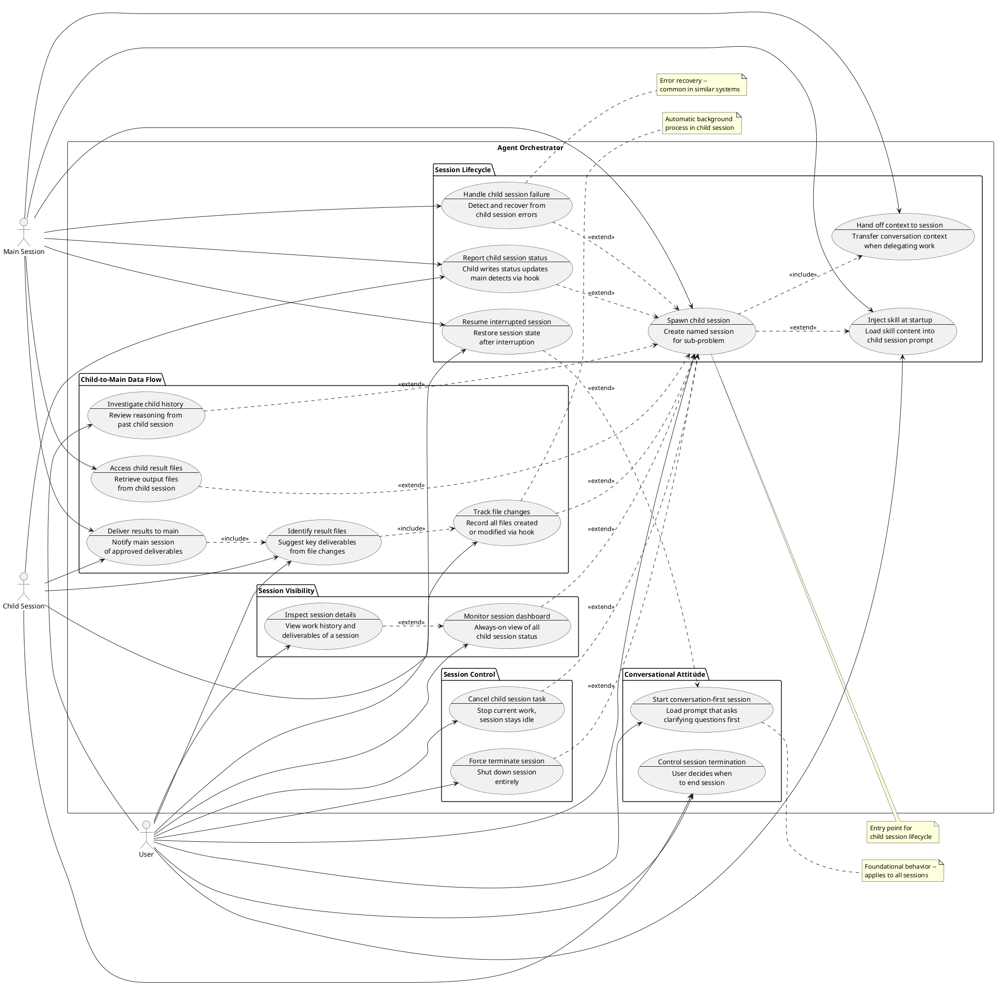

# Use Cases: Agent Orchestrator
> Source: [agent-orchestrator.story.md](./agent-orchestrator.story.md)

## Original Idea
When should the interactive agent and prompt be used? Discover the core value and usage scenarios to refine the file contents.

## Context
LLMs tend to jump to answers before fully understanding what the user actually wants. The agent orchestrator addresses this through two complementary capabilities:

1. **Conversation quality** — establishing a conversation-first attitude where the assistant asks clarifying questions before taking action and the user controls when sessions end (UC-1, UC-6). Conversation-first behavior is optional for child sessions — applied when exploration or discussion is needed, not as a default.
2. **Session orchestration** — providing a multi-session architecture where a main session can spawn named child sessions for sub-problems, automatically exchange information between sessions, and collect results when child sessions complete (UC-2 through UC-12, UC-14 through UC-18)

This is a single-user system. The orchestrator provides three levels of session control: graceful termination with summary (UC-6), immediate task cancellation with session reuse (UC-17), and forced session shutdown (UC-18). An always-on dashboard (UC-15) gives the user visibility into all sessions (active, completed, terminated) with on-demand detail inspection (UC-16).

Hook scripts are the primary implementation mechanism: they record session metadata, track file changes, validate preconditions (e.g., skill existence before spawning), and trigger event-driven notifications between sessions. These details are deliberately kept out of use case flows, which describe only observable behavior.

## Similar Systems Research

Research was conducted on multi-agent orchestration systems and AI coding assistants with multi-session capabilities.

**Similar systems examined:**
- Claude Code Agent Teams (Anthropic) — shared task list with dependency tracking, peer-to-peer messaging, file locking, session forking
- GitHub Copilot Coding Agent — async issue-to-PR workflow, third-party agent integration
- Cursor — multi-file context coordination, semantic analysis across repositories
- LangGraph, CrewAI, Google ADK — multi-agent frameworks with state management, A2A protocol, checkpoint/resume primitives
- Microsoft Foundry / Agent Framework — multi-agent orchestration with governance dashboards, workflow checkpointing
- OpenAI Agents SDK — handoffs primitive for agent-to-agent transfer, guardrails, tracing

**High-value patterns (common across 3+ systems):**
- Session state persistence and resume — agents retain context across interruptions
- Task decomposition with dependency tracking — complex tasks broken into subtasks with explicit dependencies
- Shared memory/context synchronization — agents share and synchronize state in real-time
- Error recovery and retry mechanisms — handling failures gracefully with exponential backoff and circuit breakers
- Session monitoring/telemetry — visualizing status and progress of all active sessions
- Session forking — create parallel explorations from a checkpoint to test alternative approaches
- Context handoff — explicit transfer of conversation context when delegating work to another session/agent
- Human-in-the-loop checkpoints — pause workflow to wait for human approval before proceeding

**Niche patterns (1-2 systems):**
- File locking for conflict prevention (Claude Agent Teams)
- Circuit breaker patterns for cascading failure prevention
- Peer-to-peer messaging between sibling agents (Claude Agent Teams)

**User-requested features (from forums/reviews):**
- Ability to resume interrupted sessions without losing context
- Better visibility into what child agents are doing
- Graceful handling when child sessions crash or become unresponsive
- Ability to fork a session to explore "what if" scenarios without losing the original
- Clear handoff of context when switching between sessions

**Source field legend:**
- `input` — derived from the original idea or brainstorm
- `research` — discovered from similar systems research (includes which systems)

## Actors

| Actor         | Type   | Role | Description                                                                                      |
| ------------- | ------ | ---- | ------------------------------------------------------------------------------------------------ |
| User          | person | owner | The single user who starts sessions, guides conversations, and decides when sessions end         |
| Main Session  | system | —    | The orchestrating session that spawns child sessions, monitors their status, and collects results |
| Child Session | system | —    | A dedicated named session spawned for a specific sub-problem or conversation topic               |

## Use Case Diagram

## Use Cases

### [UC-1]. Start conversation-first session
- **Actor:** User
- **Goal:** Begin a session where the assistant asks clarifying questions before taking action
- **Situation:** The user wants to explore an idea or discuss a topic and loads the conversation-first prompt
- **Flow:**
  1. User starts a session with the conversation-first prompt loaded
  2. User presents an initial idea or request
  3. The session asks clarifying questions about the request (e.g., "What problem are you trying to solve?", "Who is the intended audience?")
  4. User answers the questions
  5. The session confirms understanding before proceeding (e.g., "So you want X for Y — is that right?")
- **Expected Outcome:** The user receives results that match their actual intent rather than the assistant's assumptions; the first substantive action happens only after explicit confirmation
- **Source:** input

### [UC-2]. Spawn child session
- **Actor:** User, Main Session
- **Goal:** Create a dedicated named session for a sub-problem without cluttering the main conversation
- **Situation:** The main session encounters a sub-problem (design question, ambiguous requirement) that warrants a focused conversation, or the user explicitly requests a child session for a specific topic
- **Flow:**
  1. Main session identifies a sub-problem suitable for dedicated exploration, or user requests a child session
  2. User specifies a session name (e.g., "auth-refactor"), or main session generates one from the sub-problem context
  3. The system checks that the session name is not already in use; if a collision is found, the user is prompted to choose a different name or reuse the existing session
  4. If a skill is specified, the system verifies the skill exists before proceeding; if not found, the spawn is cancelled with a notification
  5. Main session prepares the context to hand off to the child session (UC-14)
  6. Main session creates a new named child session in a separate workspace
  7. The session name and identity are saved so the main session can find it later
  8. The child session starts with the handed-off context loaded and optionally with a conversation-first prompt (if specified by user or deemed necessary by the main session)
  9. User is notified that a new session is available (e.g., terminal notification or status message)
- **Expected Outcome:** A dedicated named child session is running with relevant context and ready for focused conversation on the sub-problem; the main session can locate and communicate with the child session by name
- **Source:** input

### [UC-3]. Report child session status
- **Actor:** Main Session, Child Session
- **Goal:** Keep the main session aware of child session progress automatically
- **Situation:** A child session is running alongside the main session and has produced new status or file updates
- **Flow:**
  1. Child session publishes a status update with current progress and file paths
  2. Main session receives the status update notification
  3. Main session retrieves the updates (status changes, new file paths) identified by child session name
  4. Main session records the updated information
  5. Main session displays the current child session status to the user
- **Expected Outcome:** The main session has current visibility into child session progress; user can see child status at a glance
- **Source:** input

### [UC-4]. Access child result files
- **Actor:** Main Session
- **Goal:** Reference output files from a child session directly
- **Situation:** A child session has finished and produced result files that the main session needs
- **Flow:**
  1. Main session detects that a child session has completed (via completion notification)
  2. Main session looks up the result file paths by child session name
  3. Main session retrieves the file paths
  4. Main session reads or processes the result files
- **Expected Outcome:** The main session can access child session output files without searching for them; files are immediately available for reference or further processing
- **Source:** input

### [UC-5]. Investigate child session history
- **Actor:** User
- **Goal:** Understand the reasoning behind a child session's output
- **Situation:** The user wants to review what happened in a past child session without re-reading the full transcript
- **Flow:**
  1. User requests investigation of a specific child session from the main session (e.g., "summarize what happened in the design session")
  2. Main session looks up the child session's conversation history by name
  3. Main session reads and analyzes the transcript, extracting key reasoning (decisions made, alternatives considered, rationale)
  4. Summary of reasoning is presented to the user
- **Expected Outcome:** The user understands why the child session produced its output without reading the entire conversation; key decisions and rationale are highlighted
- **Source:** input
- **Risk:** High — requires conversation history to be persisted and accessible. Session metadata (including transcript location) must be recorded at session creation to enable this access.

### [UC-6]. Control session termination
- **Actor:** User, Child Session
- **Goal:** Decide when a session (main or child) ends while receiving appropriate prompts
- **Situation:** The user is in a session conversation and signals they want to wrap up (e.g., says "I think we're done" or "let's finish")
- **Flow:**
  1. User indicates they are finished with the conversation
  2. The session (main or child) summarizes what was accomplished and asks for confirmation
  3. User reviews the summary
  4. User confirms session termination or chooses to continue
  5. If terminating a child session, the child session triggers result delivery (UC-10) before closing
- **Expected Outcome:** The session ends only when the user explicitly decides, with a clear summary of what was accomplished; child sessions deliver their results before termination
- **Source:** input

### [UC-7]. Inject skill at session startup
- **Actor:** User, Main Session
- **Goal:** Start a child session already configured for a specific structured dialogue mode
- **Situation:** A child session is being created and the user has specified a skill to use, or the main session selects one based on the sub-problem context
- **Flow:**
  1. User specifies a skill for the child session (e.g., "spawn a requirements session"), or main session selects one based on context
  2. The system verifies the specified skill exists; if not found, the spawn is cancelled with a notification to the user
  3. Main session prepares the skill for the child session
  4. The child session is set up with the skill active
  5. Child session starts with the skill already active
- **Expected Outcome:** The child session begins in the correct structured dialogue mode without additional setup; the skill's interview flow or analysis framework is immediately available
- **Source:** input

### [UC-8]. Track file changes
- **Actor:** Child Session
- **Goal:** Maintain a complete record of all files produced during a session
- **Situation:** Files are being created or modified within the main session's working directory during a child session's work (automatic background process with no user trigger)
- **Flow:**
  1. A file is created or modified within the working directory
  2. The child session detects the change automatically
  3. The change is recorded with enough detail to identify the file and what happened
  4. The change is added to the session's running list of file activity
- **Expected Outcome:** A complete list of all file changes is available for later review or processing; no file change is missed
- **Source:** input
- **Note:** File change tracking is an automatic background process bound to the child session, with no user trigger.

### [UC-9]. Identify result files
- **Actor:** User, Child Session
- **Goal:** Mark key deliverables from all the files changed during the session
- **Situation:** A child session has been working and producing multiple files, and the user wants to identify which are important outputs
- **Flow:**
  1. User requests identification of result files (e.g., "what did we produce?")
  2. Child session reviews which files were created or changed during the session and evaluates which are key deliverables
  3. Child session presents suggested result files to the user with brief descriptions
  4. User reviews and approves or adjusts the suggestions
  5. Approved files are marked as deliverables
- **Expected Outcome:** Important output files are identified and marked as deliverables without the user manually tracking every change; the approval explicitly triggers UC-10
- **Source:** input

### [UC-10]. Deliver results to main session
- **Actor:** Child Session, Main Session
- **Goal:** Notify the main session of approved deliverables automatically
- **Situation:** A file has been approved as a key deliverable in UC-9, or the user is terminating a child session in UC-6
- **Flow:**
  1. Child session publishes a deliverable notification
  2. Main session receives the deliverable notification
  3. Main session retrieves the deliverable file and its description, identified by child session name
  4. Main session makes the file accessible for use in the main conversation
- **Expected Outcome:** The main session can access child session results immediately after approval without searching; results flow automatically from child to main
- **Source:** input

### [UC-11]. Resume interrupted session
- **Actor:** User, Main Session
- **Goal:** Continue a session after an interruption without losing progress
- **Situation:** A session (main or child) was interrupted (network drop, terminal closed, system restart) and the user wants to continue where they left off
- **Flow:**
  1. User starts a new session and requests to resume (e.g., "resume last session" or references a session name)
  2. Main session retrieves the saved session information (what was discussed, what files were produced, which child sessions existed)
  3. Main session rebuilds the session so it matches where the user left off
  4. Main session presents a summary of where the session left off
  5. User confirms and continues the conversation
- **Expected Outcome:** The user can continue their work without re-explaining context or losing prior progress; session state is fully restored
- **Source:** research — common in LangGraph, CrewAI, Microsoft Foundry; highly requested by users

### [UC-12]. Handle child session failure
- **Actor:** Main Session
- **Goal:** Detect and recover gracefully when a child session fails or becomes unresponsive
- **Situation:** A child session crashes, times out, or becomes unresponsive during its work (including failures in background processes such as file tracking)
- **Flow:**
  1. Main session detects that a child session has not responded for an unusually long time
  2. Main session retrieves any partial results or file changes from the child session by name
  3. Main session notifies the user of the failure with available context (last known status, partial files)
  4. Main session offers recovery options (restart the child session, continue without it, or investigate)
  5. User selects a recovery action
- **Expected Outcome:** Child session failures do not block the main session; partial work is preserved; user has clear options to proceed
- **Source:** research — common in multi-agent frameworks (CrewAI, Google ADK); addresses user-requested feature for better error handling

### ~~[UC-13]. Fork session for exploration~~ *(moved to Excluded Ideas)*

### [UC-14]. Hand off context to session
- **Actor:** Main Session
- **Goal:** Transfer relevant conversation context when delegating work to a child session
- **Situation:** A child session is being spawned (UC-2) and needs to understand the context that led to its creation
- **Flow:**
  1. Main session identifies the relevant context for the child session (problem statement, constraints, prior decisions) — either automatically summarized or as specified by the user
  2. Main session compiles a context summary (not the full transcript, but key information)
  3. Main session passes the context summary to the child session so it's available from the start
  4. Child session starts with awareness of why it was created and what it should focus on
- **Expected Outcome:** The child session begins with sufficient context to work effectively without asking the user to re-explain the background; context flows seamlessly from main to child
- **Source:** research — common in OpenAI Agents SDK (handoffs), agentic design patterns; addresses user request for seamless context transfer

### [UC-15]. Monitor child session dashboard
- **Actor:** User
- **Goal:** See the overall status of all child sessions at a glance without making a request
- **Situation:** Multiple child sessions are running and the user needs to know which sessions are available and what each one is for, before deciding where to assign the next task
- **Flow:**
  1. User opens or views the session dashboard (always accessible, no request to main session needed)
  2. Dashboard displays all child sessions (active, completed, and terminated) with: session name, purpose (skill/prompt loaded at creation), and current status (busy/idle/completed/terminated)
  3. Status updates in near real-time as child sessions change state
  4. User scans the dashboard and identifies a suitable session for the next task
- **Expected Outcome:** The user always has visibility into which child sessions exist, what they do, and whether they're available — without interrupting the main session conversation
- **Source:** input — addresses reviewer completeness gap (no UC for listing all sessions)

### [UC-16]. Inspect child session details
- **Actor:** User
- **Goal:** Understand what a specific child session has done and what it has produced before assigning new work
- **Situation:** The user sees a child session on the dashboard but needs to know its work history and deliverables to decide whether it is the right session for the next task
- **Flow:**
  1. User selects a specific child session from the dashboard
  2. Detail view shows: work history (tasks processed), deliverables produced (file list with descriptions), and current status
  3. User reviews the details
  4. User decides whether to assign new work to this session or choose a different one
- **Expected Outcome:** The user understands a specific child session's track record and outputs, enabling an informed decision about whether to reuse it for the next task
- **Source:** input — addresses reviewer completeness gap (no UC for session detail inspection)

### [UC-17]. Cancel child session task
- **Actor:** User
- **Goal:** Immediately stop a child session's current work without waiting for a graceful wrap-up
- **Situation:** A child session is running a long operation and the user wants to abort it right away — the work is no longer needed or heading in the wrong direction
- **Flow:**
  1. User issues a cancel command for a specific child session (e.g., from the dashboard or via the main session)
  2. The child session's current operation is terminated immediately
  3. Any partial output (incomplete files, intermediate results) is left in place
  4. The child session returns to idle state, ready to accept new work
  5. Main session notifies the user that the task was cancelled, with a note about any partial files produced
- **Expected Outcome:** The long-running operation stops immediately; partial output is preserved for the user to review or discard; the child session remains available for reuse
- **Source:** input — addresses reviewer completeness gap (no immediate abort path)

### [UC-18]. Force terminate child session
- **Actor:** User
- **Goal:** Shut down a child session entirely when it is no longer needed or has become unrecoverable
- **Situation:** A child session is in an abnormal state (unresponsive, stuck after cancel) or the user simply no longer needs it and wants to free up resources
- **Flow:**
  1. User issues a force terminate command for a specific child session (e.g., from the dashboard or via the main session)
  2. The child session is shut down immediately, regardless of its current state
  3. Any partial output is left in place
  4. The session is marked as terminated so the dashboard and main session reflect the change
  5. Main session notifies the user that the session has been terminated
- **Expected Outcome:** The child session is completely removed from active sessions; partial output is preserved for review; the dashboard no longer shows it as available
- **Source:** input — addresses need for forced shutdown of abnormal or unneeded sessions

## Use Case Relationships

### Dependencies
- **[UC-2] -> [UC-3]**: Spawning a child session must exist before status reporting is meaningful
- **[UC-2] -> [UC-4]**: Spawning a child session is a prerequisite for result file access
- **[UC-2] -> [UC-5]**: Spawning a child session is a prerequisite for history investigation
- **[UC-2] -> [UC-6]**: Spawning a child session is a prerequisite for child session termination (partial dependency — UC-6 also applies to the main session independently, so no diagram arrow)
- **[UC-2] -> [UC-7]**: Spawning a child session can optionally include skill injection
- **[UC-2] -> [UC-8]**: Spawning a child session creates a context in which file changes are tracked
- **[UC-2] -> [UC-14]**: Spawning a child session includes context handoff
- **[UC-8] -> [UC-9]**: File change tracking must exist before the session can evaluate modified files
- **[UC-9] -> [UC-10]**: Result file identification and approval triggers result delivery
- **[UC-2] -> [UC-12]**: Child session failure handling requires a child session to exist
- **[UC-1] -> [UC-11]**: Session resume requires a prior session to have existed (extends UC-1 as alternate start)
- **[UC-2] -> [UC-15]**: The dashboard shows child sessions; spawning creates entries
- **[UC-15] -> [UC-16]**: Detail inspection extends the dashboard view
- **[UC-2] -> [UC-17]**: Cancelling a task requires a child session to exist
- **[UC-2] -> [UC-18]**: Force terminating requires a child session to exist

### Reinforcements
- **[UC-1] -> [UC-6]**: Conversation-first attitude and user-controlled termination together ensure the assistant never rushes at start or end
- **[UC-1] -> [UC-2]**: The conversation-first prompt from UC-1 can optionally be loaded in child sessions when exploration or discussion is needed
- **[UC-4] + [UC-5]**: File access and history investigation together give the main session full visibility into child session outputs
- **[UC-3] -> [UC-4]**: Status reporting enables automatic result registration
- **[UC-3] -> [UC-12]**: Status reporting provides the signals needed to detect child session failures
- **[UC-6] -> [UC-10]**: Session termination triggers result delivery, ensuring no results are lost on exit
- **[UC-11] -> [UC-3]**: Session resume benefits from status reporting — resumed sessions can quickly sync on child session state
- **[UC-14] -> [UC-2]**: Context handoff ensures child sessions are effective from the start
- **[UC-3] -> [UC-15]**: Status reporting feeds the dashboard with real-time updates
- **[UC-15] -> [UC-2]**: Dashboard visibility helps the user decide when to spawn new sessions vs reuse existing ones
- **[UC-17] -> [UC-15]**: After cancel, the session's idle status is reflected on the dashboard
- **[UC-12] -> [UC-18]**: Failure recovery may lead to force termination as a last resort

### Use Case Groups
| Group | Use Cases | Description |
|-------|-----------|-------------|
| Conversational Attitude | [UC-1], [UC-6] | Define how the assistant behaves within a session — applies to both main and child sessions |
| Session Lifecycle | [UC-2], [UC-3], [UC-7], [UC-11], [UC-12], [UC-14] | Define how sessions are created, configured, monitored, resumed, and recovered |
| Session Control | [UC-17], [UC-18] | Immediate task cancellation (session stays idle) and forced session termination (session destroyed) |
| Session Visibility | [UC-15], [UC-16] | Provide always-on and on-demand views of child session status, purpose, work history, and deliverables |
| Child-to-Main Data Flow | [UC-4], [UC-5], [UC-8], [UC-9], [UC-10] | Define how outputs (files and reasoning) flow from child sessions back to the main session; UC-8/9/10 handle file delivery pipeline, UC-4/5 handle direct access and investigation |

## Excluded Ideas

| Idea | Source | Reason | Criteria |
|------|--------|--------|----------|
| Peer-to-peer messaging between sibling sessions | research (Claude Agent Teams) | The current architecture is hierarchical (main-child); adding sibling communication increases complexity without clear benefit for the primary use case of focused sub-problem exploration | Usage: rare; Reach: subset; Core goal: tangential |
| File locking to prevent conflicts | research (Claude Agent Teams) | Relevant for concurrent editing scenarios, but current model has child sessions working on separate sub-problems with distinct files; locking adds complexity for edge cases | Usage: rare; Reach: subset; Core goal: tangential |
| Circuit breaker for cascading failures | research (multi-agent frameworks) | More relevant for distributed systems with many agents; UC-12 provides basic failure handling sufficient for 1-to-N main-child topology | Usage: rare; Reach: subset; Core goal: tangential |
| Task decomposition with dependency tracking | research (LangGraph, CrewAI) | This is more of an implementation pattern than a user-visible use case; the user's interaction with task decomposition happens through UC-2 (spawn child session) and UC-7 (inject skill) | Not a user-level use case |
| Session monitoring dashboard | research (Microsoft Foundry, Google ADK) | Superseded by UC-15 (Monitor child session dashboard) which provides always-on session visibility | Covered by UC-15 |
| Human-in-the-loop approval checkpoints | research (checkpoint patterns) | While valuable, this pattern is subsumed by UC-6 (control session termination) where the user explicitly decides when to proceed; adding formal approval gates adds process overhead for a conversational tool | Overlaps with UC-6; adds formality that contradicts conversation-first attitude |
| Fork session for exploration (UC-13) | research (Agent Factory, Google ADK, LangGraph) | Deferred — user has not yet actively used Claude Code's fork feature; child sessions with main session fork create ambiguous ownership of existing child sessions | Usage: not yet adopted; Complexity: high for main+child scenarios |
| Discover available skills | exploration-7 | Main session already shows available skills; user explicitly specifies skill in UC-7 — auto-suggestion adds unnecessary complexity | Covered by existing flow |
| Review past session landscape | exploration-7 | UC-15 dashboard includes completed and terminated sessions, providing the birds-eye view | Covered by UC-15 |
| Recover from hook failure | exploration-7 | Implementation-level concern, not a user-level use case; user-visible symptoms (missing status, missing files) are covered by UC-12 | Not a user-level use case |
| Handle session name collision | exploration-7 | Absorbed into UC-2 flow as a validation step (step 3) | Absorbed into UC-2 |
| Reuse session configuration | exploration-7 | Low priority; regular users can reuse idle child sessions (visible on UC-15 dashboard) rather than needing saved configuration templates | Usage: low; Covered partially by session reuse |
| Get guided session suggestions | exploration-7 | Low priority; adds complexity for first-time users who can learn by exploring skills in the main session | Usage: low; Reach: first-time only |
| Retract delivered results | exploration-7 | Low priority; the user can manage delivered files directly — removing them from the main session's resources is a file management action, not a distinct use case | Usage: rare; Workaround exists |
| Clean up session history | exploration-7 | Low priority; session records are lightweight and can be managed outside the orchestrator via standard file operations | Usage: rare; Workaround exists |

## Open Questions
- *(All previously open questions were resolved in revision 7. See Change Log below.)*

## Change Log

| Revision | Date | Section | Change | Reason |
|----------|------|---------|--------|--------|
| 1 | 2026-03-31 | Use Case Diagram | Changed `<<include>>` to `<<extend>>` for UC-3, UC-4, UC-5 dependencies on UC-2 | These UCs depend on UC-2 but don't include it; `<<extend>>` better represents optional extension |
| 1 | 2026-03-31 | Use Case Diagram | Added `UC1 ..> UC6 : <<extend>>` relationship | UC-1 and UC-6 together form the conversational attitude |
| 1 | 2026-03-31 | UC-2 | Added "User" as co-actor; updated situation to include user-initiated spawning | Diagram showed both User and Main Session connected to UC-2 |
| 1 | 2026-03-31 | UC-6 | Rewrote flow step 1 to be user-initiated | Original step was system-initiated in a user-driven UC |
| 1 | 2026-03-31 | UC-8 | Changed "working area" to "project directory" | Clarified undefined term |
| 1 | 2026-03-31 | UC-9 | Added "Child Session" as co-actor | Flow describes Child Session evaluating files |
| 1 | 2026-03-31 | All UCs | Added Source field | Required field was missing |
| 1 | 2026-03-31 | Relationships | Added [UC-1] -> [UC-2] reinforcement | Clarified how UC-1 relates to the orchestrator |
| 1 | 2026-03-31 | Open Questions | Updated UC-1 assumption to clarification | Resolved the standalone question |
| 2 | 2026-03-31 | UC-3 | Added "Child Session" as co-actor; updated flow to show child writes and main reads | Diagram showed both actors connected; flow now reflects information flow |
| 2 | 2026-03-31 | UC-6 | Removed ambiguous "pause" trigger; made purely user-initiated | "Pause" could be interpreted as system-detected inactivity |
| 2 | 2026-03-31 | UC-7 | Added "User" as co-actor; updated situation and flow | User can specify which skill to inject |
| 2 | 2026-03-31 | Use Case Diagram | Added user --> UC7 connection | User participates in skill selection |
| 2 | 2026-03-31 | Use Case Diagram | Added UC6 ..> UC2 : <<extend>> | Child session termination depends on child session existing |
| 2 | 2026-03-31 | Dependencies | Added [UC-2] -> [UC-6] | Child session termination requires child session to exist |
| 2 | 2026-03-31 | Open Questions | Added concurrent child sessions question | Reviewer flagged that multiple child sessions need to be handled |
| 3 | 2026-03-31 | UC-3 | Renamed from "Exchange session information" to "Report child session status" | Flow is one-directional (child to main), not bidirectional exchange |
| 3 | 2026-03-31 | UC-6 | Updated goal to clarify it applies to both main and child sessions | Reviewer noted diagram showed only user connection |
| 3 | 2026-03-31 | UC-7 | Changed `<<include>>` to `<<extend>>` for UC-2 -> UC-7 | Skill injection is optional, not always included |
| 3 | 2026-03-31 | UC-8 | Added note that it's a background process with no user trigger | Clarified system-initiated nature |
| 3 | 2026-03-31 | UC-10 | Added "Child Session" as co-actor; updated flow to show child initiates | Child's approval triggers the notification |
| 3 | 2026-03-31 | Use Case Diagram | Added child --> UC6 and child --> UC10 connections | UC-6 applies to child sessions; UC-10 is triggered by child |
| 3 | 2026-03-31 | Use Case Diagram | Added note for UC-8 about background process | Clarified system-initiated nature in diagram |
| 3 | 2026-03-31 | Dependencies | Added [UC-2] -> [UC-8] | File tracking occurs within child session context |
| 3 | 2026-03-31 | Open Questions | Added assumption about UC-8 being a background process | Documented the modeling decision |
| 4 | 2026-03-31 | UC-6 | Added "Child Session" as co-actor | Reviewer noted diagram showed child --> UC6 but actor line only said User |
| 4 | 2026-03-31 | UC-6 | Added flow step 5 to trigger UC-10 on child termination | Clarified handoff between termination and result delivery |
| 4 | 2026-03-31 | UC-9 | Added flow step 5 to mark approved files in registry | Clarified explicit trigger for UC-10 |
| 4 | 2026-03-31 | UC-10 | Updated situation to reference both UC-9 and UC-6 as triggers | Clarified the UC-9 to UC-10 handoff gap |
| 4 | 2026-03-31 | UC-5 | Added Note field about feasibility | Documented assumption about transcript accessibility |
| 4 | 2026-03-31 | UC-1, UC-2, UC-3 | Strengthened flow steps with concrete examples | Reviewer noted some flows lacked specificity |
| 4 | 2026-03-31 | Use Case Diagram | Updated note on UC-2 to say "child session lifecycle" | Clarified that UC-1 is the overall entry point, UC-2 is for child lifecycle |
| 4 | 2026-03-31 | New UCs | Added UC-11 (Resume interrupted session) | Research finding: common in similar systems, highly requested by users |
| 4 | 2026-03-31 | New UCs | Added UC-12 (Handle child session failure) | Research finding: common in multi-agent frameworks, addresses open question about error scenarios |
| 4 | 2026-03-31 | New Section | Added Similar Systems Research | Documents research findings per auto-usecase process |
| 4 | 2026-03-31 | New Section | Added Excluded Ideas | Documents research-derived UCs that were considered but excluded |
| 4 | 2026-03-31 | Dependencies | Added [UC-2] -> [UC-12] and [UC-1] -> [UC-11] | New UCs require relationship documentation |
| 4 | 2026-03-31 | Reinforcements | Added [UC-3] -> [UC-12], [UC-6] -> [UC-10], [UC-11] -> [UC-3] | New UCs create new reinforcement patterns |
| 4 | 2026-03-31 | Groups | Updated Session Lifecycle group to include UC-11 and UC-12 | New UCs belong to session lifecycle |
| 4 | 2026-03-31 | Open Questions | Added feasibility note for UC-5 and UC-11 | Documented transcript persistence assumption |
| 5 | 2026-03-31 | New UCs | Added UC-13 (Fork session for exploration) | Research finding: common in Agent Factory, Google ADK, LangGraph; addresses user request for parallel exploration |
| 5 | 2026-03-31 | New UCs | Added UC-14 (Hand off context to session) | Research finding: common in OpenAI Agents SDK; implicit in UC-2 but made explicit for clarity |
| 5 | 2026-03-31 | UC-2 | Updated flow to reference UC-14 for context handoff | Made context handoff explicit in spawn flow |
| 5 | 2026-03-31 | Use Case Diagram | Added UC-13 and UC-14 with actor connections | New UCs need diagram representation |
| 5 | 2026-03-31 | Use Case Diagram | Added UC2 ..> UC14 : <<include>> and UC13 ..> UC11 : <<include>> | New dependency relationships |
| 5 | 2026-03-31 | Dependencies | Added [UC-2] -> [UC-14] and [UC-11] -> [UC-13] | New UCs create new dependencies |
| 5 | 2026-03-31 | Reinforcements | Added [UC-14] -> [UC-2] and [UC-13] -> [UC-11] | New UCs create new reinforcement patterns |
| 5 | 2026-03-31 | Groups | Updated Session Lifecycle group to include UC-13 and UC-14 | New UCs belong to session lifecycle |
| 5 | 2026-03-31 | Similar Systems Research | Updated with additional systems (OpenAI Agents SDK) and patterns (forking, handoff) | New research findings |
| 5 | 2026-03-31 | Excluded Ideas | Added human-in-the-loop approval checkpoints | Considered but subsumed by UC-6 |
| 5 | 2026-03-31 | Open Questions | Added assumptions for UC-13 and UC-14 | Document new UC assumptions |
| 6 | 2026-03-31 | Context | Restructured to distinguish two value propositions (conversation quality vs session orchestration) | Reviewer noted scope overlap between UC-1/6 and remaining UCs |
| 6 | 2026-03-31 | Similar Systems Research | Added Source field legend | Reviewer requested definition of `input` and `research` labels |
| 6 | 2026-03-31 | Use Case Diagram | Removed `UC6 ..> UC2 : <<extend>>` relationship | UC-6 applies to both main and child sessions; extending UC-2 incorrectly implies it only applies to child sessions |
| 6 | 2026-03-31 | UC-5 | Changed Note to Risk field with "High" severity | Reviewer noted feasibility concern was underplayed |
| 6 | 2026-03-31 | UC-8 | Added Note clarifying File Tracker is sole actor | Reviewer noted diagram mismatch |
| 6 | 2026-03-31 | UC-13 | Clarified original session behavior (not "paused" but available for interaction) | Reviewer noted Claude Code cannot truly pause sessions |
| 6 | 2026-03-31 | Use Case Groups | Merged "Session Results" and "Result File Delivery" into "Child-to-Main Data Flow" | Reviewer noted unclear distinction between groups |
| 6 | 2026-03-31 | Open Questions | Added polling vs push architecture question for UC-3/UC-10 | Reviewer noted architectural choice buried in flow |
| 6 | 2026-03-31 | Open Questions | Added note about CLI flag examples being illustrative | Reviewer noted speculative details |
| 7 | 2026-04-02 | Actors | User role changed from `editor` to `—` | Single-user system; privilege levels are unnecessary |
| 7 | 2026-04-02 | Actors | Removed File Tracker actor; absorbed into Child Session | File tracking is a hook script bound to child session, not an independent process |
| 7 | 2026-04-02 | UC-8 | Actor changed from File Tracker to Child Session; flow updated to hook-based detection | File tracking implemented as child session hook script |
| 7 | 2026-04-02 | UC-2 | Added session naming (user-specified or auto-generated) and hook-based metadata recording to flow | Child sessions identified by name; session info recorded by hooks |
| 7 | 2026-04-02 | UC-2 | Added hook-based skill validation as precondition | Skill existence checked before spawn; prevents failed child sessions |
| 7 | 2026-04-02 | UC-3, UC-10 | Changed polling model to event-driven via FileChanged hook | Claude Code's FileChanged hook enables push-based notification |
| 7 | 2026-04-02 | UC-4, UC-5, UC-12 | Updated to reference child sessions by name | Consistent with session naming scheme |
| 7 | 2026-04-02 | UC-5 | Updated Risk note to reference hook-recorded transcript paths | Feasibility addressed by hook-based session metadata |
| 7 | 2026-04-02 | UC-7 | Added hook-based skill validation step | Consistent with UC-2 precondition |
| 7 | 2026-04-02 | UC-11 | Updated to reference hook-persisted session files | Session state restored from hook-recorded data |
| 7 | 2026-04-02 | UC-1 | Generalized situation — removed specific CLI flag examples | CLI flags were illustrative; actual invocation depends on implementation |
| 7 | 2026-04-02 | UC-14 | Updated flow to reflect dual context source (auto-summary + user-specified) | Context can be automatically summarized or explicitly specified by user |
| 7 | 2026-04-02 | UC-13 | Moved to Excluded Ideas | User has not yet adopted fork feature; main+child fork creates ambiguous child ownership |
| 7 | 2026-04-02 | Use Case Diagram | Removed File Tracker actor and UC-13; updated UC-8 note | Reflects actor consolidation and UC-13 exclusion |
| 7 | 2026-04-02 | Relationships | Removed UC-13 references from dependencies, reinforcements, and groups | UC-13 excluded from scope |
| 7 | 2026-04-02 | Context | Updated to reflect hook-centric architecture and single-user system | Resolved open questions inform the system description |
| 7 | 2026-04-02 | Open Questions | All 12 open questions resolved | See individual change entries above |

## Revision History

### Revision 9 — 2026-04-04

#### Last Completed
- Addressed all 14 open items from revision 8
- Resolved systemic implementation leak across 10 UCs (revision 8 review-7 findings)
- Resolved actor, diagram, and completeness gaps (revision 8 review-7 and exploration-7 findings)
- Added 4 new UCs (UC-15, UC-16, UC-17, UC-18)
- Ran reviewer (review-9): 7/17 passed, completeness SUFFICIENT
- Applied review-9 findings: 10 UC implementation leaks (finer-grained) + 2 diagram fixes

#### Decisions Made
- User actor role: `owner` (person actors need a role even in single-user systems)
- Child session dashboard (UC-15) is always-on, includes completed/terminated sessions — covers "review past session landscape" gap
- Child session detail inspection (UC-16) shows work history + deliverables — distinct from UC-5 (reasoning investigation)
- Cancel task (UC-17) stops current work, session stays idle for reuse
- Force terminate (UC-18) destroys session entirely — last resort for abnormal state
- Session name collision handled as validation step in UC-2 (step 3), not separate UC
- Conversation-first prompt is optional for child sessions — user-specified or main session judgment
- Explorer candidates triaged: discover skills (excluded — main session shows skills), hook failure recovery (excluded — implementation level), reuse config / guided suggestions / retract results / cleanup (excluded — low priority, workarounds exist)

#### Change Log

| Section | Change | Reason | Source |
|---------|--------|--------|--------|
| Actors | User role `—` → `owner` | Person actors need a role | review-7 |
| UC-2, UC-3, UC-4, UC-5, UC-7, UC-8, UC-9, UC-10, UC-11, UC-12 | Rewrote flow steps to actor-level descriptions (round 1) | Systemic implementation leak — hook, FileChanged, registry, status file references | review-7 #3 |
| UC-5 | Risk note generalized | Removed hook-specific language | review-7 #3 |
| UC-8 | Situation, Note generalized | "hook-based" → "automatic" | review-7 #3 |
| Diagram | Added `UC8 ..> UC2 : <<extend>>` | Dependency documented but missing from diagram | review-7 #1 |
| Diagram | Clarified UC-2 → UC-6 dependency text | Partial dependency — UC-6 applies to both main and child | review-7 #2 |
| New UCs | UC-15 (Monitor child session dashboard) | Completeness gap: no UC for listing all sessions | review-7 completeness |
| New UCs | UC-16 (Inspect child session details) | User needs work history + deliverables before assigning work | input |
| New UCs | UC-17 (Cancel child session task) | Completeness gap: no immediate abort path | review-7 completeness |
| New UCs | UC-18 (Force terminate child session) | Need forced shutdown for abnormal/unneeded sessions | input |
| UC-2 | Added name collision check (step 3) | Sessions identified by name; collisions could corrupt data | exploration-7 |
| UC-2 | Conversation-first prompt now optional (step 8) | Child sessions don't always need conversation-first behavior | input |
| UC-15 | Status includes completed/terminated sessions | Covers "review past session landscape" gap | exploration-7 |
| Reinforcements | UC-1 → UC-2 changed to optional | Conversation-first not always loaded in child sessions | input |
| Diagram, Dependencies, Reinforcements, Groups | Added UC-15, UC-16, UC-17, UC-18 with all relationships | New UCs require full relationship documentation | — |
| Excluded Ideas | Added 8 entries from exploration-7 triage | Explorer candidates evaluated and excluded with rationale | exploration-7 |
| Excluded Ideas | Updated Session monitoring dashboard entry | Superseded by UC-15 | review-7 completeness |
| UC-2, UC-7, UC-8, UC-9, UC-10, UC-11, UC-12, UC-14, UC-17, UC-18 | Rewrote flow steps to actor-level descriptions (round 2) | Finer-grained implementation leaks: metadata, configuration, change record, etc. | review-9 #3 |
| Diagram | Removed `UC1 ..> UC6 : <<extend>>` | Misused relationship — these are independent reinforcing behaviors | review-9 #1 |
| Diagram | Added `UC15 ..> UC2 : <<extend>>` | Missing dependency arrow | review-9 #2 |
| Diagram | UC-8 note "Hook-based" → "Automatic" | Consistent with abstraction cleanup | review-9 #3 |

#### Open Items

| Section | Item | What's Missing | Priority |
|---------|------|---------------|----------|
| (none) | — | — | — |

#### Next Steps
- Consider finalization if no further UCs or refinements are needed
- Re-review to verify all 17 UCs pass after round 2 implementation leak fixes

#### Interview Transcript

Q&A

**Q:** List all sessions — UC-3이 개별 push인데, 전체 현황 pull이 없음. 얼마나 자주 필요?
**A:** 동시에 띄워놓고 작업하는 시나리오를 생각중. reviewer와 reviser session을 띄워두었지만, 어떤 session이 사용가능한지 모르면 지정할 수가 없기 때문에. 또 child session을 계속 띄워두면, 다음 업무 요청시 내용을 알고 있어서 편함.

**Q:** 요청 없이 상태를 볼 수 있는 UI?
**A:** 사용자가 main session에 요청을 하지 않아도 상태를 볼 수 있는 UI가 있으면 좋겠어.

**Q:** 상시 표시만으로 충분? 아니면 상세 조회도 필요?
**A:** 둘다 필요해. 상세 조회인 경우는 어떤 일을 처리했는지, 만들어낸 산출물이 무엇인지 알 수 있으면 좋겠어서.

**Q:** Session status — 어떤 상태 구분이 필요?
**A:** 상태는 다른 일을 처리하고 있어서 지금 일을 받을 수 없다, 받을 수 있다 정도. 어떤 용도로 child session을 만들었는지 확인할 수 있어야 해. skill이나 system-prompt에 따라 성격이 결정될 걸로.

**Q:** Cancel child session — bash script 실행중일 때?
**A:** child session에서 bash script를 돌리고 있는 경우에는 바로 끝낼 수 있어야 해.

**Q:** Cancel 후 partial output 처리? 세션 상태?
**A:** 불완전한 파일은 정리하고 사용자가 판단하면 될 거 같아. 세션이 이상하지 않으면 그냥 살려두는 게 좋은 것 같아.

**Q:** 강제 종료 별도 UC 필요?
**A:** 대신 강제 종료하는 경우는 필요해. → 분리하는 게 좋아 보여.

**Q:** Discover available skills — 별도 UC 필요?
**A:** main session에서 사용가능한 스킬을 대부분 볼 수 있어서, 지금은 사용자가 명시적으로 지정하는 걸. 아니면 너무 복잡해질 거 같아.

**Q:** Review past session landscape — UC-15 대시보드로 충분?
**A:** 별도 UC가 필요해 보이진 않아. dashboard를 보면 다 알 수 있기 때문에.

**Q:** Hook failure recovery — UC에서 다뤄야?
**A:** UC에서 다루는 게 맞는지. 아닌 것 같아 보여서.

**Q:** Session name collision — UC-2 flow에 흡수?
**A:** 동의.

**Q:** Conversation-first가 child session 기본값?
**A:** child session 생성시 꼭 conversation-first일 필요는 없어. 사용자가 직접 지정하거나, LLM이 필요하다고 판단된 경우에 conversation-first로 띄우면 될 거 같아.

### Revision 8 — 2026-04-02 10:30

#### Last Completed
- Resolved all 12 open questions from revision 6
- Applied changes to file (revision 7)
- Ran reviewer and explorer analysis

#### Decisions Made
- User role: `—` (single-user system, no privilege levels)
- File Tracker absorbed into Child Session (hook-based)
- Project directory = main session's working directory (Claude Code convention)
- No additional error UCs needed (hook pre-validation + UC-12 covers failures)
- Child sessions identified by name (user-specified or auto-generated)
- All session metadata recorded by hook scripts (transcript paths, session info)
- Event-driven communication via FileChanged hook (not polling)
- Context handoff: auto-summary + user-specified
- UC-13 (fork) deferred to Excluded Ideas

#### Change Log

| Section | Change | Reason | Source |
|---------|--------|--------|--------|
| (no file changes in revision 8 — all changes applied in revision 7) | — | — | — |

#### Open Items

| Section | Item | What's Missing | Priority |
|---------|------|---------------|----------|
| Actors | User Role `—` → `owner` | Person actors need a role even in single-user systems | Medium |
| Cross-UC | Systemic implementation leak (10 UCs) | Flow steps reference hooks, status files, FileChanged, registry — should use actor-level descriptions | High |
| Diagram | Missing UC-2 → UC-8 arrow | Dependency is documented but not in diagram | Low |
| Diagram | UC-2 → UC-6 dependency/diagram mismatch | Dependency in text but intentionally removed from diagram — needs reconciliation | Low |
| Completeness | No UC for listing all sessions | User can't ask "show me all my sessions" | Medium |
| Completeness | No UC for cancelling child session mid-work | No immediate abort path (UC-6 is graceful, UC-12 is failure) | Medium |
| Explorer | Discover available skills | First-time users can't learn what skills exist before UC-7 | Medium |
| Explorer | Review past session landscape | No birds-eye view of all past sessions | Medium |
| Explorer | Recover from hook failure | Hooks are load-bearing but silent failures not addressed | Medium |
| Explorer | Handle session name collision | Sessions identified by name but no collision handling | Medium |
| Explorer | Reuse session configuration | Regular users have no shortcut for repeated patterns | Low |
| Explorer | Get guided session suggestions | No guidance for beginners on when to use child sessions | Low |
| Explorer | Retract delivered results | No flow to reject/remove incorrect child results | Low |
| Explorer | Clean up session history | No session record cleanup/archival UC | Low |

#### Next Steps
- Address systemic implementation leak: rewrite 10 UC flows to actor-level descriptions (highest impact single change)
- Resolve User actor role (`owner`)
- Evaluate completeness gap UC candidates (list sessions, cancel session)
- Triage explorer UC candidates (prioritize: discover skills, hook failure recovery, session name collision)

#### Interview Transcript

Q&A

**Q:** User actor `editor` role — may need privilege levels?
**A:** 항상 한명이 쓸 시스템이야. → Role 구분 불필요, `—`로 변경

**Q:** File Tracker를 별도 actor로 유지할지, Child Session에 합칠지?
**A:** Claude hook 발생시 동작하는 script. 특정 세션에서만 처리하는 hook이라. → Child Session에 흡수

**Q:** "Project directory" 범위?
**A:** Main session의 project directory. Claude의 project directory 개념을 따라가는 게 자연스럽더라고.

**Q:** UC-12 외 추가 에러 플로우 필요?
**A:** Hook으로 skill 존재유무를 확인후, 없으면 child 세션을 열지 않는 방법으로. → 별도 에러 UC 불필요

**Q:** 동시 실행 child session 식별 방법?
**A:** 세션에 이름을 붙이고 싶어. 사용자 지정 or 자동 생성 둘 다 가능 (C).

**Q:** UC-8 백그라운드 프로세스 확인?
**A:** 응. → Hook 기반 확인

**Q:** Transcript 접근 방법?
**A:** Child session 생성시 세션관련 정보를 기록하여, main session이 해당 정보를 참조하면 transcript 파일 위치를 알수 있어서. Child session 세션정보도 hook으로 기록.

**Q:** 세션 상태 저장 메커니즘?
**A:** 맞어. → Hook 기반 파일 저장/복원

**Q:** UC-13 fork 시 checkpoint 내용?
**A:** Fork는 현재 고려하지 않는 걸로. 아직 fork 기능을 많이 쓰지 않고 있어. Child session이 있는 main session fork 시 문제도 있음.

**Q:** UC-14 컨텍스트 식별 메커니즘?
**A:** 둘다. (자동 요약 + 사용자 지정)

**Q:** UC-3, UC-10 polling vs event-driven?
**A:** Claude의 FileChangedHook을 이용하면 될꺼 같아. → Event-driven

**Q:** UC-1 CLI flag 예시 일반화?
**A:** 어. → 일반화

