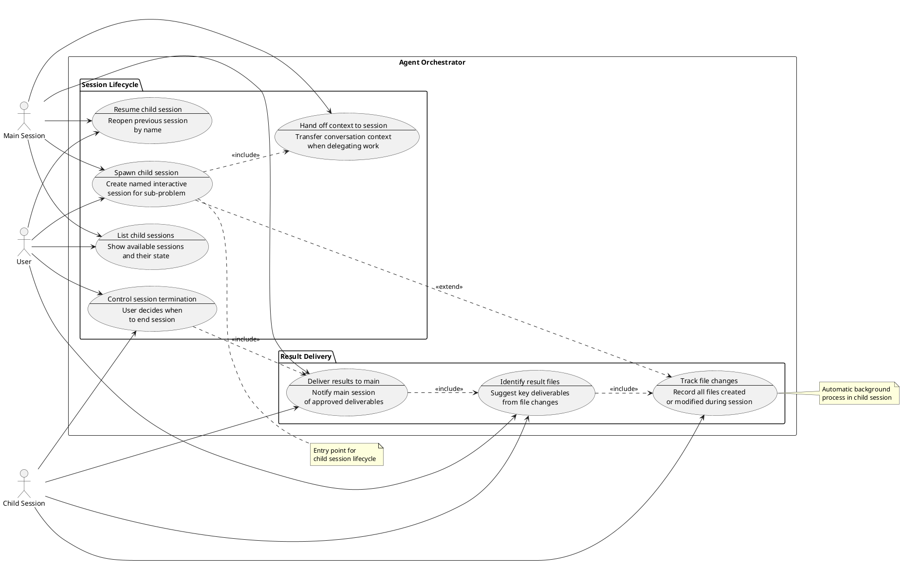

# Use Cases: Agent Orchestrator
> Source: [agent-orchestrator.story.md](./agent-orchestrator.story.md)

## Original Idea
When should the interactive agent and prompt be used? Discover the core value and usage scenarios to refine the file contents.

## Context
A user working in session A produces an artifact (e.g., a design document, a spec draft). They want to open a separate interactive session B to discuss that artifact — get feedback, explore alternatives, refine the approach — and then have the discussion results flow back to session A automatically, without the user manually copying or re-explaining anything.

Claude Code's Agent tool only supports autonomous delegation: the parent sends a task and receives a result. It does not support spawning an interactive session where the user can have a back-and-forth conversation. To enable this, the orchestrator creates a new terminal pane (via tmux or similar) running a separate Claude session with pre-loaded context. When session B's discussion concludes, the results are automatically delivered to session A through file conventions and hook-based notifications.

This is a single-user system. The orchestrator manages: session creation with context handoff (UC-2, UC-14), session listing and resumption by name (UC-19, UC-11), file change tracking during child sessions (UC-8), result identification and delivery back to the parent session (UC-9, UC-10), and user-controlled session termination that triggers result delivery (UC-6).

Hook scripts are the primary implementation mechanism: they record session metadata, track file changes, and trigger event-driven notifications between sessions. These details are deliberately kept out of use case flows, which describe only observable behavior.

## Similar Systems Research

Research was conducted on multi-agent orchestration systems and AI coding assistants with multi-session capabilities.

**Similar systems examined:**
- Claude Code Agent Teams (Anthropic) — shared task list with dependency tracking, peer-to-peer messaging, file locking, session forking
- GitHub Copilot Coding Agent — async issue-to-PR workflow, third-party agent integration
- Cursor — multi-file context coordination, semantic analysis across repositories
- LangGraph, CrewAI, Google ADK — multi-agent frameworks with state management, A2A protocol, checkpoint/resume primitives
- Microsoft Foundry / Agent Framework — multi-agent orchestration with governance dashboards, workflow checkpointing
- OpenAI Agents SDK — handoffs primitive for agent-to-agent transfer, guardrails, tracing

**High-value patterns (common across 3+ systems):**
- Session state persistence and resume — agents retain context across interruptions
- Task decomposition with dependency tracking — complex tasks broken into subtasks with explicit dependencies
- Shared memory/context synchronization — agents share and synchronize state in real-time
- Error recovery and retry mechanisms — handling failures gracefully with exponential backoff and circuit breakers
- Session monitoring/telemetry — visualizing status and progress of all active sessions
- Session forking — create parallel explorations from a checkpoint to test alternative approaches
- Context handoff — explicit transfer of conversation context when delegating work to another session/agent
- Human-in-the-loop checkpoints — pause workflow to wait for human approval before proceeding

**Niche patterns (1-2 systems):**
- File locking for conflict prevention (Claude Agent Teams)
- Circuit breaker patterns for cascading failure prevention
- Peer-to-peer messaging between sibling agents (Claude Agent Teams)

**User-requested features (from forums/reviews):**
- Ability to resume interrupted sessions without losing context
- Better visibility into what child agents are doing
- Graceful handling when child sessions crash or become unresponsive
- Ability to fork a session to explore "what if" scenarios without losing the original
- Clear handoff of context when switching between sessions

**Source field legend:**
- `input` — derived from the original idea or brainstorm
- `research` — discovered from similar systems research (includes which systems)

## Actors

| Actor         | Type   | Role | Description                                                                                      |
| ------------- | ------ | ---- | ------------------------------------------------------------------------------------------------ |
| User          | person | owner | The single user who starts sessions, guides conversations, and decides when sessions end         |
| Main Session  | system | —    | The orchestrating session that spawns child sessions, monitors their status, and collects results |
| Child Session | system | —    | A dedicated named session spawned for a specific sub-problem or conversation topic               |

## Use Case Diagram

## Use Cases

### [UC-2]. Spawn child session
- **Actor:** User, Main Session
- **Goal:** Create a dedicated named interactive session for a sub-problem without cluttering the main conversation
- **Situation:** The main session has produced an artifact (e.g., a design document) and the user wants to discuss or review it in a focused conversation, or the user explicitly requests a child session for a specific topic
- **Flow:**
  1. User requests a child session (e.g., "open a session to discuss this design") or the main session suggests one
  2. User specifies a session name (e.g., "design-review"), or main session generates one from context
  3. The system checks that the session name is not already in use; if a collision is found, the user is prompted to choose a different name or reuse the existing session
  4. Main session prepares the context to hand off to the child session (UC-14)
  5. A new terminal pane opens with a separate Claude session, pre-loaded with the handed-off context
  6. The main session confirms the child session is reachable by name
  7. User is notified that the new session is ready for conversation
- **Expected Outcome:** A dedicated named interactive session is running in a separate terminal pane with relevant context pre-loaded; the user can switch to it and begin a conversation immediately
- **Source:** input

### [UC-6]. Control session termination
- **Actor:** User, Child Session
- **Goal:** Decide when a child session ends while ensuring results are delivered
- **Situation:** The user is in a child session conversation and signals they want to wrap up (e.g., says "I think we're done" or "let's finish")
- **Flow:**
  1. User indicates they are finished with the conversation
  2. The child session summarizes what was accomplished and asks for confirmation
  3. User reviews the summary
  4. User confirms session termination or chooses to continue
  5. The child session triggers result delivery (UC-10) before closing
- **Expected Outcome:** The session ends only when the user explicitly decides, with a clear summary of what was accomplished; results are delivered to the main session before termination
- **Source:** input

### [UC-8]. Track file changes
- **Actor:** Child Session
- **Goal:** Maintain a complete record of all files produced during a session
- **Situation:** Files are being created or modified within the main session's working directory during a child session's work (automatic background process with no user trigger)
- **Flow:**
  1. A file is created or modified within the working directory
  2. The child session detects the change automatically
  3. The file path, change type (created/modified/deleted), and timestamp are recorded
  4. The change is added to the session's running list of file activity
- **Expected Outcome:** A complete list of all file changes is available for later review or processing; no file change is missed
- **Source:** input
- **Note:** File change tracking is an automatic background process bound to the child session, with no user trigger.

### [UC-9]. Identify result files
- **Actor:** User, Child Session
- **Goal:** Mark key deliverables from all the files changed during the session
- **Situation:** A child session has been working and producing multiple files, and the user wants to identify which are important outputs
- **Flow:**
  1. User requests identification of result files (e.g., "what did we produce?")
  2. Child session reviews which files were created or changed during the session and evaluates which are key deliverables
  3. Child session presents suggested result files to the user with brief descriptions
  4. User reviews and approves or adjusts the suggestions
  5. Approved files are marked as deliverables
- **Expected Outcome:** Important output files are identified and marked as deliverables without the user manually tracking every change; approved files are queued for automatic delivery to the main session
- **Source:** input

### [UC-10]. Deliver results to main session
- **Actor:** Child Session, Main Session
- **Goal:** Notify the main session of approved deliverables automatically
- **Situation:** A file has been approved as a key deliverable in UC-9, or the user is terminating a child session in UC-6
- **Flow:**
  1. Child session writes the deliverable description to an agreed location
  2. Main session detects the new deliverable
  3. Main session reads the deliverable file and its description
  4. Main session presents the delivered result to the user (e.g., announces the file and its summary)
- **Expected Outcome:** The user in the main session is informed of new deliverables from the child session, with file paths and brief descriptions, without having to ask
- **Source:** input

### [UC-11]. Resume child session
- **Actor:** User, Main Session
- **Goal:** Continue a previous child session's conversation by name
- **Situation:** A child session was terminated (either gracefully after delivering results, or unexpectedly due to a crash or closed terminal) and the user wants to continue the conversation — for additional discussion or to pick up where it was interrupted
- **Flow:**
  1. User requests resumption by child session name (e.g., "reopen design-review")
  2. Main session locates the session by name
  3. If the session name is not found, the user is notified and asked to choose from available sessions
  4. A new terminal pane opens, resuming the previous conversation with its full history intact
  5. User is notified that the session is ready
- **Expected Outcome:** The user continues the previous conversation without re-explaining context; the child session retains its full conversation history and is immediately available for interaction
- **Source:** input

### [UC-19]. List child sessions
- **Actor:** User, Main Session
- **Goal:** See which child sessions exist and their current state
- **Situation:** The user wants to know which child sessions are available before deciding what to do next (e.g., resume one, check if one is still running, or spawn a new one)
- **Flow:**
  1. User asks for the session list (e.g., "what sessions do I have?")
  2. Main session retrieves all child sessions
  3. Main session presents the list with: session name, current state (active/terminated), and original purpose
  4. User reviews the list
- **Expected Outcome:** The user knows which child sessions exist and their state, enabling an informed decision about which session to resume, inspect, or whether to create a new one
- **Source:** input

### [UC-14]. Hand off context to session
- **Actor:** Main Session
- **Goal:** Transfer relevant conversation context when delegating work to a child session
- **Situation:** A child session is being spawned (UC-2) and needs to understand the context that led to its creation
- **Flow:**
  1. Main session identifies the relevant context for the child session (artifact paths, problem statement, constraints, prior decisions) — either automatically summarized or as specified by the user
  2. Main session compiles a context summary (not the full transcript, but key information including file paths)
  3. Main session passes the context summary to the child session so it's available from the start
  4. Child session starts with awareness of why it was created and what it should focus on
- **Expected Outcome:** The child session begins with sufficient context to work effectively without asking the user to re-explain the background; context flows seamlessly from main to child
- **Source:** research — common in OpenAI Agents SDK (handoffs), agentic design patterns; addresses user request for seamless context transfer

## Use Case Relationships

### Dependencies
- **[UC-2] -> [UC-14]**: Spawning a child session includes context handoff
- **[UC-2] -> [UC-8]**: Spawning a child session creates a context in which file changes are tracked
- **[UC-2] -> [UC-11]**: Resuming a child session requires a prior child session to have existed
- **[UC-2] -> [UC-19]**: Listing child sessions requires at least one child session to have been spawned
- **[UC-8] -> [UC-9]**: File change tracking must exist before the session can evaluate modified files
- **[UC-9] -> [UC-10]**: Result file identification and approval triggers result delivery
- **[UC-6] -> [UC-10]**: Session termination triggers result delivery

### Reinforcements
- **[UC-6] + [UC-9]**: Together they ensure no deliverables are orphaned — UC-6 triggers result delivery at session end even if the user forgot to explicitly identify deliverables during the session
- **[UC-19] -> [UC-11]**: The session list helps the user pick which session to resume by showing names and states

### Use Case Groups
| Group | Use Cases | Description |
|-------|-----------|-------------|
| Session Lifecycle | [UC-2], [UC-6], [UC-11], [UC-14], [UC-19] | How sessions are created, configured with context, listed, resumed, and terminated |
| Result Delivery | [UC-8], [UC-9], [UC-10] | How outputs (files) flow from child sessions back to the main session; UC-8 tracks changes, UC-9 identifies deliverables, UC-10 delivers them |

## Excluded Ideas

| Idea | Source | Reason | Criteria |
|------|--------|--------|----------|
| Conversation-first session (UC-1) | input | A prompt instruction, not an orchestration capability — achievable via CLAUDE.md or system prompt | Not a user-level use case of the orchestrator |
| Report child session status (UC-3) | input | Real-time status monitoring adds complexity; the core problem only requires result delivery at session end | Usage: rare; Core goal: tangential |
| Access child result files (UC-4) | input | Subsumed by UC-10 (deliver results to main); once results are delivered, direct file access is redundant | Covered by UC-10 |
| Investigate child session history (UC-5) | input | Nice-to-have for debugging but not part of the core result-delivery flow; user can read transcripts manually | Usage: rare; Workaround exists |
| Inject skill at session startup (UC-7) | input | Useful extension but not required for the core problem; skill injection can be specified in UC-2's context handoff | Absorbed into UC-14 context |
| Handle child session failure (UC-12) | research (CrewAI, Google ADK) | More relevant for autonomous agents; interactive sessions have the user present to handle issues directly | Usage: rare for interactive sessions |
| Fork session for exploration (UC-13) | research (Agent Factory, Google ADK, LangGraph) | Deferred — user has not yet actively used Claude Code's fork feature; high complexity | Usage: not yet adopted; Complexity: high |
| Monitor child session dashboard (UC-15) | input | Adds complexity; with a small number of interactive sessions, the user can track them via terminal panes directly | Usage: low for interactive sessions; Workaround exists |
| Inspect child session details (UC-16) | input | Depends on UC-15 dashboard; unnecessary when sessions are visible in terminal panes | Depends on excluded UC-15 |
| Cancel child session task (UC-17) | input | Interactive sessions are user-controlled; the user can cancel directly in the terminal | Workaround exists (direct terminal control) |
| Force terminate child session (UC-18) | input | Interactive sessions can be terminated directly by closing the terminal pane | Workaround exists (close terminal pane) |
| Peer-to-peer messaging between sibling sessions | research (Claude Agent Teams) | The current architecture is hierarchical (main-child); adding sibling communication increases complexity without clear benefit | Usage: rare; Reach: subset; Core goal: tangential |
| File locking to prevent conflicts | research (Claude Agent Teams) | Relevant for concurrent editing scenarios, but current model has child sessions working on separate sub-problems with distinct files | Usage: rare; Reach: subset; Core goal: tangential |
| Circuit breaker for cascading failures | research (multi-agent frameworks) | More relevant for distributed systems with many agents | Usage: rare; Reach: subset; Core goal: tangential |
| Task decomposition with dependency tracking | research (LangGraph, CrewAI) | Implementation pattern, not a user-visible use case | Not a user-level use case |
| Human-in-the-loop approval checkpoints | research (checkpoint patterns) | Subsumed by UC-6 where the user explicitly decides when to proceed | Overlaps with UC-6 |
| Discover available skills | exploration-7 | Main session already shows available skills | Covered by existing flow |
| Review past session landscape | exploration-7 | Unnecessary without dashboard (UC-15) | Depends on excluded UC-15 |
| Recover from hook failure | exploration-7 | Implementation-level concern, not a user-level use case | Not a user-level use case |
| Handle session name collision | exploration-7 | Absorbed into UC-2 flow as a validation step (step 3) | Absorbed into UC-2 |
| Reuse session configuration | exploration-7 | Low priority; not part of core result-delivery flow | Usage: low |
| Get guided session suggestions | exploration-7 | Low priority; adds complexity for first-time users | Usage: low; Reach: first-time only |
| Retract delivered results | exploration-7 | User can manage delivered files directly | Usage: rare; Workaround exists |
| Clean up session history | exploration-7 | Session records can be managed via standard file operations | Usage: rare; Workaround exists |

## Open Questions
- *(All previously open questions were resolved in revision 7. See Revision History below.)*

## Revision History

### Revision 1 — 2026-03-31

#### Last Completed
- Initial composition and first review round

#### Change Log

| Section | Change | Reason | Source |
|---------|--------|--------|--------|
| Use Case Diagram | Changed `<<include>>` to `<<extend>>` for UC-3, UC-4, UC-5 dependencies on UC-2 | These UCs depend on UC-2 but don't include it; `<<extend>>` better represents optional extension | review-1 |
| Use Case Diagram | Added `UC1 ..> UC6 : <<extend>>` relationship | UC-1 and UC-6 together form the conversational attitude | review-1 |
| UC-2 | Added "User" as co-actor; updated situation to include user-initiated spawning | Diagram showed both User and Main Session connected to UC-2 | review-1 |
| UC-6 | Rewrote flow step 1 to be user-initiated | Original step was system-initiated in a user-driven UC | review-1 |
| UC-8 | Changed "working area" to "project directory" | Clarified undefined term | review-1 |
| UC-9 | Added "Child Session" as co-actor | Flow describes Child Session evaluating files | review-1 |
| All UCs | Added Source field | Required field was missing | review-1 |
| Relationships | Added [UC-1] -> [UC-2] reinforcement | Clarified how UC-1 relates to the orchestrator | review-1 |
| Open Questions | Updated UC-1 assumption to clarification | Resolved the standalone question | review-1 |

### Revision 2 — 2026-03-31

#### Last Completed
- Second review round

#### Change Log

| Section | Change | Reason | Source |
|---------|--------|--------|--------|
| UC-3 | Added "Child Session" as co-actor; updated flow to show child writes and main reads | Diagram showed both actors connected; flow now reflects information flow | review-2 |
| UC-6 | Removed ambiguous "pause" trigger; made purely user-initiated | "Pause" could be interpreted as system-detected inactivity | review-2 |
| UC-7 | Added "User" as co-actor; updated situation and flow | User can specify which skill to inject | review-2 |
| Use Case Diagram | Added user --> UC7 connection | User participates in skill selection | review-2 |
| Use Case Diagram | Added UC6 ..> UC2 : <<extend>> | Child session termination depends on child session existing | review-2 |
| Dependencies | Added [UC-2] -> [UC-6] | Child session termination requires child session to exist | review-2 |
| Open Questions | Added concurrent child sessions question | Reviewer flagged that multiple child sessions need to be handled | review-2 |

### Revision 3 — 2026-03-31

#### Last Completed
- UC-3 rename, UC-6 scope clarification

#### Change Log

| Section | Change | Reason | Source |
|---------|--------|--------|--------|
| UC-3 | Renamed from "Exchange session information" to "Report child session status" | Flow is one-directional (child to main), not bidirectional exchange | review-3 |

### Revisions 4–9

See git history for detailed change logs of revisions 4 through 9, which added UC-11 through UC-18 via review and exploration rounds.

### Revision 10 — 2026-04-04

#### Last Completed
- Major scope reduction: narrowed from 17 UCs to 6 core UCs based on re-evaluation of the original problem

#### Decisions Made
- Focused the orchestrator on the core problem: spawning interactive child sessions and delivering results back to the parent session automatically
- Removed UC-1 (conversation-first attitude) — a prompt instruction, not an orchestration capability
- Removed UC-3,4,5 (status reporting, file access, history investigation) — not required for the core result-delivery flow
- Removed UC-7 (skill injection) — absorbed into UC-14 context handoff
- Removed UC-11 (session resume) — high complexity, tangential to core problem
- Removed UC-12 (failure handling) — interactive sessions have the user present to handle issues
- Removed UC-15,16 (dashboard, inspection) — unnecessary when sessions are visible in terminal panes
- Removed UC-17,18 (cancel, force terminate) — user can control interactive sessions directly via terminal
- Kept existing UC numbering (UC-2,6,8,9,10,14) for traceability to previous revisions

#### Change Log

| Section | Change | Reason | Source |
|---------|--------|--------|--------|
| Context | Rewrote to focus on core problem: inter-session artifact discussion and automatic result delivery | Original context described two capabilities (conversation quality + session orchestration); narrowed to the actual problem being solved | co-think interview |
| Use Cases | Removed UC-1,3,4,5,7,11,12,15,16,17,18 (11 UCs) | Not required for the core problem of spawning interactive sessions and delivering results | co-think interview |
| UC-2 | Updated situation to emphasize artifact discussion scenario; updated flow to mention terminal pane; updated expected outcome | Aligned with narrower scope | co-think interview |
| UC-6 | Simplified to focus on child session termination only (removed main session scope) | Main session termination is outside orchestrator scope | co-think interview |
| Excluded Ideas | Added 11 removed UCs with exclusion reasons | Preserved traceability | co-think interview |
| Use Case Diagram | Rebuilt with 6 UCs in 2 groups (Session Lifecycle, Result Delivery) | Reflects reduced scope | co-think interview |
| Relationships | Rebuilt for 6 UC scope | Previous relationships referenced removed UCs | co-think interview |

#### Review-Driven Changes (review-10)

| Section | Change | Reason | Source |
|---------|--------|--------|--------|
| UC-2 | Rewrote step 6: "session name and identity are saved" → "main session confirms child session is reachable by name" | Implementation leak — internal bookkeeping not observable by user | agent-orchestrator.usecase.review-10.md |
| UC-8 | Rewrote step 3: "enough detail" → "file path, change type, and timestamp" | Too abstract — vague specification | agent-orchestrator.usecase.review-10.md |
| UC-9 | Rewrote outcome: removed "triggers UC-10" → "approved files are queued for automatic delivery" | Process mechanic, not user-observable outcome | agent-orchestrator.usecase.review-10.md |
| UC-10 | Rewrote flow steps 1-4 to be concrete and user-observable; rewrote outcome to describe what user sees | Abstract flow, implementation language ("publishes"), weak outcome | agent-orchestrator.usecase.review-10.md |
| Diagram | Added UC-2 → UC-8 extend relationship | Missing relationship: dependency existed in text but not in diagram | agent-orchestrator.usecase.review-10.md |
| Reinforcements | Removed redundant UC-14→UC-2 and UC-6→UC-10; added UC-6+UC-9 reinforcement | Redundant entries restated dependencies; replaced with distinct enhancement | agent-orchestrator.usecase.review-10.md |
| Diagram | Changed UC-8 subtitle: "via hook" → "during session" | Implementation leak in diagram | agent-orchestrator.usecase.review-10b.md |

#### Open Items

| Section | Item | What's Missing | Priority |
|---------|------|---------------|----------|
| — | — | No open items | — |

#### Next Steps
- Review the 6 core UCs for completeness and precision
- Validate that the excluded UCs are truly unnecessary for the core problem

#### Interview Transcript

Q&A

**Q:** 이게 정말 필요한 기능인지.
**A:** (Facilitator analyzed the document and challenged whether the orchestrator is needed given Claude Code's native Agent tool, Agent Teams, and existing capabilities. Identified that most of the 18 UCs overlap with native features.)

**Q:** 해결하고 싶었던 문제는?
**A:** 사용자가 두 개의 세션을 생성. 첫번째 세션에서 만든 산출물을 두번째 세션에서 논의하고 싶은 경우. 논의 결과를 첫번째 세션에서 알게 해주고 싶음. 사용자가 prompt로 일일이 지시하지 않아도 되게.

**Q:** 두번째 세션에서 사용자가 interactive하게 대화를 하고난 뒤, 결과를 저장해야 하는 경우인지?
**A:** 맞음.

**Q:** 독립세션을 claude session에서 만들어야 하는 건지?
**A:** 맞음.

**Q:** interactive child session과 대화하려면 터미널 멀티플렉서가 꼭 필요한 건지?
**A:** 꼭 필요한 건 아님 — 하지만 동시에 두 세션이 살아있는 상태를 원함. 사용자가 session-id를 기억하지 않아도 되게.

**Q:** UC-8 (Track file changes)는 빠져도 되는지?
**A:** 유지해야 자동화가 됨.

### Revision 11 — 2026-04-04

#### Last Completed
- Added UC-11 (Resume child session) and UC-19 (List child sessions)
- Review round 10c — all 8 UCs passed

#### Decisions Made
- UC-11 is independent from UC-19 — user can resume by name directly without listing first
- UC-19 reinforces UC-11 but is not required
- UC-19 does not extend UC-2 — the data prerequisite is captured in Dependencies only
- Used UC-19 (new number) instead of reusing UC-15 to avoid confusion with the excluded dashboard UC

#### Change Log

| Section | Change | Reason | Source |
|---------|--------|--------|--------|
| Use Cases | Added UC-11 (Resume child session) | User needs to reopen terminated sessions for additional discussion or after unexpected closure | co-think interview |
| Use Cases | Added UC-19 (List child sessions) | UC-11 requires users to know session names; listing provides discoverability | co-think interview |
| Excluded Ideas | Removed UC-11 entry | UC-11 reinstated with narrower scope (child sessions only, using --resume) | co-think interview |
| UC-11 | "looks up the session ID by name" → "locates the session by name" | Implementation leak — users interact with names, not internal IDs | agent-orchestrator.usecase.review-10c.md |
| UC-19 | "retrieves all registered child sessions" → "retrieves all child sessions" | Implementation leak — "registered" implies internal bookkeeping | agent-orchestrator.usecase.review-10c.md |
| Diagram | Removed UC-19 → UC-2 extend arrow | Incorrect relationship — data prerequisite already in Dependencies | agent-orchestrator.usecase.review-10c.md |
| Diagram | Removed UC-11 → UC-2 extend arrow | UC-11 is independent, not an extension of UC-2 | co-think interview |
| Context | Added session listing and resumption (UC-19, UC-11) | Reflects expanded scope | co-think interview |
| Dependencies | Added UC-2 → UC-11 and UC-2 → UC-19 | Both require prior child sessions to exist | co-think interview |
| Reinforcements | Added UC-19 → UC-11 | Session list helps user pick which session to resume | co-think interview |
| Groups | Added UC-11, UC-19 to Session Lifecycle | Session listing and resumption are part of session lifecycle | co-think interview |

#### Open Items

| Section | Item | What's Missing | Priority |
|---------|------|---------------|----------|
| — | — | No open items | — |

#### Next Steps
- Review the 8 core UCs for completeness
- Consider explorer run for additional perspectives

#### Interview Transcript

Q&A

**Q:** child session 종료 후, main session에서 다시 동일 child session을 재시작하고 싶은 경우가 있는데.
**A:** (Facilitator asked about the scenario — additional discussion after normal termination, or recovery after unexpected closure. User confirmed both.)

**Q:** UC-2에 alternative flow로 넣을지, 별도 UC로 만들지?
**A:** (Facilitator recommended separate UC — different situation, different flow. User agreed.)

**Q:** ��용자가 session-id를 언급하지 않고, 이름으로 지정하면 좋겠어.
**A:** 맞음. "design-review 다시 열어줘"처럼 이름으로 재개.

**Q:** UC-11은 결국 UC-19를 확장한 걸로 보이는데.
**A:** (Facilitator noted UC-11 can be invoked independently by name without listing. Agreed UC-19 reinforces UC-11 but is not required.)

**Q:** session의 이름을 알면 resume을 독자적으로 실행할 수 있잖아.
**A:** 맞음. UC-11은 독립적.

