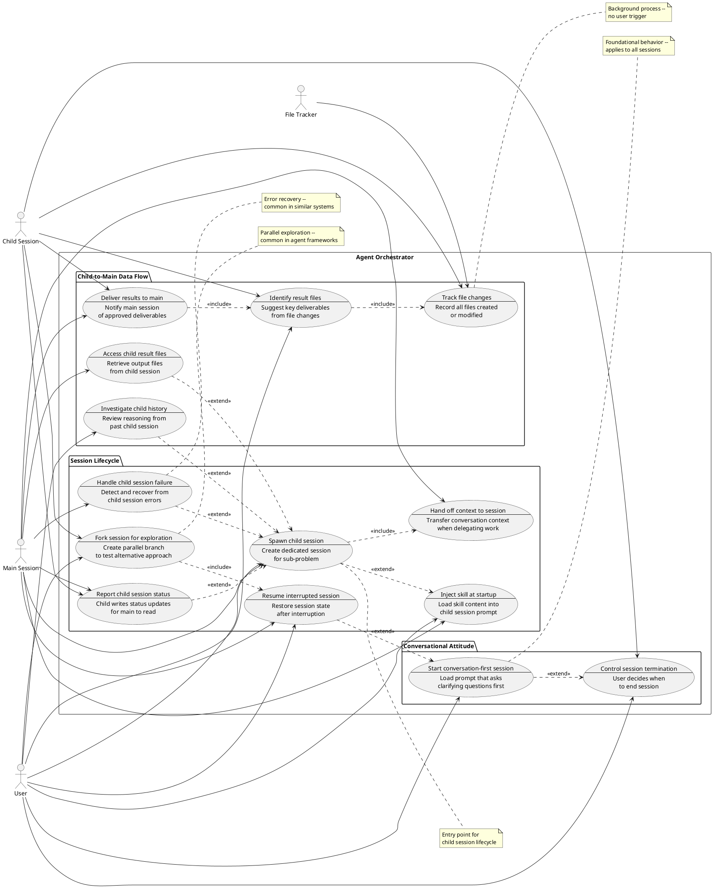

# Use Cases: Agent Orchestrator
> Source: [agent-orchestrator.story.md](./agent-orchestrator.story.md)

## Original Idea
When should the interactive agent and prompt be used? Discover the core value and usage scenarios to refine the file contents.

## Context
LLMs tend to jump to answers before fully understanding what the user actually wants. The agent orchestrator addresses this through two complementary capabilities:

1. **Conversation quality** — establishing a conversation-first attitude where the assistant asks clarifying questions before taking action and the user controls when sessions end (UC-1, UC-6)
2. **Session orchestration** — providing a multi-session architecture where a main session can spawn dedicated child sessions for sub-problems, automatically exchange information between sessions, and collect results when child sessions complete (UC-2 through UC-14)

This enables focused, structured conversations without cluttering the main session, while giving the user full control over session lifecycle and access to all outputs.

## Similar Systems Research

Research was conducted on multi-agent orchestration systems and AI coding assistants with multi-session capabilities.

**Similar systems examined:**
- Claude Code Agent Teams (Anthropic) — shared task list with dependency tracking, peer-to-peer messaging, file locking, session forking
- GitHub Copilot Coding Agent — async issue-to-PR workflow, third-party agent integration
- Cursor — multi-file context coordination, semantic analysis across repositories
- LangGraph, CrewAI, Google ADK — multi-agent frameworks with state management, A2A protocol, checkpoint/resume primitives
- Microsoft Foundry / Agent Framework — multi-agent orchestration with governance dashboards, workflow checkpointing
- OpenAI Agents SDK — handoffs primitive for agent-to-agent transfer, guardrails, tracing

**High-value patterns (common across 3+ systems):**
- Session state persistence and resume — agents retain context across interruptions
- Task decomposition with dependency tracking — complex tasks broken into subtasks with explicit dependencies
- Shared memory/context synchronization — agents share and synchronize state in real-time
- Error recovery and retry mechanisms — handling failures gracefully with exponential backoff and circuit breakers
- Session monitoring/telemetry — visualizing status and progress of all active sessions
- Session forking — create parallel explorations from a checkpoint to test alternative approaches
- Context handoff — explicit transfer of conversation context when delegating work to another session/agent
- Human-in-the-loop checkpoints — pause workflow to wait for human approval before proceeding

**Niche patterns (1-2 systems):**
- File locking for conflict prevention (Claude Agent Teams)
- Circuit breaker patterns for cascading failure prevention
- Peer-to-peer messaging between sibling agents (Claude Agent Teams)

**User-requested features (from forums/reviews):**
- Ability to resume interrupted sessions without losing context
- Better visibility into what child agents are doing
- Graceful handling when child sessions crash or become unresponsive
- Ability to fork a session to explore "what if" scenarios without losing the original
- Clear handoff of context when switching between sessions

**Source field legend:**
- `input` — derived from the original idea or brainstorm
- `research` — discovered from similar systems research (includes which systems)

## Actors

| Actor | Type | Role | Description |
|-------|------|------|-------------|
| User | person | editor | A person who starts sessions, guides conversations, and decides when sessions should end |
| Main Session | system | -- | The orchestrating session that spawns child sessions, monitors their status, and collects their results |
| Child Session | system | -- | A dedicated session spawned for a specific sub-problem or conversation topic |
| File Tracker | system | -- | A component that monitors and records all file changes within the project directory during a session |

## Use Case Diagram

## Use Cases

### [UC-1]. Start conversation-first session
- **Actor:** User
- **Goal:** Begin a session where the assistant asks clarifying questions before taking action
- **Situation:** The user wants to explore an idea or discuss a topic and loads the interactive prompt via command-line flags (e.g., `--prompt conversation-first` or a skill reference)
- **Flow:**
  1. User starts a session with the conversation-first prompt loaded
  2. User presents an initial idea or request
  3. The session asks clarifying questions about the request (e.g., "What problem are you trying to solve?", "Who is the intended audience?")
  4. User answers the questions
  5. The session confirms understanding before proceeding (e.g., "So you want X for Y — is that right?")
- **Expected Outcome:** The user receives results that match their actual intent rather than the assistant's assumptions; the first substantive action happens only after explicit confirmation
- **Source:** input

### [UC-2]. Spawn child session
- **Actor:** User, Main Session
- **Goal:** Create a dedicated session for a sub-problem without cluttering the main conversation
- **Situation:** The main session encounters a sub-problem (design question, ambiguous requirement) that warrants a focused conversation, or the user explicitly requests a child session for a specific topic
- **Flow:**
  1. Main session identifies a sub-problem suitable for dedicated exploration, or user requests a child session
  2. Main session prepares the context to hand off to the child session (UC-14)
  3. Main session creates a new child session in a separate terminal
  4. The child session starts with the conversation-first prompt and handed-off context loaded
  5. User is notified that a new session is available (e.g., terminal notification or status message)
- **Expected Outcome:** A dedicated child session is running with relevant context and ready for focused conversation on the sub-problem
- **Source:** input

### [UC-3]. Report child session status
- **Actor:** Main Session, Child Session
- **Goal:** Keep the main session aware of child session progress automatically
- **Situation:** A child session is running alongside the main session and has produced new status or file updates
- **Flow:**
  1. Child session writes status updates and file paths to a shared location (e.g., a status file in the project directory)
  2. Main session checks for updates from child sessions periodically
  3. Main session retrieves the updates (status changes, new file paths)
  4. Main session records the updated information
  5. Main session displays the current child session status to the user
- **Expected Outcome:** The main session has current visibility into child session progress without manual copy-pasting; user can see child status at a glance
- **Source:** input

### [UC-4]. Access child result files
- **Actor:** Main Session
- **Goal:** Reference output files from a child session directly
- **Situation:** A child session has finished and produced result files that the main session needs
- **Flow:**
  1. Main session detects that a child session has completed (via status update)
  2. Main session looks up the registered result file paths
  3. Main session retrieves the file paths from the registry
  4. Main session reads or processes the result files
- **Expected Outcome:** The main session can access child session output files without searching for them; files are immediately available for reference or further processing
- **Source:** input

### [UC-5]. Investigate child session history
- **Actor:** User
- **Goal:** Understand the reasoning behind a child session's output
- **Situation:** The user wants to review what happened in a past child session without re-reading the full transcript
- **Flow:**
  1. User requests investigation of a specific child session from the main session (e.g., "summarize what happened in the design session")
  2. Main session retrieves the child session's conversation history from the persisted transcript
  3. Main session analyzes the transcript and extracts key reasoning (decisions made, alternatives considered, rationale)
  4. Summary of reasoning is presented to the user
- **Expected Outcome:** The user understands why the child session produced its output without reading the entire conversation; key decisions and rationale are highlighted
- **Source:** input
- **Risk:** High — requires conversation history to be persisted and accessible. Claude Code session transcripts may not be trivially accessible to another session. See Open Questions.

### [UC-6]. Control session termination
- **Actor:** User, Child Session
- **Goal:** Decide when a session (main or child) ends while receiving appropriate prompts
- **Situation:** The user is in a session conversation and signals they want to wrap up (e.g., says "I think we're done" or "let's finish")
- **Flow:**
  1. User indicates they are finished with the conversation
  2. The session (main or child) summarizes what was accomplished and asks for confirmation
  3. User reviews the summary
  4. User confirms session termination or chooses to continue
  5. If terminating a child session, the child session triggers result delivery (UC-10) before closing
- **Expected Outcome:** The session ends only when the user explicitly decides, with a clear summary of what was accomplished; child sessions deliver their results before termination
- **Source:** input

### [UC-7]. Inject skill at session startup
- **Actor:** User, Main Session
- **Goal:** Start a child session already configured for a specific structured dialogue mode
- **Situation:** A child session is being created and the user has specified a skill to use, or the main session selects one based on the sub-problem context
- **Flow:**
  1. User specifies a skill for the child session (e.g., "spawn a requirements session"), or main session selects one based on context
  2. Main session retrieves the skill's content from the skill registry
  3. Skill content is inserted into the child session's system prompt
  4. Child session starts with the skill already active
- **Expected Outcome:** The child session begins in the correct structured dialogue mode without additional setup; the skill's interview flow or analysis framework is immediately available
- **Source:** input

### [UC-8]. Track file changes
- **Actor:** File Tracker
- **Goal:** Maintain a complete record of all files produced during a session
- **Situation:** Files are being created or modified within the project directory during a session's work (background process with no user trigger)
- **Flow:**
  1. A file is created or modified within the project directory
  2. File Tracker detects the change (via filesystem monitoring)
  3. File path, change type (created/modified/deleted), and timestamp are recorded
  4. The record is stored in the session's file change log
- **Expected Outcome:** A complete list of all file changes is available for later review or processing; no file change is missed
- **Source:** input
- **Note:** File Tracker is the sole actor for this UC. While file changes occur "during a session's work," the tracking itself is performed by the File Tracker component, not by the Child Session. The Child Session consumes the file change log in UC-9.

### [UC-9]. Identify result files
- **Actor:** User, Child Session
- **Goal:** Mark key deliverables from all the files changed during the session
- **Situation:** A child session has been working and producing multiple files, and the user wants to identify which are important outputs
- **Flow:**
  1. User requests identification of result files (e.g., "what did we produce?")
  2. Child session reviews the file change log and evaluates which files are key deliverables (based on file type, content, or naming patterns)
  3. Child session presents suggested result files to the user with brief descriptions
  4. User reviews and approves or adjusts the suggestions
  5. Approved files are marked as deliverables in the session registry
- **Expected Outcome:** Important output files are identified and marked as deliverables without the user manually tracking every change; the approval explicitly triggers UC-10
- **Source:** input

### [UC-10]. Deliver results to main session
- **Actor:** Child Session, Main Session
- **Goal:** Notify the main session of approved deliverables automatically
- **Situation:** A file has been approved as a key deliverable in UC-9, or the user is terminating a child session in UC-6
- **Flow:**
  1. Child session writes the deliverable notification to the shared status location
  2. Main session detects the deliverable notification during its periodic check
  3. Main session retrieves the deliverable file path and metadata
  4. Main session adds the file to its available resources
- **Expected Outcome:** The main session can access child session results immediately after approval without searching; results flow automatically from child to main
- **Source:** input

### [UC-11]. Resume interrupted session
- **Actor:** User, Main Session
- **Goal:** Continue a session after an interruption without losing progress
- **Situation:** A session (main or child) was interrupted (network drop, terminal closed, system restart) and the user wants to continue where they left off
- **Flow:**
  1. User starts a new session and requests to resume (e.g., "resume last session" or references a session ID)
  2. Main session retrieves the persisted session state (conversation history, file change log, child session registry)
  3. Main session restores the session context
  4. Main session presents a summary of where the session left off
  5. User confirms and continues the conversation
- **Expected Outcome:** The user can continue their work without re-explaining context or losing prior progress; session state is fully restored
- **Source:** research — common in LangGraph, CrewAI, Microsoft Foundry; highly requested by users

### [UC-12]. Handle child session failure
- **Actor:** Main Session
- **Goal:** Detect and recover gracefully when a child session fails or becomes unresponsive
- **Situation:** A child session crashes, times out, or becomes unresponsive during its work
- **Flow:**
  1. Main session detects that a child session has stopped responding (no status updates for configured timeout period)
  2. Main session retrieves any partial results or file changes from the child session
  3. Main session notifies the user of the failure with available context (last known status, partial files)
  4. Main session offers recovery options (restart the child session, continue without it, or investigate)
  5. User selects a recovery action
- **Expected Outcome:** Child session failures do not block the main session; partial work is preserved; user has clear options to proceed
- **Source:** research — common in multi-agent frameworks (CrewAI, Google ADK); addresses user-requested feature for better error handling

### [UC-13]. Fork session for exploration
- **Actor:** User, Child Session
- **Goal:** Create a parallel branch from the current session to explore an alternative approach without losing the original state
- **Situation:** The user or child session reaches a decision point with multiple viable approaches and wants to test one path without committing to it (e.g., "Should we refactor or rewrite?")
- **Flow:**
  1. User requests a fork from the current session (e.g., "fork this session to try the refactor approach")
  2. The session creates a checkpoint of the current state (conversation history, file changes, context)
  3. A new forked session is created with the checkpoint as its starting point
  4. The original session continues to be available (user can switch back to it at any time)
  5. User is notified that the forked session is available for exploration
- **Expected Outcome:** Two independent sessions exist: the original at the decision point (available for continued interaction), and the fork ready to explore the alternative; either can be continued or discarded
- **Source:** research — common in Agent Factory, Google ADK, LangGraph; addresses user request for "what if" exploration
- **Note:** The original session is not "paused" in a technical sense — the user simply chooses which session to interact with. Both sessions remain independent and can be resumed at any time.

### [UC-14]. Hand off context to session
- **Actor:** Main Session
- **Goal:** Transfer relevant conversation context when delegating work to a child session
- **Situation:** A child session is being spawned (UC-2) and needs to understand the context that led to its creation
- **Flow:**
  1. Main session identifies the relevant context for the child session (problem statement, constraints, prior decisions)
  2. Main session compiles a context summary (not the full transcript, but key information)
  3. Main session includes the context summary in the child session's initial prompt
  4. Child session starts with awareness of why it was created and what it should focus on
- **Expected Outcome:** The child session begins with sufficient context to work effectively without asking the user to re-explain the background; context flows seamlessly from main to child
- **Source:** research — common in OpenAI Agents SDK (handoffs), agentic design patterns; addresses user request for seamless context transfer

## Use Case Relationships

### Dependencies
- **[UC-2] -> [UC-3]**: Spawning a child session must exist before status reporting is meaningful
- **[UC-2] -> [UC-4]**: Spawning a child session is a prerequisite for result file access
- **[UC-2] -> [UC-5]**: Spawning a child session is a prerequisite for history investigation
- **[UC-2] -> [UC-6]**: Spawning a child session is a prerequisite for child session termination (UC-6 applies to both main and child sessions)
- **[UC-2] -> [UC-7]**: Spawning a child session can optionally include skill injection
- **[UC-2] -> [UC-8]**: Spawning a child session creates a context in which file changes are tracked
- **[UC-2] -> [UC-14]**: Spawning a child session includes context handoff
- **[UC-8] -> [UC-9]**: File change tracking must exist before the session can evaluate modified files
- **[UC-9] -> [UC-10]**: Result file identification and approval triggers result delivery
- **[UC-2] -> [UC-12]**: Child session failure handling requires a child session to exist
- **[UC-1] -> [UC-11]**: Session resume requires a prior session to have existed (extends UC-1 as alternate start)
- **[UC-11] -> [UC-13]**: Session forking requires checkpoint capability (uses same state persistence as resume)

### Reinforcements
- **[UC-1] -> [UC-6]**: Conversation-first attitude and user-controlled termination together ensure the assistant never rushes at start or end
- **[UC-1] -> [UC-2]**: The conversation-first prompt loaded in UC-1 is also loaded in child sessions spawned by UC-2
- **[UC-4] + [UC-5]**: File access and history investigation together give the main session full visibility into child session outputs
- **[UC-3] -> [UC-4]**: Status reporting enables automatic result registration
- **[UC-3] -> [UC-12]**: Status reporting provides the signals needed to detect child session failures
- **[UC-6] -> [UC-10]**: Session termination triggers result delivery, ensuring no results are lost on exit
- **[UC-11] -> [UC-3]**: Session resume benefits from status reporting — resumed sessions can quickly sync on child session state
- **[UC-14] -> [UC-2]**: Context handoff ensures child sessions are effective from the start
- **[UC-13] -> [UC-11]**: Session forking reuses the checkpoint/resume infrastructure

### Use Case Groups
| Group | Use Cases | Description |
|-------|-----------|-------------|
| Conversational Attitude | [UC-1], [UC-6] | Define how the assistant behaves within a session — applies to both main and child sessions |
| Session Lifecycle | [UC-2], [UC-3], [UC-7], [UC-11], [UC-12], [UC-13], [UC-14] | Define how sessions are created, configured, monitored, resumed, forked, and recovered |
| Child-to-Main Data Flow | [UC-4], [UC-5], [UC-8], [UC-9], [UC-10] | Define how outputs (files and reasoning) flow from child sessions back to the main session; UC-8/9/10 handle file delivery pipeline, UC-4/5 handle direct access and investigation |

## Excluded Ideas

| Idea | Source | Reason | Criteria |
|------|--------|--------|----------|
| Peer-to-peer messaging between sibling sessions | research (Claude Agent Teams) | The current architecture is hierarchical (main-child); adding sibling communication increases complexity without clear benefit for the primary use case of focused sub-problem exploration | Usage: rare; Reach: subset; Core goal: tangential |
| File locking to prevent conflicts | research (Claude Agent Teams) | Relevant for concurrent editing scenarios, but current model has child sessions working on separate sub-problems with distinct files; locking adds complexity for edge cases | Usage: rare; Reach: subset; Core goal: tangential |
| Circuit breaker for cascading failures | research (multi-agent frameworks) | More relevant for distributed systems with many agents; UC-12 provides basic failure handling sufficient for 1-to-N main-child topology | Usage: rare; Reach: subset; Core goal: tangential |
| Task decomposition with dependency tracking | research (LangGraph, CrewAI) | This is more of an implementation pattern than a user-visible use case; the user's interaction with task decomposition happens through UC-2 (spawn child session) and UC-7 (inject skill) | Not a user-level use case |
| Session monitoring dashboard | research (Microsoft Foundry, Google ADK) | Useful for enterprise scenarios with many concurrent sessions; current model assumes a single user with a handful of sessions where UC-3 provides sufficient visibility | Usage: routine; Reach: subset; Core goal: tangential |
| Human-in-the-loop approval checkpoints | research (checkpoint patterns) | While valuable, this pattern is subsumed by UC-6 (control session termination) where the user explicitly decides when to proceed; adding formal approval gates adds process overhead for a conversational tool | Overlaps with UC-6; adds formality that contradicts conversation-first attitude |

## Open Questions
- [Assumption] The User actor was assigned the `editor` role based on their ability to guide conversations and make decisions; if different privilege levels are needed (e.g., admin for configuration), this should be revisited.
- [Assumption] File Tracker was modeled as a separate system actor; it may alternatively be a component within Child Session depending on implementation architecture. If merged, UC-8's actor changes to Child Session.
- [Clarified] UC-1 (conversation-first attitude) applies to all sessions including child sessions — the prompt loaded in UC-1 is also used when spawning child sessions via UC-2. This is reflected in the reinforcement relationship [UC-1] -> [UC-2].
- [Assumption] The "project directory" in UC-8 refers to the git repository root or the directory from which the session was started; the exact scope depends on implementation.
- [To resolve] Alternative flows for error scenarios beyond UC-12 (skill injection failure, file tracker failure) are not documented — these may be needed for robustness.
- [To resolve] Concurrent child sessions: The current use cases assume a main session can have multiple child sessions running simultaneously. UC-3, UC-4, UC-10, and UC-12 should handle identifying which child session an update or result came from. The exact mechanism (session IDs, naming) is left to implementation.
- [Assumption] UC-8 is a background system process with no user-initiated trigger. It is modeled as a use case because it produces value (the file change log) consumed by UC-9 and UC-10.
- [Feasibility] UC-5 (investigate child history), UC-11 (resume session), and UC-13 (fork session) require conversation history to be persisted and accessible. Claude Code session transcripts may not be trivially accessible to another session. Implementation may require explicit session logging or integration with a transcript storage mechanism.
- [Assumption] UC-11 and UC-13 assume session state is persisted on termination or periodically. The persistence mechanism (file-based, database, etc.) is left to implementation.
- [Assumption] UC-13 (fork session) assumes the checkpoint includes sufficient state to create an independent branch. The exact contents of a checkpoint (conversation history, file state, context) depend on implementation.
- [Assumption] UC-14 (context handoff) assumes the main session can identify and summarize relevant context. The mechanism for determining "relevant context" (heuristics, user guidance, or LLM summarization) is left to implementation.
- [Architecture] UC-3 and UC-10 describe status updates flowing from child to main via a "shared location" that main checks "periodically." This implies a polling model. Alternative: event-driven/push-based notification where the child session actively notifies the main session. Most similar systems use event-driven patterns. The choice impacts latency and resource usage.
- [Architecture] UC-1 situation mentions specific CLI flags (e.g., `--prompt conversation-first`) as illustrative examples. The actual invocation mechanism depends on implementation.

## Change Log

| Revision | Date | Section | Change | Reason |
|----------|------|---------|--------|--------|
| 1 | 2026-03-31 | Use Case Diagram | Changed `<<include>>` to `<<extend>>` for UC-3, UC-4, UC-5 dependencies on UC-2 | These UCs depend on UC-2 but don't include it; `<<extend>>` better represents optional extension |
| 1 | 2026-03-31 | Use Case Diagram | Added `UC1 ..> UC6 : <<extend>>` relationship | UC-1 and UC-6 together form the conversational attitude |
| 1 | 2026-03-31 | UC-2 | Added "User" as co-actor; updated situation to include user-initiated spawning | Diagram showed both User and Main Session connected to UC-2 |
| 1 | 2026-03-31 | UC-6 | Rewrote flow step 1 to be user-initiated | Original step was system-initiated in a user-driven UC |
| 1 | 2026-03-31 | UC-8 | Changed "working area" to "project directory" | Clarified undefined term |
| 1 | 2026-03-31 | UC-9 | Added "Child Session" as co-actor | Flow describes Child Session evaluating files |
| 1 | 2026-03-31 | All UCs | Added Source field | Required field was missing |
| 1 | 2026-03-31 | Relationships | Added [UC-1] -> [UC-2] reinforcement | Clarified how UC-1 relates to the orchestrator |
| 1 | 2026-03-31 | Open Questions | Updated UC-1 assumption to clarification | Resolved the standalone question |
| 2 | 2026-03-31 | UC-3 | Added "Child Session" as co-actor; updated flow to show child writes and main reads | Diagram showed both actors connected; flow now reflects information flow |
| 2 | 2026-03-31 | UC-6 | Removed ambiguous "pause" trigger; made purely user-initiated | "Pause" could be interpreted as system-detected inactivity |
| 2 | 2026-03-31 | UC-7 | Added "User" as co-actor; updated situation and flow | User can specify which skill to inject |
| 2 | 2026-03-31 | Use Case Diagram | Added user --> UC7 connection | User participates in skill selection |
| 2 | 2026-03-31 | Use Case Diagram | Added UC6 ..> UC2 : <<extend>> | Child session termination depends on child session existing |
| 2 | 2026-03-31 | Dependencies | Added [UC-2] -> [UC-6] | Child session termination requires child session to exist |
| 2 | 2026-03-31 | Open Questions | Added concurrent child sessions question | Reviewer flagged that multiple child sessions need to be handled |
| 3 | 2026-03-31 | UC-3 | Renamed from "Exchange session information" to "Report child session status" | Flow is one-directional (child to main), not bidirectional exchange |
| 3 | 2026-03-31 | UC-6 | Updated goal to clarify it applies to both main and child sessions | Reviewer noted diagram showed only user connection |
| 3 | 2026-03-31 | UC-7 | Changed `<<include>>` to `<<extend>>` for UC-2 -> UC-7 | Skill injection is optional, not always included |
| 3 | 2026-03-31 | UC-8 | Added note that it's a background process with no user trigger | Clarified system-initiated nature |
| 3 | 2026-03-31 | UC-10 | Added "Child Session" as co-actor; updated flow to show child initiates | Child's approval triggers the notification |
| 3 | 2026-03-31 | Use Case Diagram | Added child --> UC6 and child --> UC10 connections | UC-6 applies to child sessions; UC-10 is triggered by child |
| 3 | 2026-03-31 | Use Case Diagram | Added note for UC-8 about background process | Clarified system-initiated nature in diagram |
| 3 | 2026-03-31 | Dependencies | Added [UC-2] -> [UC-8] | File tracking occurs within child session context |
| 3 | 2026-03-31 | Open Questions | Added assumption about UC-8 being a background process | Documented the modeling decision |
| 4 | 2026-03-31 | UC-6 | Added "Child Session" as co-actor | Reviewer noted diagram showed child --> UC6 but actor line only said User |
| 4 | 2026-03-31 | UC-6 | Added flow step 5 to trigger UC-10 on child termination | Clarified handoff between termination and result delivery |
| 4 | 2026-03-31 | UC-9 | Added flow step 5 to mark approved files in registry | Clarified explicit trigger for UC-10 |
| 4 | 2026-03-31 | UC-10 | Updated situation to reference both UC-9 and UC-6 as triggers | Clarified the UC-9 to UC-10 handoff gap |
| 4 | 2026-03-31 | UC-5 | Added Note field about feasibility | Documented assumption about transcript accessibility |
| 4 | 2026-03-31 | UC-1, UC-2, UC-3 | Strengthened flow steps with concrete examples | Reviewer noted some flows lacked specificity |
| 4 | 2026-03-31 | Use Case Diagram | Updated note on UC-2 to say "child session lifecycle" | Clarified that UC-1 is the overall entry point, UC-2 is for child lifecycle |
| 4 | 2026-03-31 | New UCs | Added UC-11 (Resume interrupted session) | Research finding: common in similar systems, highly requested by users |
| 4 | 2026-03-31 | New UCs | Added UC-12 (Handle child session failure) | Research finding: common in multi-agent frameworks, addresses open question about error scenarios |
| 4 | 2026-03-31 | New Section | Added Similar Systems Research | Documents research findings per auto-usecase process |
| 4 | 2026-03-31 | New Section | Added Excluded Ideas | Documents research-derived UCs that were considered but excluded |
| 4 | 2026-03-31 | Dependencies | Added [UC-2] -> [UC-12] and [UC-1] -> [UC-11] | New UCs require relationship documentation |
| 4 | 2026-03-31 | Reinforcements | Added [UC-3] -> [UC-12], [UC-6] -> [UC-10], [UC-11] -> [UC-3] | New UCs create new reinforcement patterns |
| 4 | 2026-03-31 | Groups | Updated Session Lifecycle group to include UC-11 and UC-12 | New UCs belong to session lifecycle |
| 4 | 2026-03-31 | Open Questions | Added feasibility note for UC-5 and UC-11 | Documented transcript persistence assumption |
| 5 | 2026-03-31 | New UCs | Added UC-13 (Fork session for exploration) | Research finding: common in Agent Factory, Google ADK, LangGraph; addresses user request for parallel exploration |
| 5 | 2026-03-31 | New UCs | Added UC-14 (Hand off context to session) | Research finding: common in OpenAI Agents SDK; implicit in UC-2 but made explicit for clarity |
| 5 | 2026-03-31 | UC-2 | Updated flow to reference UC-14 for context handoff | Made context handoff explicit in spawn flow |
| 5 | 2026-03-31 | Use Case Diagram | Added UC-13 and UC-14 with actor connections | New UCs need diagram representation |
| 5 | 2026-03-31 | Use Case Diagram | Added UC2 ..> UC14 : <<include>> and UC13 ..> UC11 : <<include>> | New dependency relationships |
| 5 | 2026-03-31 | Dependencies | Added [UC-2] -> [UC-14] and [UC-11] -> [UC-13] | New UCs create new dependencies |
| 5 | 2026-03-31 | Reinforcements | Added [UC-14] -> [UC-2] and [UC-13] -> [UC-11] | New UCs create new reinforcement patterns |
| 5 | 2026-03-31 | Groups | Updated Session Lifecycle group to include UC-13 and UC-14 | New UCs belong to session lifecycle |
| 5 | 2026-03-31 | Similar Systems Research | Updated with additional systems (OpenAI Agents SDK) and patterns (forking, handoff) | New research findings |
| 5 | 2026-03-31 | Excluded Ideas | Added human-in-the-loop approval checkpoints | Considered but subsumed by UC-6 |
| 5 | 2026-03-31 | Open Questions | Added assumptions for UC-13 and UC-14 | Document new UC assumptions |
| 6 | 2026-03-31 | Context | Restructured to distinguish two value propositions (conversation quality vs session orchestration) | Reviewer noted scope overlap between UC-1/6 and remaining UCs |
| 6 | 2026-03-31 | Similar Systems Research | Added Source field legend | Reviewer requested definition of `input` and `research` labels |
| 6 | 2026-03-31 | Use Case Diagram | Removed `UC6 ..> UC2 : <<extend>>` relationship | UC-6 applies to both main and child sessions; extending UC-2 incorrectly implies it only applies to child sessions |
| 6 | 2026-03-31 | UC-5 | Changed Note to Risk field with "High" severity | Reviewer noted feasibility concern was underplayed |
| 6 | 2026-03-31 | UC-8 | Added Note clarifying File Tracker is sole actor | Reviewer noted diagram mismatch |
| 6 | 2026-03-31 | UC-13 | Clarified original session behavior (not "paused" but available for interaction) | Reviewer noted Claude Code cannot truly pause sessions |
| 6 | 2026-03-31 | Use Case Groups | Merged "Session Results" and "Result File Delivery" into "Child-to-Main Data Flow" | Reviewer noted unclear distinction between groups |
| 6 | 2026-03-31 | Open Questions | Added polling vs push architecture question for UC-3/UC-10 | Reviewer noted architectural choice buried in flow |
| 6 | 2026-03-31 | Open Questions | Added note about CLI flag examples being illustrative | Reviewer noted speculative details |
