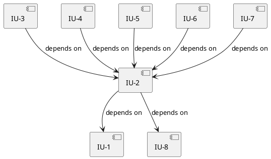

# Implementation Plan: co-think-code

> Source: Design discussion (2026-04-09) — no formal spec; requirements derived from conversation.

## Overview

A new skill `co-think-code` for the `think` plugin that autonomously executes `.impl-plan.md` files. It reads the implementation plan, works through units in dependency order, implements code, runs tests, commits per unit, and records progress + implementation decisions back into the plan file.

This completes the co-think pipeline: **usecase → spec → plan → code**.

## Technology Stack

| Category | Choice |
|----------|--------|
| Format | Markdown (SKILL.md + reference docs) |
| Location | `plugins/think/skills/co-think-code/` |
| Pattern | Same as co-think-plan, co-think-spec |

## Implementation Strategy

- **Approach:** Bottom-up. First extend the plan output format (status/completion note), then build the skill definition, then reference docs.
- **Incremental delivery:** Each IU produces a standalone, reviewable artifact.
- **Key constraint:** The coder skill must be compatible with existing `.impl-plan.md` files produced by co-think-plan.

---

## Implementation Units

### [IU-1]. Extend co-think-plan output template with status tracking

**FRs:** Progress tracking, completion notes
**Components:** co-think-plan output-template.md
**Dependencies:** None

**Description:**
Add three new fields to the IU section format in `co-think-plan/references/output-template.md`:
1. `**Status:**` field with values `TODO | IN_PROGRESS | DONE` (default: `TODO`)
2. `**Completion Note:**` section — a bulleted list recording implementation decisions, deviations from plan, and rationale. Written by orchestrator on success.
3. `**Deviation Note:**` section — written by orchestrator when an agent reports a major deviation (plan assumes something that doesn't hold in the actual codebase). Records: what the plan assumed, what reality is, and the impact. Status is reset to `TODO` (retryable after plan revision). Example:
   ```
   **Deviation Note:**
   - Issue: Plan specifies OAuth2 with Google provider, but existing codebase uses SAML for all auth flows
   - Impact: Cannot proceed without a design decision on auth coexistence
   - Decision: user skipped (2026-04-09) — revisit after plan update
   ```

These fields are optional for plan authors (co-think-plan doesn't set them), but required for the coder (co-think-code reads and writes them).

> **Note:** `BLOCKED` is NOT a plan file status. The orchestrator derives blocked state at runtime from the dependency graph when an IU fails — it is tracked via TaskList within the session, not persisted in the plan file. On session resume, blocked state is re-derived from the dependency graph + current statuses.

**Files:**

| Action | Path | Change |
|--------|------|--------|
| Modify | `plugins/think/skills/co-think-plan/references/output-template.md` | Add Status field and Completion Note section to IU template |

**Test Strategy:**
- **Type:** Manual review
- **Scenarios:**
  - Verify the new fields integrate naturally into the existing IU template
  - Verify existing `.impl-plan.md` files remain valid (fields are optional additions)

**Acceptance Criteria:**
- [ ] IU template includes `**Status:** TODO | IN_PROGRESS | DONE`
- [ ] IU template includes `**Completion Note:**` section with example content
- [ ] IU template includes `**Deviation Note:**` section with example content (issue, impact, user decision)
- [ ] Existing plan files remain backward-compatible (no required changes)

---

### [IU-2]. Create SKILL.md — orchestrator skill definition

**FRs:** Autonomous execution, plan reading, session resume, agent orchestration
**Components:** co-think-code SKILL.md
**Dependencies:** [IU-1], [IU-8]

**Description:**
Create the main skill file at `plugins/think/skills/co-think-code/SKILL.md`. The skill is an **orchestrator** — it reads the plan, manages execution order, and delegates actual implementation to `code-executor` agents. The skill itself does not write application code.

1. **Input resolution** — resolve `.impl-plan.md` file from arguments (same pattern as co-think-plan)
2. **Mode detection** — Fresh Start (all units TODO) vs Resume (some units DONE)
3. **Step 0: Codebase exploration** — understand project structure, conventions, build/test setup. Critically: identify the **test framework, test runner command, and test report format** (e.g., `npm test`, `pytest`, `./gradlew test`). This context is passed to every agent.
4. **Step 1: Plan review** — read the plan, list units and statuses, confirm with user before starting
5. **Orchestration loop** (phase by phase, following the Implementation Order table):
   - **Sequential phase (single unit):**
     - Spawn a **fresh** `Agent(subagent_type: "code-executor")` per IU — no agent reuse across units. Each IU gets a clean context to avoid cross-unit context accumulation. Prior decisions are communicated via completion notes in the prompt, not via agent memory.
     - Agent implements code + tests, runs tests, commits, returns completion note
     - Skill updates plan file: set Status to DONE, write Completion Note
   - **Parallel phase (multiple units):**
     - Spawn one `Agent(subagent_type: "code-executor", isolation: "worktree")` per unit
     - All agents work independently in isolated worktrees
     - After all agents complete: merge worktrees, run full test suite, update plan file
     - See `${CLAUDE_SKILL_DIR}/references/parallel-execution.md` for full procedure
6. **Deviation handling** — when an agent reports a major deviation (plan vs reality mismatch):
   - Present deviation report to user: what the plan assumed, what reality is, and the impact
   - Write `**Deviation Note:**` to the plan file with issue, impact, and user's decision
   - Reset Status to `TODO` (retryable after plan revision)
   - **Propagate block**: mark all downstream IUs as `BLOCKED` in TaskList (runtime only, not in plan file)
   - IUs with no dependency on the deviated unit continue unaffected
   - Note: build errors and unit test failures are the agent's responsibility to resolve — only plan-reality mismatches are reported as deviations
7. **Session management** — user can pause at any phase boundary; progress is preserved in the plan file
8. **Wrapping up** — summary of what was done, what remains, which IUs are blocked (if any)

**Orchestrator → Agent contract:**
- **Input (prompt):** IU section (description, file mappings, test strategy, acceptance criteria), codebase context (project structure, conventions, test framework/runner command), recent completion notes from prior IUs
- **Output (agent result):** structured result with: status (`success` | `deviation`), completion note (bulleted text), commit hash (if success), deviation details (if deviation: what plan assumed, what reality is, impact)

**TaskList for session-scoped work management:**
- Before spawning agents for a phase, create tasks for each IU: `"IU-N: spawn agent"` (in_progress) + `"IU-N: update plan file"` (pending, blocked by spawn task)
- When agent returns, mark spawn task completed, then execute the plan update task (set Status, write Completion Note via Edit tool)
- On deviation: mark spawn task as completed (with deviation metadata), create task `"IU-N: report deviation to user"`, and tasks marking downstream IUs as blocked
- TaskList is session-scoped — cross-session state lives in the plan file's Status fields

Frontmatter: `name: co-think-code`, tools include Read, Write, Edit, Bash, Glob, Grep, Agent, TaskCreate, TaskUpdate, TaskList.

**Files:**

| Action | Path | Change |
|--------|------|--------|
| Create | `plugins/think/skills/co-think-code/SKILL.md` | Orchestrator skill definition |

**Test Strategy:**
- **Type:** Manual review + dry run
- **Scenarios:**
  - Invoke skill with a sample `.impl-plan.md` — verify it reads the plan and spawns agent for first unit
  - Invoke with partially-completed plan — verify it detects DONE units and picks up from the right phase
  - Parallel phase — verify it spawns multiple worktree agents
  - Agent deviation — verify downstream IUs are blocked, independent IUs continue
  - Invoke with no argument — verify it asks for input

**Acceptance Criteria:**
- [ ] Skill frontmatter follows existing pattern (name, description, argument-hint, allowed-tools)
- [ ] Input resolution logic matches co-think-plan's pattern
- [ ] Fresh Start and Resume modes are clearly distinguished
- [ ] Skill delegates implementation to `code-executor` agents — does not write application code itself
- [ ] Sequential phase: one agent per IU
- [ ] Parallel phase: one worktree agent per IU
- [ ] Failure propagation follows dependency graph (block downstream, continue independent)
- [ ] Step 0 captures test framework, runner command, and report format — passed to agents
- [ ] User can pause at any phase boundary
- [ ] References to `${CLAUDE_SKILL_DIR}/references/` for detailed procedures

---

### [IU-3]. Create reference — execution-procedure.md

**FRs:** Implementation guidance per unit
**Components:** co-think-code references
**Dependencies:** [IU-2]

**Description:**
Detailed procedure for implementing a single IU. Content:

1. **Reading the IU** — how to interpret file mappings (Create vs Modify), test strategy, acceptance criteria
2. **Codebase alignment** — check existing conventions before writing new files; follow project patterns for naming, structure, imports
3. **Implementation steps:**
   - Create/modify files per the file mapping table
   - Follow the description for business logic
   - Use acceptance criteria as implementation checkpoints
4. **Handling plan deviations** — when the coder discovers something the plan didn't anticipate:
   - Minor deviation (different import path, slightly different API shape) → proceed, record in completion note
   - Major deviation (missing dependency, architectural conflict) → stop, report to user
5. **Completion note guidelines** — what to record:
   - Deviations from the plan and why
   - Additional dependencies or packages installed
   - Edge cases discovered and handled
   - Decisions made that weren't specified in the plan

**Files:**

| Action | Path | Change |
|--------|------|--------|
| Create | `plugins/think/skills/co-think-code/references/execution-procedure.md` | Full execution procedure |

**Test Strategy:**
- **Type:** Manual review
- **Scenarios:**
  - Verify the procedure is actionable — could a coder follow it step-by-step?
  - Verify deviation handling covers common cases

**Acceptance Criteria:**
- [ ] Covers full lifecycle: read IU → implement → handle deviations → write completion note
- [ ] Clear distinction between minor (proceed) and major (stop) deviations
- [ ] Completion note guidelines with concrete examples

---

### [IU-4]. Create reference — test-and-commit.md

**FRs:** Test validation, commit conventions, progress recording
**Components:** co-think-code references
**Dependencies:** [IU-2]

**Description:**
Procedure for test execution, failure handling, and committing. Content:

1. **Test framework context** — use the test framework, runner command, and report format identified during Step 0 (codebase exploration). This determines how to run tests and how to read results.
2. **IU-level test requirement** — every IU must produce its own unit tests. The coder writes tests as part of implementation, not as a separate step. Test file paths follow the plan's test strategy and project conventions.
3. **Test execution** — run the IU's specific tests using the project's test runner (e.g., `npm test -- --testPathPattern=auth`, `pytest tests/test_auth.py`). Run the full suite only after parallel unit merges or when the IU's test strategy explicitly requires it.
4. **Build and test pass — agent's baseline responsibility:**
   - Build errors and unit test failures are NOT reported to the orchestrator. The agent must resolve them.
   - The agent wrote both the code and the tests — it controls both sides and is expected to make them pass.
   - The only reason to stop and report back is a **major deviation**: the plan assumes something that doesn't hold in the actual codebase (missing dependency, architectural conflict, contradictory requirements).
5. **Commit convention:**
   - Format: `feat(<IU-N>): <short description>` (or `fix`, `refactor` as appropriate)
   - Body: reference the plan file and IU number
   - One commit per IU — atomic, revertable

> **Note:** Plan file status/completion note updates are the orchestrator's responsibility, not the agent's. This reference is for the agent's test and commit behavior only.

**Files:**

| Action | Path | Change |
|--------|------|--------|
| Create | `plugins/think/skills/co-think-code/references/test-and-commit.md` | Full test and commit procedure |

**Test Strategy:**
- **Type:** Manual review
- **Scenarios:**
  - Verify commit message format is consistent and parseable
  - Verify agent responsibility boundary is clear (build/test = agent, deviation = orchestrator)

**Acceptance Criteria:**
- [ ] Test discovery covers common project types (Node, Python, Java/Gradle)
- [ ] Build and test pass defined as agent's baseline responsibility
- [ ] Commit message format includes IU reference
- [ ] Explicitly notes that plan file updates are orchestrator's responsibility

---

### [IU-5]. Create reference — session-resume.md

**FRs:** Cross-session continuity
**Components:** co-think-code references
**Dependencies:** [IU-2]

**Description:**
Procedure for resuming work from a previous session. Content:

1. **Detecting previous progress** — scan IU statuses in the plan file:
   - All `TODO` → Fresh Start mode
   - Mix of `DONE` and `TODO` → Resume mode
   - `IN_PROGRESS` found → previous session was interrupted; treat as incomplete, reset to `TODO`
2. **Context recovery** — before starting the next unit:
   - Read completion notes of the last 2-3 DONE units for context on recent decisions
   - Check git log for recent IU-tagged commits to verify state consistency
   - Run existing tests to confirm previously completed work still passes
3. **State consistency check** — if tests fail for previously DONE units:
   - Report to user — something changed since last session
   - Do not proceed until resolved

**Files:**

| Action | Path | Change |
|--------|------|--------|
| Create | `plugins/think/skills/co-think-code/references/session-resume.md` | Full session resume procedure |

**Test Strategy:**
- **Type:** Manual review
- **Scenarios:**
  - Plan with all TODO → should enter Fresh Start
  - Plan with 3 DONE, 2 TODO → should resume from IU-4
  - Plan with IN_PROGRESS → should reset to TODO and report

**Acceptance Criteria:**
- [ ] Three modes detected correctly (Fresh, Resume, Interrupted)
- [ ] Context recovery reads recent completion notes
- [ ] State consistency check runs tests before proceeding
- [ ] IN_PROGRESS units are reset to TODO with user notification

---

### [IU-6]. Update plugin registration

**FRs:** Plugin discoverability
**Components:** marketplace.json, plugin description
**Dependencies:** [IU-2]

**Description:**
Update the marketplace to reflect the new skill:
1. Bump `think` plugin version in `.claude-plugin/marketplace.json` (0.12.0 → 0.13.0)
2. Update the think plugin description to include "code execution" or "implementation" in the capability list

**Files:**

| Action | Path | Change |
|--------|------|--------|
| Modify | `.claude-plugin/marketplace.json` | Bump think version to 0.13.0, update description |

**Test Strategy:**
- **Type:** Manual review
- **Scenarios:**
  - Verify JSON is valid after edit
  - Verify version bump follows semver (minor bump for new feature)

**Acceptance Criteria:**
- [ ] Version bumped to 0.13.0
- [ ] Description reflects the new code execution capability
- [ ] JSON remains valid

---

### [IU-7]. Create reference — parallel-execution.md

**FRs:** Parallel unit implementation via worktrees
**Components:** co-think-code references
**Dependencies:** [IU-2]

**Description:**
Procedure for implementing multiple units in parallel using git worktrees. Content:

1. **When to parallelize** — check the Implementation Order table; units in the same phase marked "Can Parallelize: Yes" are candidates
2. **Spawning parallel agents** — for each parallelizable unit:
   - Use `Agent(isolation: "worktree")` to spawn an isolated agent
   - Each agent receives: the plan file path, the specific IU to implement, codebase exploration context from Step 0, and the test framework info
   - Agents work independently — no shared state during execution
3. **Merge procedure** — after all parallel agents complete:
   - Merge each worktree branch into the working branch sequentially
   - If merge conflicts occur, resolve them (prefer the later merge's changes for non-overlapping files; manual resolution for true conflicts)
   - After all merges, run the **full test suite** to verify integration
4. **Deviation handling — dependency-aware propagation:**
   - If one agent reports a major deviation, **agents with no dependency on the deviated unit continue**
   - Deviated unit stays `IN_PROGRESS` — handle individually after successful units are merged
   - **Block propagation**: walk the dependency graph from the deviated unit forward; mark all downstream IUs as `BLOCKED` — they cannot be scheduled in future phases until the deviation is resolved
   - Example: IU-3 deviates → IU-6 depends on IU-3 → IU-6 is BLOCKED. IU-4 has no dependency on IU-3 → IU-4 continues.
   - Report deviation to user after all parallel agents complete
   - If integration tests fail after merge, diagnose which unit interaction caused the issue
5. **Plan file updates** — after merge:
   - Collect completion notes from each agent's worktree
   - Update all parallel units' statuses and completion notes in a single edit pass
   - Commit the plan update separately from the code commits

**Files:**

| Action | Path | Change |
|--------|------|--------|
| Create | `plugins/think/skills/co-think-code/references/parallel-execution.md` | Full parallel execution procedure |

**Test Strategy:**
- **Type:** Manual review
- **Scenarios:**
  - Two independent units → should spawn two worktree agents
  - One succeeds, one fails → successful unit merged, failed unit reported
  - Post-merge integration test failure → diagnosis guidance applies

**Acceptance Criteria:**
- [ ] Clear criteria for when to parallelize vs go sequential
- [ ] `Agent(isolation: "worktree")` usage with correct context passing
- [ ] Merge procedure handles conflicts
- [ ] Failed unit blocks downstream dependents only, not independent units
- [ ] Integration test after merge is mandatory

---

### [IU-8]. Create code-executor agent definition

**FRs:** Autonomous IU implementation
**Components:** agents/code-executor.md
**Dependencies:** None

**Description:**
Create the agent definition at `plugins/think/agents/code-executor.md`. This agent receives a single IU and implements it end-to-end. It is spawned by the co-think-code skill (orchestrator).

**Agent receives from orchestrator:**
- The IU section from the plan (description, file mappings, test strategy, acceptance criteria)
- Codebase context from Step 0 (project structure, conventions, test framework/runner)
- Completion notes from recently completed IUs (for context on prior decisions)

**Agent references (via `${CLAUDE_PLUGIN_ROOT}`):**
- `${CLAUDE_PLUGIN_ROOT}/skills/co-think-code/references/execution-procedure.md` — implementation procedure
- `${CLAUDE_PLUGIN_ROOT}/skills/co-think-code/references/test-and-commit.md` — test execution and commit conventions

**Agent responsibilities:**
1. Read the execution procedure and test-and-commit references above
2. Read and understand the IU's file mappings and acceptance criteria
3. Explore relevant existing code (if modifying files)
4. Implement the code changes per the file mapping table
5. Write unit tests per the IU's test strategy
6. Run the IU's tests — **build pass and test pass are the agent's baseline responsibility**. Diagnose and fix until both pass.
7. If a **major deviation** is discovered (plan assumes something that doesn't hold — missing dependency, architectural conflict, contradictory requirements): stop and return a deviation report instead of forcing a broken implementation.
8. On success: commit with IU-tagged message (`feat(IU-N): <description>`)
9. Return a structured result to orchestrator: status (`success` | `deviation`), completion note (if success), deviation details (if deviation: what plan assumed, what reality is, impact), commit hash (if success)
   - **Agent does NOT update the plan file** — plan file management is the orchestrator's sole responsibility

**Agent frontmatter:**
```yaml
name: code-executor
description: >
  Implement a single implementation unit (IU) from an impl-plan: write code,
  write tests, run tests, commit. Returns completion note and status.
model: opus
color: blue
tools: "Read, Write, Edit, Bash, Glob, Grep"
```

**Files:**

| Action | Path | Change |
|--------|------|--------|
| Create | `plugins/think/agents/code-executor.md` | Agent definition with implementation procedure |

**Test Strategy:**
- **Type:** Manual review + dry run
- **Scenarios:**
  - Agent receives a simple IU (create one file + test) → should implement and commit
  - Agent receives an IU with existing file modification → should read existing code first
  - Agent encounters build/test failure → should fix autonomously until pass
  - Agent encounters major deviation → should stop and return deviation report

**Acceptance Criteria:**
- [ ] Agent frontmatter follows existing pattern (name, description, model, color, tools)
- [ ] Agent does not manage plan file status — that's the orchestrator's job
- [ ] Returns structured result (status, completion note or deviation details, commit hash)
- [ ] Build and test pass are agent's baseline — no escalation to orchestrator for these
- [ ] Commit message format: `feat(IU-N): <description>`
- [ ] Agent prompt is self-contained — does not assume conversation context

---

## Dependency Graph



- **Phase 1**: IU-1 (plan template extension) and IU-8 (code-executor agent) are independent foundations — can be built in parallel.
- **Phase 2**: IU-2 (orchestrator skill) depends on both IU-1 and IU-8.
- **Phase 3**: Reference docs (IU-3~5, IU-7) and plugin registration (IU-6) are independent of each other.

### Implementation Order

| Phase | Units | Can Parallelize |
|-------|-------|-----------------|
| 1 | IU-1, IU-8 | Yes |
| 2 | IU-2 | — |
| 3 | IU-3, IU-4, IU-5, IU-6, IU-7 | Yes |

---

## Open Items

(None remaining)

### Resolved Items
- ~~Parallel unit execution~~ → Resolved: use `Agent(isolation: "worktree")` for same-phase units (IU-7)
- ~~Test scope~~ → Resolved: Step 0 identifies test framework/runner; each IU runs its own tests via project runner with path filter
- ~~IU-level testing~~ → Resolved: every IU must produce its own unit tests as part of implementation
- ~~Agent reference access~~ → Resolved: agent uses `${CLAUDE_PLUGIN_ROOT}/skills/co-think-code/references/` (IU-8)
- ~~Plan file update responsibility~~ → Resolved: orchestrator only (A); agent returns completion note as text, does not touch plan file (IU-2, IU-4, IU-8)
- ~~BLOCKED status in plan file~~ → Resolved: BLOCKED is runtime-only, derived from dependency graph; not persisted in plan file (IU-1 note)
- ~~Orchestrator-agent contract~~ → Resolved: input/output contract specified in IU-2
- ~~Sequential agent reuse~~ → Resolved: fresh agent per IU, no reuse; prior context via completion notes in prompt (IU-2)
- ~~IU-4 numbering~~ → Fixed
- ~~Error recovery UX~~ → Resolved: build/test pass is agent's baseline responsibility; only major deviations (plan vs reality mismatch) are reported to user. Deviation Note persisted in plan file. No 3-strike model, no Unaffected/Options sections in report. (IU-1, IU-2, IU-4, IU-7, IU-8)

## Next Steps
- Begin implementation from Phase 1: IU-1 (plan template extension) + IU-8 (code-executor agent) in parallel
