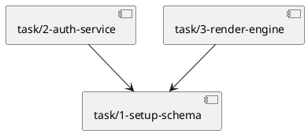

# Implementation Plan Builder & Executor

Takes the architecture in `a4/architecture.md` (plus the UCs in `a4/usecase/`, the domain model in `a4/domain.md`, and the actor roster in `a4/actors.md`) and autonomously plans, implements, and tests the project — iterating until integration and smoke tests pass.

## Workspace Layout

Resolve `a4/` via `git rev-parse --show-toplevel`. Inputs:

- `a4/architecture.md` — the authoritative architecture wiki page.
- `a4/usecase/*.md` — Use Cases (task `implements:` references point here).
- `a4/domain.md`, `a4/actors.md`, `a4/nfr.md`, `a4/context.md` — supporting wiki pages.
- `a4/bootstrap.md` — bootstrap report (if auto-bootstrap has run). Verified build/launch/test commands live here.

Outputs:

- `a4/plan.md` — single wiki page: Overview, Implementation Strategy, Milestones, Launch & Verify, Shared Integration Points.
- `a4/task/<id>-<slug>.md` — one per executable unit of work (Jira-task semantics).
- `a4/review/<id>-<slug>.md` — findings from plan-reviewer and failures from test-runner.

Derived views (dependency graph, open-task dashboard, milestone progress, test-failure summary) render via Obsidian dataview; no separate files.

## Plan Wiki Schema

```yaml
---
kind: plan
updated: 2026-04-24
---
```

No lifecycle, revision, or source SHA fields. Cross-references, footnote markers, and the Wiki Update Protocol follow the shared conventions at `${CLAUDE_PLUGIN_ROOT}/references/obsidian-conventions.md`.

## Task File Schema

```yaml
---
id: 5
title: Render markdown
status: pending | implementing | complete | failing
implements: [usecase/3-search-history, usecase/4-render-preview]
depends_on: [task/4-parse-config]
justified_by: []
related: []
files: [src/render.ts, src/render.test.ts]
cycle: 1
labels: [renderer]
milestone: v1.0
created: 2026-04-22
updated: 2026-04-24
---
```

Body sections: `## Description`, `## Files` (action/path/change table), `## Unit Test Strategy` (scenarios + isolation + test files), `## Acceptance Criteria` (checklist derived from UCs), `## Interface Contracts` (the contracts this task consumes or provides, with wikilinks to `[[architecture]]` sections), `## Log` (append-only per cycle).

`status` semantics:
- `pending` — not yet assigned.
- `implementing` — an `iu-implementer` agent is working or crashed mid-work (reset to `pending` on session resume).
- `complete` — implemented; unit tests pass.
- `failing` — implementation or unit tests failed after an iu-implementer attempt.

`cycle:` starts at 1 and increments each retry. `updated:` bumps on every status change.

## Id Allocation

Always allocate via the shared utility before creating a task or review item:

```bash
uv run "${CLAUDE_PLUGIN_ROOT}/scripts/allocate_id.py" "$(git rev-parse --show-toplevel)/a4"
```

## Modes

Determined by the workspace state, not by frontmatter flags:

- **Plan mode** — `a4/plan.md` absent OR `a4/task/` is empty. Run Phase 1.
- **Implement mode** — `a4/task/` has `pending` or `failing` tasks, or no test-runner review items yet reference the current cycle. Run Phase 2.
- **Iterate mode** — open review items target `plan` or a task (typically from the prior cycle's test-runner). Walk them before re-running Phase 2.

Mode detection runs at session start via:

```bash
ls a4/task/*.md                                  # any tasks?
grep -l '^status: pending'   a4/task/*.md       # pending tasks
grep -l '^status: failing'   a4/task/*.md       # failing tasks
ls a4/review/*.md | xargs grep -l 'status: open\|target: plan\|target: task/' # open review items
```

## Resume Hygiene

At session start, for every task with `status: implementing`, reset to `pending` (an `implementing` status at session-start means the prior session crashed mid-work). Record a `## Log` entry: `YYYY-MM-DD — reset from implementing → pending (previous session terminated)`.

---

## Phase 1 — Plan Generation + Verification

### Step 1.1: Read Sources

Read these files up front:

- `a4/architecture.md` — technology stack, components, information flows, interface contracts, test strategy.
- `a4/usecase/*.md` — every UC (ids, actors, flows, acceptance criteria). Use `grep -l` to enumerate.
- `a4/domain.md`, `a4/actors.md`, `a4/nfr.md`, `a4/context.md` — supporting wiki pages.
- `a4/bootstrap.md` — if present. Extract verified build/launch/test commands; use them directly instead of auto-detection.

If `bootstrap.md` is absent, suggest `/a4:auto-bootstrap` first. Continue only if the user opts to proceed without it.

### Step 1.2: Explore the Codebase

Check project structure, conventions, test setup, build configuration. File paths in task frontmatter must be specific to this codebase (`src/render.ts`, not "a renderer file").

### Step 1.3: Generate Plan + Tasks

Enter plan mode. Design:

1. **Implementation strategy** (component-first / feature-first / hybrid) — read `${CLAUDE_SKILL_DIR}/references/planning-guide.md` for guidance.
2. **Milestones** — group tasks into named deliverable sets (`v1.0`, `beta`, `phase-1`). Milestones drive plan narrative sequencing.
3. **Tasks** (one per executable unit):
   - Derive from architecture components + UC flows.
   - Size: covers 1–5 related UCs, touches 1–3 components, independently testable, ≤ ~500 lines.
   - File mapping (source files + unit test files following the bootstrap/codebase convention).
   - Dependencies (`depends_on:` using task wikilink paths).
   - Unit test scenarios + isolation strategy.
   - Acceptance criteria derived from UC flows, validation, error handling.
   - Milestone assignment (`milestone:` field).
4. **Shared Integration Points** — identify any file appearing in 3+ tasks' file lists. Define the integration pattern.
5. **Launch & Verify** — build command, launch command, smoke scenario, test isolation flags. Pull directly from `bootstrap.md` when available.

Exit plan mode. Write artifacts:

**`a4/plan.md` body** (with the wiki frontmatter above):

```markdown
# Plan

> Implements the architecture in [[architecture]] to deliver the use cases in [[context]].

## Overview

<One paragraph: what is being implemented, how it serves the UCs, key sequencing intuition.>

## Implementation Strategy

- **Approach:** <component-first | feature-first | hybrid>
- **Incremental delivery:** <how the system stays testable at each step>
- **Key constraints:** <architectural or operational constraints shaping order>

## Milestones

### v1.0 — Foundation

**Goal:** <what "done" means for this milestone>
**Scope:** [[task/1-setup-schema]], [[task/2-auth-service]], [[task/3-render-engine]]
**Success criteria:** <observable outcome — e.g., "user can send a message and see a response">
**Risks:** <anything with mitigation>

### v1.1 — Enrichment

…

## Dependency Graph (snapshot)



> Authoritative source: per-task `depends_on:` frontmatter. This diagram is a point-in-time snapshot; regenerate via compass / dataview when tasks change.

## Launch & Verify

| Item | Value |
|------|-------|
| App type | <web app / VS Code extension / CLI / API / …> |
| Build command | <e.g., `npm run build`> |
| Launch command | <e.g., `npm run dev`> |
| Launch URL / view | <e.g., `http://localhost:3000`> |
| Smoke scenario | <minimal end-to-end interaction> |
| Test isolation | <flags — e.g., `--disable-extensions`, `--user-data-dir=<tmpdir>`> |

## Shared Integration Points

<Only when a file appears in 3+ tasks.>

| File | Integration Pattern | Contributing Tasks |
|------|--------------------|-------------------|
| `src/app.ts` | Handler registration; tasks register their handlers via `app.register(...)` | [[task/2-auth-service]], [[task/3-render-engine]], [[task/5-history-service]] |

## Changes

[^1]: 2026-04-24 — [[architecture]]
```

**Per-task files** — allocate ids via `allocate_id.py`, write `a4/task/<id>-<slug>.md` using the schema above. The plan.md's Milestones section references them via wikilinks.

Commit plan generation together when the user confirms (see Commit Points).

### Step 1.4: Plan Verification

Spawn `Agent(subagent_type: "a4:plan-reviewer")`. Pass:
- `a4/` absolute path
- Prior open plan-targeted review item ids (to deduplicate)

The reviewer emits per-finding review items to `a4/review/<id>-<slug>.md` and returns a summary.

Walk each new review item:
- **Plan-level fix** — edit `plan.md` or the affected task file; resolve the review item (`status: resolved`, append `## Log`, add wiki footnote if plan.md changed).
- **Arch / usecase finding** — **stop Phase 1**. Leave the review item `status: open` with its existing `target:` pointing at `architecture` or `usecase/...`. Tell the user to run `/a4:arch` or `/a4:usecase iterate` and resume `/a4:plan iterate` afterwards.
- **Defer** — leave `status: open` with a `## Log` reason.

Loop up to 3 review rounds if plan-level revisions are substantial. Once the reviewer returns `ACTIONABLE` (or the user explicitly approves moving on with deferred findings), proceed to Phase 2.

---

## Phase 2 — Implement + Test Loop (max 3 cycles)

Implementation is delegated to subagents on a per-task basis. Each agent runs in a fresh context and receives only one task file plus the contracts it needs.

### Step 2.1: Pick Ready Tasks

A task is **ready** when `status ∈ {pending, failing}` AND every `depends_on` entry resolves to a task with `status: complete`. Build the ready set by reading task frontmatter.

Independent ready tasks run in parallel. Tasks with mutual dependencies run sequentially.

### Step 2.2: Spawn iu-implementer

For each ready task, spawn one agent:

```
Agent(subagent_type: "a4:iu-implementer", prompt: """
Task file: <absolute path to a4/task/<id>-<slug>.md>
Plan file: <absolute path to a4/plan.md>
Architecture file: <absolute path to a4/architecture.md>
Relevant UC files: <paths referenced by the task's implements:>

Read the task file for Description, Files, Unit Test Strategy, Acceptance Criteria.
Pull build + unit-test commands from the plan's Launch & Verify section.

Implement the task and write its unit tests. All unit tests must pass.
Commit code + unit tests (one commit per task).
Return: result (pass/fail), summary of changes, any issues encountered.
""")
```

Before spawning, set the task's `status: implementing`, bump `updated:`. After the agent returns, append a `## Log` entry and update `status: complete` or `status: failing` based on the return value.

### Step 2.3: Run Integration + Smoke Tests

After all tasks reach `complete` (or after a cycle ends with failures still outstanding), spawn the test-runner:

```
Agent(subagent_type: "a4:test-runner", prompt: """
Plan file: <absolute path to a4/plan.md>
a4/ path: <absolute path>
Cycle: <current integer>

Use the Launch & Verify config for build/run/test commands. Run integration and
smoke tests as defined in the plan. For each failing test, emit one review item
at a4/review/<id>-<slug>.md via allocate_id.py with:

  kind: finding
  status: open
  target: <task/<id>-<slug> if the failure is traceable to a task; otherwise plan>
  source: test-runner
  wiki_impact: []
  priority: high | medium
  labels: [test-failure, cycle-<N>]

Body includes: test name, expected vs actual, full stack/log snippet, and best-guess
root cause pointer (without classifying as plan/arch/usecase — the calling skill does
that classification).

Return: counts (passed, failed), list of review item ids written.
""")
```

### Step 2.4: Analyze Results

Read the returned summary. If all passed AND all tasks `complete`: declare the plan complete, report to the user, proceed to wrap-up.

If failures exist, classify each test-runner review item:

- **Task / plan issue** — the failure is a coding error, missing logic, or plan-level oversight. Revise the affected task file(s): update Description, Files, Acceptance Criteria, or `depends_on` as needed; reset the task's `status: pending`; increment `cycle:`; append a `## Log` entry citing the review item that triggered the revision. Any transitively affected downstream tasks also reset to `pending`. Re-run plan-reviewer on the revised tasks (single scoped round). If it passes, return to Step 2.1.
- **Architecture issue** — the failure exposes a wrong contract, missing component, or test-strategy gap. Update the test-runner review item `target: architecture` if not already so (create a new arch-targeted review item if needed). **Stop Phase 2.** Recommend `/a4:arch iterate`. On resume, the new review items from `arch iterate` drive the fix.
- **Use-case issue** — the failure exposes ambiguous flow / validation / error handling. Retarget to `usecase/<id>-<slug>`. **Stop Phase 2.** Recommend `/a4:usecase iterate`.

If 3 cycles complete and failures remain: halt. Mark affected tasks `status: failing`, append `## Log` per failure, leave all test-runner review items `open`. Report the state to the user.

---

## Commit Points

- **Plan generation** — commit `a4/plan.md` + all new `a4/task/*.md` files together once the user confirms the initial plan.
- **Plan revision during verification** — commit revised plan / task files + resolved review items as one commit per review round.
- **Per-task implementation** — iu-implementer commits its own code + unit tests per task; the orchestrating skill does **not** also commit those files.
- **Per-cycle test results** — commit the emitted test-runner review items + updated task `## Log` entries together as one commit after Step 2.3.
- **Plan revision after test failure** — commit revised task files + status resets + review item linkages as one commit before re-running Step 2.1.
- **Final state** — commit the final plan / tasks / review items when the user wraps up.

Never skip hooks, amend, or force-push without explicit user instruction.

## Wrap Up

When the user ends the session, or when all tasks are `complete` and all tests pass:

1. Summarize:
   - Tasks completed / revised / still failing.
   - Review items opened / resolved / still open.
   - Cycles consumed.
2. If any tasks remain `pending` / `failing` or any review items are `open`, suggest `/a4:plan iterate` as the resumption path.
3. Suggest `/a4:handoff` to snapshot the session.

## Agent Usage

Context is passed via file paths, not agent memory.

- **`plan-reviewer`** — `Agent(subagent_type: "a4:plan-reviewer")`. Reviews the plan + tasks against architecture / UCs; emits per-finding review items.
- **`iu-implementer`** — `Agent(subagent_type: "a4:iu-implementer")`. Implements one task + its unit tests; commits code + tests. Never reads other tasks' files.
- **`test-runner`** — `Agent(subagent_type: "a4:test-runner")`. Runs integration + smoke tests; emits per-failure review items. Does not classify failures.

## Non-Goals

- Do not split the plan into per-milestone files. `plan.md` holds all milestone narrative in one file per the ADR.
- Do not add a `phase:` frontmatter field to tasks. `milestone:` covers phase semantics.
- Do not maintain a separate `plan.history.md`. Each task's `## Log` section records per-task history; the workspace's git history covers the rest.
- Do not emit aggregated test reports or aggregated plan-review reports. All findings are per-review-item files.
- Do not track per-source SHAs on `plan.md`. The wiki update protocol's footnote + drift-detector flow handles cross-reference consistency.
