> Source: https://plantuml.com/activity-diagram-beta

# PlantUML Activity Diagram Reference

## Simple Action

Activities are defined with `:` and terminated with `;`. Supports Creole/HTML formatting.

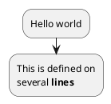

## Action List (Dash or Asterisk)

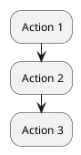

```plantuml
@startuml
* Action 1
** Sub-Action 1.1
** Sub-Action 1.2
*** Sub-Action 1.2.1
* Action 2
@enduml
```

## Start / Stop / End

Use `start` to begin a diagram. Use `stop` or `end` to terminate.

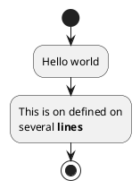

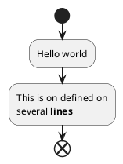

## Conditional (if / then / else / endif)

### Basic if/else

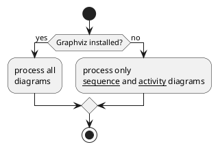

### Using `is` keyword

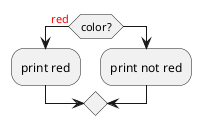

### Using `equals` keyword

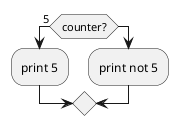

## Multiple Conditions (elseif)

### Horizontal mode (default)

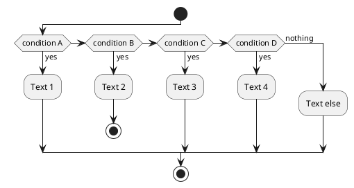

### Vertical mode

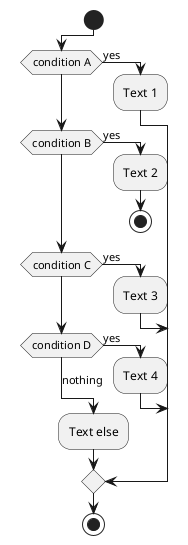

## Switch / Case

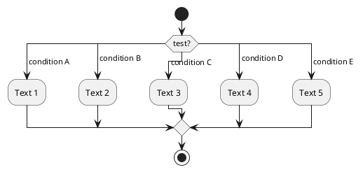

## Conditional with Stop, Kill, and Detach

`stop` ends with a terminator. `kill` terminates flow with a visual cross. `detach` removes the arrow entirely.

```plantuml
@startuml
if (condition?) then
  :error;
  stop
endif
:action;
<<#palegreen>>
@enduml
```

```plantuml
@startuml
if (condition?) then
  :error;
  <<#pink>>
  kill
endif
:action;
<<#palegreen>>
@enduml
```

```plantuml
@startuml
if (condition?) then
  :error;
  <<#pink>>
  detach
endif
:action;
<<#palegreen>>
@enduml
```

## Repeat Loop

### Basic repeat

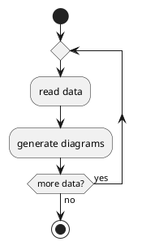

### Repeat with starting label and backward action

The `backward` keyword inserts an action in the return path of the loop.

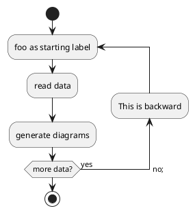

### Break in repeat loop

```plantuml
@startuml
start
repeat
  :Test something;
    if (Something went wrong?) then (no)
      :OK;
      <<#palegreen>>
      break
    endif
    ->NOK;
    :Alert "Error with long text";
repeat while (Something went wrong with long text?) is (yes) not (no)
->//merged step//;
:Alert "Success";
stop
@enduml
```

## While Loop

### Basic while

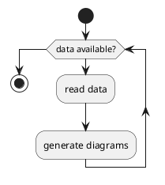

### While with labels

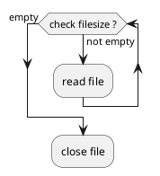

### While with backward action

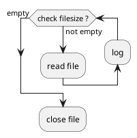

### Infinite while loop

```plantuml
@startuml
:Step 1;
if (condition1) then
  while (loop forever)
   :Step 2;
  endwhile
  -[hidden]->
  detach
else
  :end normally;
  stop
endif
@enduml
```

## Parallel Processing (fork)

### Basic fork

```plantuml
@startuml
start
fork
  :action 1;
fork again
  :action 2;
end fork
stop
@enduml
```

### Fork with end merge

`end merge` merges all branches into a single flow (no synchronization bar).

```plantuml
@startuml
start
fork
  :action 1;
fork again
  :action 2;
end merge
stop
@enduml
```

### Multiple fork branches

```plantuml
@startuml
start
fork
  :action 1;
fork again
  :action 2;
fork again
  :action 3;
fork again
  :action 4;
end merge
stop
@enduml
```

### Fork with end in a branch

```plantuml
@startuml
start
fork
  :action 1;
fork again
  :action 2;
  end
end merge
stop
@enduml
```

### Fork with joinspec

Use `{or}` or `{and}` to specify join conditions.

```plantuml
@startuml
start
fork
  :action A;
fork again
  :action B;
end fork {or}
stop
@enduml
```

```plantuml
@startuml
start
fork
  :action A;
fork again
  :action B;
end fork {and}
stop
@enduml
```

### Fork inside conditional

```plantuml
@startuml
start
if (multiprocessor?) then (yes)
  fork
    :Treatment 1;
  fork again
    :Treatment 2;
  end fork
else (monoproc)
  :Treatment 1;
  :Treatment 2;
endif
@enduml
```

## Split Processing

### Basic split

```plantuml
@startuml
start
split
   :A;
split again
   :B;
split again
   :C;
split again
   :a;
   :b;
end split
:D;
end
@enduml
```

### Input split (multi-start)

```plantuml
@startuml
split
   -[hidden]->
   :A;
split again
   -[hidden]->
   :B;
split again
   -[hidden]->
   :C;
end split
:D;
@enduml
```

### Output split (multi-end)

```plantuml
@startuml
start
split
   :A;
   kill
split again
   :B;
   detach
split again
   :C;
   kill
end split
@enduml
```

## Goto and Label (Experimental)

```plantuml
@startuml
title Point two queries to same activity\nwith `goto`
start
if (Test Question?) then (yes)
'space label only for alignment
label sp_lab0
label sp_lab1
'real label
label lab
:shared;
else (no)
if (Second Test Question?) then (yes)
label sp_lab2
goto sp_lab1
else
:nonShared;
endif
endif
:merge;
@enduml
```

## Connectors

Connectors create named junction points using parentheses. Can be colored.

```plantuml
@startuml
start
:Some activity;
(A)
detach
(A)
:Other activity;
@enduml
```

### Colored connectors

```plantuml
@startuml
start
:The connector below wishes he was blue;
#blue:(B)
:This next connector feels green;
#green:(G)
stop
@enduml
```

### Styled connectors

```plantuml
@startuml
<style>
circle {
  Backgroundcolor palegreen
  LineColor green
  LineThickness 2
}
</style>

(1)
:a;
(A)
@enduml
```

## Notes

### Floating and multi-line notes

```plantuml
@startuml
start
:foo1;
floating note left: This is a note
:foo2;
note right
  This note is on several
  //lines// and can
  contain <b>HTML</b>
  ====
  * Calling the method ""foo()"" is prohibited
end note
stop
@enduml
```

### Note on backward activity

```plantuml
@startuml
start
repeat
:Enter data;
:Submit;
backward :Warning;
note right: Note
repeat while (Valid?) is (No) not (Yes)
stop
@enduml
```

### Note on partition activity

```plantuml
@startuml
start
partition "**process** HelloWorld" {
    note
        This is my note
        ----
        //Creole test//
    end note
    :Ready;
    :HelloWorld(i);
    <<output>>
    :Hello-Sent;
}
@enduml
```

## Colors on Activities

Use `<<#color>>` stereotype after an activity to set its background color. Supports named colors and hex values.

```plantuml
@startuml
start
:starting progress;
:reading configuration files
These files should be edited at this point!;
<<#HotPink>>
:ending of the process;
<<#AAAAAA>>
@enduml
```

### Gradient colors

```plantuml
@startuml
start
partition #red/white testPartition {
        :testActivity;
        <<#blue\green>>
}
@enduml
```

## Arrows

### Text on arrows

Use `->` with text to label arrows.

```plantuml
@startuml
:foo1;
-> You can put text on arrows;
if (test) then
  -[#blue]->
  :foo2;
  -[#green,dashed]-> The text can
  also be on several lines
  and **very** long...;
  :foo3;
else
  -[#black,dotted]->
  :foo4;
endif
-[#gray,bold]->
:foo5;
@enduml
```

Arrow styles: `dashed`, `dotted`, `bold`, `hidden`. Colors with `#colorname`.

### Simple colored arrow (link)

```plantuml
@startuml
:a;
link #blue
:b;
@enduml
```

### Multiple colored arrows

```plantuml
@startuml
skinparam colorArrowSeparationSpace 1
start
-[#red;#green;#orange;#blue]->
:action;
stop
@enduml
```

### Lines without arrows

```plantuml
@startuml
skinparam ArrowHeadColor none
start
:Hello world;
:This is on defined on
several **lines**;
stop
@enduml
```

## Grouping: Group, Partition, Package, Rectangle, Card

All grouping keywords work similarly. `partition` and `group` are the most common.

```plantuml
@startuml
start
group Group {
  :Activity;
}
floating note: Note on Group

partition Partition {
  :Activity;
}
floating note: Note on Partition

package Package {
  :Activity;
}
floating note: Note on Package

rectangle Rectangle {
  :Activity;
}
floating note: Note on Rectangle

card Card {
  :Activity;
}
floating note: Note on Card
end
@enduml
```

### Partition with color

```plantuml
@startuml
start
partition #lightGreen "Input Interface" {
    :read config file;
    :init internal variable;
}
partition Running {
    :wait for user interaction;
    :print information;
}
stop
@enduml
```

### Partition with hyperlink

```plantuml
@startuml
start
partition "[[http://plantuml.com partition_name]]" {
    :read doc. on [[http://plantuml.com plantuml_website]];
    :test diagram;
}
end
@enduml
```

## Swimlanes

Swimlanes are defined with `|Name|`. Optional background color and alias supported.

### Basic swimlanes

```plantuml
@startuml
|Swimlane1|
start
:foo1;
|#AntiqueWhite|Swimlane2|
:foo2;
:foo3;
|Swimlane1|
:foo4;
|Swimlane2|
:foo5;
stop
@enduml
```

### Swimlanes with conditional

```plantuml
@startuml
|#pink|Actor_For_red|
start
if (color?) is (red) then
:**action red**;
<<#pink>>
:foo1;
else (not red)
|#lightgray|Actor_For_no_red|
:**action not red**;
<<#lightgray>>
:foo2;
endif
|Next_Actor|
:foo3;
<<#lightblue>>
:foo4;
|Final_Actor|
:foo5;
<<#palegreen>>
stop
@enduml
```

### Swimlanes with alias

```plantuml
@startuml
|#palegreen|f| fisherman
|c| cook
|#gold|e| eater
|f|
start
:go fish;
|c|
:fry fish;
|e|
:eat fish;
stop
@enduml
```

## Detach and Kill

`detach` removes the connecting arrow. `kill` shows a cross terminator.

```plantuml
@startuml
:start;
fork
   :foo1;
   :foo2;
fork again
   :foo3;
   detach
endfork
if (foo4) then
   :foo5;
   detach
endif
:foo6;
detach
@enduml
```

```plantuml
@startuml
:start;
fork
   :foo1;
   :foo2;
fork again
   :foo3;
   kill
endfork
if (foo4) then
   :foo5;
   kill
endif
:foo6;
kill
@enduml
```

## SDL (Specification and Description Language) Shapes

Use `<<stereotype>>` after an activity to change its shape.

```plantuml
@startuml
start
:SDL Shape;
:input;
<<input>>
:output;
<<output>>
:procedure;
<<procedure>>
:load;
<<load>>
:save;
<<save>>
:continuous;
<<continuous>>
:task;
<<task>>
end
@enduml
```

### SDL complex example

```plantuml
@startuml
:Ready;
:next(o);
<<procedure>>
:Receiving;
split
 :nak(i);
 <<input>>
 :ack(o);
 <<output>>
split again
 :ack(i);
 <<input>>
 :next(o)
 on several lines;
 <<procedure>>
 :i := i + 1;
 <<task>>
 :ack(o);
 <<output>>
split again
 :err(i);
 <<input>>
 :nak(o);
 <<output>>
split again
 :foo;
 <<save>>
split again
 :bar;
 <<load>>
split again
 :i > 5;
 <<continuous>>
 stop
end split
:finish;
@enduml
```

## UML Shapes

```plantuml
@startuml
:action;
:object;
<<object>>
:ObjectNode typed by signal;
<<objectSignal>>
:AcceptEventAction without TimeEvent trigger;
<<acceptEvent>>
:SendSignalAction;
<<sendSignal>>
:Trigger;
<<trigger>>
:AcceptEventAction with TimeEvent trigger;
<<timeEvent>>
:an action;
@enduml
```

## Condition Style (skinparam)

Controls how condition labels are rendered.

```plantuml
@startuml
skinparam conditionStyle inside
start
repeat
  :act1;
  :act2;
repeatwhile (<b>end)
:act3;
@enduml
```

```plantuml
@startuml
skinparam conditionStyle diamond
start
repeat
  :act1;
  :act2;
repeatwhile (<b>end)
:act3;
@enduml
```

```plantuml
@startuml
skinparam conditionStyle InsideDiamond
start
repeat
  :act1;
  :act2;
repeatwhile (<b>end)
:act3;
@enduml
```

## Condition End Style

Controls the merge point shape after conditionals.

### Diamond style

```plantuml
@startuml
skinparam ConditionEndStyle diamond
:A;
if (decision) then (yes)
    :B1;
else (no)
    :B2;
endif
:C;
@enduml
```

### Hline style

```plantuml
@startuml
skinparam ConditionEndStyle hline
:A;
if (decision) then (yes)
    :B1;
else (no)
    :B2;
endif
:C;
@enduml
```

## Styling with `<style>`

```plantuml
@startuml
<style>
activityDiagram {
  BackgroundColor #33668E
  BorderColor #33668E
  FontColor #888
  FontName arial
  diamond {
    BackgroundColor #ccf
    LineColor #00FF00
    FontColor green
    FontName arial
    FontSize 15
  }
  arrow {
    FontColor gold
    FontName arial
    FontSize 15
  }
  partition {
    LineColor red
    FontColor green
    RoundCorner 10
    BackgroundColor PeachPuff
  }
  note {
    FontColor Blue
    LineColor Navy
    BackgroundColor #ccf
  }
}
document {
   BackgroundColor transparent
}
</style>
start
:init;
-> test of color;
if (color?) is (<color:red>red) then
  :print red;
else
 :print not red;
 note right: no color
endif
partition End {
  :end;
}
-> this is the end;
end
@enduml
```

## Creole and HTML Formatting in Activities

```plantuml
@startuml
:Creole:
  wave: ~~wave~~
  bold: **bold**
  italics: //italics//
  monospaced: ""monospaced""
  stricken-out: --stricken-out--
  underlined: __underlined__;
:HTML Creole:
  bold: <b>bold
  italics: <i>italics
  monospaced: <font:monospaced>monospaced
  stroked: <s>stroked
  underlined: <u>underlined
  waved: <w>waved
  Blue: <color:blue>Blue
  Orange: <back:orange>Orange background
  big: <size:20>big;
@enduml
```

## Complete Example

```plantuml
@startuml
start
:ClickServlet.handleRequest();
:new page;
if (Page.onSecurityCheck) then (true)
  :Page.onInit();
  if (isForward?) then (no)
    :Process controls;
    if (continue processing?) then (no)
      stop
    endif

    if (isPost?) then (yes)
      :Page.onPost();
    else (no)
      :Page.onGet();
    endif
    :Page.onRender();
  endif
else (false)
endif

if (do redirect?) then (yes)
  :redirect process;
else
  if (do forward?) then (yes)
    :Forward request;
  else (no)
    :Render page template;
  endif
endif

stop
@enduml
```
