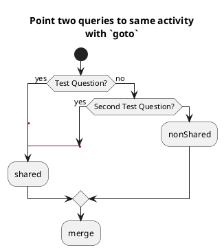
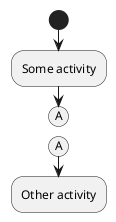
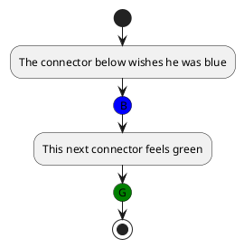
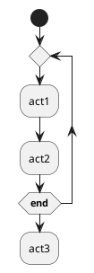
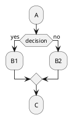
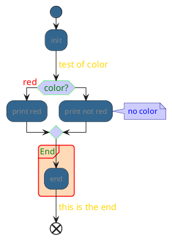
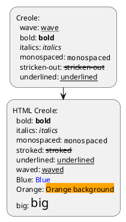
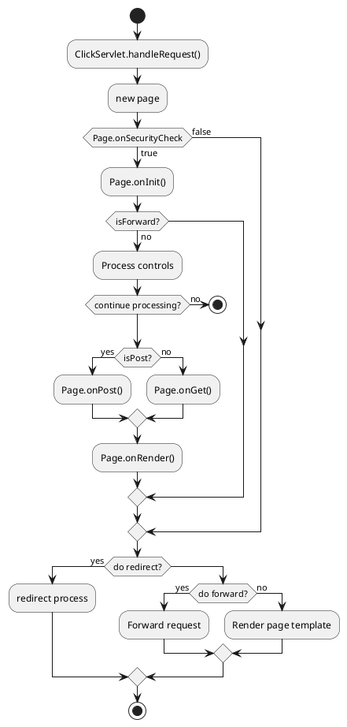

# Activity Diagram — Advanced Reference

> Source: https://plantuml.com/activity-diagram-beta

## Goto and Label (Experimental)



## Connectors

Connectors create named junction points using parentheses. Can be colored.



### Colored connectors



### Styled connectors

```plantuml
@startuml
<style>
circle {
  Backgroundcolor palegreen
  LineColor green
  LineThickness 2
}
</style>

(1)
:a;
(A)
@enduml
```



## SDL (Specification and Description Language) Shapes

Use `<<stereotype>>` after an activity to change its shape.

```plantuml
@startuml
start
:SDL Shape;
:input;
<<input>>
:output;
<<output>>
:procedure;
<<procedure>>
:load;
<<load>>
:save;
<<save>>
:continuous;
<<continuous>>
:task;
<<task>>
end
@enduml
```

### SDL complex example

```plantuml
@startuml
:Ready;
:next(o);
<<procedure>>
:Receiving;
split
 :nak(i);
 <<input>>
 :ack(o);
 <<output>>
split again
 :ack(i);
 <<input>>
 :next(o)
 on several lines;
 <<procedure>>
 :i := i + 1;
 <<task>>
 :ack(o);
 <<output>>
split again
 :err(i);
 <<input>>
 :nak(o);
 <<output>>
split again
 :foo;
 <<save>>
split again
 :bar;
 <<load>>
split again
 :i > 5;
 <<continuous>>
 stop
end split
:finish;
@enduml
```

## UML Shapes

```plantuml
@startuml
:action;
:object;
<<object>>
:ObjectNode typed by signal;
<<objectSignal>>
:AcceptEventAction without TimeEvent trigger;
<<acceptEvent>>
:SendSignalAction;
<<sendSignal>>
:Trigger;
<<trigger>>
:AcceptEventAction with TimeEvent trigger;
<<timeEvent>>
:an action;
@enduml
```

## Condition Style (skinparam)

Controls how condition labels are rendered.



Options: `inside`, `diamond`, `InsideDiamond`

## Condition End Style

Controls the merge point shape after conditionals.



Options: `diamond`, `hline`

## Styling with `<style>`



## Creole and HTML Formatting in Activities



## Complete Example


