> Source: https://plantuml.com/class-diagram

# PlantUML Class Diagram Reference

## Class Declaration

PlantUML supports the following element type keywords: `abstract`, `abstract class`, `annotation`, `circle`, `class`, `dataclass`, `diamond`, `entity`, `enum`, `exception`, `interface`, `metaclass`, `protocol`, `record`, `stereotype`, `struct`.

```plantuml
@startuml
abstract        AbstractList
abstract class  AbstractCollection
annotation      SuppressWarnings
circle          CircleElement
class           ArrayList
dataclass       DataPoint
diamond         DiamondElement
entity          Person
enum            TimeUnit
exception       IOException
interface       List
metaclass       MetaType
protocol        Sendable
record          UserRecord
stereotype      StereotypeElement
struct          Point
@enduml
```

Short forms for circle and diamond:

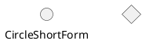

## Non-Letter Class Names

Use quotes or the `as` keyword for class names with special characters:

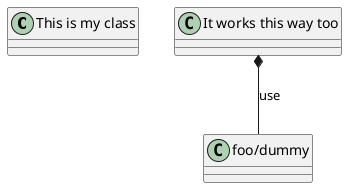

For names starting with `$`, use an alias:

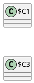

## Fields and Methods

Inline declaration using `:`:

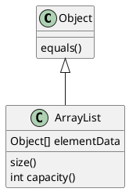

Bracketed declaration:

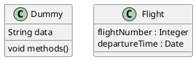

Override the parser with `{field}` and `{method}` modifiers:

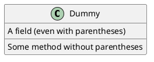

## Visibility Modifiers

Characters placed before a member define its visibility:

| Character | Visibility |
|-----------|-----------|
| `-` | private |
| `#` | protected |
| `~` | package private |
| `+` | public |

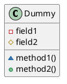

To turn off visibility icons and use text characters instead:

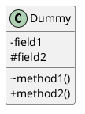

Class-level visibility is also supported: `-class`, `#class`, `~class`, `+class`.

## Static and Abstract Members

Use `{static}` or `{classifier}` for static members, and `{abstract}` for abstract members:

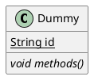

## Advanced Class Body (Separators)

Use `--`, `..`, `==`, or `__` to create visual separators with optional titles:

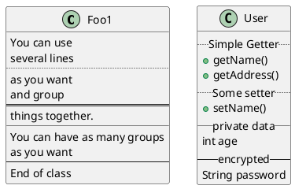

## Generics

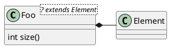

Disable generic rendering with: `skinparam genericDisplay old`

## Relationships

### Relationship Types

| Type | Symbol | Drawing |
|------|--------|---------|
| Extension (inheritance) | `<\|--` | Solid line, closed triangle |
| Implementation (realization) | `<\|..` | Dotted line, closed triangle |
| Composition | `*--` | Solid line, filled diamond |
| Aggregation | `o--` | Solid line, open diamond |
| Association (strong) | `-->` | Solid line, open arrow |
| Dependency (weak) | `..>` | Dotted line, open arrow |

Additional arrow heads: `#`, `x`, `}`, `+`, `^`

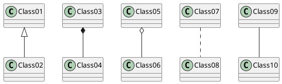

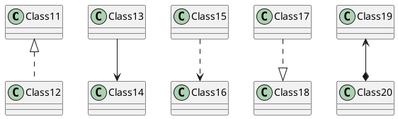

### Horizontal vs Vertical Lines

Double dash `--` creates vertical lines. Single dash `-` creates horizontal lines:

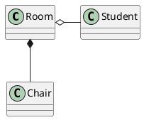

### Labels on Relations

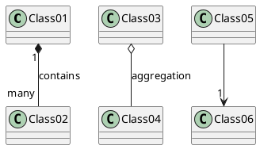

Use `<` or `>` in the label to indicate direction:

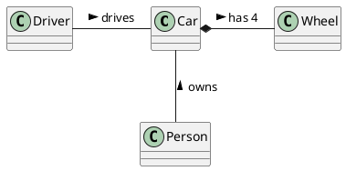

### Arrow Direction Control

Use keywords to force direction: `-left->`, `-right->`, `-up->`, `-down->`:

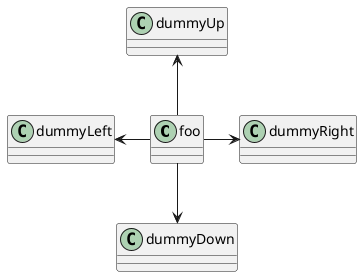

Shortcuts: `-l->`, `-r->`, `-u->`, `-d->` or `-le->`, `-ri->`, `-up->`, `-do->`

### Bracketed Relationship Styles

Customize line style, color, and thickness directly on the arrow:

**Line styles:** `[bold]`, `[dashed]`, `[dotted]`, `[hidden]`, `[plain]`

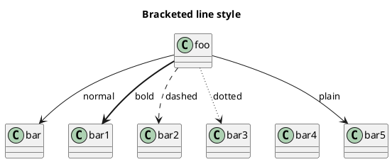

**Line color:**

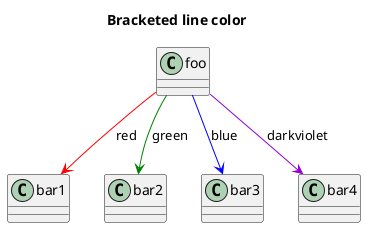

**Line thickness:**

```plantuml
@startuml
title Bracketed line thickness

class foo
foo -[thickness=1]-> bar1 : 1
foo -[thickness=2]-> bar2 : 2
foo -[thickness=4]-> bar3 : 4
foo -[thickness=8]-> bar4 : 8
foo -[thickness=16]-> bar5 : 16
@enduml
```

**Combined styles:**

```plantuml
@startuml
title Bracketed line combined

class foo
foo -[#red,thickness=1]-> bar1
foo -[#red,dashed,thickness=2]-> bar2
foo -[#green,dashed,thickness=4]-> bar3
foo -[#blue,dotted,thickness=8]-> bar4
foo -[#blue,plain,thickness=16]-> bar5
@enduml
```

## Extends and Implements Keywords

```plantuml
@startuml
class ArrayList implements List
class ArrayList extends AbstractList

interface List
abstract class AbstractList
@enduml
```

Multiple inheritance/implementation:

```plantuml
@startuml
class A extends B, C {
}
@enduml
```

## Abstract Classes and Interfaces

```plantuml
@startuml
abstract class AbstractList
abstract AbstractCollection

interface List
interface Collection

List <|-- AbstractList
Collection <|-- AbstractCollection

Collection <|- List
AbstractCollection <|- AbstractList
AbstractList <|-- ArrayList

class ArrayList {
  Object[] elementData
  size()
}

enum TimeUnit {
  DAYS
  HOURS
  MINUTES
}

annotation SuppressWarnings
@enduml
```

Annotations with members:

```plantuml
@startuml
annotation Annotation {
  annotation with members
  String foo()
  String bar()
}
@enduml
```

## Stereotypes and Custom Spots

```plantuml
@startuml
class Object << general >>
Object <|--- ArrayList

note top of Object : In java, every class\nextends this one.
@enduml
```

Custom spots use `(character,color)` inside the stereotype:

```plantuml
@startuml
class System << (S,#FF7700) Singleton >>
class Date << (D,orchid) >>
@enduml
```

## Packages

```plantuml
@startuml
package "Classic Collections" #DDDDDD {
  Object <|-- ArrayList
}

package com.plantuml {
  Object <|-- Demo1
  Demo1 *- Demo2
}
@enduml
```

### Package Styles

```plantuml
@startuml
package node <<Node>> {
  class Class1
}

package rect <<Rectangle>> {
  class Class2
}

package folder <<Folder>> {
  class Class3
}

package frame <<Frame>> {
  class Class4
}

package cloud <<Cloud>> {
  class Class5
}

package database <<Database>> {
  class Class6
}
@enduml
```

Set a default style with: `skinparam packageStyle rectangle`

### Nested Packages

```plantuml
@startuml
package foo1.foo2 {
  class Foo
}

package foo1.foo2.foo3 {
  class Bar
}

foo1.foo2 +-- foo1.foo2.foo3
@enduml
```

## Namespaces and Automatic Package Creation

Since PlantUML 1.2023.2, namespaces and packages are synonymous.

Use `set separator` to control automatic package creation from `::` in names:

```plantuml
@startuml
set separator ::
class X1::X2::foo {
  some info
}
@enduml
```

Disable automatic namespace creation:

```plantuml
@startuml
set separator none
class X1::X2::foo {
  some info
}
@enduml
```

## Notes

### Notes on Classes

Position options: `top`, `bottom`, `left`, `right`.

```plantuml
@startuml
class Object

note top of Object : In java, every class\nextends this one.

note "This is a floating note" as N1
note "This note is connected\nto several objects." as N2
Object .. N2
N2 .. ArrayList

class Foo
note left: On last defined class
@enduml
```

### Multiline Notes

```plantuml
@startuml
class Foo

note top of Foo
  In java, <size:18>every</size> <u>class</u>
  <b>extends</b>
  <i>this</i> one.
end note
@enduml
```

### Notes on Fields and Methods

```plantuml
@startuml
class A {
  {static} int counter
  +void {abstract} start(int timeout)
}

note right of A::counter
  This member is annotated
end note

note right of A::"start(int timeout)"
  This method is annotated
end note
@enduml
```

### Notes on Links

```plantuml
@startuml
class Dummy

Dummy --> Foo : A link
note on link #red: note that is red

Dummy --> Foo2 : Another link
note right on link #blue
  this is my note on right link
  and target is Foo2
end note
@enduml
```

### HTML in Notes

Supported tags: `<b>`, `<u>`, `<i>`, `<s>`, `<del>`, `<strike>`, `<font>`, `<color>`, `<size>`, ``.

```plantuml
@startuml
class Foo

note top of Foo
  Use <b>bold</b>, <i>italic</i>,
  <u>underline</u>, <s>strikethrough</s>,
  <font color="red">colored text</font>,
  and <size:20>different sizes</size>.
end note
@enduml
```

## Association Classes

```plantuml
@startuml
class Student {
  Name
}
class Course {
  Name
}

Student "0..*" - "1..*" Course
(Student, Course) .. Enrollment

class Enrollment {
  drop()
  cancel()
}
@enduml
```

## Same-Class Associations (Diamond)

```plantuml
@startuml
class Station {
  +name: string
}

class StationCrossing {
  +cost: TimeInterval
}

<> diamond

StationCrossing . diamond
diamond - "from 0..*" Station
diamond - "to 0..*" Station
@enduml
```

## Lollipop Interface

```plantuml
@startuml
class foo
bar ()- foo
foo -() baz
@enduml
```

## Hiding and Removing Members

### Hide Empty Members

```plantuml
@startuml
hide empty members
class Dummy
class Foo {
  +method()
}
@enduml
```

### Hide Specific Members

```plantuml
@startuml
hide empty fields
hide empty methods

class Dummy1 {
  +myMethod()
}

class Dummy2 {
  +hiddenField
}
@enduml
```

### Scoped Hiding

Options: class name, interface, enum, `<<stereotype>>`, visibility level.

```plantuml
@startuml
interface List
class Dummy

hide interface fields
hide interface methods
hide Dummy fields

class Foo {
  -privateField
  #protectedField
  +publicMethod()
}

hide private members
hide protected members
@enduml
```

### Hide/Show Circle and Stereotype

```plantuml
@startuml
hide circle
hide stereotype
class Foo
interface Bar
@enduml
```

## Hiding and Removing Classes

```plantuml
@startuml
class Foo1
class Foo2

hide Foo2
@enduml
```

Remove unlinked classes:

```plantuml
@startuml
class C1
class C2
class C3
C1 -- C2

hide @unlinked
@enduml
```

`remove @unlinked` also works.

## Tagged Elements

Use `$tags` for selective hiding/removing:

```plantuml
@startuml
class C1 $tag1
class C2 $tag2
class C3 $tag1

C1 -- C2

remove $tag1
@enduml
```

Restore specific tags:

```plantuml
@startuml
class C1 $tag1
class C2 $tag2
class C3

remove *
restore $tag1
@enduml
```

## Layout Helpers

### Together Grouping

```plantuml
@startuml
together {
  class Together1
  class Together2
  class Together3
}
class Bar1

Together1 - Together2
Together2 - Together3
Together2 -[hidden]--> Bar1
@enduml
```

### Hidden Links

Use `[hidden]` to influence layout without visible arrows:

```plantuml
@startuml
class A
class B
class C

A -[hidden]-> B
B -[hidden]-> C
A --> C
@enduml
```

## Skinparam Customization

### Class Colors

```plantuml
@startuml
skinparam class {
  BackgroundColor PaleGreen
  ArrowColor SeaGreen
  BorderColor SpringGreen
}
skinparam stereotypeCBackgroundColor YellowGreen

Class01 "1" *-- "many" Class02 : contains
@enduml
```

### Stereotype-Specific Styling

No space between parameter name and stereotype:

```plantuml
@startuml
skinparam class {
  BackgroundColor<<Foo>> Wheat
  BorderColor<<Foo>> Tomato
}

class Foo <<Foo>>
class Bar
@enduml
```

### Color Gradients

Gradient symbols: `|` (vertical), `/` (diagonal), `\` (reverse diagonal), `-` (horizontal).

```plantuml
@startuml
skinparam classBackgroundColor Wheat|CornflowerBlue

class Foo #red-green
class Bar #blue\9932CC
@enduml
```

## Splitting Large Diagrams

```plantuml
@startuml
page 2x2
skinparam pageMargin 10
skinparam pageExternalColor gray
skinparam pageBorderColor black

class BaseClass

namespace net.hierarchical #DDDDDD {
  .BaseClass <|-- Move
  .Move <|-- RookMove
}
@enduml
```

Splits output into `hpages x vpages` separate files.
