# Class Diagram — Advanced Reference

> Source: https://plantuml.com/class-diagram

## Bracketed Relationship Styles

Customize line style, color, and thickness on arrows.

**Line styles:** `[bold]`, `[dashed]`, `[dotted]`, `[hidden]`, `[plain]`

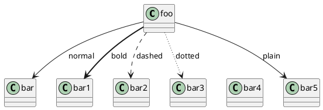

**Line color:**

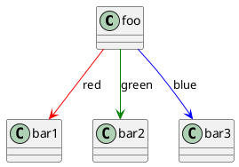

**Line thickness:**

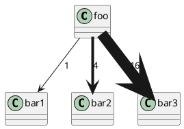

**Combined:**

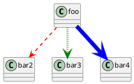

## Association Classes

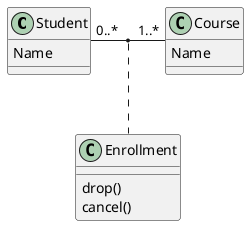

## Same-Class Associations (Diamond)

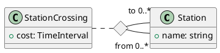

## Lollipop Interface

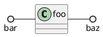

## Hiding and Removing Members

### Hide Empty Members

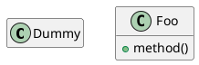

### Scoped Hiding

Options: class name, interface, enum, `<<stereotype>>`, visibility level.

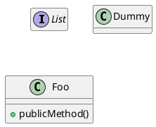

### Hide/Show Circle and Stereotype

```plantuml
@startuml
hide circle
hide stereotype
class Foo
interface Bar
@enduml
```

## Hiding and Removing Classes

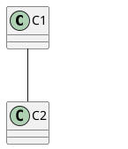

## Tagged Elements

```plantuml
@startuml
class C1 $tag1
class C2 $tag2
class C3 $tag1
C1 -- C2
remove $tag1
@enduml
```

Restore specific: `remove *` then `restore $tag1`

## Layout Helpers

### Together Grouping

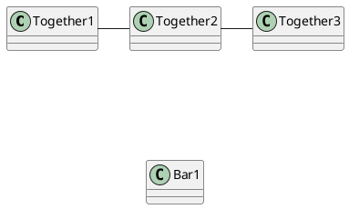

### Hidden Links

Use `[hidden]` to influence layout without visible arrows.

## Notes on Links

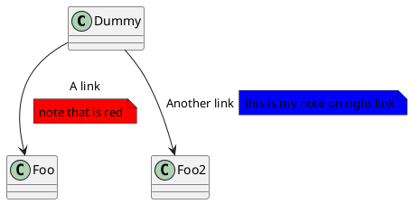

## Skinparam Customization

### Class Colors

```plantuml
@startuml
skinparam class {
  BackgroundColor PaleGreen
  ArrowColor SeaGreen
  BorderColor SpringGreen
}
skinparam stereotypeCBackgroundColor YellowGreen
Class01 "1" *-- "many" Class02 : contains
@enduml
```

### Stereotype-Specific Styling

```plantuml
@startuml
skinparam class {
  BackgroundColor<<Foo>> Wheat
  BorderColor<<Foo>> Tomato
}
class Foo <<Foo>>
class Bar
@enduml
```

### Color Gradients

Gradient symbols: `|` (vertical), `/` (diagonal), `\` (reverse diagonal), `-` (horizontal).

```plantuml
@startuml
skinparam classBackgroundColor Wheat|CornflowerBlue
class Foo #red-green
class Bar #blue\9932CC
@enduml
```

## Splitting Large Diagrams

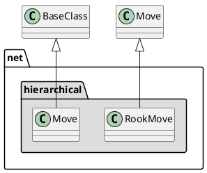
