> Source: https://plantuml.com/component-diagram

# PlantUML Component Diagram Reference

## Components

Components are declared using square brackets `[ComponentName]` or the `component` keyword. Use `as` for aliasing and `\n` for line breaks within names.

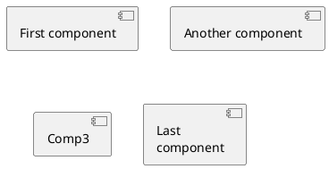

### Naming Exceptions

Component names starting with `$` can conflict with tag syntax in some contexts. A safer pattern is to use a quoted display name with a regular alias:

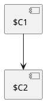

## Interfaces

Interfaces are declared using parentheses `()` or the `interface` keyword.

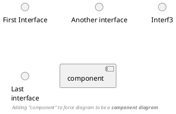

## Basic Example

Use `-` for solid lines and `..>` for dotted arrows. Add labels with `: label`.

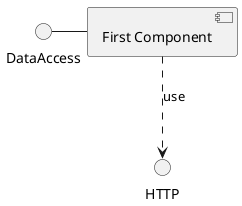

## Links and Arrows

### Line Styles

| Syntax | Description |
|--------|-------------|
| `--` | Solid line |
| `..` | Dotted line |
| `-->` | Solid arrow |
| `..>` | Dotted arrow |
| `-` | Short solid line |
| `->` | Short solid arrow |

### Arrow Length

More dashes make the arrow longer:

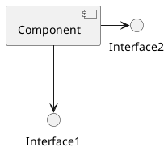

Reversed direction:

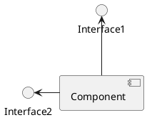

### Arrow Direction

Control layout direction with `-left->`, `-right->`, `-up->`, `-down->` (abbreviations: `-l->`, `-r->`, `-u->`, `-d->`):

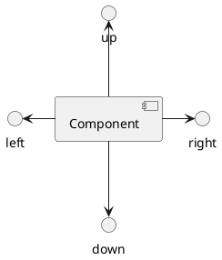

### Layout Direction

Use `left to right direction` to change the default top-to-bottom layout:

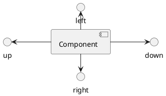

## Grouping Components

Use `package`, `node`, `cloud`, `database`, `folder`, or `frame` to group components. These containers can be nested.

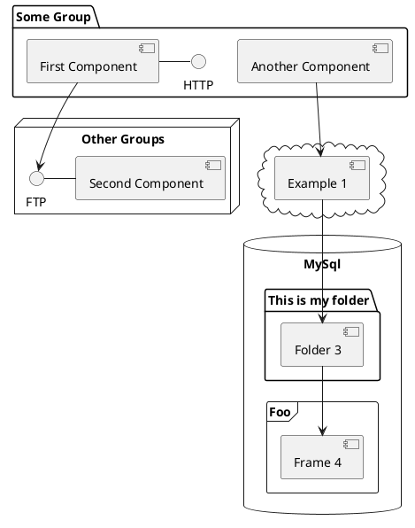

## Notes

### Positioned Notes

Attach notes to components with `note top of`, `note bottom of`, `note left of`, `note right of`:

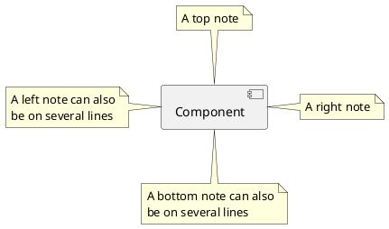

### Floating Notes

Create a standalone note and link it:

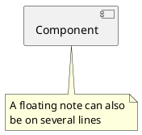

### Notes on Links

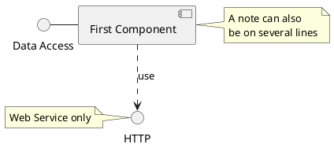

## Long Description

Use square brackets after a component declaration to provide multi-line descriptions:

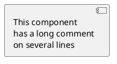

## Individual Colors

Assign colors to components using `#ColorName` or `#HexCode`:

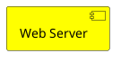

## Component Style Notation

### UML2 (Default)

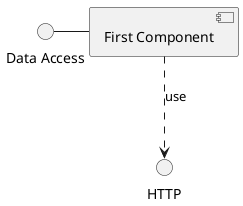

### UML1

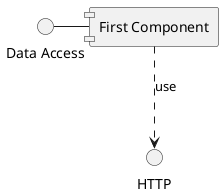

### Rectangle


### Nested Components with UML2 vs Rectangle

UML2 style:

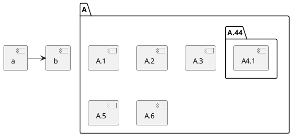

Rectangle style:

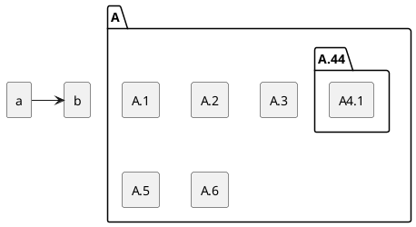

## Using Sprites in Stereotypes

Define custom icons with `sprite` and apply them via stereotypes:

```plantuml
@startuml
sprite $businessProcess [16x16/16] {
FFFFFFFFFFFFFFFF
FFFFFFFFFFFFFFFF
FFFFFFFFFFFFFFFF
FFFFFFFFFFFFFFFF
FFFFFFFFFF0FFFFF
FFFFFFFFFF00FFFF
FF00000000000FFF
FF000000000000FF
FF00000000000FFF
FFFFFFFFFF00FFFF
FFFFFFFFFF0FFFFF
FFFFFFFFFFFFFFFF
FFFFFFFFFFFFFFFF
FFFFFFFFFFFFFFFF
FFFFFFFFFFFFFFFF
FFFFFFFFFFFFFFFF
}

rectangle " End to End\nbusiness process" <<$businessProcess>> {
  rectangle "inner process 1" <<$businessProcess>> as src
  rectangle "inner process 2" <<$businessProcess>> as tgt
  src -> tgt
}
@enduml
```

## Skinparam

### Interface and Component Styling

```plantuml
@startuml
skinparam interface {
  backgroundColor RosyBrown
  borderColor orange
}

skinparam component {
  FontSize 13
  BackgroundColor<<Apache>> Pink
  BorderColor<<Apache>> #FF6655
  FontName Courier
  BorderColor black
  BackgroundColor gold
  ArrowFontName Impact
  ArrowColor #FF6655
  ArrowFontColor #777777
}

() "Data Access" as DA
Component "Web Server" as WS << Apache >>

DA - [First Component]
[First Component] ..> () HTTP : use
HTTP - WS
@enduml
```

### Stereotype-Based Styling

```plantuml
@startuml
skinparam component {
  backgroundColor<<static lib>> DarkKhaki
  backgroundColor<<shared lib>> Green
}

skinparam node {
  borderColor Green
  backgroundColor Yellow
  backgroundColor<<shared_node>> Magenta
}

skinparam databaseBackgroundColor Aqua

[AA] <<static lib>>
[BB] <<shared lib>>
[CC] <<static lib>>

node node1
node node2 <<shared_node>>
database Production
@enduml
```

## Hide or Remove Unlinked Components

### Default (all shown)

```plantuml
@startuml
component C1
component C2
component C3
C1 -- C2
@enduml
```

### Hide Unlinked

```plantuml
@startuml
component C1
component C2
component C3
C1 -- C2

hide @unlinked
@enduml
```

### Remove Unlinked

```plantuml
@startuml
component C1
component C2
component C3
C1 -- C2

remove @unlinked
@enduml
```

## Hide, Remove, or Restore Tagged Components

Tag components with `$tagName` for selective visibility.

### Default (all shown)

```plantuml
@startuml
component C1 $tag13
component C2
component C3 $tag13
C1 -- C2
@enduml
```

### Hide by Tag

```plantuml
@startuml
component C1 $tag13
component C2
component C3 $tag13
C1 -- C2

hide $tag13
@enduml
```

### Remove by Tag

```plantuml
@startuml
component C1 $tag13
component C2
component C3 $tag13
C1 -- C2

remove $tag13
@enduml
```

### Remove Tag then Restore Specific Tag

```plantuml
@startuml
component C1 $tag13 $tag1
component C2
component C3 $tag13
C1 -- C2

remove $tag13
restore $tag1
@enduml
```

### Remove All then Restore Specific Tag

```plantuml
@startuml
component C1 $tag13 $tag1
component C2
component C3 $tag13
C1 -- C2

remove *
restore $tag1
@enduml
```

## Ports

Ports define connection points on component boundaries. Use `port` (bidirectional), `portin` (input), or `portout` (output).

### Basic Port

```plantuml
@startuml
component "C" as c {
  port p1
  port p2
  port p3
  component c1
}

c --> p1
c --> p2
c --> p3
p1 --> c1
p2 --> c1
@enduml
```

### PortIn (Input Ports)

```plantuml
@startuml
component "C" as c {
  portin p1
  portin p2
  portin p3
  component c1
}

c --> p1
c --> p2
c --> p3
p1 --> c1
p2 --> c1
@enduml
```

### PortOut (Output Ports)

```plantuml
@startuml
component C {
  portout p1
  portout p2
  portout p3
  component c1
}

[o]
p1 --> o
p2 --> o
p3 --> o
c1 --> p1
@enduml
```

### Mixing PortIn and PortOut

```plantuml
@startuml
component "C" as i {
  portin p1
  portin p2
  portin p3
  portout po1
  portout po2
  portout po3
  component c1
}

[o]
i --> p1
i --> p2
i --> p3
p1 --> c1
p2 --> c1
po1 --> o
po2 --> o
po3 --> o
c1 --> po1
@enduml
```

## Display JSON Data on Component Diagram

Use `allowmixing` to combine component diagrams with JSON data:

```plantuml
@startuml
allowmixing

component Component
() Interface

json JSON {
  "fruit":"Apple",
  "size":"Large",
  "color": ["Red", "Green"]
}
@enduml
```

## Validation

After writing a `.puml` file or a PlantUML fenced block in Markdown, always validate the syntax:

- **Local** (preferred): `bash ${CLAUDE_PLUGIN_ROOT}/scripts/validate.sh <file.puml>`
- **Online** (fallback): `uv run ${CLAUDE_PLUGIN_ROOT}/scripts/validate_online.py <file.puml>`

For PlantUML blocks embedded in Markdown, extract the content to a temporary `.puml` file before validating. If validation fails, read the error output, fix the syntax, and re-validate.
