> Source: https://plantuml.com/activity-diagram-beta

# PlantUML Activity Diagram Reference

## Simple Action

Activities are defined with `:` and terminated with `;`. Supports Creole/HTML formatting.

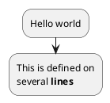

## Start / Stop / End

Use `start` to begin a diagram. Use `stop` or `end` to terminate.

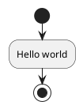

## Conditional (if / then / else / endif)

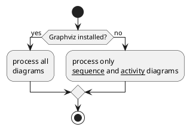

### Multiple Conditions (elseif)

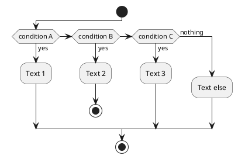

Vertical mode: `!pragma useVerticalIf on`

### Switch / Case

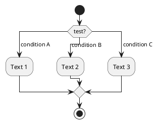

### Stop, Kill, and Detach

`stop` ends with a terminator. `kill` terminates with a cross. `detach` removes the arrow entirely.

## Repeat Loop

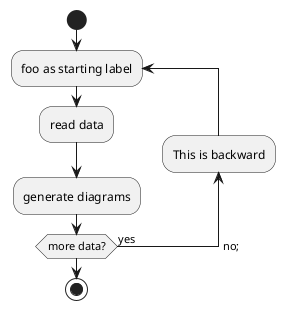

`break` exits a repeat loop.

## While Loop

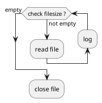

## Parallel Processing (fork)

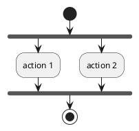

- `end merge` — merges without synchronization bar
- `end fork {or}` / `end fork {and}` — join conditions

## Split Processing

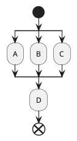

## Notes

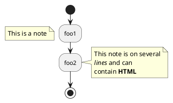

## Colors on Activities

Add `<<#color>>` **after** the closing `;` to color an activity.

```plantuml
@startuml
start
:starting progress;
:reading configuration files\nThese files should be edited at this point!; <<#HotPink>>
:ending of the process; <<#AAAAAA>>
@enduml
```

> **Deprecated:** The older `#color:text;` prefix syntax (e.g., `#HotPink:reading files;`) still works but emits a deprecation warning. Always use the `<<#color>>` suffix form instead.

## Arrows

Use `->` with text to label arrows. Arrow styles: `dashed`, `dotted`, `bold`, `hidden`. Colors with `#colorname`.

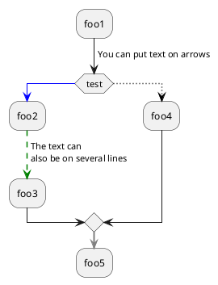

## Grouping: Group, Partition, Package, Rectangle, Card

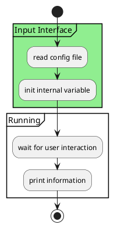

## Swimlanes

Swimlanes are defined with `|Name|`. Optional background color and alias supported.

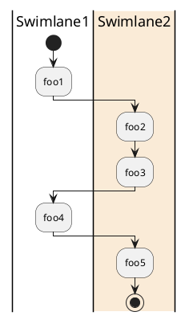

### Swimlanes with alias

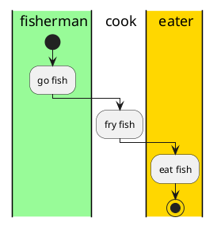

## Additional Resources

For SDL/UML shapes, goto/label, connectors, condition/end styles, `<style>` blocks, Creole formatting examples, and complete examples:
- **`activity-diagram-advanced.md`** — Advanced activity diagram features and styling
