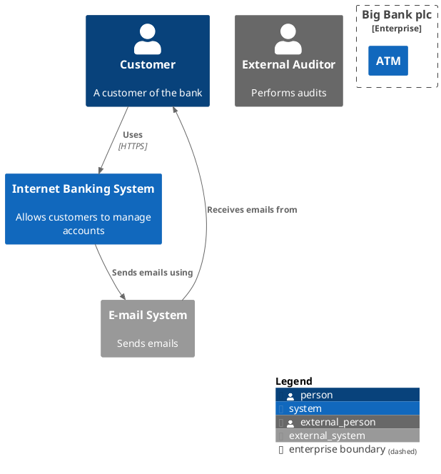
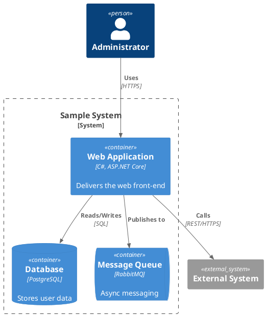
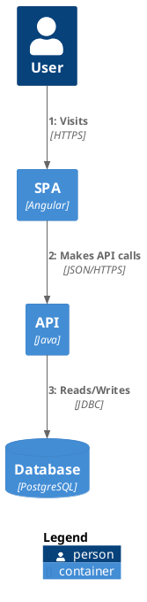
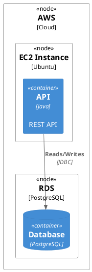
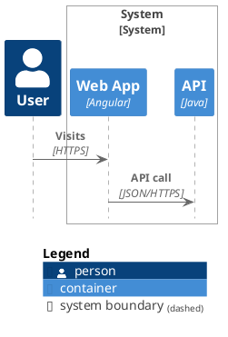
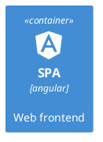
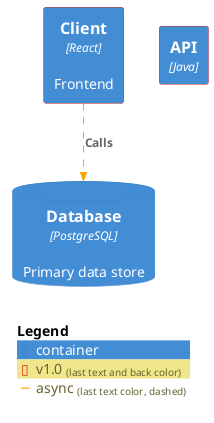
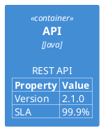

> Source: https://github.com/plantuml-stdlib/C4-PlantUML

# C4-PlantUML Diagram Reference

C4-PlantUML combines PlantUML with the [C4 model](https://c4model.com/) for describing software architectures using four abstraction levels: System Context, Container, Component, and Code. It provides macros, stereotypes, and styling for creating C4 diagrams.

## Including the Library

```text
' Via PlantUML stdlib (no internet required, uses last released version)
!include <C4/C4_Context>
!include <C4/C4_Container>
!include <C4/C4_Component>
!include <C4/C4_Dynamic>
!include <C4/C4_Deployment>
!include <C4/C4_Sequence>

' Via remote URL (always up-to-date, requires internet)
!include https://raw.githubusercontent.com/plantuml-stdlib/C4-PlantUML/master/C4_Container.puml
```

Each include file builds on the previous level: `C4_Component.puml` includes Container macros, which includes Context macros.

## Diagram Types and Core Macros

### System Context & System Landscape (C4_Context)

Define people and systems at the highest level.



**Element macros:**
- `Person(alias, label, ?descr, ?sprite, ?tags, ?link, ?type)`
- `Person_Ext(alias, label, ?descr, ?sprite, ?tags, ?link, ?type)`
- `System(alias, label, ?descr, ?sprite, ?tags, ?link, ?type, ?baseShape)`
- `System_Ext(alias, label, ?descr, ?sprite, ?tags, ?link, ?type, ?baseShape)`
- `SystemDb(alias, label, ?descr, ?sprite, ?tags, ?link, ?type)` / `SystemDb_Ext(...)`
- `SystemQueue(alias, label, ?descr, ?sprite, ?tags, ?link, ?type)` / `SystemQueue_Ext(...)`

**Boundary macros:**
- `Boundary(alias, label, ?type, ?tags, ?link, ?descr)`
- `Enterprise_Boundary(alias, label, ?tags, ?link, ?descr)`
- `System_Boundary(alias, label, ?tags, ?link, ?descr)`

### Container Diagram (C4_Container)

Zoom into a system to show containers (applications, data stores, etc.).



**Additional macros (extends Context):**
- `Container(alias, label, ?techn, ?descr, ?sprite, ?tags, ?link, ?baseShape)`
- `Container_Ext(alias, label, ?techn, ?descr, ?sprite, ?tags, ?link, ?baseShape)`
- `ContainerDb(alias, label, ?techn, ?descr, ?sprite, ?tags, ?link)` / `ContainerDb_Ext(...)`
- `ContainerQueue(alias, label, ?techn, ?descr, ?sprite, ?tags, ?link)` / `ContainerQueue_Ext(...)`
- `Container_Boundary(alias, label, ?tags, ?link, ?descr)`

### Component Diagram (C4_Component)

Zoom into a container to show its internal components.

**Additional macros (extends Container):**
- `Component(alias, label, ?techn, ?descr, ?sprite, ?tags, ?link, ?baseShape)`
- `Component_Ext(alias, label, ?techn, ?descr, ?sprite, ?tags, ?link, ?baseShape)`
- `ComponentDb(alias, label, ?techn, ?descr, ?sprite, ?tags, ?link)` / `ComponentDb_Ext(...)`
- `ComponentQueue(alias, label, ?techn, ?descr, ?sprite, ?tags, ?link)` / `ComponentQueue_Ext(...)`

### Dynamic Diagram (C4_Dynamic)

Show runtime behavior with numbered interactions.



**Additional macros:**
- `Index($offset=1)` — returns current index and calculates next
- `SetIndex($new_index)` — sets and returns new index
- `LastIndex()` — returns the last used index
- `increment($offset=1)` — increase index (procedure, no output)
- `setIndex($new_index)` — set index (procedure, no output)

### Deployment Diagram (C4_Deployment)

Show how containers map to infrastructure.



**Additional macros:**
- `Deployment_Node(alias, label, ?type, ?descr, ?sprite, ?tags, ?link)`
- `Node(alias, label, ?type, ?descr, ?sprite, ?tags, ?link)` — short alias
- `Node_L(...)` / `Node_R(...)` — aligned variants

### C4-Styled Sequence Diagram (C4_Sequence)

Reuse C4 elements as sequence diagram participants.

> **Important:** Define boundaries **without `{` and `}`** — use `Boundary_End()` instead.



## Relationship Macros

```
Rel(from, to, label, ?techn, ?descr, ?sprite, ?tags, ?link)
BiRel(from, to, label, ?techn, ?descr, ?sprite, ?tags, ?link)
```

**Directional variants:**
- `Rel_U` / `Rel_Up`, `Rel_D` / `Rel_Down`, `Rel_L` / `Rel_Left`, `Rel_R` / `Rel_Right`
- `BiRel_U`, `BiRel_D`, `BiRel_L`, `BiRel_R`
- `Rel_Back(from, to, label, ...)` — reversed arrow

## Layout Control

**Layout without relationships:**
- `Lay_U(from, to)`, `Lay_D(from, to)`, `Lay_L(from, to)`, `Lay_R(from, to)`
- `Lay_Distance(from, to, ?distance)` — set distance between elements

**Global layout options:**
- `LAYOUT_TOP_DOWN()` / `LAYOUT_LEFT_RIGHT()` / `LAYOUT_LANDSCAPE()`
- `LAYOUT_WITH_LEGEND()` / `SHOW_LEGEND(?hideStereotype, ?details)`
- `SHOW_FLOATING_LEGEND(?alias, ?hideStereotype, ?details)`
- `LAYOUT_AS_SKETCH()`
- `HIDE_STEREOTYPE()`

**Person display options:**
- `HIDE_PERSON_SPRITE()` / `SHOW_PERSON_SPRITE(?sprite)`
- `SHOW_PERSON_PORTRAIT()` / `SHOW_PERSON_OUTLINE()`

## Sprites and Icons

Built-in sprites: `person`, `person2`, `robot`, `robot2`



Sprite options: `$sprite="name"`, `$sprite="name,scale=0.5"`, `$sprite="name,scale=0.5,color=red"`

## Tags and Custom Styling

Define custom tags for visual differentiation:



**Shape helpers:** `RoundedBoxShape()`, `EightSidedShape()`, `SharpCornerShape()`
**Line helpers:** `DashedLine()`, `DottedLine()`, `BoldLine()`, `SolidLine()`

## Element Properties

Attach property tables to elements:



## Additional Resources

### Reference Files

For complete macro signatures, element-specific tags, boundary tags, custom schemas, and advanced styling:
- **`c4-diagram-macros.md`** — Full macro reference with all signatures and advanced features
