> Source: https://plantuml.com/class-diagram

# PlantUML Class Diagram Reference

## Class Declaration

Keywords: `abstract`, `abstract class`, `annotation`, `circle`, `class`, `dataclass`, `diamond`, `entity`, `enum`, `exception`, `interface`, `metaclass`, `protocol`, `record`, `stereotype`, `struct`.

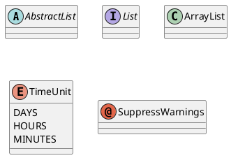

Short forms: `()` for circle, `<>` for diamond.

## Fields and Methods

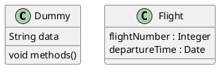

Override parser: `{field}` forces field, `{method}` forces method.

## Visibility Modifiers

| Character | Visibility |
|-----------|-----------|
| `-` | private |
| `#` | protected |
| `~` | package private |
| `+` | public |

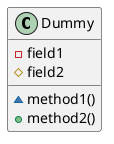

Disable icons: `skinparam classAttributeIconSize 0`

## Static and Abstract Members

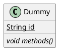

## Separators in Class Body

Use `--`, `..`, `==`, `__` with optional titles.

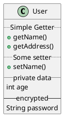

## Generics

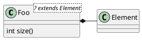

## Relationships

| Type | Symbol | Drawing |
|------|--------|---------|
| Extension (inheritance) | `<\|--` | Solid line, closed triangle |
| Implementation | `<\|..` | Dotted line, closed triangle |
| Composition | `*--` | Solid line, filled diamond |
| Aggregation | `o--` | Solid line, open diamond |
| Association | `-->` | Solid line, open arrow |
| Dependency | `..>` | Dotted line, open arrow |

Additional arrow heads: `#`, `x`, `}`, `+`, `^`

### Horizontal vs Vertical

Double dash `--` = vertical. Single dash `-` = horizontal.

### Labels and Cardinality

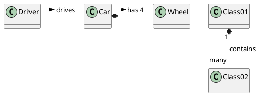

### Direction Control

Use `-left->`, `-right->`, `-up->`, `-down->` (or `-l->`, `-r->`, `-u->`, `-d->`).

## Extends and Implements Keywords

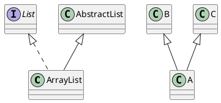

## Stereotypes and Custom Spots

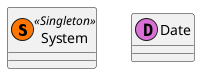

## Packages

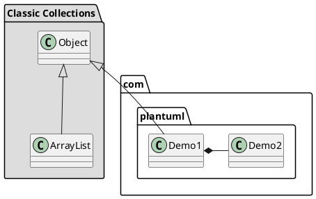

Package styles: `<<Node>>`, `<<Rectangle>>`, `<<Folder>>`, `<<Frame>>`, `<<Cloud>>`, `<<Database>>`

### Namespaces

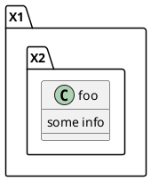

Disable: `set separator none`

## Notes

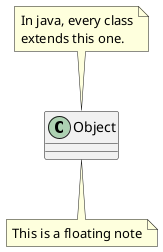

### Notes on Fields and Methods

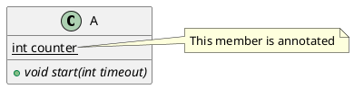

## Additional Resources

For bracketed relationship styles (color, thickness, dashed), association classes, diamond associations, lollipop interfaces, hide/remove members and classes, tagged elements, layout helpers, skinparam customization, and large diagram splitting:
- **`class-diagram-advanced.md`** — Advanced class diagram features and styling
