> Source: https://plantuml.com/er-diagram

# PlantUML Entity-Relationship Diagram Reference

PlantUML supports two ER diagram notations:

1. **Information Engineering (IE) notation** — uses `@startuml`/`@enduml`, based on class diagram engine, best for database schemas
2. **Chen notation** — uses `@startchen`/`@endchen`, classic academic ER style with diamond relationships

---

## Information Engineering (IE) Notation

### Basic Structure

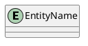

### Entity Declaration with Attributes

Use `*` to mark mandatory attributes. Separate the primary key section from other attributes with `--`.

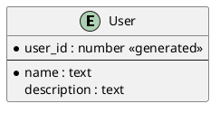

### Attribute Markers

| Marker | Meaning |
|--------|---------|
| `*` | Mandatory attribute |
| `<<generated>>` | Auto-generated value |
| `<<FK>>` | Foreign key |

Bold formatting is supported in attributes. Add a space after `*` before bold to avoid conflicts with creole markup:

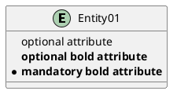

### Relationship Cardinality Symbols

Cardinality is expressed with symbols on each end of the relationship line:

| Symbol | Meaning |
|--------|---------|
| `\|\|` | Exactly one |
| `\|o` | Zero or one |
| `}o` | Zero or many |
| `}\|` | One or many |

The reverse direction mirrors the symbols:

| Symbol | Meaning |
|--------|---------|
| `\|\|` | Exactly one |
| `o\|` | Zero or one |
| `o{` | Zero or many |
| `\|{` | One or many |

### Relationship Line Styles

| Syntax | Style |
|--------|-------|
| `--` | Solid line |
| `..` | Dashed line |

### Relationship Examples

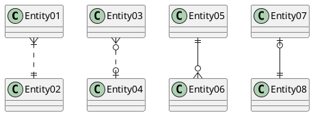

Reading the above:
- `Entity01 }|..|| Entity02` — Entity01 is one-or-many to exactly-one Entity02 (dashed)
- `Entity03 }o..o| Entity04` — Entity03 is zero-or-many to zero-or-one Entity04 (dashed)
- `Entity05 ||--o{ Entity06` — Entity05 is exactly-one to zero-or-many Entity06 (solid)
- `Entity07 |o--|| Entity08` — Entity07 is zero-or-one to exactly-one Entity08 (solid)

### Entity Aliases

Use `"Display Name" as alias` to give entities readable names:

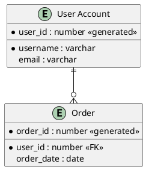

### Orthogonal Line Routing

Use `skinparam linetype ortho` to draw right-angle lines instead of diagonal ones. This avoids rendering issues with angled crow's feet:

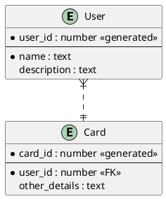

### Hiding the Circle/Spot

By default, entities display a colored circle. Hide it with:

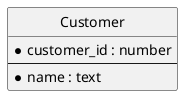

### Complete IE Example

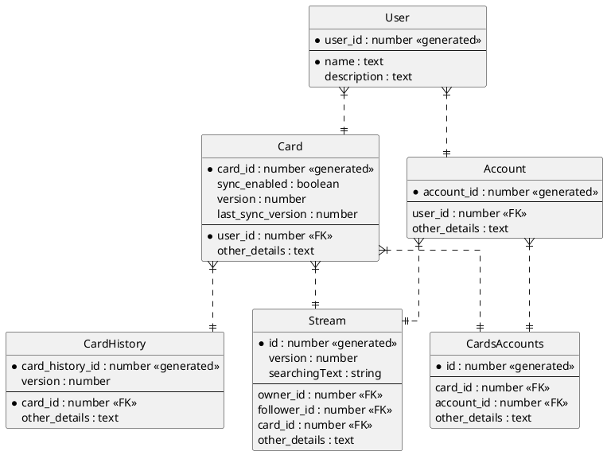

---

## Chen Notation

### Basic Structure

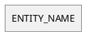

### Entity with Attributes

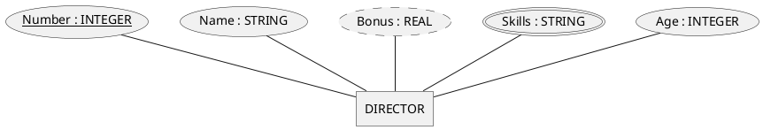

### Attribute Markers

| Marker | Meaning |
|--------|---------|
| `<<key>>` | Primary key (unique identifier) |
| `<<derived>>` | Computed/derived attribute |
| `<<multi>>` | Multi-valued attribute |

### Composite Attributes

Nest attributes using braces:

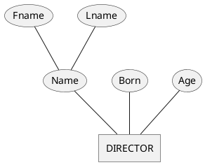

### Relationship Declaration

Relationships are first-class elements (diamonds) that can have their own attributes:

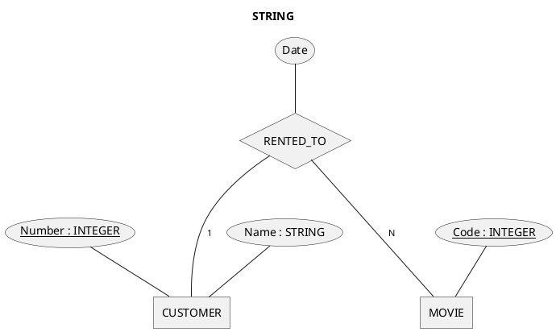

### Cardinality Notation

**Simple cardinality:**

| Syntax | Meaning |
|--------|---------|
| `-1-` | Optional one (partial participation) |
| `-N-` | Optional many |
| `=1=` | Mandatory one (total participation, thick line) |
| `=N=` | Mandatory many |

**Range cardinality:**

| Syntax | Meaning |
|--------|---------|
| `-(0,1)-` | Zero or one |
| `-(1,1)-` | Exactly one |
| `-(0,N)-` | Zero or many |
| `-(1,N)-` | One or many |
| `-(N,M)-` | Many-to-many range |

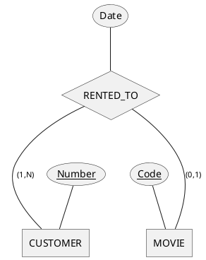

### Weak Entities and Identifying Relationships

Mark entities as `<<weak>>` and relationships as `<<identifying>>`:

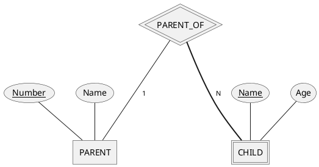

### Generalization / Specialization

Use `->-` for subclass-to-superclass generalization:

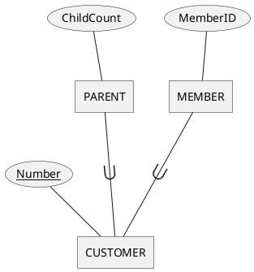

### Specialization Groups

**Disjoint specialization** (entity belongs to at most one subclass):

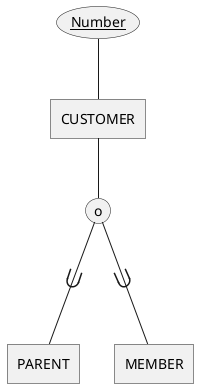

**Overlapping specialization** (entity can belong to multiple subclasses):

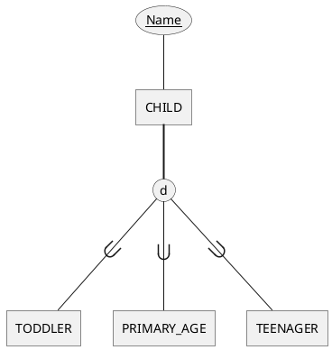

**Union type / Category:**

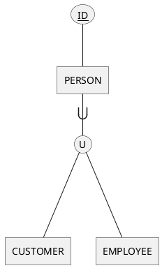

| Symbol | Meaning |
|--------|---------|
| `o` | Disjoint constraint |
| `d` | Disjoint constraint (alternative) |
| `U` | Union type / category |

### Aliases for Readable Names

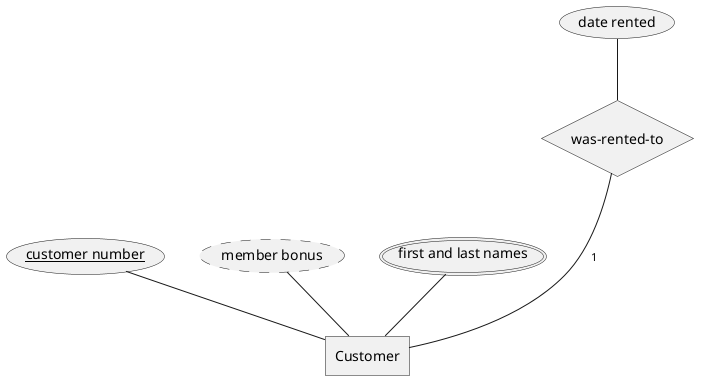

### Layout Direction

Control diagram direction with:

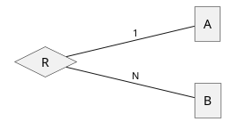

Options: `top to bottom direction` (default), `left to right direction`

### Styling with CSS-like Syntax

Apply colors and fonts using `<style>` blocks:

```plantuml
@startchen
<style>
.red {
  BackGroundColor Red
  FontColor White
}
.blue {
  BackGroundColor Blue
  FontColor White
}
</style>

entity "Director" as DIRECTOR {
  Died <<red>>
  Age <<blue>>
  Name
}
@endchen
```
