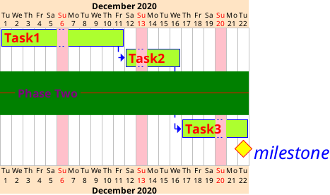
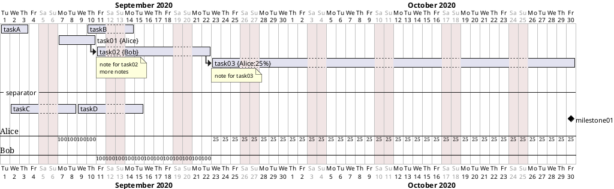

# Gantt Diagram — Advanced Reference

> Source: https://plantuml.com/gantt-diagram

## Display on Same Row

```plantuml
@startgantt
Project starts 2020-09-01
[taskA] starts 2020-09-01 and requires 3 days
[taskB] starts 2020-09-10 and requires 3 days
[taskB] displays on same row as [taskA]
@endgantt
```

## Comprehensive Style Definition

### Hidden Timeline Style

```plantuml
@startgantt
<style>
ganttDiagram {
  timeline {
    LineColor transparent
    FontColor transparent
  }
}
</style>
hide footbox
[Test prototype] requires 7 days
[Prototype completed] happens at [Test prototype]'s end
then [Setup assembly line] requires 12 days
@endgantt
```

## Full Complex Example

