> Source: https://plantuml.com/gantt-diagram

# PlantUML Gantt Diagram Reference

## Declaring Tasks

Tasks are defined using square brackets. Use `requires`, `lasts`, or start/end dates.

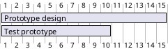

## Task Start and End Dates

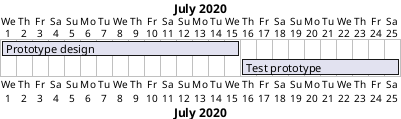

### Relative Start Date

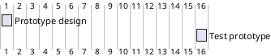

## Short Names (Aliases)

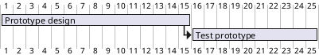

## Task Dependencies

### Using `starts at ... end`

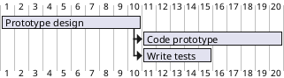

### Using `then` Keyword

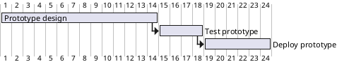

### Using Arrow Notation

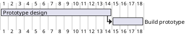

### Delayed Constraints

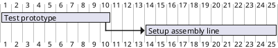

## Task Completion Status

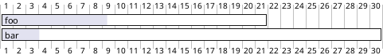

### Percentage and Styling

```plantuml
@startgantt
<style>
ganttDiagram {
  task {
    BackGroundColor GreenYellow
    LineColor Green
    unstarted {
      BackGroundColor Fuchsia
      LineColor FireBrick
    }
  }
  undone {
    BackGroundColor red
  }
}
</style>
[foo] lasts 21 days
[foo] is 40% completed
[bar] requires 30 days and is 10% complete
@endgantt
```

## Milestones

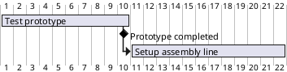

### Milestone at Fixed Date

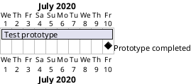

### Milestone Linked to Multiple Tasks

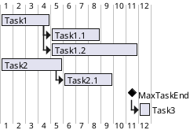

## Task Coloring

```plantuml
@startgantt
[Prototype design] requires 13 days
[Prototype design] is colored in Fuchsia/FireBrick
[Test prototype] requires 4 days
[Test prototype] is colored in GreenYellow/Green
[Test prototype] starts at [Prototype design]'s end
@endgantt
```

## Closed Days (Non-Working Days)

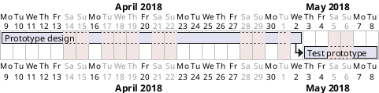

Re-open with: `2020-07-13 is open`

## Working Days and Delays

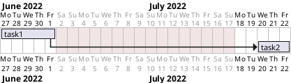

## Coloring Specific Days

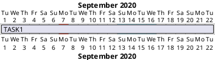

## Resource Management

### Assigning Tasks to Resources

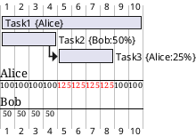

### Multiple Resources Per Task

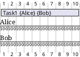

### Resource Time Off

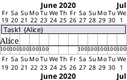

### Hide Resources

`hide resources names`, `hide resources footbox`

## Title, Header, Footer, Hide Footbox

```plantuml
@startgantt
header My Header
footer My Footer
title My Gantt Diagram
hide footbox

[Task1] requires 10 days
then [Task2] requires 4 days
@endgantt
```

## Scale Configuration (Print Scale)

Options: `daily` (default), `weekly`, `monthly`, `quarterly`, `yearly`

```plantuml
@startgantt
printscale weekly
Project starts the 20th of september 2020
[Prototype design] as [TASK1] requires 130 days
[Testing] requires 20 days
[TASK1] -> [Testing]
@endgantt
```

### Zoom

Combine `zoom` with any scale to magnify.

```plantuml
@startgantt
printscale weekly
zoom 4
Project starts the 1st of january 2021
[Prototype design end] as [TASK1] requires 19 days
[Testing] requires 14 days
[TASK1] -> [Testing]
@endgantt
```

## Print Between (Date Range Filtering)

```plantuml
@startgantt
Print between 2021-01-12 and 2021-01-22
Project starts the 1st of january 2021
[Prototype design end] as [TASK1] requires 8 days
[Testing] requires 3 days
[TASK1] -> [Testing]
@endgantt
```

## Week Numbering in Headers

Options: `with week numbering from N`, `with calendar date`

```plantuml
@startgantt
printscale weekly with week numbering from 1
Project starts the 6th of July 2020
[Task1] on {Alice} requires 2 weeks
[Task2] on {Bob:50%} requires 2 weeks
@endgantt
```

### Custom Week Start Day

```plantuml
@startgantt
printscale weekly
weeks starts on Sunday and must have at least 4 days
friday are closed
saturday are closed
Project starts the 1st of january 2025
[Prototype design end] as [TASK1] requires 19 days
[Testing] requires 14 days
[TASK1] -> [Testing]
@endgantt
```

## Language

Set day/month names: `language en`, `language ko`, `language ja`, etc.

## Comments

Single-line: `' comment`
Multi-line: `/' comment '/`

## Separators

### Horizontal (Phase Dividers)

```plantuml
@startgantt
[Task1] requires 10 days
then [Task2] requires 4 days
-- Phase Two --
then [Task3] requires 5 days
then [Task4] requires 6 days
@endgantt
```

### Vertical

```plantuml
@startgantt
[task1] requires 1 week
[task2] starts 20 days after [task1]'s end and requires 3 days
Separator just at [task1]'s end
Separator just 2 days after [task1]'s end
@endgantt
```

## Notes

```plantuml
@startgantt
[task01] requires 15 days
note bottom
  memo1 ...
  memo2 ...
end note
[task01] -> [task02]
@endgantt
```

## Today Indicator

```plantuml
@startgantt
Project starts 2020-07-01
saturday are closed
sunday are closed
today is 2020-07-10
today is colored in #AAF
[Prototype design] requires 15 days
@endgantt
```

## Additional Resources

For same-row display, comprehensive `<style>` theming, and a full complex example:
- **`gantt-diagram-advanced.md`** — Less-common Gantt layout and styling patterns
