> Source: https://plantuml.com/mindmap-diagram

# PlantUML MindMap Diagram Reference

## OrgMode Syntax

The default syntax uses `*` characters to denote hierarchy depth. One `*` is the root, two `**` is the first level, and so on.

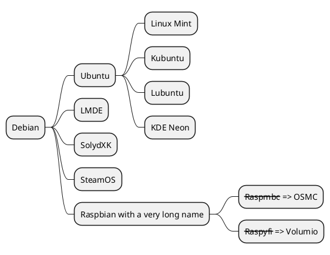

## Markdown Syntax (Header Notation)

Use `#` characters as an alternative to `*` for defining hierarchy levels.

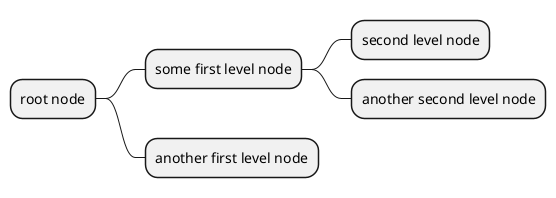

## Markdown Syntax (Indented List)

Use `*` with tab indentation to define parent-child relationships.


## Arithmetic Notation (Left and Right Sides)

Use `+` for right-side branches and `-` for left-side branches. This allows explicit control over which side of the root a branch appears on.

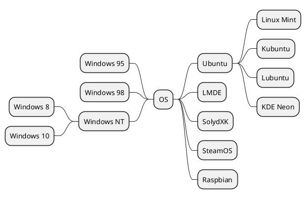

## Multiline Nodes

Use `:` and `;` delimiters to create nodes with multiline content. This supports formatted text and embedded code blocks.

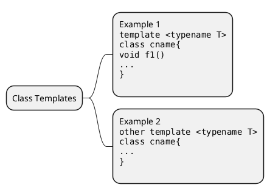

Multiline also works with arithmetic notation:

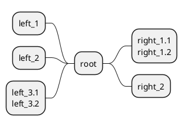

## Multiroot Mindmap

You can create multiple root nodes by repeating `*` at the top level.

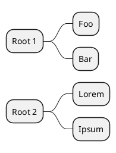

## Inline Colors (OrgMode Syntax)

Apply colors directly to nodes using `[#color]` after the level markers.

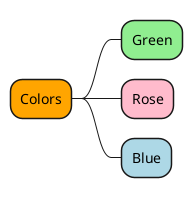

## Inline Colors (Arithmetic Notation)

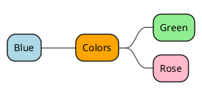

## Inline Colors (Markdown Syntax)

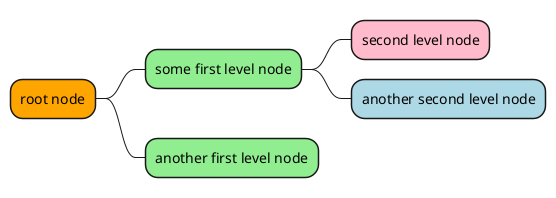

## Style-Based Colors (OrgMode Syntax)

Define named styles with `<<styleName>>` and configure them in a `<style>` block.

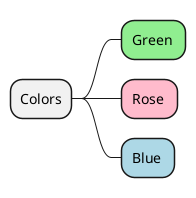

## Style-Based Colors (Arithmetic Notation)

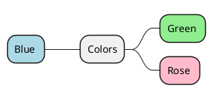

## Style-Based Colors (Markdown Syntax)

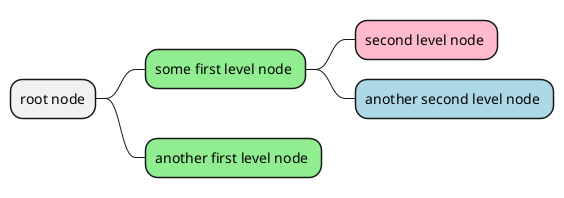

## Applying Style to Entire Branch

Use `.styleName *` in the style block to apply a style to a node and all its descendants.

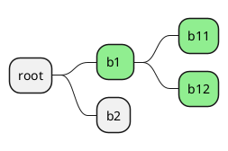

## Removing Boxes (Boxless Nodes)

Append `_` to the level markers to remove the box around a node, displaying only text.

**Boxless on leaf nodes:**

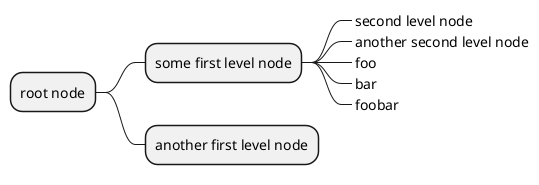

**Boxless on all nodes:**

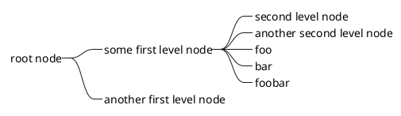

**Boxless with arithmetic notation:**

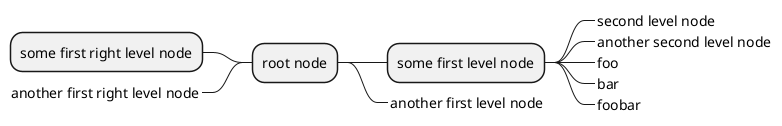

## Changing Sides with OrgMode Syntax

Use the `left side` separator to place subsequent branches on the left side of the root.

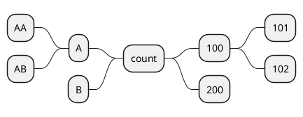

## Diagram Direction

### Left to Right (Default)

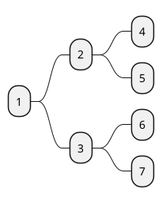

### Top to Bottom

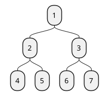

### Right to Left

```plantuml
@startmindmap
right to left direction
* 1
** 2
*** 4
*** 5
** 3
*** 6
*** 7
@endmindmap
```

### Bottom to Top

Combine `top to bottom direction` with `left side` to achieve bottom-to-top layout.

```plantuml
@startmindmap
top to bottom direction
left side
* 1
** 2
*** 4
*** 5
** 3
*** 6
*** 7
@endmindmap
```

## Styling Nodes by Depth

Use `:depth(n)` selectors in the `<style>` block to target nodes at specific hierarchy levels.

```plantuml
@startmindmap
<style>
mindmapDiagram {
    node {
        BackgroundColor lightGreen
    }
    :depth(1) {
      BackGroundColor white
    }
}
</style>
* Linux
** NixOS
** Debian
*** Ubuntu
**** Linux Mint
**** Kubuntu
**** Lubuntu
**** KDE Neon
@endmindmap
```

## Styling Boxless Nodes

Use the `boxless` selector in the `<style>` block to style nodes that have boxes removed.

```plantuml
@startmindmap
<style>
mindmapDiagram {
  node {
    BackgroundColor lightGreen
  }
  boxless {
    FontColor darkgreen
  }
}
</style>
* Linux
** NixOS
** Debian
***_ Ubuntu
**** Linux Mint
**** Kubuntu
**** Lubuntu
**** KDE Neon
@endmindmap
```

## Word Wrap and Advanced Styling

Use `MaximumWidth` (in pixels) to enable automatic word wrapping. The `<style>` block supports `node`, `rootNode`, `leafNode`, and `arrow` selectors with properties like `Padding`, `Margin`, `LineColor`, `LineThickness`, `BackgroundColor`, `RoundCorner`, `Shadowing`, `LineStyle`, and `HorizontalAlignment`.

```plantuml
@startmindmap
<style>
node {
  Padding 12
  Margin 3
  HorizontalAlignment center
  LineColor blue
  LineThickness 3.0
  BackgroundColor gold
  RoundCorner 40
  MaximumWidth 100
}

rootNode {
  LineStyle 8.0;3.0
  LineColor red
  BackgroundColor white
  LineThickness 1.0
  RoundCorner 0
  Shadowing 0.0
}

leafNode {
  LineColor gold
  RoundCorner 0
  Padding 3
}

arrow {
  LineStyle 4
  LineThickness 0.5
  LineColor green
}
</style>

* Hi =)
** sometimes i have node in wich i want to write a long text
*** this results in really huge diagram
**** of course, i can explicit split with a\nnew line
**** but it could be cool if PlantUML was able to split long lines, maybe with an option
@endmindmap
```

## Creole Formatting on MindMap Nodes

MindMap nodes support Creole markup for rich text formatting including bold, italics, monospaced, strikethrough, underline, wave-underline, colors, icons, images, horizontal lines, and nested lists.

```plantuml
@startmindmap
* Creole on Mindmap
left side
**:==Creole
This is **bold**
This is //italics//
This is ""monospaced""
This is --stricken-out--
This is __underlined__
This is ~~wave-underlined~~
-- test Unicode and icons--
This is <U+221E> long
This is a <&code> icon
Use image : 
;
**: <b>HTML Creole
This is <b>bold</b>
This is <i>italics</i>
This is <font:monospaced>monospaced</font>
This is <s>stroked</s>
This is <u>underlined</u>
This is <w>waved</w>
This is <s:green>stroked</s>
This is <u:red>underlined</u>
This is <w:#0000FF>waved</w>
-- other examples --
This is <color:blue>Blue</color>
This is <back:orange>Orange background</back>
This is <size:20>big</size>
;
right side
**:==Creole line
You can have horizontal line
----
Or double line
====
Or strong line
____
Or dotted line
..My title..
Or dotted title
//and title... //
==Title==
Or double-line title
--Another title--
Or single-line title
Enjoy!;
**:==Creole list item
**test list 1**
* Bullet list
* Second item
** Sub item
*** Sub sub item
* Third item
----
**test list 2**
# Numbered list
# Second item
## Sub item
## Another sub item
# Third item
;
@endmindmap
```

## Complete Example with Title, Header, Footer, Caption, and Legend

```plantuml
@startmindmap
caption figure 1
title My super title

* <&flag>Debian
** <&globe>Ubuntu
*** Linux Mint
*** Kubuntu
*** Lubuntu
*** KDE Neon
** <&graph>LMDE
** <&pulse>SolydXK
** <&people>SteamOS
** <&star>Raspbian with a very long name
*** <s>Raspmbc</s> => OSMC
*** <s>Raspyfi</s> => Volumio

header
My super header
endheader

center footer My super footer

legend right
  Short
  legend
endlegend
@endmindmap
```
