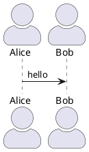
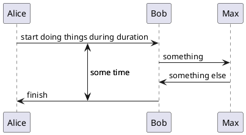
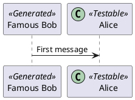
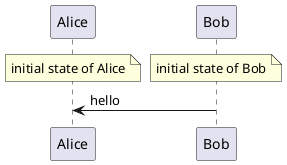
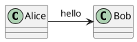
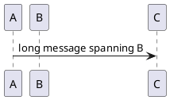
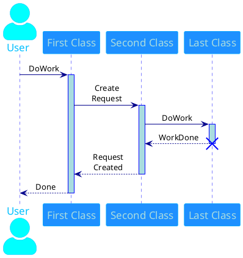
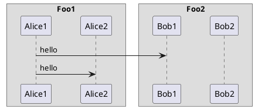

# Sequence Diagram — Advanced Reference

> Source: https://plantuml.com/sequence-diagram

## Actor Style

Change with `skinparam actorStyle`: `stick` (default), `awesome`, `Hollow`.



## Anchors and Duration (Teoz)

Use `!pragma teoz true` to enable. Use `{name}` for anchors and `<->` for duration arrows.



## Stereotypes and Custom Spots



Remove guillemets: `skinparam guillemet false`
Position: `skinparam stereotypePosition bottom`

## Aligned Notes (Same Level)

Use `/` prefix to place notes at the same level.



## Removing Participants

Use `hide`, `show`, or `remove` to control visibility.



## Partition (Teoz Full-Width Grouping)

```plantuml
@startuml
!pragma teoz true

partition p1
    b -> c : msg
end

partition p2
    a -> b : msg
end
@enduml
```

## Message Span (Teoz)



## Common Skinparam Settings



### Padding


