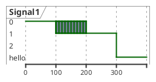
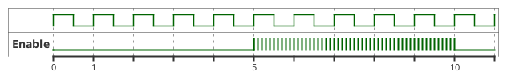
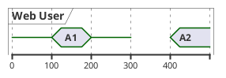
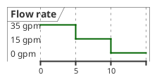
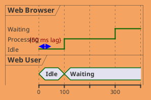
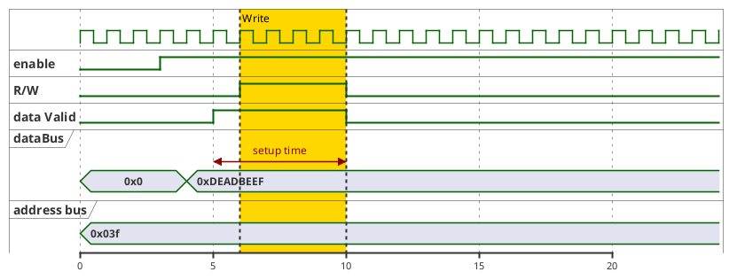
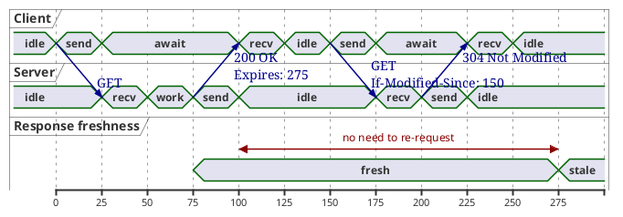

# Timing Diagram — Advanced Reference

> Source: https://plantuml.com/timing-diagram

## Intricated (Undefined) Robust States

Show uncertain or transitional states by listing multiple values in braces `{a,b}`.



## Intricated Binary States



## Hidden States

Use `{-}` for a break in the signal and `{hidden}` to completely hide a section.



## Ordering Robust Signal States

Use `has` to declare and order states. Optional labels with `as`.



## Compact Mode

Global: `mode compact`
Per-participant: `compact robust "Name" as alias`

## Styling with `<style>`



## Stereotypes for Per-Signal Styling

```plantuml
@startuml
<style>
timingDiagram {
  .red {
    LineColor red
  }
  .blue {
    LineColor blue
    LineThickness 5
  }
}
</style>

<<blue>> binary "Output Signal 1" as OS1
<<red>> binary "Input Signal 1" as IS1

@0
OS1 is low
IS1 is low

@5
OS1 is high
IS1 is high

@10
OS1 is low
IS1 is low
@enduml
```

## Complete Digital Hardware Example



## Complete Web Caching Example


