> Source: https://plantuml.com/timing-diagram

# PlantUML Timing Diagram Reference

## Participant Types

| Type | Description |
|------|-------------|
| `robust` | Complex line signal with multiple named states |
| `concise` | Simplified signal for data movement |
| `rectangle` | Similar to concise but within a rectangle |
| `clock` | Repeating transitions with period, pulse, offset |
| `binary` | Exactly 2 states: `high`/`low` or `0`/`1` |
| `analog` | Continuous signals with linear interpolation |

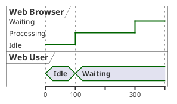

## Binary and Clock Signals

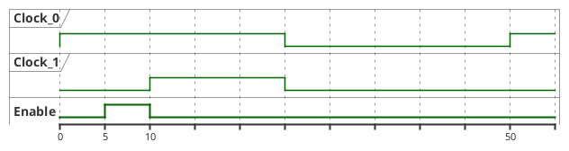

## State Changes Using @ Notation

Use `@<time>` for absolute time, `@+<offset>` for relative time.

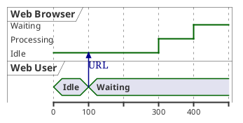

## Date and Time Format Usage

### Date Format

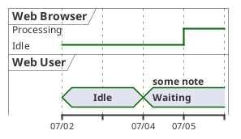

### Time Format (HH:MM:SS)

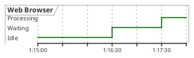

### Custom Date Format

```plantuml
@startuml
use date format "YY-MM-dd"

robust "Web Browser" as WB

@19-07-02
WB is Idle

@19-07-04
WB is Waiting

@19-07-05
WB is Processing
@enduml
```

## Participant-Oriented Definition

Define all transitions for a single participant on one line.

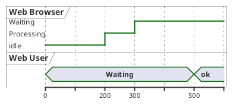

## Anchor Points

Name specific times for reuse with `as :label`.

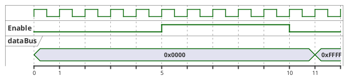

## Decimal and Negative Time Values

Time values can be decimal (`@5.5`) or negative (`@-200`).

## Defining States by Clock Reference

Use `@<clock>*<tick>` to reference clock ticks.

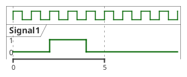

## Analog Signals

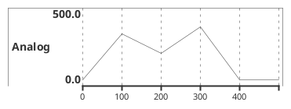

## Analog Signal Range and Customization

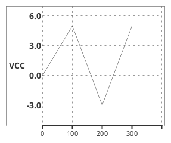

## Messages Between Participants

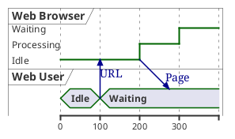

## Time Constraints and Delays

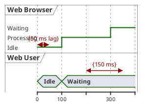

## Highlighted Periods

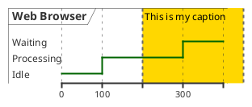

## Notes

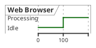

## Adding Colors to States

Append a color code after the state value.

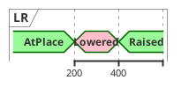

## Initial State and Scale

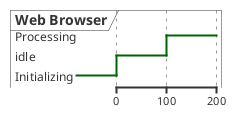

## Time Axis Control

- `manual time-axis` — labels only at state-change points
- `hide time-axis` — completely remove axis

## Title, Header, Footer, Legend, Caption

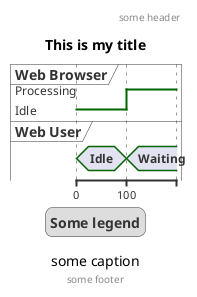

## Additional Resources

For intricated/hidden states, state ordering with `has`, compact mode, `<style>` blocks, stereotypes, and complete examples:
- **`timing-diagram-advanced.md`** — Less-common timing diagram features and styling
