> Source: https://plantuml.com/use-case-diagram

# PlantUML Use Case Diagram Reference

## Defining Use Cases

Use cases are enclosed in parentheses. You can also use the `usecase` keyword. An alias can be assigned with the `as` keyword. Newlines can be inserted with `\n`.

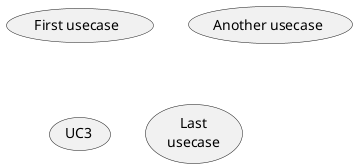

## Defining Actors

Actors are enclosed in colons. You can also use the `actor` keyword. An alias can be assigned with the `as` keyword.

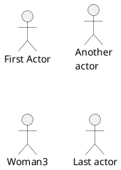

## Actor Styles

You can change the actor rendering style using `skinparam actorStyle`.

**Default (stick man):**

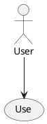

**Awesome man:**

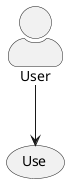

**Hollow man:**

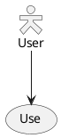

## Basic Use Case Example

Connect actors to use cases with arrows. Use `-->` for vertical arrows and `->` for horizontal arrows. You can add labels with `:`.

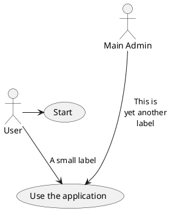

## Use Case Descriptions (Multiline)

You can define multi-line descriptions using the `as` keyword with double quotes. Separators like `--`, `==`, `..`, and `__` can be used inside descriptions.

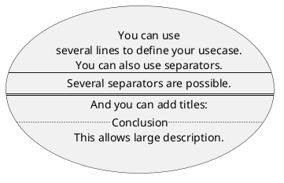

## Arrows and Connections

### Basic Arrows

The number of dashes controls arrow length. More dashes means a longer arrow.

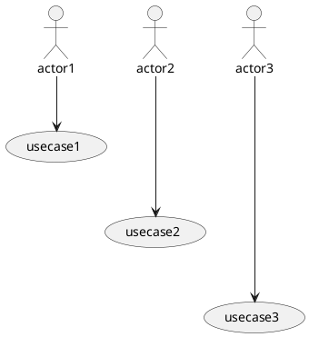

### Arrow Directions

You can use `-left->`, `-right->`, `-up->`, and `-down->` to control direction. Shortened forms like `-l->`, `-r->`, `-u->`, `-d->` also work.

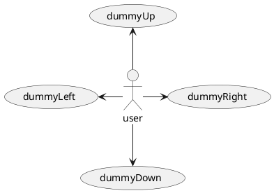

### Include and Extend Relationships

Use dotted arrows (`.>`) with labels for include and extend relationships.

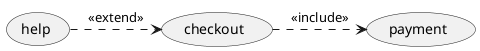

### Inheritance (Generalization)

Use `<|--` for inheritance between actors or use cases.

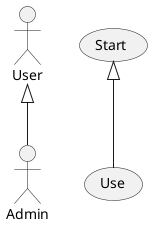

### Reversed Arrows

Arrows can be reversed.

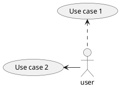

## Grouping with Packages and Rectangles

### Package

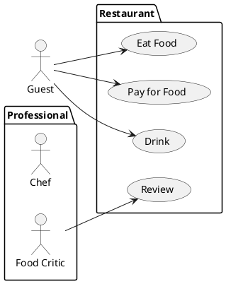

### Rectangle

Use `rectangle` to define a system boundary.

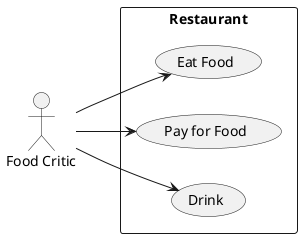

## Notes

Add notes to elements with `note left of`, `note right of`, `note top of`, or `note bottom of`. You can also create floating notes.

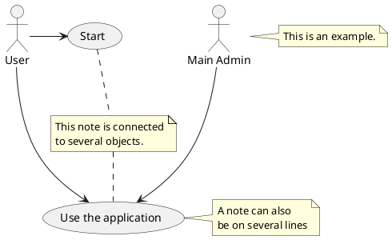

## Stereotypes

Add stereotypes with `<< >>` after the element name.

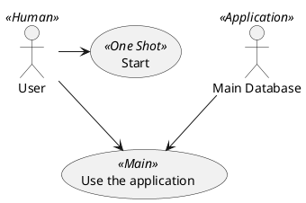

## Diagram Direction

### Left to Right Direction

By default, diagrams flow top to bottom. Use `left to right direction` to change the layout.

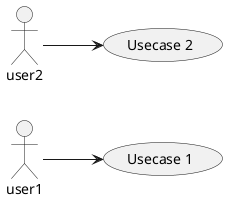

### Top to Bottom (Default)

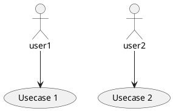

## Inline Colors and Styles

### Element Colors

You can set background color, line color, line style, and text color directly on elements.

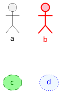

### Arrow Colors and Styles

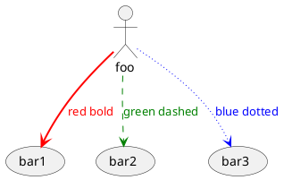

## Skinparam Customization

Use `skinparam` to globally configure colors, fonts, and styles.

```plantuml
@startuml
skinparam handwritten true

skinparam usecase {
  BackgroundColor DarkSeaGreen
  BorderColor DarkSlateGray
  BackgroundColor<< Main >> YellowGreen
  ArrowColor Olive
  ActorBorderColor black
  ActorFontName Courier
  ActorBackgroundColor<< Human >> Gold
}

User << Human >>
:Main Database: as MySql << Application >>
(Start) << One Shot >>
(Use the application) as (Use) << Main >>

User -> (Start)
User --> (Use)
MySql --> (Use)
@enduml
```

## Business Use Cases and Business Actors

Add a `/` suffix to create business variants of use cases and actors.

```plantuml
@startuml
(First usecase)/
:First Actor:/

actor/ Woman3
usecase/ UC3
@enduml
```

## Splitting Diagrams Across Pages

Use `newpage` to split a diagram into multiple pages.

```plantuml
@startuml
:actor1: --> (Usecase1)
newpage
:actor2: --> (Usecase2)
@enduml
```

## Title, Header, Footer, Legend

```plantuml
@startuml
title My Use Case Diagram
header Page Header
footer Page %page% of %lastpage%

legend right
  Short description
endlegend

:actor1: --> (usecase1)
:actor2: --> (usecase2)
@enduml
```

## Complete Example

A comprehensive example combining multiple features.

```plantuml
@startuml
left to right direction
skinparam packageStyle rectangle

actor customer
actor clerk

rectangle checkout {
  customer -- (checkout)
  (checkout) .> (payment) : <<include>>
  (help) .> (checkout) : <<extend>>
  (checkout) -- clerk
}
@enduml
```

## Mixing with JSON/YAML (allowmixing)

You can embed JSON or YAML data alongside use case elements.

```plantuml
@startuml
allowmixing

actor Actor
usecase Usecase

json JSON {
  "fruit":"Apple",
  "size":"Large",
  "color": ["Red", "Green"]
}
@enduml
```
