> Source: https://plantuml.com/wbs-diagram

# PlantUML WBS Diagram Reference

## OrgMode Syntax

WBS diagrams use `@startwbs` and `@endwbs`. The primary syntax uses asterisks (`*`) where each level of depth adds another `*`.

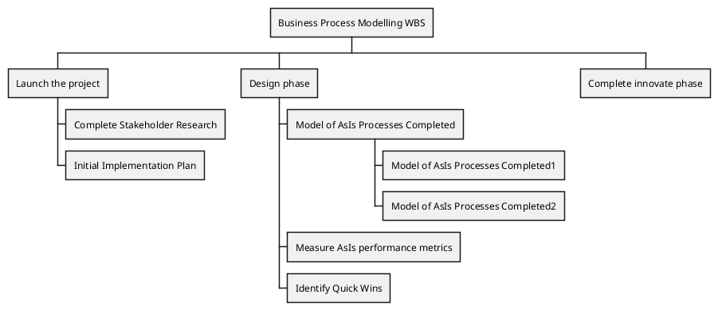

## Change Direction

By default, child nodes alternate left and right. Use `<` after the asterisks to force a node to the left side, or `>` to force it to the right side.

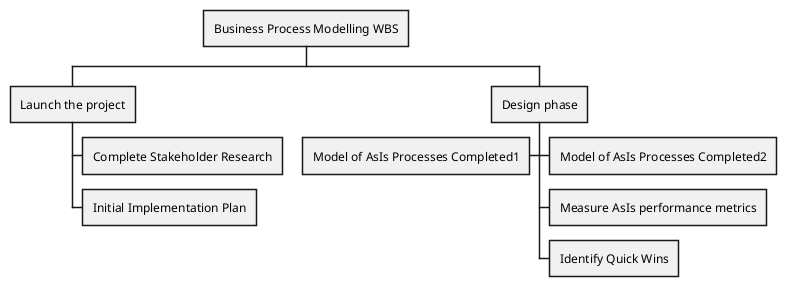

## Arithmetic Notation

An alternative syntax uses `+` for right-side nodes and `-` for left-side nodes. Each additional `+` or `-` increases the depth level.

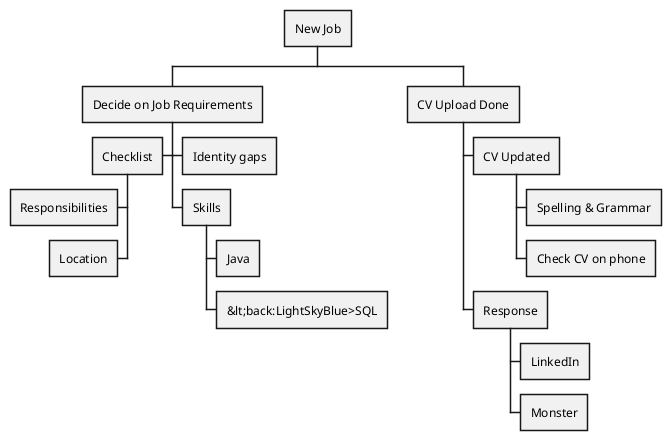

## Multiline Nodes

Use `:` to start multiline content and `;` to end it. This allows longer text within a single box.

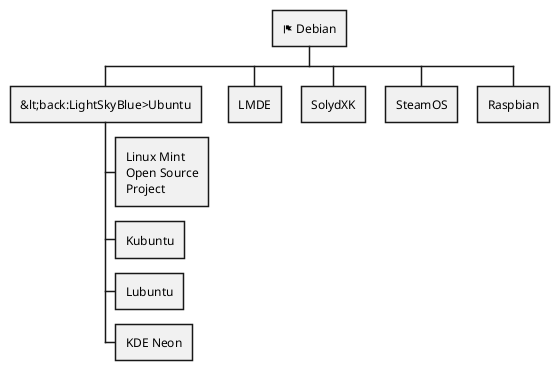

## Removing Boxes

Append `_` after the asterisks (OrgMode) or `+`/`-` (arithmetic) to remove the box around a node, rendering it as plain text.

**Selective boxless nodes (OrgMode):**

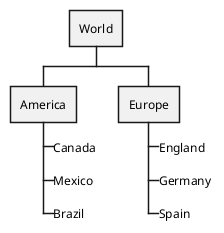

**All boxless nodes:**

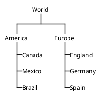

**Selective boxless nodes (arithmetic notation):**

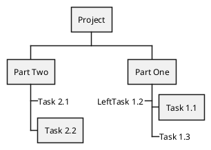

## Colors with Inline Notation

Apply background colors directly to nodes using `[#Color]` after the asterisks or `+`/`-`.

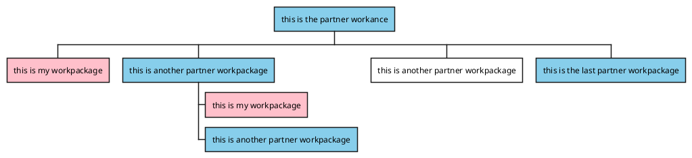

## Colors with Style

Use the `<style>` block with stereotypes (`<<stylename>>`) for reusable color definitions.

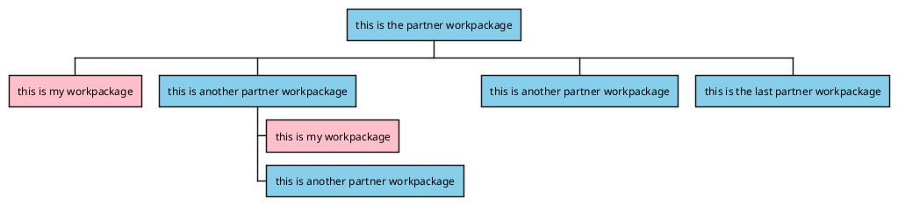

## Advanced Styling

Use the `<style>` block to control line colors, arrow colors, border styles, round corners, fonts, and depth-specific styles.

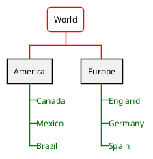

### Available Style Properties

- `BackgroundColor` -- node background color
- `RoundCorner` -- corner radius for rounded boxes
- `LineColor` -- border/connector line color
- `LineStyle` -- dash pattern for lines (e.g., `2` for dashed)
- `LineThickness` -- thickness of lines
- `FontColor` -- text color
- `Padding` -- internal padding within nodes
- `HorizontalAlignment` -- text alignment (`left`, `center`, `right`)
- `MaximumWidth` -- maximum width in pixels before wrapping
- `:depth(N)` -- target nodes at a specific depth level
- `arrow` -- style arrows/connectors
- `boxless` -- style boxless nodes specifically

## Word Wrap

Use `MaximumWidth` within the `<style>` block to control automatic text wrapping. The value is in pixels.

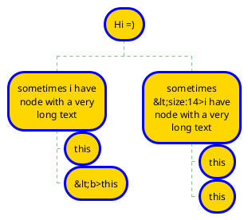

## Arrows Between WBS Elements

Connect nodes using arrows by assigning aliases with `as` or parenthetical notation `(alias)`.

**Using `as` keyword:**

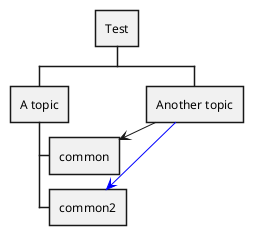

**Using parenthetical aliases:**

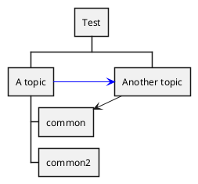

### Arrow Styles

- `->` -- solid arrow
- `-->` -- longer solid arrow
- `..>` -- dotted arrow
- Append `#color` to set arrow color (e.g., `..> c2 #blue`)

## Creole and HTML Formatting

Nodes support Creole markup and inline HTML-like tags for rich text formatting.

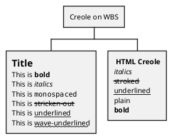

### Supported Creole Markup

- `**bold**` -- bold text
- `//italics//` -- italic text
- `""monospaced""` -- monospaced text
- `--stricken-out--` -- strikethrough text
- `__underlined__` -- underlined text
- `~~wave-underlined~~` -- wavy underlined text
- `= Title` -- heading level within a multiline node

### Supported HTML-like Tags

- `<b>` -- bold
- `<i>` -- italics
- `<s>` -- strikethrough
- `<u>` -- underline
- `<plain>` -- plain text
- `<size:N>` -- font size
- `<back:Color>` -- background color for inline text
