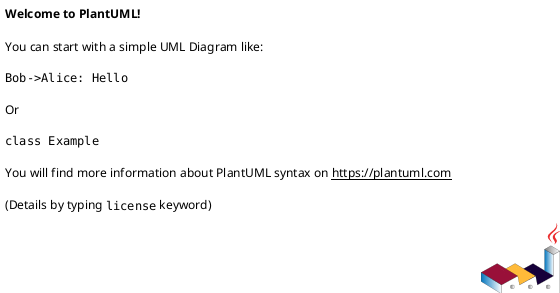

# Create PlantUML Diagram

Create a PlantUML diagram based on `$ARGUMENTS`.

## Output Modes

### 1. Standalone `.puml` File

When the user asks to create/generate a diagram without specifying a target Markdown file:

1. Determine the appropriate diagram type from the user's description
2. Load the corresponding reference skill for syntax guidance
3. Write the diagram to a `.puml` file
4. Validate using the validation script

```bash
bash ${CLAUDE_PLUGIN_ROOT}/scripts/validate.sh <output.puml>
```

### 2. Inject into Markdown

When the user asks to add/insert/inject a diagram into a Markdown file:

1. Read the target Markdown file
2. Create the diagram as a fenced code block:

````markdown

````

3. Insert at the specified location (or append if unspecified)
4. Validate the PlantUML content by extracting it to a temp file:

```bash
bash ${CLAUDE_PLUGIN_ROOT}/scripts/validate.sh /tmp/plantuml_check.puml
```

## Workflow

1. **Identify diagram type** from user description (sequence, class, activity, etc.)
2. **Consult reference** — read the matching diagram skill's SKILL.md for correct syntax
3. **Draft the diagram** using proper PlantUML syntax
4. **Write output** as `.puml` file or Markdown fenced block
5. **Validate** — run the validation script; fix any syntax errors

## Validation

Always validate after writing. Two options available:

- **Local** (preferred): `bash scripts/validate.sh <file.puml>`
- **Online** (fallback): `uv run scripts/validate_online.py <file.puml>`

If validation fails, read the error output, fix the syntax, and re-validate.
