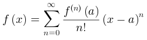
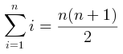
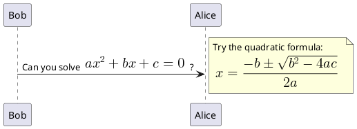

> Sources:
> - https://plantuml.com/creole
> - https://plantuml.com/link
> - https://plantuml.com/ascii-math

# PlantUML Creole Markup and Hyperlinks Reference

PlantUML integrates a Creole engine for standardized styled text across all diagram types. This reference covers text formatting, lists, tables, trees, links, emojis, and icons.

## Text Formatting

| Style | Creole Syntax | HTML Alternative |
|-------|--------------|-----------------|
| **Bold** | `**text**` | `<b>text</b>` |
| *Italic* | `//text//` | `<i>text</i>` |
| `Monospace` | `""text""` | `<font:monospaced>text</font>` |
| ~~Strikethrough~~ | `--text--` | `<s>text</s>` |
| Underline | `__text__` | `<u>text</u>` |
| Wave underline | `~~text~~` | `<w>text</w>` |

### Escape Special Characters

Use tilde `~` to prevent Creole interpretation:

```
~**not bold~**
~//not italic~//
```

### Plain Text

Suppress all formatting inside styled contexts:

```
<plain>No **formatting** here</plain>
```

## Colors and Styling

### Text Color

```
<color:red>red text</color>
<color:#FF8800>orange text</color>
```

### Background Color

```
<back:yellow>highlighted</back>
<back:#AAFFAA>green background</back>
```

### Colored Decorations

```
<s:red>red strikethrough</s>
<u:blue>blue underline</u>
<u:#FF0000>red underline</u>
<w:#0000FF>blue wave underline</w>
```

### Font Size

```
<size:18>large text</size>
<size:10>small text</size>
```

### Subscript and Superscript

```
H<sub>2</sub>O
E = mc<sup>2</sup>
```

## Headings

```
= Extra-large heading
== Large heading
=== Medium heading
==== Small heading
```

## Lists

### Unordered (Bullet)

```
* Item 1
* Item 2
** Sub-item 2a
** Sub-item 2b
*** Deep item
```

### Ordered (Numbered)

```
# First
# Second
## Sub-step 2.1
## Sub-step 2.2
# Third
```

## Horizontal Lines

```
----          ' single line
====          ' double line
____          ' strong line
....          ' dotted line
..Title..     ' dotted with title
--Title--     ' single-line with title
```

## Tables

Use pipe `|` separators. `|=` marks header cells.

```
|= Column 1 |= Column 2 |= Column 3 |
| Cell A1 | Cell A2 | Cell A3 |
| Cell B1 | Cell B2 | Cell B3 |
```

### Table Styling

```
' Row background color
|= Name |= Value |
|<#LightBlue> Server | Production |
|<#LightGreen> Status | Running |

' Cell-level color
| <#yellow>Warning | Check logs |
```

## Tree Notation

Create hierarchical trees with `|_`:

```
|_ Root
  |_ Branch A
    |_ Leaf 1
    |_ Leaf 2
  |_ Branch B
    |_ Leaf 3
```

## Code Blocks

```
<code>
function hello() {
    return "world";
}
</code>
```

## Hyperlinks

### Basic Syntax

```
[[http://example.com]]
[[http://example.com Display Label]]
[[http://example.com{Tooltip text}]]
[[http://example.com{Tooltip} Display Label]]
[[{Tooltip only, no URL}]]
```

### Links on Elements

Apply links to diagram elements:

```plantuml
@startuml
actor User [[http://example.com/users]]
usecase Login [[http://example.com/login{Login flow docs}]]
User -> Login
@enduml
```



### Explicit URL Directive

```plantuml
url of MyClass is [[http://example.com/MyClass]]
```

### URL Prefix

Set a global base URL:

```plantuml
skinparam topurl http://example.com/docs/
```

### Class Diagram Fields/Methods

Use triple brackets for links on members:

```plantuml
class Foo {
  +method() [[[http://example.com/method]]]
}
```

### Link Styling

```plantuml
skinparam hyperlinkColor #0066CC
skinparam hyperlinkUnderline true
```

## Emojis

Use emoji names or Unicode hex codes:

```
<:smile:>
<:thumbsup:>
<:1f600:>
<#green:sunny:>    ' colored emoji
```

1,174+ emojis available from Unicode blocks.

## OpenIconic Icons

Built-in icon set using `<&name>` syntax:

```
<&heart> Favorite
<&folder> Directory
<&people> Team
<&envelope-closed> Email
<&wifi> Network
<&lock-locked> Secure
<&check> Done
<&warning> Alert
<&cloud> Cloud
<&terminal> Console
```

## Images

### Remote Images

```


```

### Local Images

```


```

## Math Formulas

PlantUML supports mathematical notation via AsciiMath and LaTeX (JLatexMath).

### AsciiMath

Use `<math>...</math>` tags:

```
<math>int_0^1 f(x)dx</math>
<math>x^2 + y_1 + z_12^34</math>
<math>d/dx f(x) = lim_(h->0) (f(x+h)-f(x))/h</math>
<math>sum_(i=1)^n i = (n(n+1))/2</math>
```

Standalone AsciiMath diagram:



### LaTeX (JLatexMath)

Use `<latex>...</latex>` tags:

```
<latex>\int_0^1 f(x)dx</latex>
<latex>x^2 + y_1 + z_{12}^{34}</latex>
<latex>\dfrac{d}{dx}f(x) = \lim\limits_{h \to 0} \dfrac{f(x+h)-f(x)}{h}</latex>
```

Standalone LaTeX diagram:



### Embedding in Diagrams



> **Note:** JLatexMath requires separate JAR files (`jlatexmath`, `batik`, etc.) in the PlantUML folder. AsciiMath works without additional dependencies.

## Unicode Characters

```
&#9742;           ' decimal format (☎)
<U+260E>          ' hex format (☎)
∞                 ' direct Unicode character
```

## Applicability

Creole markup and links are supported across **all diagram types**: sequence, class, activity, component, state, object, deployment, use case, timing, network, JSON/YAML, and more. Specific features may vary slightly by diagram type.
