> Source: https://plantuml.com/deployment-diagram

# PlantUML Deployment Diagram Reference

## Declaring Elements

PlantUML deployment diagrams support a wide range of element keywords. Each keyword creates a distinct visual shape.

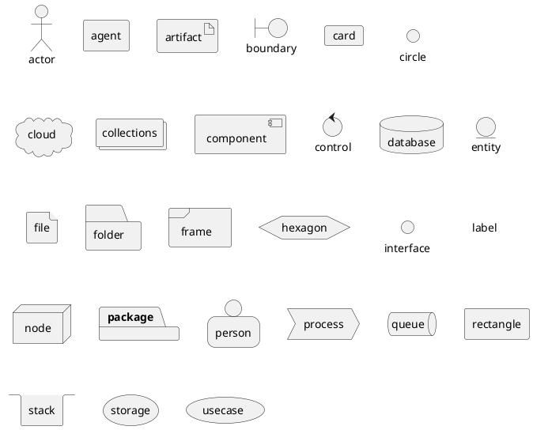

## Short Form Syntax

Several elements have abbreviated notation:

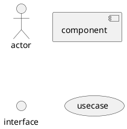

## Aliases

Use the `as` keyword to assign aliases to elements with long names.

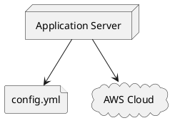

## Long Descriptions with Brackets

Elements support multi-line descriptions using square brackets. You can use separators (`--`, `==`, `..`, `__`) inside descriptions.

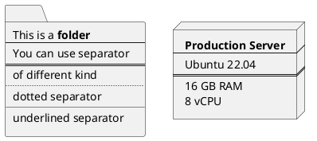

## Linking and Arrows

### Basic Line Styles

Connect elements with different line styles:

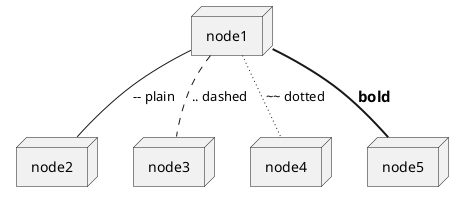

### Arrow Head Types

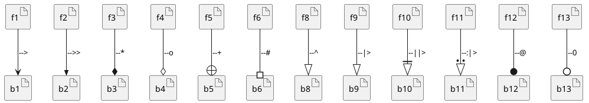

`--\` 형태는 parser-sensitive 해서 복붙 시 `Syntax Error?`를 유발할 수 있으므로 예제에서 제외했습니다.

### Circle Arrows

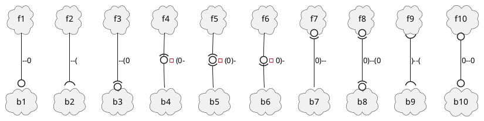

### Arrow Length

Use more dashes to increase arrow length:

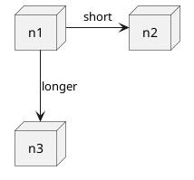

### Arrow Direction

Use `-left->`, `-right->`, `-up->`, `-down->` (or shorthand `-l->`, `-r->`, `-u->`, `-d->`) to control direction.

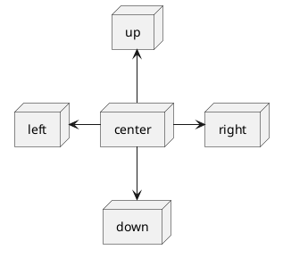

## Bracketed Arrow Styling

### Line Styles

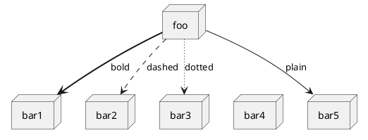

### Line Colors

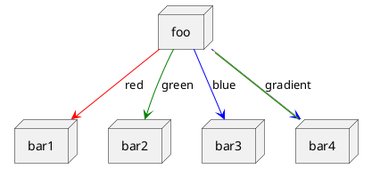

### Line Thickness

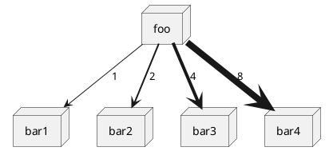

### Mixed Styling

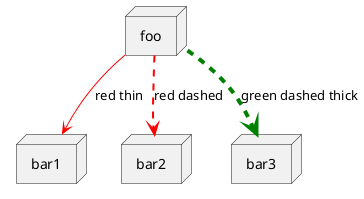

## Inline Arrow Color and Style

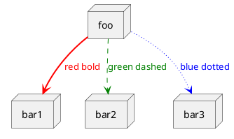

## Inline Element Styling

Change colors and styles directly on individual elements:

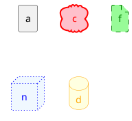

## Nesting Elements

Many elements can contain other elements using curly braces. This is useful for modeling deployment topology.

### Nestable Elements

The following elements support nesting: `artifact`, `card`, `cloud`, `component`, `database`, `file`, `folder`, `frame`, `hexagon`, `node`, `package`, `process`, `queue`, `rectangle`, `stack`, `storage`.

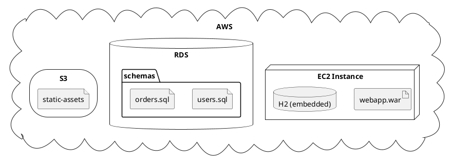

### Multi-Level Nesting

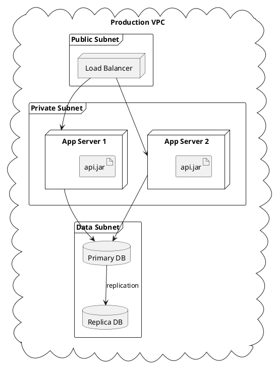

## Ports

Ports define named connection points on nodes. Three keywords are available: `port` (bidirectional), `portin` (input), and `portout` (output).

### Basic Port Usage

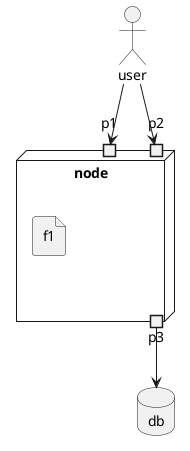

### Input Ports

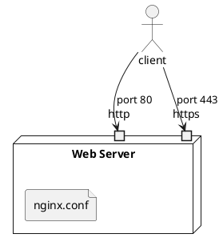

### Output Ports

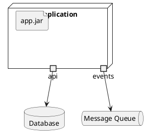

### Mixed Ports

```plantuml
@startuml
node "API Gateway" {
  portin request
  portout upstream
  file "routes.conf"
}

actor client
node "Backend"

client --> request
upstream --> Backend
@enduml
```

## Diagram Direction

### Top to Bottom (Default)

```plantuml
@startuml
top to bottom direction
node "Web Server" as web
node "App Server" as app
database "Database" as db

web --> app
app --> db
@enduml
```

### Left to Right

```plantuml
@startuml
left to right direction
actor user
node "Web Server" as web
node "App Server" as app
database "Database" as db

user --> web
web --> app
app --> db
@enduml
```

## Stereotypes

Add stereotypes with `<< >>` after the element name:

```plantuml
@startuml
node "web01" << Linux >>
node "web02" << Linux >>
node "db01" << Windows >>
database "MySQL" << Primary >>
database "MySQL" << Replica >> as replica

"web01" --> "MySQL"
"web02" --> "MySQL"
"MySQL" --> replica : replication
@enduml
```

## Round Corners

### Per-Stereotype Round Corners

```plantuml
@startuml
skinparam rectangle {
  roundCorner<<Concept>> 25
}

rectangle "Concept Model" <<Concept>> {
  rectangle "Example 1" <<Concept>> as ex1
  rectangle "Example 2" <<Concept>> as ex2
}
@enduml
```

### Global Round Corners

```plantuml
@startuml
skinparam roundCorner 15

actor actor
component component
database database
node node
rectangle rect
@enduml
```

## Notes

```plantuml
@startuml
node "App Server" as app
database "DB" as db

app --> db

note right of app : Runs on port 8080

note left of db
  PostgreSQL 15
  with read replicas
end note

note "Secure connection\nover TLS" as n1
app .. n1
n1 .. db
@enduml
```

## Styling with `<style>` Block

### Global Style

```plantuml
@startuml
<style>
componentDiagram {
  BackGroundColor palegreen
  LineThickness 1
  LineColor red
}
</style>

node "Server"
database "DB"
"Server" --> "DB"
@enduml
```

### Element-Specific Styles

```plantuml
@startuml
<style>
node {
  BackGroundColor #lightblue
  LineColor #336699
  LineThickness 2
  FontColor #333333
}
database {
  BackGroundColor #ffe0b2
  LineColor #e65100
  LineThickness 2
}
artifact {
  BackGroundColor #e8f5e9
  LineColor #2e7d32
}
</style>

node "Web Server" {
  artifact "webapp.war"
}
database "PostgreSQL"

"Web Server" --> "PostgreSQL"
@enduml
```

### Stereotype-Based Styles

```plantuml
@startuml
<style>
.production {
  BackgroundColor #ffebee
  LineColor red
}
.staging {
  BackgroundColor #e3f2fd
  LineColor blue
}
</style>

node "prod-web01" << production >>
node "stg-web01" << staging >>
database "prod-db" << production >>
database "stg-db" << staging >>

"prod-web01" --> "prod-db"
"stg-web01" --> "stg-db"
@enduml
```

## Skinparam Customization

Use `skinparam` to globally configure colors, fonts, and rendering.

```plantuml
@startuml
skinparam node {
  BackgroundColor LightYellow
  BorderColor DarkSlateGray
  FontName Courier
  FontSize 14
}

skinparam database {
  BackgroundColor LightBlue
  BorderColor Navy
}

skinparam artifact {
  BackgroundColor PaleGreen
  BorderColor DarkGreen
}

skinparam ArrowColor DarkSlateGray
skinparam ArrowThickness 2

node "App Server" {
  artifact "myapp.jar"
}
database "MySQL"

"App Server" --> "MySQL"
@enduml
```

### Handwritten Style

```plantuml
@startuml
skinparam handwritten true

node "Server"
database "Database"
"Server" --> "Database"
@enduml
```

## Title, Header, Footer, Legend

```plantuml
@startuml
title Production Deployment Architecture
header Deployment Diagram
footer Page %page% of %lastpage%

legend right
  Production environment
  deployed on AWS
endlegend

cloud "AWS" {
  node "EC2" as ec2
  database "RDS" as rds
}

ec2 --> rds
@enduml
```

## Mixing with Other Diagram Types

Use the `allowmixing` directive to combine deployment elements with other diagram types (class, object, JSON, etc.).

```plantuml
@startuml
allowmixing

component Component
actor Actor
usecase Usecase

json JSON {
  "fruit": "Apple",
  "size": "Large",
  "color": ["Red", "Green"]
}
@enduml
```

## Display JSON Data

```plantuml
@startuml
allowmixing

node "Config Server" as cfg
artifact "app-config" as ac

json "Application Config" {
  "server": {
    "port": 8080,
    "host": "0.0.0.0"
  },
  "database": {
    "url": "jdbc:postgresql://db:5432/mydb",
    "pool_size": 10
  }
}

cfg --> ac
@enduml
```

## Splitting Diagrams Across Pages

Use `newpage` to split a deployment diagram into multiple pages.

```plantuml
@startuml
node "Web Tier" as web
node "App Tier" as app
web --> app

newpage

node "App Tier" as app2
database "Data Tier" as db
app2 --> db
@enduml
```

## Comprehensive Example

A full deployment diagram combining multiple features:

```plantuml
@startuml
left to right direction
title Microservices Deployment Architecture

skinparam node {
  BackgroundColor #f5f5f5
  BorderColor #666666
}
skinparam database {
  BackgroundColor #e3f2fd
  BorderColor #1565c0
}

cloud "Internet" as internet

node "DMZ" {
  node "Nginx" as lb {
    artifact "nginx.conf"
  }
}

frame "Kubernetes Cluster" {
  node "Pod: API Gateway" as gw {
    artifact "gateway.jar"
    portin http
    portout upstream
  }
  node "Pod: User Service" as userSvc {
    artifact "user-svc.jar"
  }
  node "Pod: Order Service" as orderSvc {
    artifact "order-svc.jar"
  }
  queue "Kafka" as mq
}

frame "Data Layer" {
  database "PostgreSQL" as pg << Primary >>
  database "PostgreSQL" as pgr << Replica >>
  database "Redis" as redis
}

internet --> lb
lb --> http
upstream --> userSvc
upstream --> orderSvc

userSvc --> pg
orderSvc --> pg
pg --> pgr : replication
userSvc --> redis : cache
orderSvc --> mq : events
mq --> userSvc : consume
@enduml
```

## Validation

After writing a `.puml` file or a PlantUML fenced block in Markdown, always validate the syntax:

- **Local** (preferred): `bash ${CLAUDE_PLUGIN_ROOT}/scripts/validate.sh <file.puml>`
- **Online** (fallback): `uv run ${CLAUDE_PLUGIN_ROOT}/scripts/validate_online.py <file.puml>`

For PlantUML blocks embedded in Markdown, extract the content to a temporary `.puml` file before validating. If validation fails, read the error output, fix the syntax, and re-validate.
