> Source: https://plantuml.com/gantt-diagram

# PlantUML Gantt Diagram Reference

## Declaring Tasks

Tasks are defined using square brackets. Use `requires`, `lasts`, or start/end dates to define duration.

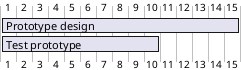

### Using `lasts` Keyword


## Task Start Dates

### Absolute Start Date

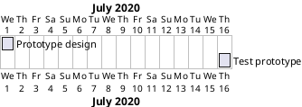

### Relative Start Date (D+ Notation)

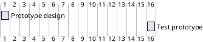

## Task End Dates

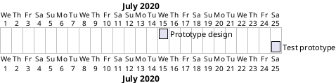

## Combined Start/End and Duration

You can combine start, end, and duration on a single line using `and`.

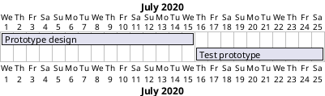

## Short Names (Aliases)

Use `as` to assign a short alias for referencing tasks in constraints.

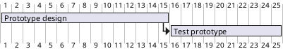

### Multiple Tasks with Same Display Name

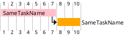

## Task Dependencies and Constraints

### Using `starts at ... end`

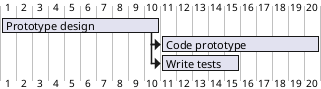

### Using `then` Keyword (Simplified Succession)

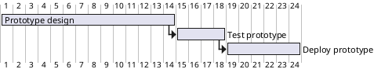

### Using Arrow Notation

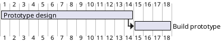

### Delayed Constraints (Gap Between Tasks)

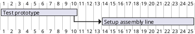

### Constraint Relative to Start

```plantuml
@startgantt
[Prototype design] requires 13 days
and is colored in Lavender/LightBlue
[Test prototype] requires 9 days
and is colored in Coral/Green
and starts 3 days after [Prototype design]'s end
[Write tests] requires 5 days
and ends at [Prototype design]'s end
[Hire tests writers] requires 6 days
and ends at [Write tests]'s start
[Init and write tests report] is colored in Coral/Green
[Init and write tests report] starts 1 day before [Test prototype]'s start and ends at [Test prototype]'s end
@endgantt
```

## Task Completion Status

### Percentage Completion

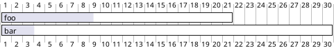

### Styling Completed vs Unstarted Tasks

```plantuml
@startgantt
<style>
ganttDiagram {
  task {
    BackGroundColor GreenYellow
    LineColor Green
    unstarted {
      BackGroundColor Fuchsia
      LineColor FireBrick
    }
  }
}
</style>
[Test prototype 0] requires 4 days
[Test prototype 0] is 0% complete
[Test prototype 20] requires 4 days
[Test prototype 20] is 20% complete
@endgantt
```

### Styling Undone Portion

```plantuml
@startgantt
<style>
ganttDiagram {
  task {
    BackGroundColor GreenYellow
    LineColor Green
  }
  undone {
    BackGroundColor red
  }
}
</style>
[foo] lasts 21 days
[foo] is 40% completed
@endgantt
```

## Milestones

Milestones are zero-duration events. Use the `happens` keyword.

### Milestone at Task End

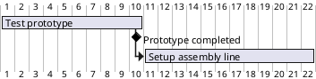

### Milestone at Fixed Date

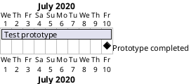

### Milestone Linked to Multiple Tasks

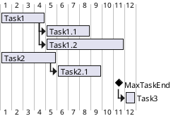

## Hyperlinks

```plantuml
@startgantt
[task1] requires 10 days
[task1] links to [[http://plantuml.com]]
@endgantt
```

## Task Coloring

Specify background/line colors using `is colored in Background/Line` syntax.

```plantuml
@startgantt
[Prototype design] requires 13 days
and is colored in Fuchsia/FireBrick
[Test prototype] requires 4 days
and is colored in GreenYellow/Green
[Test prototype] starts at [Prototype design]'s end
@endgantt
```

## Task Deletion

Use `is deleted` to remove a previously defined task.

```plantuml
@startgantt
[Prototype design] requires 15 days
[Test prototype] requires 10 days
[Test prototype] is deleted
@endgantt
```

## Project Start Date

### Using Natural Language Format

```plantuml
@startgantt
Project starts the 20th of september 2017
[Prototype design] as [TASK1] requires 13 days
[TASK1] is colored in Lavender/LightBlue
@endgantt
```

### Using ISO Date Format

```plantuml
@startgantt
Project starts 2020-07-01
[Prototype design] requires 15 days
@endgantt
```

## Coloring Specific Days

```plantuml
@startgantt
Project starts the 2020/09/01
2020/09/07 is colored in salmon
2020/09/13 to 2020/09/16 are colored in lightblue
[Prototype design] as [TASK1] requires 22 days
[TASK1] is colored in Lavender/LightBlue
@endgantt
```

## Closed Days (Non-Working Days)

### Closing Days of the Week

```plantuml
@startgantt
saturday are closed
sunday are closed
Project starts 2020-07-01
[Prototype design] requires 15 days
[Test prototype] requires 10 days
@endgantt
```

### Closing Specific Dates

```plantuml
@startgantt
project starts the 2018/04/09
saturday are closed
sunday are closed
2018/05/01 is closed
2018/04/17 to 2018/04/19 is closed
[Prototype design] requires 14 days
[Test prototype] requires 4 days
[Prototype design] -> [Test prototype]
@endgantt
```

### Re-Opening Previously Closed Days

```plantuml
@startgantt
2020-07-07 to 2020-07-17 is closed
2020-07-13 is open
Project starts the 2020-07-01
[Prototype design] requires 10 days
Then [Test prototype] requires 10 days
@endgantt
```

## Working Days and Delays

Use `working days` for delays that skip closed days.

```plantuml
@startgantt
saturday are closed
sunday are closed
2022-07-04 to 2022-07-15 is closed
Project starts 2022-06-27
[task1] starts at 2022-06-27 and requires 1 week
[task2] starts 2 working days after [task1]'s end and requires 3 days
@endgantt
```

## Week Definition Based on Closed Days

When weekends are closed, `1 week` means 5 working days instead of 7 calendar days.

### Standard 7-Day Week

```plantuml
@startgantt
Project starts 2021-03-29
[Review 01] happens at 2021-03-29
[Review 02 - 3 weeks] happens on 3 weeks after [Review 01]'s end
[Review 02 - 21 days] happens on 21 days after [Review 01]'s end
@endgantt
```

### 5-Day Week (Weekends Closed)

```plantuml
@startgantt
Project starts 2021-03-29
saturday are closed
sunday are closed
[Review 01] happens at 2021-03-29
[Review 02 - 3 weeks] happens on 3 weeks after [Review 01]'s end
[Review 02 - 15 days] happens on 15 days after [Review 01]'s end
@endgantt
```

## Scale Configuration (Print Scale)

### Daily Scale (Default)

```plantuml
@startgantt
printscale daily
Project starts the 1st of january 2021
[Prototype design end] as [TASK1] requires 19 days
[Testing] requires 14 days
[TASK1] -> [Testing]
@endgantt
```

### Weekly Scale

```plantuml
@startgantt
printscale weekly
Project starts the 20th of september 2020
[Prototype design] as [TASK1] requires 130 days
[Testing] requires 20 days
[TASK1] -> [Testing]
@endgantt
```

### Monthly Scale

```plantuml
@startgantt
projectscale monthly
Project starts the 20th of september 2020
[Prototype design] as [TASK1] requires 130 days
[Testing] requires 20 days
[TASK1] -> [Testing]
@endgantt
```

### Quarterly Scale

```plantuml
@startgantt
projectscale quarterly
Project starts the 20th of september 2020
[Prototype design] as [TASK1] requires 130 days
[Testing] requires 20 days
[TASK1] -> [Testing]
@endgantt
```

### Yearly Scale

```plantuml
@startgantt
projectscale yearly
Project starts the 1st of october 2020
[Prototype design] as [TASK1] requires 700 days
[Testing] requires 200 days
[TASK1] -> [Testing]
@endgantt
```

## Zoom

Combine `zoom` with any scale to magnify the diagram.

```plantuml
@startgantt
printscale daily
zoom 2
Project starts the 1st of january 2021
[Prototype design end] as [TASK1] requires 8 days
[Testing] requires 3 days
[TASK1] -> [Testing]
@endgantt
```

```plantuml
@startgantt
printscale weekly
zoom 4
Project starts the 1st of january 2021
[Prototype design end] as [TASK1] requires 19 days
[Testing] requires 14 days
[TASK1] -> [Testing]
@endgantt
```

```plantuml
@startgantt
projectscale monthly
zoom 3
Project starts the 20th of september 2020
[Prototype design] as [TASK1] requires 130 days
[Testing] requires 20 days
[TASK1] -> [Testing]
@endgantt
```

## Print Between (Date Range Filtering)

Restrict the visible date range of the diagram.

```plantuml
@startgantt
Print between 2021-01-12 and 2021-01-22
Project starts the 1st of january 2021
[Prototype design end] as [TASK1] requires 8 days
[Testing] requires 3 days
[TASK1] -> [Testing]
@endgantt
```

## Week Numbering in Headers

### Default Week Numbering

```plantuml
@startgantt
printscale weekly
Project starts the 6th of July 2020
[Task1] on {Alice} requires 2 weeks
[Task2] on {Bob:50%} requires 2 weeks
then [Task3] on {Alice:25%} requires 1 week
@endgantt
```

### Week Numbering from 1

```plantuml
@startgantt
printscale weekly with week numbering from 1
Project starts the 6th of July 2020
[Task1] on {Alice} requires 2 weeks
[Task2] on {Bob:50%} requires 2 weeks
@endgantt
```

### Custom Week Number Start

```plantuml
@startgantt
printscale weekly with week numbering from 11
Project starts the 6th of July 2020
[Task1] on {Alice} requires 2 weeks
[Task2] on {Bob:50%} requires 2 weeks
@endgantt
```

### Negative Week Numbers

```plantuml
@startgantt
printscale weekly with week numbering from -3
Project starts the 6th of July 2020
[Task1] on {Alice} requires 2 weeks
[Task2] on {Bob:50%} requires 2 weeks
@endgantt
```

### Calendar Date in Week Header

```plantuml
@startgantt
printscale weekly with calendar date
Project starts the 6th of July 2020
[Task1] on {Alice} requires 2 weeks
[Task2] on {Bob:50%} requires 2 weeks
@endgantt
```

### Custom Week Start Day

```plantuml
@startgantt
printscale weekly
weeks starts on Sunday and must have at least 4 days
friday are closed
saturday are closed
Project starts the 1st of january 2025
[Prototype design end] as [TASK1] requires 19 days
[Testing] requires 14 days
[TASK1] -> [Testing]
@endgantt
```

## Resource Management

### Assigning Tasks to Resources

Use `on {ResourceName}` to assign. Optionally specify percentage with `{ResourceName:50%}`.

```plantuml
@startgantt
[Task1] on {Alice} requires 10 days
[Task2] on {Bob:50%} requires 2 days
then [Task3] on {Alice:25%} requires 1 days
@endgantt
```

### Multiple Resources Per Task

```plantuml
@startgantt
[Task1] on {Alice} {Bob} requires 20 days
@endgantt
```

### Resource Time Off

```plantuml
@startgantt
project starts on 2020-06-19
[Task1] on {Alice} requires 10 days
{Alice} is off on 2020-06-24 to 2020-06-26
@endgantt
```

## Resource Display Control

### Hide Resource Names

```plantuml
@startgantt
hide resources names
[Task1] on {Alice} requires 10 days
[Task2] on {Bob:50%} requires 2 days
then [Task3] on {Alice:25%} requires 1 days
@endgantt
```

### Hide Resource Footbox

```plantuml
@startgantt
hide resources footbox
[Task1] on {Alice} requires 10 days
[Task2] on {Bob:50%} requires 2 days
then [Task3] on {Alice:25%} requires 1 days
@endgantt
```

### Hide Both Names and Footbox

```plantuml
@startgantt
hide resources names
hide resources footbox
[Task1] on {Alice} requires 10 days
[Task2] on {Bob:50%} requires 2 days
then [Task3] on {Alice:25%} requires 1 days
@endgantt
```

## Separators

### Horizontal Separator (Phase Dividers)

```plantuml
@startgantt
[Task1] requires 10 days
then [Task2] requires 4 days
-- Phase Two --
then [Task3] requires 5 days
then [Task4] requires 6 days
@endgantt
```

### Vertical Separator

```plantuml
@startgantt
[task1] requires 1 week
[task2] starts 20 days after [task1]'s end and requires 3 days
Separator just at [task1]'s end
Separator just 2 days after [task1]'s end
Separator just at [task2]'s start
Separator just 2 days before [task2]'s start
@endgantt
```

## Display on Same Row

Place multiple non-overlapping tasks on the same row.

```plantuml
@startgantt
Project starts 2020-09-01
[taskA] starts 2020-09-01 and requires 3 days
[taskB] starts 2020-09-10 and requires 3 days
[taskB] displays on same row as [taskA]
[taskC] starts 2020-09-05 and requires 4 days
[taskD] starts 2020-09-15 and requires 3 days
[taskD] displays on same row as [taskC]
@endgantt
```

## Notes

### Note on a Task

```plantuml
@startgantt
[task01] requires 15 days
note bottom
  memo1 ...
  memo2 ...
  explanations1 ...
  explanations2 ...
end note
[task01] -> [task02]
@endgantt
```

### Notes on Multiple Tasks

```plantuml
@startgantt
-- test01 --
[task01] requires 4 days
note bottom
  memo1 ...
  memo2 ...
end note
[task02] requires 8 days
[task01] -> [task02]
note bottom
  memo1 ...
  memo2 ...
end note
-- test02 --
[task03] requires 12 days
@endgantt
```

## Today Indicator

Use `today` to mark the current date on the chart.

```plantuml
@startgantt
Project starts 2020-07-01
saturday are closed
sunday are closed
today is 2020-07-10
today is colored in #AAF
[Prototype design] requires 15 days
[Test prototype] requires 10 days
[Prototype design] -> [Test prototype]
@endgantt
```

## Title, Header, and Footer

```plantuml
@startgantt
header My Header
footer My Footer
title My Gantt Diagram

[Task1] requires 10 days
then [Task2] requires 4 days
@endgantt
```

## Hide Footbox

Remove the bottom time axis.

```plantuml
@startgantt
hide footbox
[Test prototype] requires 7 days
[Prototype completed] happens at [Test prototype]'s end
then [Setup assembly line] requires 12 days
@endgantt
```

## Language Configuration

Set the language for day/month names in the calendar header.

```plantuml
@startgantt
language en
Project starts 2020-07-01
[Task1] requires 5 days
@endgantt
```

Supported languages include: `en`, `de`, `es`, `fr`, `ja`, `ko`, `ru`, `zh`, and others.

## Comments

### Single-Line Comment

```plantuml
@startgantt
' This is a single-line comment
[Task1] requires 3 days
@endgantt
```

### Multi-Line Comment

```plantuml
@startgantt
/' This comment spans
   multiple lines '/
[Task1] requires 3 days
@endgantt
```

## Styling with `<style>`

### Comprehensive Style Definition

```plantuml
@startgantt
<style>
ganttDiagram {
  task {
    FontName Helvetica
    FontColor red
    FontSize 18
    FontStyle bold
    BackGroundColor GreenYellow
    LineColor blue
  }
  milestone {
    FontColor blue
    FontSize 25
    FontStyle italic
    BackGroundColor yellow
    LineColor red
  }
  note {
    FontColor DarkGreen
    FontSize 10
    LineColor OrangeRed
  }
  arrow {
    FontName Helvetica
    FontColor red
    FontSize 18
    FontStyle bold
    BackGroundColor GreenYellow
    LineColor blue
    LineStyle 8.0;13.0
    LineThickness 3.0
  }
  separator {
    LineColor red
    BackGroundColor green
    FontSize 16
    FontStyle bold
    FontColor purple
    Margin 5
    Padding 20
  }
  timeline {
    BackgroundColor Bisque
  }
  closed {
    BackgroundColor pink
    FontColor red
  }
}
</style>
Project starts the 2020-12-01
[Task1] requires 10 days
sunday are closed
then [Task2] requires 4 days
-- Phase Two --
then [Task3] requires 5 days
[milestone] happens at [Task3]'s end
note bottom
  a]note for task3
end note
@endgantt
```

### Clean Minimal Style (Hidden Timeline)

```plantuml
@startgantt
<style>
ganttDiagram {
  timeline {
    LineColor transparent
    FontColor transparent
  }
}
</style>
hide footbox
[Test prototype] requires 7 days
[Prototype completed] happens at [Test prototype]'s end
then [Setup assembly line] requires 12 days
@endgantt
```

## Full Complex Example

```plantuml
@startgantt
Project starts 2020-09-01
saturday are closed
sunday are closed

[taskA] starts 2020-09-01 and requires 3 days
[taskB] starts 2020-09-10 and requires 3 days
[taskB] displays on same row as [taskA]

[task01] on {Alice} starts 2020-09-05 and requires 4 days
then [task02] on {Bob} requires 8 days
note bottom
  note for task02
  more notes
end note
then [task03] on {Alice:25%} requires 7 days
note bottom
  note for task03
end note

-- separator --

[taskC] starts 2020-09-02 and requires 5 days
[taskD] starts 2020-09-09 and requires 5 days
[taskD] displays on same row as [taskC]

[milestone01] happens at [task03]'s end
@endgantt
```
