> Source: https://plantuml.com/gantt-diagram

# PlantUML Gantt Diagram Reference

## Declaring Tasks

Tasks are defined using square brackets. Use `requires`, `lasts`, or start/end dates.

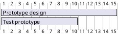

## Task Start and End Dates

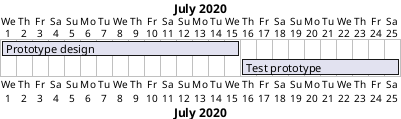

### Relative Start Date

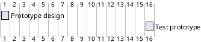

## Short Names (Aliases)

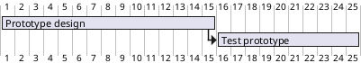

## Task Dependencies

### Using `starts at ... end`

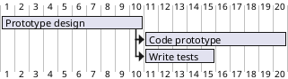

### Using `then` Keyword

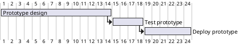

### Using Arrow Notation

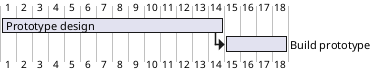

### Delayed Constraints

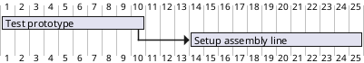

## Task Completion Status

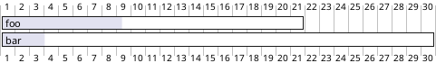

## Milestones

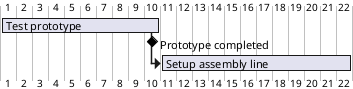

### Milestone at Fixed Date

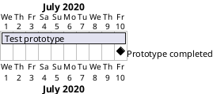

## Task Coloring

```plantuml
@startgantt
[Prototype design] requires 13 days
and is colored in Fuchsia/FireBrick
[Test prototype] requires 4 days
and is colored in GreenYellow/Green
[Test prototype] starts at [Prototype design]'s end
@endgantt
```

## Closed Days (Non-Working Days)

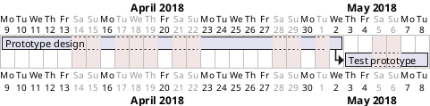

Re-open with: `2020-07-13 is open`

## Coloring Specific Days

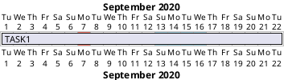

## Title, Header, Footer, Hide Footbox

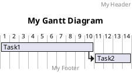

## Language

Set day/month names: `language en`, `language ko`, `language ja`, etc.

## Comments

Single-line: `' comment`
Multi-line: `/' comment '/`

## Additional Resources

For completion styling, multi-task milestones, working days, print scale (daily/weekly/monthly/quarterly/yearly), zoom, date range filtering, week numbering, resource management, separators, same-row display, notes, today indicator, and `<style>` blocks:
- **`references/advanced.md`** — Advanced Gantt diagram features and styling
