# Gantt Diagram — Advanced Reference

> Source: https://plantuml.com/gantt-diagram

## Task Completion Status

### Percentage and Styling

```plantuml
@startgantt
<style>
ganttDiagram {
  task {
    BackGroundColor GreenYellow
    LineColor Green
    unstarted {
      BackGroundColor Fuchsia
      LineColor FireBrick
    }
  }
  undone {
    BackGroundColor red
  }
}
</style>
[foo] lasts 21 days
[foo] is 40% completed
[bar] requires 30 days and is 10% complete
@endgantt
```

## Milestone Linked to Multiple Tasks

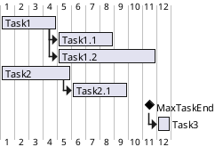

## Working Days and Delays

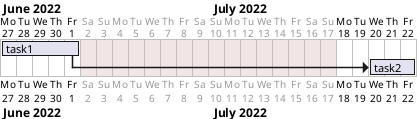

## Scale Configuration (Print Scale)

Options: `daily` (default), `weekly`, `monthly`, `quarterly`, `yearly`

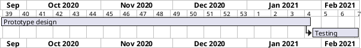

### Zoom

Combine `zoom` with any scale to magnify.

```plantuml
@startgantt
printscale weekly
zoom 4
Project starts the 1st of january 2021
[Prototype design end] as [TASK1] requires 19 days
[Testing] requires 14 days
[TASK1] -> [Testing]
@endgantt
```

## Print Between (Date Range Filtering)

```plantuml
@startgantt
Print between 2021-01-12 and 2021-01-22
Project starts the 1st of january 2021
[Prototype design end] as [TASK1] requires 8 days
[Testing] requires 3 days
[TASK1] -> [Testing]
@endgantt
```

## Week Numbering in Headers

Options: `with week numbering from N`, `with calendar date`

```plantuml
@startgantt
printscale weekly with week numbering from 1
Project starts the 6th of July 2020
[Task1] on {Alice} requires 2 weeks
[Task2] on {Bob:50%} requires 2 weeks
@endgantt
```

### Custom Week Start Day

```plantuml
@startgantt
printscale weekly
weeks starts on Sunday and must have at least 4 days
friday are closed
saturday are closed
Project starts the 1st of january 2025
[Prototype design end] as [TASK1] requires 19 days
[Testing] requires 14 days
[TASK1] -> [Testing]
@endgantt
```

## Resource Management

### Assigning Tasks to Resources

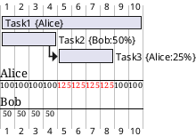

### Multiple Resources Per Task

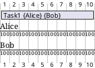

### Resource Time Off

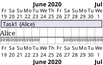

### Hide Resources

`hide resources names`, `hide resources footbox`

## Separators

### Horizontal (Phase Dividers)

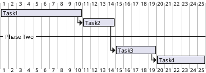

### Vertical

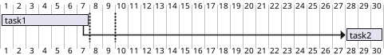

## Display on Same Row

```plantuml
@startgantt
Project starts 2020-09-01
[taskA] starts 2020-09-01 and requires 3 days
[taskB] starts 2020-09-10 and requires 3 days
[taskB] displays on same row as [taskA]
@endgantt
```

## Notes

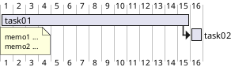

## Today Indicator

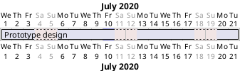

## Comprehensive Style Definition

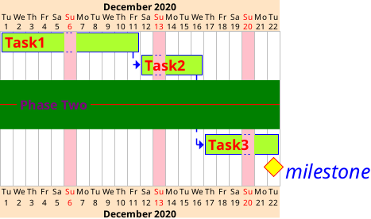

### Hidden Timeline Style

```plantuml
@startgantt
<style>
ganttDiagram {
  timeline {
    LineColor transparent
    FontColor transparent
  }
}
</style>
hide footbox
[Test prototype] requires 7 days
[Prototype completed] happens at [Test prototype]'s end
then [Setup assembly line] requires 12 days
@endgantt
```

## Full Complex Example

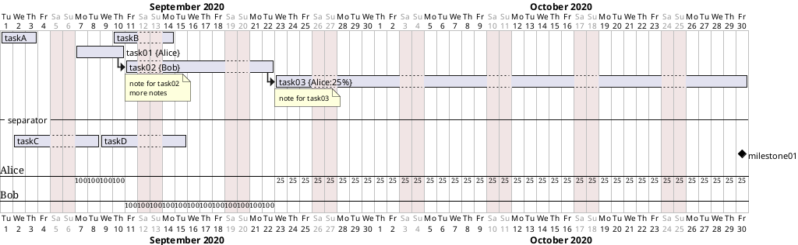
