> Sources:
> - https://plantuml.com/json
> - https://plantuml.com/yaml

# PlantUML JSON & YAML Visualization Reference

## JSON Visualization

### Basic Syntax

JSON diagrams use `@startjson` and `@endjson` delimiters.

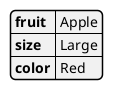

### Simple Values

You can display a single string, number, boolean, or null as a standalone diagram.

```plantuml
@startjson
"Hello world!"
@endjson
```

```plantuml
@startjson
42
@endjson
```

```plantuml
@startjson
true
@endjson
```

### Complex Nested JSON

Objects and arrays can be nested to any depth.

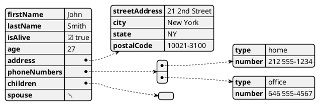

### Supported Data Types

All JSON data types are supported:

- **Null:** `null`
- **Booleans:** `true`, `false`
- **Numbers:** integers, decimals, exponential notation (e.g., `1e10`)
- **Strings:** Unicode support, escape sequences (`\"`, `\\`, `\/`, `\b`, `\f`, `\n`, `\r`, `\t`, `\uXXXX`)
- **Arrays:** ordered lists (homogeneous or mixed-type)
- **Objects:** key-value pairs

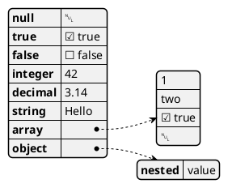

### Highlighting Elements

Use `#highlight` to emphasize specific keys or nested paths. Paths are separated by `/`.

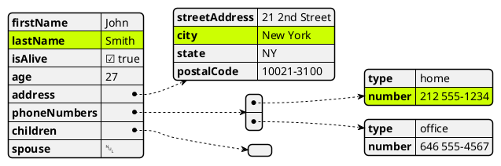

### Custom Highlight Styles

Define custom style classes and apply them with `<<className>>`.

```plantuml
@startjson
<style>
  .h1 {
    BackGroundColor green
    FontColor white
    FontStyle italic
  }
  .h2 {
    BackGroundColor red
    FontColor white
    FontStyle italic
  }
</style>
#highlight "lastName" <<h1>>
#highlight "address" / "city" <<h2>>
{
  "firstName": "John",
  "lastName": "Smith",
  "address": {
    "streetAddress": "21 2nd Street",
    "city": "New York"
  }
}
@endjson
```

### Default Highlight Style

Customize the default highlight appearance using the `highlight` block inside `jsonDiagram`.

```plantuml
@startjson
<style>
jsonDiagram {
  highlight {
    BackGroundColor yellow
    FontColor red
    FontStyle bold
  }
}
</style>
#highlight "city"
{
  "name": "John",
  "city": "New York"
}
@endjson
```

### Global JSON Diagram Styling

Customize the overall diagram appearance using `<style>` with `jsonDiagram`.

```plantuml
@startjson
<style>
jsonDiagram {
  node {
    BackGroundColor Khaki
    LineColor lightblue
    FontName Helvetica
    FontColor red
    FontSize 18
    FontStyle bold
    RoundCorner 0
    LineThickness 2
    LineStyle 10-5
    separator {
      LineThickness 0.5
      LineColor black
      LineStyle 1-5
    }
  }
  arrow {
    BackGroundColor lightblue
    LineColor green
    LineThickness 2
    LineStyle 2-5
  }
}
</style>
{
  "fruit": "Apple",
  "size": "Large",
  "color": ["Red", "Green"]
}
@endjson
```

### Text Formatting (Creole and HTML)

JSON values support rich text formatting with Creole syntax and HTML-like tags.

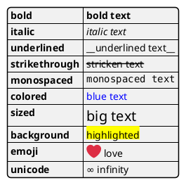

### JSON Entities in Other Diagrams

JSON data can be embedded within class, object, component, deployment, use case, and state diagrams using the `json` keyword.

**In class/object diagrams:**

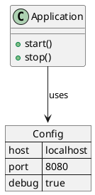

**In deployment/component diagrams:**

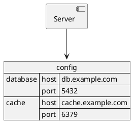

### Minimum and Maximum Array Size

Use `!$minArraySize` and `!$maxArraySize` to control how arrays render.

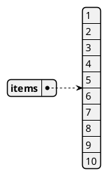

## YAML Visualization

### Basic Syntax

YAML diagrams use `@startyaml` and `@endyaml` delimiters.


### Complex Nested YAML

YAML supports deeply nested structures with objects, arrays, and mixed content.

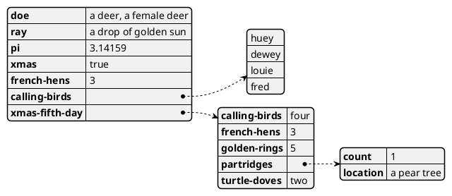

### Special Characters in Keys

YAML keys can include symbols and Unicode characters.

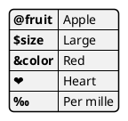

### Highlighting Elements

Use `#highlight` to emphasize specific keys or nested paths. Paths are separated by `/`.

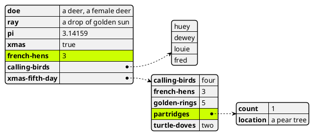

### Custom Highlight Styles

Define custom style classes and apply them with `<<className>>`.

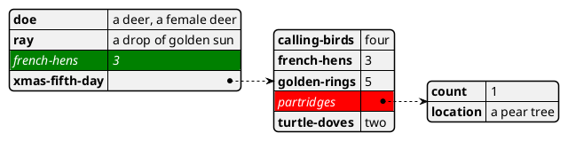

### Default Highlight Style

Customize the default highlight appearance using the `highlight` block inside `yamlDiagram`.

```plantuml
@startyaml
<style>
yamlDiagram {
  highlight {
    BackGroundColor red
    FontColor white
    FontStyle italic
  }
}
</style>
#highlight "fruit"
fruit: Apple
size: Large
color: Red
@endyaml
```

### Global YAML Diagram Styling

Customize the overall diagram appearance using `<style>` with `yamlDiagram`.

```plantuml
@startyaml
<style>
yamlDiagram {
  node {
    BackGroundColor lightblue
    LineColor lightblue
    FontName Helvetica
    FontColor red
    FontSize 18
    FontStyle bold
    RoundCorner 0
    LineThickness 2
    LineStyle 10-5
    separator {
      LineThickness 0.5
      LineColor black
      LineStyle 1-5
    }
  }
  arrow {
    BackGroundColor lightblue
    LineColor green
    LineThickness 2
    LineStyle 2-5
  }
}
</style>
fruit: Apple
size: Large
color:
  - Red
  - Green
@endyaml
```

### Text Formatting (Creole and HTML)

YAML values support rich text formatting with Creole syntax and HTML-like tags.

```plantuml
@startyaml
bold: "**bold text**"
italic: "//italic text//"
monospaced: "\"\"monospaced text\"\""
strikethrough: "--stricken-out--"
underlined: "__underlined text__"
wave: "~~wave text~~"
@endyaml
```

HTML Creole tags supported in YAML values:

- `<b>bold</b>`
- `<i>italic</i>`
- `<font:monospaced>mono</font>`
- `<s>strikethrough</s>`
- `<u>underlined</u>`
- `<w>wave</w>`
- `<color:blue>colored text</color>`
- `<back:yellow>background</back>`
- `<size:20>sized text</size>`
- `<&icon>` (OpenIconic icons)
- `<U+XXXX>` (Unicode characters)
- `<:emoji:>` (emoji)
- `` (inline images)

### YAML Entities in Other Diagrams

YAML data can be embedded within other diagram types using the `yaml` keyword, similar to JSON entities.

```plantuml
@startuml
allowmixing

yaml config {
  database:
    host: db.example.com
    port: 5432
  cache:
    host: cache.example.com
    port: 6379
}

component Server
Server --> config
@enduml
```

## Style Properties Reference

The following style properties are available for both `jsonDiagram` and `yamlDiagram`:

### Node Properties

| Property | Description | Example |
|---|---|---|
| `BackGroundColor` | Node background color | `BackGroundColor Khaki` |
| `LineColor` | Node border color | `LineColor lightblue` |
| `FontName` | Font family | `FontName Helvetica` |
| `FontColor` | Text color | `FontColor red` |
| `FontSize` | Text size | `FontSize 18` |
| `FontStyle` | Text style | `FontStyle bold` |
| `RoundCorner` | Corner rounding radius | `RoundCorner 0` |
| `LineThickness` | Border thickness | `LineThickness 2` |
| `LineStyle` | Dash pattern | `LineStyle 10-5` |

### Separator Properties (inside `node`)

| Property | Description | Example |
|---|---|---|
| `LineThickness` | Separator line thickness | `LineThickness 0.5` |
| `LineColor` | Separator line color | `LineColor black` |
| `LineStyle` | Separator dash pattern | `LineStyle 1-5` |

### Arrow Properties

| Property | Description | Example |
|---|---|---|
| `BackGroundColor` | Arrow head fill color | `BackGroundColor lightblue` |
| `LineColor` | Arrow line color | `LineColor green` |
| `LineThickness` | Arrow line thickness | `LineThickness 2` |
| `LineStyle` | Arrow dash pattern | `LineStyle 2-5` |

### Highlight Properties

| Property | Description | Example |
|---|---|---|
| `BackGroundColor` | Highlight background color | `BackGroundColor yellow` |
| `FontColor` | Highlighted text color | `FontColor white` |
| `FontStyle` | Highlighted text style | `FontStyle italic` |

## Validation

After writing a `.puml` file or a PlantUML fenced block in Markdown, always validate the syntax:

- **Local** (preferred): `bash ${CLAUDE_PLUGIN_ROOT}/scripts/validate.sh <file.puml>`
- **Online** (fallback): `uv run ${CLAUDE_PLUGIN_ROOT}/scripts/validate_online.py <file.puml>`

For PlantUML blocks embedded in Markdown, extract the content to a temporary `.puml` file before validating. If validation fails, read the error output, fix the syntax, and re-validate.
