> Source: https://plantuml.com/nwdiag

# PlantUML Network Diagram Reference

## Basic Network Definition

Define a network with a name and optional address. Servers are listed inside the network block with optional addresses.

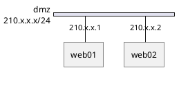

## Multiple Networks

Nodes appearing in multiple networks are automatically connected across them.

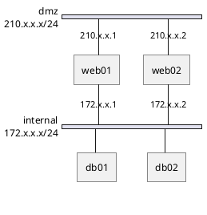

## Multiple Addresses

Assign multiple addresses to a node by separating them with commas.

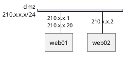

## Grouping Nodes

### Groups Inside Networks

Groups can be defined within a network block to visually cluster related servers.

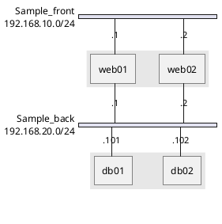

### Groups Outside Networks

Groups defined at the top level span across all networks the member nodes belong to.

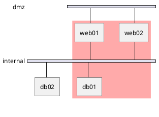

### Group Properties

Groups support `color` and `description` properties.

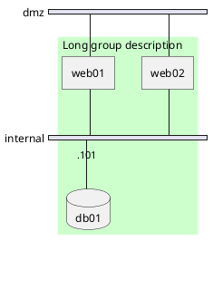

## Peer Networks

Use `--` to create direct peer-to-peer connections outside of a network block.

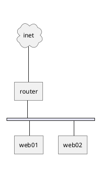

### Peer Networks with Groups

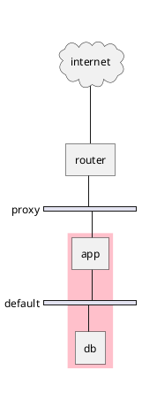

## Colors

### Network Colors

Assign a color to a network using the `color` property.

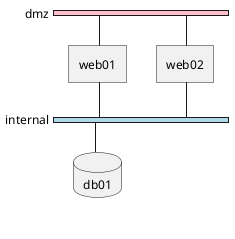

### Combining Colors on Networks, Groups, and Nodes

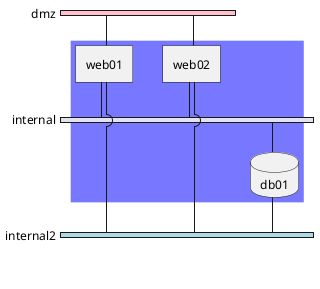

## Descriptions

Use the `description` property on nodes to add text labels below icons. Supports `\n` for line breaks.

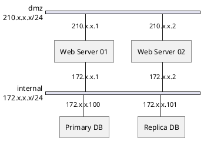

## Shapes

Nodes support various shapes. Common shapes for network diagrams include: `cloud`, `database`, `node`, `actor`, `agent`, `artifact`, `boundary`, `card`, `collections`, `component`, `control`, `entity`, `file`, `folder`, `frame`, `hexagon`, `interface`, `label`, `package`, `person`, `queue`, `stack`, `rectangle`, `storage`, `usecase`.

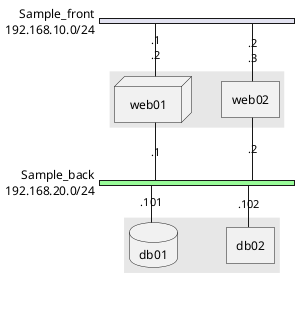

## Network Width Control

Use `width = full` to force a network to span the full width of the diagram.

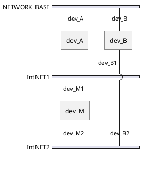

## Internal / Direct Connections (TCP/IP, USB, SERIAL)

Use `--` between nodes to create direct connections outside of a named network, useful for USB, serial, or other point-to-point links.

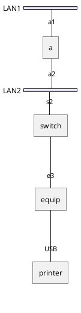

## Using Sprites and Icons

### Standard Library Sprites

```plantuml
@startnwdiag
!include <office/Servers/application_server>
!include <office/Servers/database_server>

nwdiag {
  network dmz {
    address = "210.x.x.x/24"

    web01 [address = "210.x.x.1, 210.x.x.20",
           description = "<$application_server>\n web01"]
    web02 [address = "210.x.x.2",
           description = "<$application_server>\n web02"];
  }

  network internal {
    address = "172.x.x.x/24";

    web01 [address = "172.x.x.1"];
    web02 [address = "172.x.x.2"];
    db01 [address = "172.x.x.100",
          description = "<$database_server>\n db01"];
    db02 [address = "172.x.x.101",
          description = "<$database_server>\n db02"];
  }
}
@endnwdiag
```

### OpenIconic Icons

Use `<&icon_name>` syntax. Append `*scale` to resize (e.g., `<&cog*4>`).

```plantuml
@startnwdiag
nwdiag {
  group nightly {
    color = "#FFAAAA";
    description = "<&clock> Restarted nightly <&clock>";
    web02;
    db01;
  }

  network dmz {
    address = "210.x.x.x/24"

    user [description = "<&person*4.5>\n user1"];
    web01 [address = "210.x.x.1, 210.x.x.20",
           description = "<&cog*4>\nweb01"]
    web02 [address = "210.x.x.2",
           description = "<&cog*4>\nweb02"];
  }

  network internal {
    address = "172.x.x.x/24";

    web01 [address = "172.x.x.1"];
    web02 [address = "172.x.x.2"];
    db01 [address = "172.x.x.100",
          description = "<&spreadsheet*4>\n db01"];
    db02 [address = "172.x.x.101",
          description = "<&spreadsheet*4>\n db02"];
    ptr [address = "172.x.x.110",
         description = "<&print*4>\n ptr01"];
  }
}
@endnwdiag
```

## Title, Caption, Header, Footer, and Legend

Add document-level annotations around the diagram.

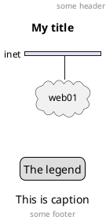

## Shadow Control

Disable shadows using the `<style>` block.

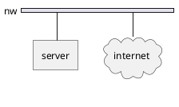

## Global Styling with Style Block

Customize the appearance of all diagram elements using `<style>`.

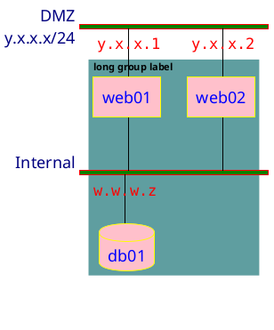

## Comprehensive Example

A full example combining multiple features: networks, groups, colors, shapes, addresses, and descriptions.

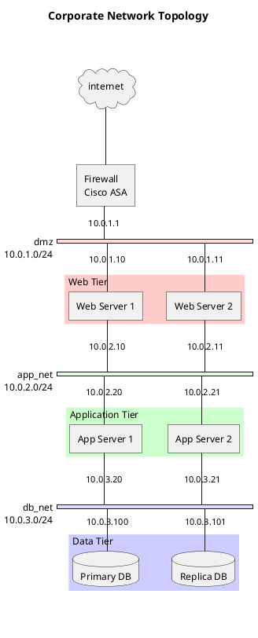
