> Source: https://plantuml.com/object-diagram

# PlantUML Object Diagram Reference

An object diagram provides a graphical representation showcasing objects and their relationships at a specific moment in time, offering a snapshot of the system's structure.

## Definition of Objects

Use the `object` keyword to define objects. Use `as` to create an alias for objects with long names.

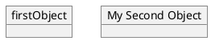

## Adding Fields

### Colon Notation

Declare fields one at a time using `:` after the object name.

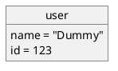

### Bracket Notation

Group all fields inside curly braces `{}`.


## Relations Between Objects

The following relationship types are supported. Replace `--` with `..` for dotted lines. Add labels using `:` and cardinality using double-quotes `""`.

| Type           | Symbol   | Description                     |
|----------------|----------|---------------------------------|
| Extension      | `<\|--`  | Specialization in hierarchy     |
| Implementation | `<\|..`  | Interface realization           |
| Composition    | `*--`    | Part cannot exist without whole |
| Aggregation    | `o--`    | Part can exist independently    |
| Dependency     | `-->`    | Object uses another             |
| Weak Dep.      | `..>`    | Weaker dependency form          |

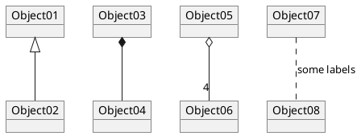

## Association Objects (Diamond)

Use the `diamond` keyword to create an association node connecting multiple objects.

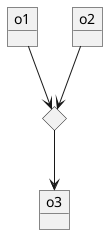

## Notes

Notes can be attached to objects using directional keywords (`top`, `bottom`, `left`, `right`).

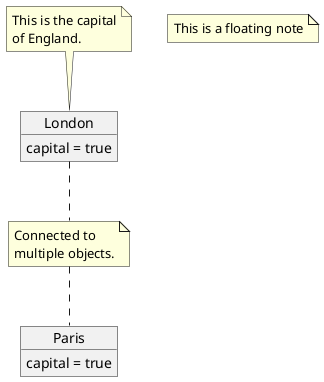

### Multi-line Notes with Formatting

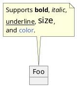

## Packages

Use `package` to group objects. Optional background color can be set with `#color`.

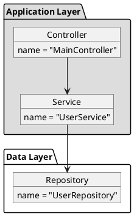

### Package Styles

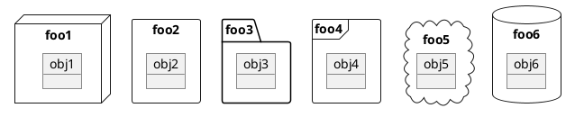

## Stereotypes

Define custom stereotypes with optional spot characters and colors.

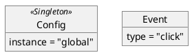

## Skinparam (Styling)

Use `skinparam` to customize colors and fonts for object diagram elements.

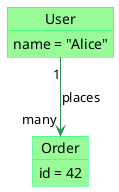

### Stereotype-specific Styling

```plantuml
@startuml
skinparam object {
  BackgroundColor PaleGreen
  BorderColor SpringGreen
  BackgroundColor<<Important>> Wheat
  BorderColor<<Important>> Tomato
}

object Server <<Important>> {
  status = "active"
}
object Client {
  connected = true
}
Server <-- Client
@enduml
```

## Hide / Show Commands

Control visibility of object members and elements.

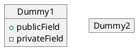

### Hide Unlinked Objects

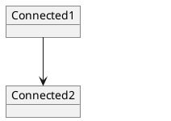

## Map Table or Associative Array

Use the `map` keyword to define key-value map tables with `=>` as the separator.

### Basic Map

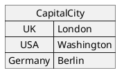

### Map with Title

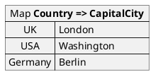

### Typed Map

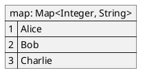

### Map Linked to Objects

Use `*->` inside a map entry to link a value to an object.

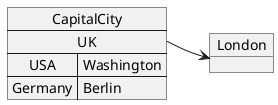

### Map with Multiple Object Links

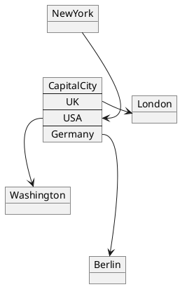

### Map Entry References

Use `MapName::key` to reference individual entries in a map for external links.

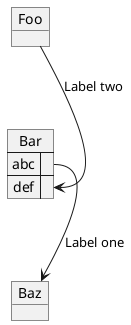

### Map with Packages

```plantuml
@startuml
package foo {
    object baz
}

package bar {
    map A {
        b *-> foo.baz
        c =>
    }
}

A::c --> foo
@enduml
```

## PERT Diagrams with Maps

Maps can be used to create Program Evaluation and Review Technique (PERT) diagrams.

```plantuml
@startuml PERT
left to right direction
' Horizontal lines: -->, <--, <-->
' Vertical lines: ->, <-, <->
title PERT: Project Name

map Kick.Off {
}
map task.1 {
    Start => End
}
map task.2 {
    Start => End
}
map task.3 {
    Start => End
}
map task.4 {
    Start => End
}
map task.5 {
    Start => End
}
Kick.Off --> task.1 : Label 1
Kick.Off --> task.2 : Label 2
Kick.Off --> task.3 : Label 3
task.1 --> task.4
task.2 --> task.4
task.3 --> task.4
task.4 --> task.5 : Label 4
@enduml
```

## Display JSON Data on Object Diagram

Embed JSON data alongside objects and classes using the `json` keyword.

```plantuml
@startuml
class Class
object Object
json JSON {
   "fruit":"Apple",
   "size":"Large",
   "color": ["Red", "Green"]
}
@enduml
```

## Layout Direction

Use `left to right direction` or `top to bottom direction` to control layout flow.

```plantuml
@startuml
left to right direction

object User {
  name = "Alice"
}
object Session {
  id = "abc123"
}
object Cart {
  items = 3
}

User --> Session
Session --> Cart
@enduml
```

## Validation

After writing a `.puml` file or a PlantUML fenced block in Markdown, always validate the syntax:

- **Local** (preferred): `bash ${CLAUDE_PLUGIN_ROOT}/scripts/validate.sh <file.puml>`
- **Online** (fallback): `uv run ${CLAUDE_PLUGIN_ROOT}/scripts/validate_online.py <file.puml>`

For PlantUML blocks embedded in Markdown, extract the content to a temporary `.puml` file before validating. If validation fails, read the error output, fix the syntax, and re-validate.
