> Sources:
> - https://plantuml.com/salt
> - https://plantuml.com/archimate-diagram
> - https://plantuml.com/ditaa
> - https://plantuml.com/ebnf
> - https://plantuml.com/regex

# PlantUML Other Diagram Types Reference

## Salt (Wireframe)

Salt provides a quick way to create wireframe mockups using `@startsalt`/`@endsalt`.

### Basic Widgets

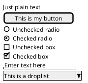

### Grid Layout

Use `|` to separate columns. Grid border styles: `{#` all borders, `{!` vertical only, `{-` horizontal only, `{+` external frame.

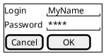

### Group Box

Prefix `{` with `^"title"` to create a titled group box.

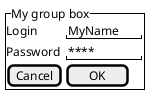

### Tabs

Use `{/` for horizontal tabs or `{|` for vertical tabs.

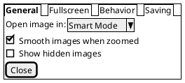

### Menu Bar

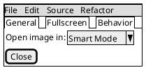

### Tree Widget

Use `{T` with `+` indentation levels. Variants: `{T!`, `{T-`, `{T+`, `{T#`.

```plantuml
@startsalt
{
  {T
    + World
    ++ America
    +++ Canada
    +++ USA
    ++++ New York
    ++++ Boston
    ++ Europe
    +++ France
  }
}
@endsalt
```

### Tree Table

Combine tree structure with columns using `|`.

```plantuml
@startsalt
{
  {T
    +Region        | Population    | Age
    + World        | 7.13 billion  | 30
    ++ America     | 964 million   | 30
    +++ Canada     | 35 million    | 30
  }
}
@endsalt
```

### Separators

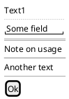

### Scroll Bars

`{S` both scrollbars, `{SI` vertical only, `{S-` horizontal only.

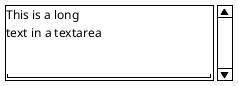

### Nested Brackets

Nest `{` inside cells for complex layouts.

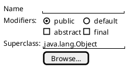

### OpenIconic Icons

```plantuml
@startsalt
{
  Login<&person> | "MyName   "
  Password<&key> | "****     "
  [Cancel <&circle-x>] | [OK <&account-login>]
}
@endsalt
```

### Colors and Creole Formatting

```plantuml
@startsalt
{
  <color:Blue>Blue text
  [<color:green>Green button]
  This is **bold**
  This is //italics//
  This is __underlined__
}
@endsalt
```

### Styling

```plantuml
@startsalt
<style>
saltDiagram {
  BackgroundColor palegreen
}
</style>
{+
  Login    | "MyName   "
  Password | "****     "
}
@endsalt
```

## Archimate Diagram

Archimate diagrams model enterprise architecture using `archimate` keyword with stereotypes and color categories.

### Basic Elements

Use the `archimate` keyword with a color category and a stereotype.

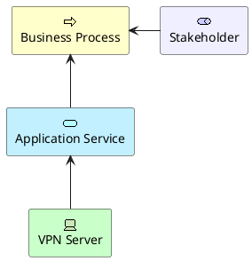

### Color Categories

- `#Business` -- business-layer elements
- `#Application` -- application-layer components
- `#Technology` -- technology infrastructure
- `#Motivation` -- strategic motivation elements
- `#Strategy` -- strategic planning elements
- `#Physical` -- physical assets
- `#Implementation` -- implementation artifacts

### Using the Standard Library

Include macros for convenient element creation.

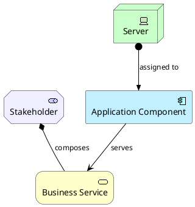

### Relationship Types

Pattern: `Rel_<Type>(from, to, "label")` with directional variants `_Up/_Down/_Left/_Right`.

Supported relationship types:
- `Rel_Access` -- accessing data
- `Rel_Aggregation` -- aggregation
- `Rel_Assignment` -- assignment
- `Rel_Association` -- association
- `Rel_Composition` -- composition
- `Rel_Flow` -- flow of information
- `Rel_Influence` -- influence
- `Rel_Realization` -- realization
- `Rel_Serving` -- serving
- `Rel_Specialization` -- specialization
- `Rel_Triggering` -- triggering

### Junctions

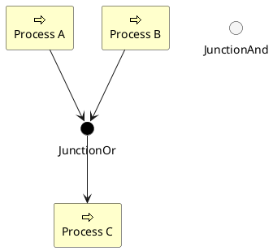

### Sprites

Reference archimate sprites for element icons.

```plantuml
@startuml
sprite $bProcess jar:archimate/business-process
sprite $aService jar:archimate/application-service

rectangle "Business Process" <<$bProcess>> #Business
rectangle "App Service" <<$aService>> #Application
@enduml
```

## Ditaa (ASCII Art Diagrams)

Ditaa converts ASCII art into proper diagrams. Uses `@startditaa`/`@endditaa`. Output is PNG only.

### Basic Shapes

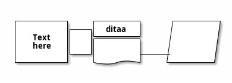

### Shape Tags

Tags placed inside shapes change their appearance:

- `{c}` -- choice/decision (diamond)
- `{d}` -- document symbol
- `{io}` -- input/output parallelogram
- `{mo}` -- manual operation
- `{o}` -- ellipse/oval
- `{s}` -- storage (database/cylinder)
- `{tr}` -- trapezoid

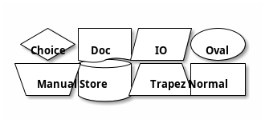

### Colors

Use `cXXX` color codes inside shapes (hex shorthand).

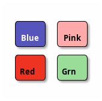

### Rounded Corners

Use `/` and `\` characters for rounded corners.

```plantuml
@startditaa
/--+
|  |
+--/
@endditaa
```

### Options

Options are passed after `@startditaa`:

- `--no-shadows` or `-S` -- remove shadow effects
- `--no-separation` or `-E` -- remove separators between shapes
- `scale=<value>` -- scale the diagram

```plantuml
@startditaa --no-shadows, scale=0.8
+--------+   +-------+
|        +---+ ditaa |
|  Text  |   +-------+
+--------+
@endditaa
```

## EBNF Syntax Diagrams

EBNF diagrams visualize grammar rules using `@startebnf`/`@endebnf`.

### Basic Rules and Terminals

```plantuml
@startebnf
binaryDigit = "0" | "1";
@endebnf
```

### Core EBNF Notation

- **Sequence**: `a, b` -- elements in order
- **Alternation**: `a | b` -- choice between alternatives
- **Optional**: `[a]` -- zero or one occurrence
- **Repetition**: `{a}` -- zero or more occurrences
- **Grouping**: `(a | b)` -- group sub-expressions

```plantuml
@startebnf
literal = "a";
special = ? a ?;
required = a;
optional = [a];
zero_or_more = {a};
one_or_more = a, {a};
alternative = a | b;
group = (a | b), c;
@endebnf
```

### Repetition with Multipliers

```plantuml
@startebnf
byte = 8 * bit;
bit = "0" | "1";
@endebnf
```

### Special Sequences

Use `?...?` for meta-descriptions of characters.

```plantuml
@startebnf
h_tab = ? Unicode U+0009 ?;
newline = ? line break ?;
@endebnf
```

### Lists with Separators

```plantuml
@startebnf
zero_or_more_csv = [item, {",", item}];
one_or_more_csv = item, {",", item};
@endebnf
```

### Comments

```plantuml
@startebnf
(* This is a grammar comment *)
Rule1 = {"a"-"z" (* any lowercase letter *)};
@endebnf
```

### Styling

```plantuml
@startebnf
<style>
element {
  ebnf {
    LineColor blue
    Fontcolor green
    Backgroundcolor palegreen
  }
}
</style>
title Styled Grammar
expression = term, {("+"|"-"), term};
term = factor, {("*"|"/"), factor};
@endebnf
```

### Practical Example

```plantuml
@startebnf
title JSON Value
value = string | number | object | array | "true" | "false" | "null";
object = "{", [pair, {",", pair}], "}";
pair = string, ":", value;
array = "[", [value, {",", value}], "]";
string = '"', {character}, '"';
number = ["-"], digit, {digit}, [".", digit, {digit}];
digit = "0" | "1" | "2" | "3" | "4" | "5" | "6" | "7" | "8" | "9";
@endebnf
```

## Regex Visualization

Regex diagrams visualize regular expression patterns using `@startregex`/`@endregex`.

### Basic Literal Text

```plantuml
@startregex
abc
@endregex
```

### Character Classes

```plantuml
@startregex
[a-zA-Z0-9]
@endregex
```

### Shorthand Character Classes

- `\d` -- digit, `\D` -- non-digit
- `\w` -- word character, `\W` -- non-word
- `\s` -- whitespace, `\S` -- non-whitespace
- `.` -- any character

```plantuml
@startregex
\d\w\s.
@endregex
```

### Quantifiers

- `?` -- optional (zero or one)
- `+` -- one or more
- `*` -- zero or more
- `{n}` -- exactly n times
- `{n,m}` -- between n and m times
- `{n,}` -- at least n times

```plantuml
@startregex
ab?c+d*e{2}f{1,3}
@endregex
```

### Alternation

```plantuml
@startregex
cat|dog|bird
@endregex
```

### Special Escapes

```plantuml
@startregex
\t\r\n
@endregex
```

### Unicode Support

```plantuml
@startregex
\uFFFF\x{FFFF}
@endregex
```

```plantuml
@startregex
\p{L}\p{Letter}\p{Latin}
@endregex
```

### Literal Sequences

Use `\Q...\E` to treat content as literal text.

```plantuml
@startregex
\Qfoo.bar\E
@endregex
```

### Options

Use `!option` directives for configuration.

```plantuml
@startregex
!option useDescriptiveNames true
!option language en
\d?\D+\w*\W{1,2}|\s.\S
@endregex
```

Supported `language` values: `en` (English), `de` (Deutsch), `ja` (Japanese), and other ISO 639 codes.

### Practical Example

```plantuml
@startregex
title Email Pattern
[a-zA-Z0-9._%+\-]+@[a-zA-Z0-9.\-]+\.[a-zA-Z]{2,}
@endregex
```
