> Source: https://plantuml.com/sequence-diagram

# PlantUML Sequence Diagram Reference

## Basic Syntax

Use `->` to draw a message between two participants. Participants do not have to be explicitly declared.

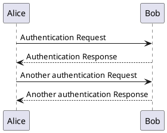

## Declaring Participants

Use `participant` or shape keywords: `actor`, `boundary`, `control`, `entity`, `database`, `collections`, `queue`.

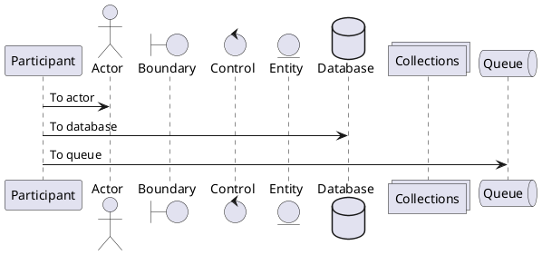

### Background Colors and Ordering

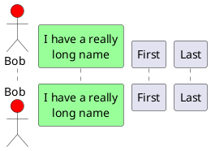

## Arrow Styles

| Syntax | Description |
|--------|-------------|
| `->` | Solid line with arrowhead |
| `-->` | Dotted line with arrowhead |
| `<-` | Reverse solid arrow |
| `<--` | Reverse dotted arrow |
| `-[#red]>` | Colored arrow |

## Message Grouping

Keywords: `alt`/`else`, `opt`, `loop`, `par`/`and`, `break`, `critical`, `group`. Close with `end`.

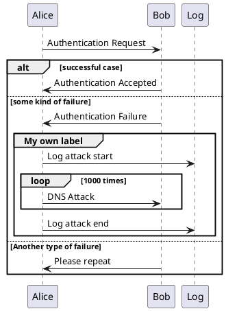

### Secondary Group Labels and Colors

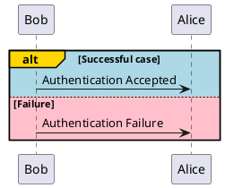

## Notes

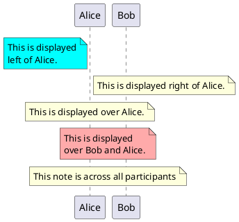

## Divider / Separator

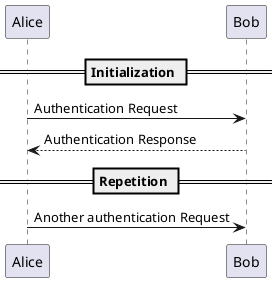

## Reference

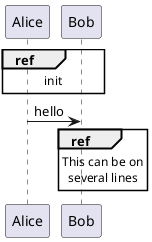

## Delay and Spacing

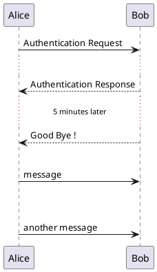

## Lifeline Activation and Deactivation

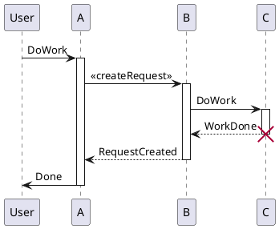

### Shortcut Syntax

| Shortcut | Meaning |
|----------|---------|
| `++` | Activate target (optionally with `#color`) |
| `--` | Deactivate source |
| `**` | Create target |
| `!!` | Destroy target |

```plantuml
@startuml
alice -> bob ++ : hello
bob -> bob ++ : self call
bob -> babe **  ++ : create
return done
return rc
bob -> george ** : create
bob -> george !! : delete
return success
@enduml
```

## Return

Use `return` to generate a return message back to the last activated participant.

## Participant Creation

Use `create` to show instantiation at a specific point.

## Box Around Participants

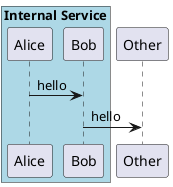

## Mainframe

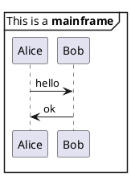

## Page Title, Header, Footer

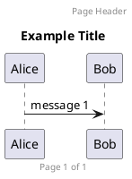

## Splitting Diagrams

Use `newpage` to split into multiple pages. `ignore newpage` renders as single image.

## Additional Resources

For autonumbering (basic, hierarchical, formatting), actor styles, special arrow types, incoming/outgoing messages, Teoz anchors/durations, stereotypes, partition, message span, and skinparam customization:
- **`references/advanced.md`** — Advanced sequence diagram features and styling
