> Source: https://plantuml.com/sequence-diagram

# PlantUML Sequence Diagram Reference

## Basic Syntax

Use `->` to draw a message between two participants. Participants do not have to be explicitly declared.

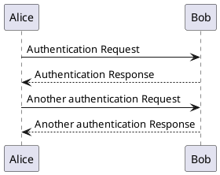

## Declaring Participants

Use the `participant` keyword to explicitly declare a participant. You can also use these alternative keywords to change the shape:

- `actor` - stick figure
- `boundary` - boundary symbol
- `control` - control symbol
- `entity` - entity symbol
- `database` - database symbol
- `collections` - collections symbol
- `queue` - queue symbol

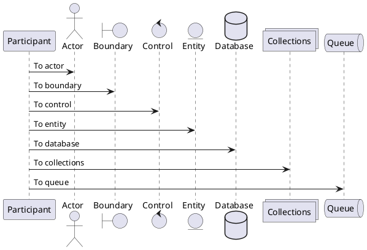

### Renaming with `as` Keyword and Background Colors

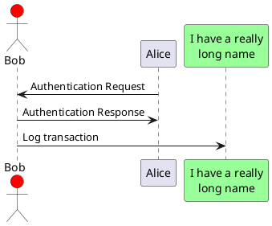

### Participant Ordering with `order`

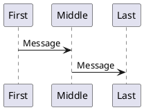

### Multi-line Participant Declarations

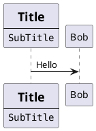

## Non-letter Participants

Use quotes to define participants with non-letter characters. You can also use the `as` keyword to assign an alias.

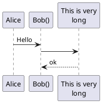

## Messages to Self

A participant can send a message to itself. Multiline text is supported using `\n`.

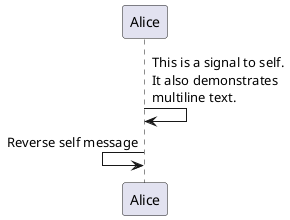

## Text Alignment

Use skinparams to change message text alignment.

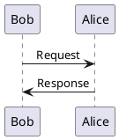

Options for `sequenceMessageAlign`: `left`, `right`, `center`.

## Actor Style

Change the actor rendering style with the `actorStyle` skinparam.

### Stick (default)

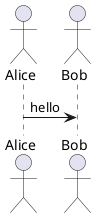

### Awesome

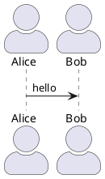

### Hollow

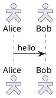

## Arrow Styles

### Standard Arrows

| Syntax | Description |
|--------|-------------|
| `->` | Solid line with arrowhead |
| `-->` | Dotted line with arrowhead |
| `<-` | Reverse solid arrow |
| `<--` | Reverse dotted arrow |

### Special Arrow Types

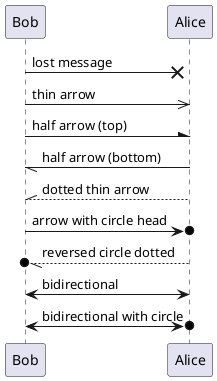

### Arrow Color

You can change the color of individual arrows using the `[#color]` syntax.

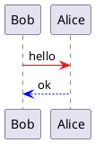

## Autonumbering

Use `autonumber` to automatically add incrementing numbers to messages.

### Basic Autonumber

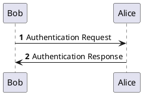

### Start and Increment

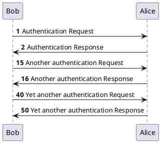

### Formatting with Double Quotes

You can use Java `DecimalFormat` patterns (with `0`, `#`, or `.`) inside double-quoted strings.

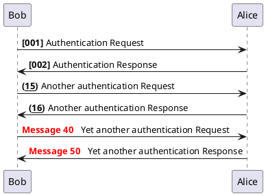

### Stop and Resume

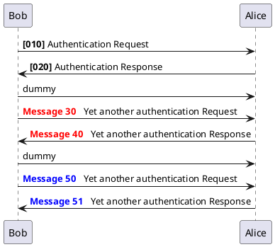

### Hierarchical Autonumber

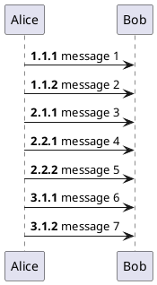

### Autonumber Variable

Use `%autonumber%` to reference the current autonumber value inside messages.

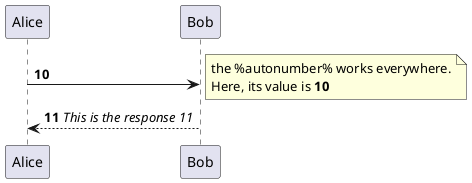

## Page Title, Header, and Footer

Use `title`, `header`, and `footer` to add document information.

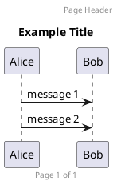

## Splitting Diagrams with `newpage`

Use `newpage` to split a diagram into several pages.

```plantuml
@startuml
Alice -> Bob : message 1
Alice -> Bob : message 2

newpage

Alice -> Bob : message 3
Alice -> Bob : message 4

newpage A title for the\nlast page

Alice -> Bob : message 5
Alice -> Bob : message 6
@enduml
```

Use `ignore newpage` to render all pages as a single image.

## Message Grouping

Use the following keywords to group messages together. They must be closed with `end`.

| Keyword | Description |
|---------|-------------|
| `alt` / `else` | Alternative (if/else) |
| `opt` | Optional |
| `loop` | Loop |
| `par` | Parallel |
| `break` | Break out of sequence |
| `critical` | Critical section |
| `group` | Custom label group |

### alt / else

```plantuml
@startuml
Alice -> Bob: Authentication Request
alt successful case
    Bob -> Alice: Authentication Accepted
else some kind of failure
    Bob -> Alice: Authentication Failure
    group My own label
        Alice -> Log : Log attack start
        loop 1000 times
            Alice -> Bob: DNS Attack
        end
        Alice -> Log : Log attack end
    end
else Another type of failure
    Bob -> Alice: Please repeat
end
@enduml
```

### opt

```plantuml
@startuml
Alice -> Bob: Request
opt Optional sequence
    Bob -> Alice: Optional response
end
@enduml
```

### loop

```plantuml
@startuml
Alice -> Bob: Request
loop 1000 times
    Bob -> Alice: Attempt
end
@enduml
```

### par (parallel)

```plantuml
@startuml
par
    Alice -> Bob: Message 1
and
    Alice -> Charlie: Message 2
and
    Alice -> Dave: Message 3
end
@enduml
```

### break

```plantuml
@startuml
Alice -> Bob: Request
break exception
    Bob -> Alice: Error
end
Alice -> Bob: Continue
@enduml
```

### critical

```plantuml
@startuml
Alice -> Bob: Request
critical critical section
    Bob -> Alice: Critical operation
end
@enduml
```

### group with Custom Label

```plantuml
@startuml
Alice -> Bob: Request
group My label [My label 2]
    Alice -> Bob: Grouped message 1
    Bob -> Alice: Grouped message 2
end
@enduml
```

## Secondary Group Labels and Colors

```plantuml
@startuml
Alice -> Bob: Authentication Request
alt#Gold #LightBlue Successful case
    Bob -> Alice: Authentication Accepted
else #Pink Failure
    Bob -> Alice: Authentication Failure
end
@enduml
```

## Notes on Messages

Use `note left` or `note right` after a message to add a note.

```plantuml
@startuml
Alice -> Bob : hello
note left: this is a first note
Bob -> Alice : ok
note right: this is another note
Bob -> Bob : I am thinking
note left
    a note
    can also be on
    several lines
end note
@enduml
```

## Notes Relative to Participants

Use `note left of`, `note right of`, or `note over` to position notes relative to participants.

```plantuml
@startuml
participant Alice
participant Bob

note left of Alice #aqua
    This is displayed
    left of Alice.
end note

note right of Alice: This is displayed right of Alice.
note over Alice: This is displayed over Alice.
note over Alice, Bob #FFAAAA: This is displayed\nover Bob and Alice.
note over Bob, Alice
    This is yet another
    example of
    a long note.
end note
@enduml
```

## Note Shapes

Use `hnote` for hexagonal notes and `rnote` for rectangular notes.

```plantuml
@startuml
caller -> server : conReq
hnote over caller : idle
caller <- server : worklist
rnote over server
    "r]" as rectangle
    "h]" as hexagon
end rnote
rnote over server
    this is
    on several
    lines
end rnote
hnote over caller
    this is
    on several
    lines
end hnote
@enduml
```

## Notes Across All Participants

Use `note across` to place a note spanning all participants.

```plantuml
@startuml
Alice -> Bob: message 1
note across: This note is across all participants
Bob -> Alice: message 2
hnote across: Hexagonal note across all
@enduml
```

## Aligned Notes (Same Level)

Use `/` prefix to place notes at the same level.

```plantuml
@startuml
note over Alice : initial state of Alice
/ note over Bob : initial state of Bob
Bob -> Alice : hello
@enduml
```

## Creole and HTML Formatting

You can use Creole markup and basic HTML in messages and notes.

```plantuml
@startuml
participant Alice
participant "The **Famous** Bob" as Bob

Alice -> Bob : hello --there--
Alice -> Bob : A]  //This is written in italic//
Alice -> Bob : A]  ""This is code""
Alice -> Bob : A]  ~~This is strikethrough~~

note left
    This is **bold**
    This is //italic//
    This is ""monospaced""
    This is --stroked--
    This is __underlined__
    This is ~~wave-underlined~~
end note

note left
    <back:camelBlue><size:18>Colored</size></back>
end note
@enduml
```

## Divider / Separator

Use `== text ==` to create visual separators.

```plantuml
@startuml
== Initialization ==
Alice -> Bob: Authentication Request
Bob --> Alice: Authentication Response

== Repetition ==
Alice -> Bob: Another authentication Request
Alice <-- Bob: Another authentication Response
@enduml
```

## Reference

Use `ref over` to add a reference frame.

```plantuml
@startuml
participant Alice
actor Bob

ref over Alice, Bob : init

Alice -> Bob : hello

ref over Bob
    This can be on
    several lines
end ref
@enduml
```

## Delay

Use `...` to indicate a delay. You can optionally add a label.

```plantuml
@startuml
Alice -> Bob: Authentication Request
...
Bob --> Alice: Authentication Response
...5 minutes later...
Bob --> Alice: Good Bye !
@enduml
```

## Spacing

Use `|||` to add extra vertical spacing. Use `||NNpx||` for a specific pixel value.

```plantuml
@startuml
Alice -> Bob: message 1
Bob --> Alice: ok
|||
Alice -> Bob: message 2
Bob --> Alice: ok
||45||
Alice -> Bob: message 3
Bob --> Alice: ok
@enduml
```

## Text Wrapping and Max Message Size

Use `maxMessageSize` skinparam to auto-wrap long messages. You can also use `\n` for manual line breaks.

```plantuml
@startuml
skinparam maxMessageSize 50

participant a
participant b

a -> b :this\nis\nmanually\ndone
a -> b :this is a very long message on several words that will automatically wrap
@enduml
```

## Lifeline Activation and Deactivation

Use `activate` and `deactivate` to show the activation bar on a participant lifeline. Use `destroy` to end a lifeline completely.

```plantuml
@startuml
participant User

User -> A: DoWork
activate A

A -> B: << createRequest >>
activate B

B -> C: DoWork
activate C
C --> B: WorkDone
destroy C

B --> A: RequestCreated
deactivate B

A -> User: Done
deactivate A
@enduml
```

### Nested Activation with Colors

```plantuml
@startuml
participant User

User -> A: DoWork
activate A #FFBBBB

A -> A: InternalWork
activate A #DarkSalmon

A -> B: DoWork
activate B

B --> A: Done
deactivate B
deactivate A

A -> User: Done
deactivate A
@enduml
```

### Autoactivation

```plantuml
@startuml
autoactivate on
alice -> bob : hello
bob -> bob : self call
return bye
@enduml
```

## Return

Use `return` to generate a return message back to the last activated participant.

```plantuml
@startuml
Bob -> Alice : hello
activate Alice
Alice -> Alice : some action
return bye
@enduml
```

## Participant Creation

Use `create` to show the instantiation of a participant at a specific point in the diagram.

```plantuml
@startuml
Bob -> Alice : hello

create Other
Alice -> Other : new

create control String
Alice -> String

note right : You can also put notes!

Alice --> Bob : ok
@enduml
```

## Shortcut Syntax for Activation, Deactivation, Creation, and Destruction

Use `++`, `--`, `**`, and `!!` after the target participant as shortcuts.

| Shortcut | Meaning |
|----------|---------|
| `++` | Activate target (optionally with `#color`) |
| `--` | Deactivate source |
| `**` | Create target |
| `!!` | Destroy target |

```plantuml
@startuml
alice -> bob ++ : hello
bob -> bob ++ : self call
bob -> babe **  ++ : create
bob -> george ** : create
return done
return rc
bob -> george !! : delete
return success
@enduml
```

### Combined Activation/Deactivation

```plantuml
@startuml
alice -> bob ++ #gold: hello
bob -> alice --++ #gold: response
alice -> bob --: bye
@enduml
```

## Incoming and Outgoing Messages

Use `[` and `]` to indicate messages coming from or going to outside the diagram.

### Incoming (from left)

```plantuml
@startuml
[-> A: DoWork
activate A
A -> A: Internal call
A ->] : << createRequest >>
A <--] : RequestCreated
[<- A: Done
deactivate A
@enduml
```

### Outgoing (to right)

```plantuml
@startuml
participant Alice
Alice ->] : Request
Alice <--] : Response
@enduml
```

### All Incoming Arrow Variants

```plantuml
@startuml
[-> Bob : hello
[o-> Bob : hello
[o->o Bob : hello
[x-> Bob : hello

[<- Bob : hello
[x<- Bob : hello

Bob ->] : hello
Bob ->o] : hello
Bob o->o] : hello
Bob ->x] : hello

Bob <-] : hello
Bob x<-] : hello
@enduml
```

## Short Arrows with `?`

Use `?` for short incoming/outgoing arrows.

```plantuml
@startuml
?-> Alice  : ""?->""\n**short** to actor
[-> Alice  : ""[->""\n**from start** to actor
[-> Bob    : ""[->""\n**from start** to actor
?-> Bob    : ""?->""\n**short** to actor
Alice ->]  : ""->]""\nfrom actor **to end**
Alice ->?  : ""->?""\nfrom actor **short**
Alice -> Bob : ""->""\n**normal**
@enduml
```

## Anchors and Duration (Teoz)

Use `!pragma teoz true` to enable the Teoz rendering engine. Use `{name}` to mark anchors and `<->` to draw duration arrows between them.

```plantuml
@startuml
!pragma teoz true

{start} Alice -> Bob : start doing things during duration
Bob -> Max : something
Max -> Bob : something else
{end} Bob -> Alice : finish

{start} <-> {end} : some time
@enduml
```

## Stereotypes and Spots

Add stereotypes using `<<` and `>>`. You can also use custom spots with `(char,color)`.

```plantuml
@startuml
participant "Famous Bob" as Bob << Generated >>
participant Alice << (C,#ADD1B2) Testable >>

Bob -> Alice : First message
@enduml
```

### Removing Guillemets

```plantuml
@startuml
skinparam guillemet false

participant "Famous Bob" as Bob << Generated >>
participant Alice << (C,#ADD1B2) >>

Bob -> Alice : First message
@enduml
```

### Stereotype Position

```plantuml
@startuml
skinparam stereotypePosition bottom

participant Bob << Generated >>
participant Alice << (C,#ADD1B2) Testable >>

Bob -> Alice : First message
@enduml
```

## Hiding Footbox

Use `hide footbox` to remove the participant boxes at the bottom of the diagram.

```plantuml
@startuml
hide footbox

actor Alice
actor Bob

Alice -> Bob: Authentication Request
Bob --> Alice: Authentication Response
@enduml
```

## Box Around Participants

Use `box` and `end box` to draw a colored rectangle around a group of participants.

```plantuml
@startuml
box "Internal Service" #LightBlue
    participant Alice
    participant Bob
end box
participant Other

Alice -> Bob : hello
Bob -> Other : hello
@enduml
```

### Box Without Title

```plantuml
@startuml
box #LightBlue
    participant Alice
    participant Bob
end box
participant Other

Alice -> Bob : hello
Bob -> Other : hello
@enduml
```

## Mainframe

Use `mainframe` to add a frame with a title around the entire diagram.

```plantuml
@startuml
mainframe This is a **mainframe**

Alice -> Bob : hello
Bob -> Alice : ok
@enduml
```

## Removing Participant (hide/show/remove)

Use `hide`, `show`, or `remove` to control the visibility of participants.

```plantuml
@startuml
Alice -> Bob : hello
Bob -> Charlie : hello

hide Charlie
@enduml
```

```plantuml
@startuml
Alice -> Bob : hello
Bob -> Charlie : hello

remove Charlie
@enduml
```

## Partition (Teoz Full-Width Grouping)

Use `partition` with `!pragma teoz true` for full-width grouping.

```plantuml
@startuml
!pragma teoz true

partition p1
    b -> c : msg
end

partition p2
    a -> b : msg
end
@enduml
```

## Common Skinparam Settings

```plantuml
@startuml
skinparam sequenceMessageAlign center
skinparam responseMessageBelowArrow true
skinparam maxMessageSize 50
skinparam actorStyle awesome
skinparam stereotypePosition top
skinparam guillemet false

skinparam sequence {
    ArrowColor DarkBlue
    ActorBorderColor DeepSkyBlue
    LifeLineBorderColor blue
    LifeLineBackgroundColor #A9DCDF

    ParticipantBorderColor DeepSkyBlue
    ParticipantBackgroundColor DodgerBlue
    ParticipantFontName Impact
    ParticipantFontSize 17
    ParticipantFontColor #A9DCDF

    ActorBackgroundColor aqua
    ActorFontColor DeepSkyBlue
    ActorFontSize 17
    ActorFontName Aapex
}

actor User
participant "First Class" as A
participant "Second Class" as B
participant "Last Class" as C

User -> A: DoWork
activate A

A -> B: Create Request
activate B

B -> C: DoWork
activate C
C --> B: WorkDone
destroy C

B --> A: Request Created
deactivate B

A --> User: Done
deactivate A
@enduml
```

### Changing Padding

```plantuml
@startuml
skinparam ParticipantPadding 20
skinparam BoxPadding 10

box "Foo1"
participant Alice1
participant Alice2
end box
box "Foo2"
participant Bob1
participant Bob2
end box
Alice1 -> Bob1 : hello
Alice1 -> Alice2 : hello
@enduml
```

## Message Span (Teoz)

Use `!pragma sequenceMessageSpan true` together with the Teoz engine to span messages across participants.

```plantuml
@startuml
!pragma teoz true
!pragma sequenceMessageSpan true

participant A
participant B
participant C

A -> C : long message spanning B
@enduml
```
