# Sequence Diagram — Advanced Reference

> Source: https://plantuml.com/sequence-diagram

## Autonumbering

### Basic, Start, and Increment

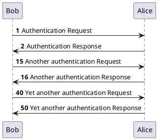

### Formatting with Double Quotes

Use Java `DecimalFormat` patterns (`0`, `#`, `.`) inside double-quoted strings.

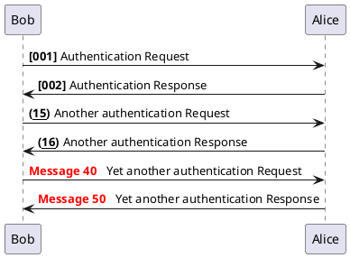

### Stop and Resume

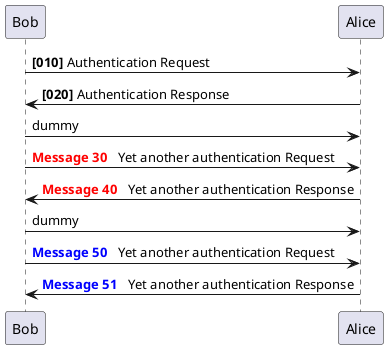

### Hierarchical Autonumber

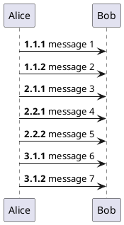

### Autonumber Variable

Use `%autonumber%` to reference the current value inside messages.

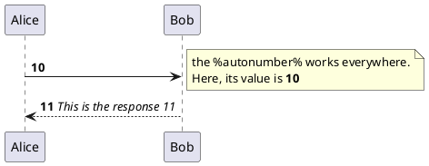

## Actor Style

Change with `skinparam actorStyle`: `stick` (default), `awesome`, `Hollow`.

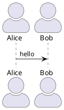

## Special Arrow Types

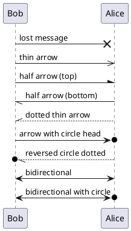

## Incoming and Outgoing Messages

Use `[` and `]` for messages from/to outside the diagram.

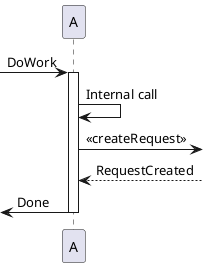

### Short Arrows with `?`

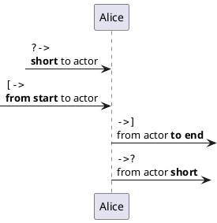

## Anchors and Duration (Teoz)

Use `!pragma teoz true` to enable. Use `{name}` for anchors and `<->` for duration arrows.

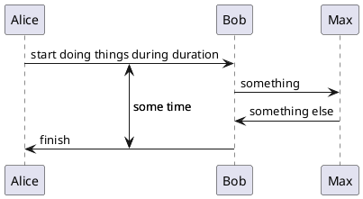

## Stereotypes and Custom Spots

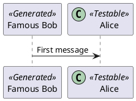

Remove guillemets: `skinparam guillemet false`
Position: `skinparam stereotypePosition bottom`

## Note Shapes

`hnote` for hexagonal, `rnote` for rectangular notes.

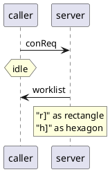

## Aligned Notes (Same Level)

Use `/` prefix to place notes at the same level.

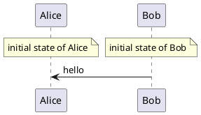

## Removing Participants

Use `hide`, `show`, or `remove` to control visibility.

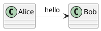

## Partition (Teoz Full-Width Grouping)

```plantuml
@startuml
!pragma teoz true

partition p1
    b -> c : msg
end

partition p2
    a -> b : msg
end
@enduml
```

## Message Span (Teoz)

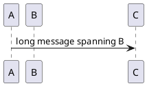

## Common Skinparam Settings

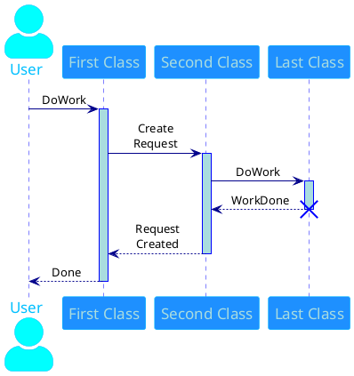

### Padding

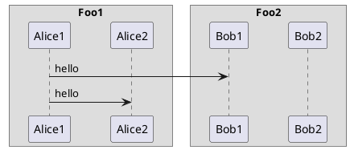
