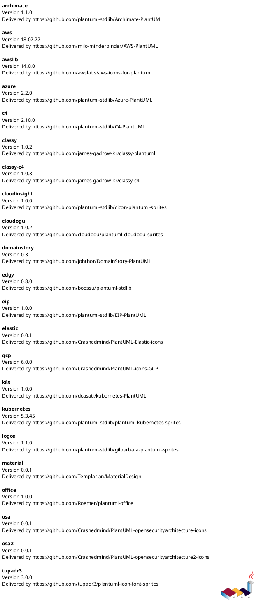
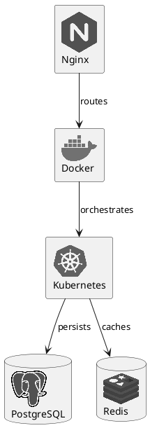
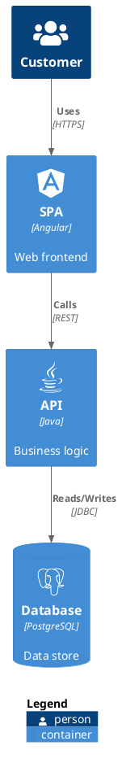

> Sources:
> - https://github.com/plantuml-stdlib/gilbarbara-plantuml-sprites
> - https://github.com/tupadr3/plantuml-icon-font-sprites
> - https://plantuml.com/sprite
> - https://plantuml.com/stdlib

# PlantUML Sprites and Icon Libraries Reference

Sprites are small graphic images that can be embedded in PlantUML diagrams to add visual context — technology logos, cloud service icons, brand marks, etc.

## PlantUML Stdlib Overview

PlantUML includes standard libraries (stdlib) that can be used without downloading external files. View all available libraries with:



Key stdlib libraries for icons:

| Library | Include Prefix | Description |
|---------|---------------|-------------|
| `<awslib/>` | `!include <awslib/...>` | AWS Architecture Icons |
| `<azure/>` | `!include <azure/...>` | Microsoft Azure Icons |
| `<cloudinsight/>` | `!include <cloudinsight/...>` | Cloudinsight icons |
| `<logos/>` | `!include <logos/...>` | Gil Barbara tech logos (gilbarbara) |
| `<office/>` | `!include <office/...>` | Microsoft Office icons |
| `<osa/>` | `!include <osa/...>` | Open Security Architecture icons |
| `<tupadr3/>` | `!include <tupadr3/...>` | Icon font sprites (DevIcons, Font Awesome, etc.) |

## Gil Barbara Tech Logos (gilbarbara)

Over 500+ technology and brand logos. Ideal for architecture diagrams with real tech stack icons.

### Include Syntax

```plantuml
' Via PlantUML stdlib (recommended, no internet required)
!include <logos/docker-icon>
!include <logos/kubernetes>
!include <logos/postgresql>

' Via remote URL (latest version)
!define SPRITES https://raw.githubusercontent.com/plantuml-stdlib/gilbarbara-plantuml-sprites/v1.1/sprites
!includeurl SPRITES/docker-icon.puml
```

### Usage in Diagrams

Use `<$sprite-name>` syntax inside element labels:



### Color and Styling

```plantuml
' Apply color to monochrome sprites
rectangle "<$docker-icon,color=#2496ED>\nDocker" as docker

' Use PNG for full-color images
!define IMAGESURL https://raw.githubusercontent.com/plantuml-stdlib/gilbarbara-plantuml-sprites/v1.1/pngs
rectangle "\nDocker" as docker
```

### Common Sprite Names

**Cloud & Infrastructure:** `aws`, `azure-icon`, `google-cloud`, `docker-icon`, `kubernetes`, `terraform`, `ansible`, `nginx`, `apache`

**Databases:** `postgresql`, `mysql`, `mongodb-icon`, `redis`, `elasticsearch`, `cassandra`, `mariadb`, `sqlite`

**Languages:** `python`, `java`, `go`, `nodejs-icon`, `typescript-icon`, `rust`, `kotlin`, `swift`

**Frameworks:** `react`, `angular-icon`, `vue`, `spring-icon`, `django`, `flask`, `nextjs`, `rails`

**Tools:** `github-icon`, `gitlab`, `jenkins`, `grafana`, `prometheus`, `kafka`, `rabbitmq`, `graphql`

For a full list, see `references/sprite-names.md` or https://github.com/plantuml-stdlib/gilbarbara-plantuml-sprites/blob/master/sprites-list.md

## tupadr3 Icon Font Sprites

Sprites from popular icon font sets: DevIcons, Font Awesome 5, Material Design, Weather, and more.

### Include Syntax

```plantuml
' Via stdlib
!include <tupadr3/devicons/angular>
!include <tupadr3/font-awesome-5/users>
!include <tupadr3/devicons2/docker>

' Via remote URL
!define DEVICONS https://raw.githubusercontent.com/tupadr3/plantuml-icon-font-sprites/master/devicons
!define FONTAWESOME https://raw.githubusercontent.com/tupadr3/plantuml-icon-font-sprites/master/font-awesome-5
!include DEVICONS/angular.puml
!include FONTAWESOME/users.puml
```

### Available Sets

| Set | Stdlib Path | Icons |
|-----|------------|-------|
| DevIcons | `<tupadr3/devicons/...>` | Developer tool icons |
| DevIcons 2 | `<tupadr3/devicons2/...>` | Updated developer icons |
| Font Awesome 5 | `<tupadr3/font-awesome-5/...>` | General purpose icons |
| Material Design | `<tupadr3/material/...>` | Google Material icons |
| Weather | `<tupadr3/weather/...>` | Weather icons |
| Govicons | `<tupadr3/govicons/...>` | Government icons |

### Usage with C4 Diagrams

Sprites integrate seamlessly with C4-PlantUML via `$sprite` parameter:



## Native PlantUML Sprite Features

### Sprite Syntax in Elements

```plantuml
' Inline sprite reference
:<$spriteName> Some text;

' In rectangle/component labels
rectangle "<$spriteName>\nLabel" as alias

' With scale and color
<$spriteName{scale=0.5}>
<$spriteName,scale=0.5,color=#FF0000>
```

### Image Embedding

```plantuml
' Remote image


' Local image

```

### OpenIconic

PlantUML includes OpenIconic icons natively:

```plantuml
' Use & prefix
<&folder> Folder icon
<&people> People icon
<&envelope-closed> Email icon

' In relationships (C4)
Rel(a, b, "Sends", $sprite="&envelope-closed")
```

### Custom Sprite Definition

Define custom monochrome sprites inline:

```plantuml
sprite $myIcon {
    0000000000
    0FFFFFFFF0
    0F000000F0
    0F000000F0
    0FFFFFFFF0
    0000000000
}
rectangle "<$myIcon> Custom" as c
```

## Additional Resources

### Reference Files

- **`references/sprite-names.md`** — Categorized list of commonly used gilbarbara sprite names

## Validation

After writing a `.puml` file or a PlantUML fenced block in Markdown, always validate the syntax:

- **Local** (preferred): `bash ${CLAUDE_PLUGIN_ROOT}/scripts/validate.sh <file.puml>`
- **Online** (fallback): `uv run ${CLAUDE_PLUGIN_ROOT}/scripts/validate_online.py <file.puml>`

For PlantUML blocks embedded in Markdown, extract the content to a temporary `.puml` file before validating. If validation fails, read the error output, fix the syntax, and re-validate.
