> Source: https://plantuml.com/state-diagram

# PlantUML State Diagram Reference

## Simple State and Transitions

Use `[*]` for the initial and final pseudostates. Arrows (`-->`) define transitions between states. Add descriptions to states with `: description`.

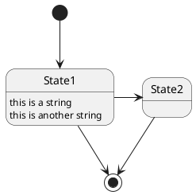

## Hide Empty Description

Use `hide empty description` to render states as simple boxes instead of showing an empty description compartment.

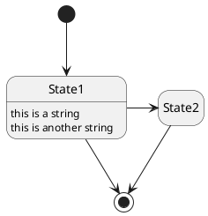

## Composite / Nested States

Define sub-states inside a `state Name { }` block. Composite states can be nested to arbitrary depth.

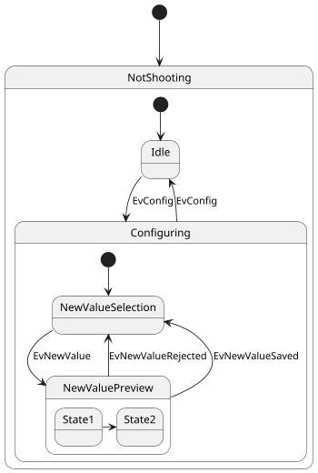

## Sub-state to Sub-state Transitions

Transitions can cross composite state boundaries by referencing inner states directly.

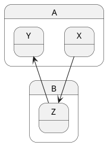

## Long State Names with Aliases

Use `as` keyword to assign a short alias to a state with a long display name. Newlines in names use `\n`.

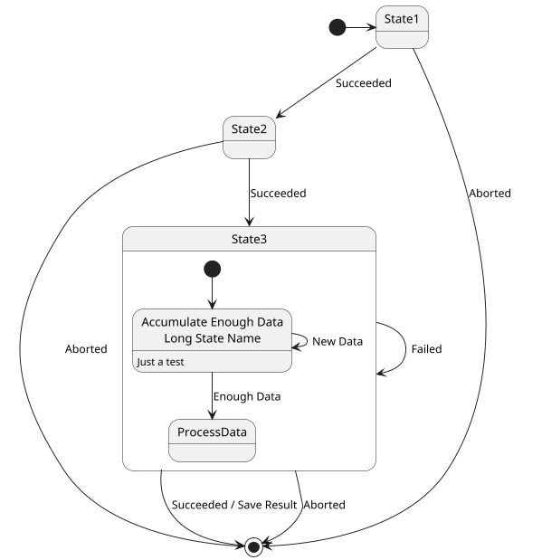

## State Aliases

Multiple syntax forms for declaring states with aliases.

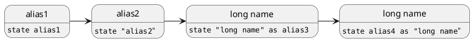

## State Aliases with Inline Descriptions


## Fork and Join

Use `<<fork>>` and `<<join>>` stereotypes for concurrent branching and synchronization.

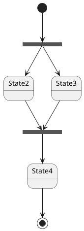

## Concurrent / Orthogonal States

Use `--` for horizontal separator or `||` for vertical separator to define concurrent regions within a composite state.

### Horizontal Separator (--)

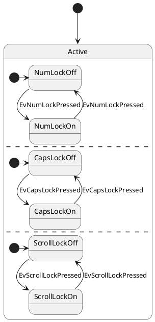

### Vertical Separator (||)

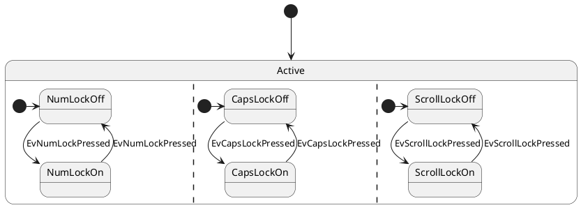

## Choice Pseudostate

Use `<<choice>>` stereotype for conditional branching with guard conditions in square brackets.

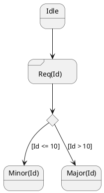

## All Stereotypes

PlantUML supports the following state stereotypes: `<<start>>`, `<<end>>`, `<<choice>>`, `<<fork>>`, `<<join>>`, `<<history>>`, `<<history*>>`, `<<sdlreceive>>`, `<<entryPoint>>`, `<<exitPoint>>`, `<<inputPin>>`, `<<outputPin>>`, `<<expansionInput>>`, `<<expansionOutput>>`.

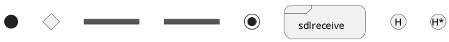

## Start, Choice, Fork, Join, End Combined

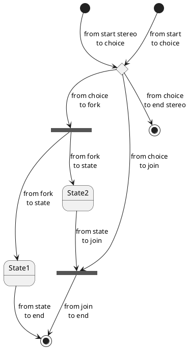

## History States

Use `[H]` for shallow history and `[H*]` for deep history within composite states. Also available as stereotypes `<<history>>` and `<<history*>>`.

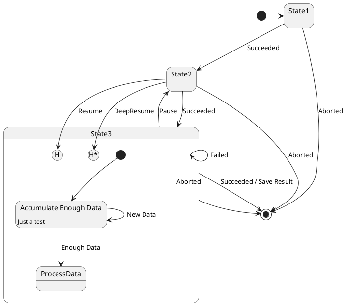

### History Stereotypes

```plantuml
@startuml
state A {
  state s1 as "Start 1"  <<start>>
  state s2 as "H 2"      <<history>>
  state s3 as "H 3"      <<history*>>
}
@enduml
```

## Entry and Exit Points

Use `<<entryPoint>>` and `<<exitPoint>>` stereotypes to define explicit entry/exit points on composite state borders.

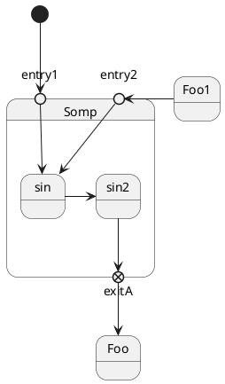

## Input and Output Pins

Use `<<inputPin>>` and `<<outputPin>>` stereotypes for pin notation on composite states.

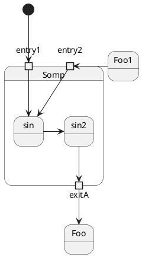

## Expansion Input and Output

Use `<<expansionInput>>` and `<<expansionOutput>>` stereotypes for expansion region notation.

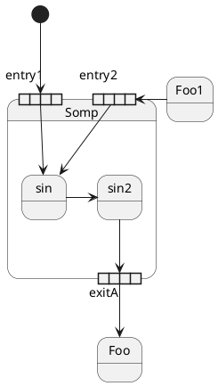

## Arrow Direction

Control arrow direction with `-up->`, `-down->`, `-left->`, `-right->`. Short forms: `-u->`, `-d->`, `-l->`, `-r->`.

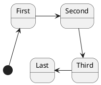

## Arrow Line Color and Style

Customize arrow color and line style using `[#color]`, `[dashed]`, `[dotted]`, `[bold]` inside the arrow.

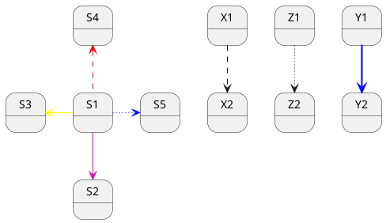

## Arrow Head and Tail Styles

Customize arrowheads with `x->` (crossed) and `->o` (circle) notation.

```plantuml
@startuml
state a
a -> b     :  ->
c x-> d    :  x->
e ->o f    :  ->o
g x->o h   :  x->o
@enduml
```

## Notes

### Notes on States

Position notes with `note left of`, `note right of`, `note top of`, `note bottom of`.

```plantuml
@startuml
[*] --> Active
Active --> Inactive

note left of Active : this is a short\nnote

note right of Inactive
  A note can also
  be defined on
  several lines
end note
@enduml
```

### Notes on Start/End Stereotypes

```plantuml
@startuml
state start <<start>>
start -> A
note left of start : this is a short note on start

state end <<end>>
A -> end
note right of end
  note
  on end
end note
@enduml
```

### Floating Notes

```plantuml
@startuml
state foo
note "This is a floating note" as N1
@enduml
```

### Notes on Transitions

Use `note on link` immediately after a transition to attach a note to that arrow.

```plantuml
@startuml
[*] -> State1
State1 --> State2
note on link
  this is a state-transition note
end note
@enduml
```

### Notes on Composite States

```plantuml
@startuml
[*] --> NotShooting

state "Not Shooting State" as NotShooting {
  state "Idle mode" as Idle
  state "Configuring mode" as Configuring
  [*] --> Idle
  Idle --> Configuring : EvConfig
  Configuring --> Idle : EvConfig
}

note right of NotShooting : This is a note on a composite state
@enduml
```

## Inline State Colors

Set background color with `#color` after the state name.

```plantuml
@startuml
state CurrentSite #pink {
  state HardwareSetup #lightblue {
    state Site #brown
    Site -[hidden]-> Controller
    Controller -[hidden]-> Devices
  }
  state PresentationSetup {
    Groups -[hidden]-> PlansAndGraphics
  }
  state Trends #FFFF77
  state Schedule #magenta
  state AlarmSupression
}
@enduml
```

## State Line Style and Color

Use `##[style]color` for border styling or the semicolon syntax `#background;line:color;line.style`.

### Hash Syntax

```plantuml
@startuml
state FooGradient #red-green ##00FFFF
state FooDashed #red|green ##[dashed]blue {
}
state FooDotted ##[dotted]blue {
}
state FooBold ##[bold] {
}
state Foo1 ##[dotted]green {
  state inner1 ##[dotted]yellow
}
state out ##[dotted]gold

state Foo2 ##[bold]green {
  state inner2 ##[dotted]yellow
}

inner1 -> inner2
out -> inner2
@enduml
```

### Semicolon Syntax

```plantuml
@startuml
state FooGradient #red-green;line:00FFFF
state FooDashed #red|green;line.dashed;line:blue {
}
state FooDotted #line.dotted;line:blue {
}
state FooBold #line.bold {
}
state Foo1 #line.dotted;line:green {
  state inner1 #line.dotted;line:yellow
}
state out #line.dotted;line:gold

state Foo2 #line.bold;line:green {
  state inner2 #line.dotted;line:yellow
}

inner1 -> inner2
out -> inner2
@enduml
```

### Detailed Inline Color Properties

Combine background, line, and text colors with styles.

```plantuml
@startuml
state s1 : s1 description
state s2 #pink;line:red;line.bold;text:red : s2 description
state s3 #palegreen;line:green;line.dashed;text:green : s3 description
state s4 #aliceblue;line:blue;line.dotted;text:blue : s4 description
@enduml
```

## Skinparam

Customize global appearance using `skinparam`. Supports stereotype-specific styling with `<<StereotypeName>>`.

```plantuml
@startuml
skinparam backgroundColor LightYellow
skinparam state {
  StartColor MediumBlue
  EndColor Red
  BackgroundColor Peru
  BackgroundColor<<Warning>> Olive
  BorderColor Gray
  FontName Impact
}

[*] --> NotShooting

state "Not Shooting State" as NotShooting {
  state "Idle mode" as Idle <<Warning>>
  state "Configuring mode" as Configuring
  [*] --> Idle
  Idle --> Configuring : EvConfig
  Configuring --> Idle : EvConfig
}

NotShooting --> [*]
@enduml
```

### All Skinparam State Properties

```plantuml
@startuml
skinparam State {
  AttributeFontColor blue
  AttributeFontName serif
  AttributeFontSize 9
  AttributeFontStyle italic
  BackgroundColor palegreen
  BorderColor violet
  EndColor gold
  FontColor red
  FontName Sanserif
  FontSize 15
  FontStyle bold
  StartColor silver
}

state A : a a a\na
state B : b b b\nb

[*] -> A  : start
A  -> B  : a2b
B  -> [*] : end
@enduml
```

## Style Block (Modern Syntax)

Use `<style>` blocks as a modern alternative to skinparam.

```plantuml
@startuml
<style>
stateDiagram {
  BackgroundColor Peru
  FontName Impact
  FontColor Red
  arrow {
    FontSize 13
    LineColor Blue
  }
}
</style>

[*] --> NotShooting

state "Not Shooting State" as NotShooting {
  state "Idle mode" as Idle <<Warning>>
  state "Configuring mode" as Configuring
  [*] --> Idle
  Idle --> Configuring : EvConfig
  Configuring --> Idle : EvConfig
}

NotShooting --> [*]
@enduml
```

### Diamond Styling for Choice States

```plantuml
@startuml
<style>
diamond {
  BackgroundColor #palegreen
  LineColor #green
  LineThickness 2.5
}
</style>

state state1
state state2
state choice1 <<choice>>
state end3 <<end>>

state1  --> choice1 : 1
choice1 --> state2  : 2
choice1 --> end3    : 3
@enduml
```

### Styling Nested State Bodies with CSS Class

```plantuml
@startuml
<style>
.foo {
  state,stateBody {
    BackGroundColor lightblue;
  }
}
</style>

state MainState <<foo>> {
  state SubA
}
@enduml
```

## State Descriptions

```plantuml
@startuml
hide empty description

state s0
state "This is the State 1" as s1 {
  s1 : State description
  state s2
  state s3 : long descr.
  state s4
  s4 : long descr.
}

[*] -> s0
s0 --> s2
s2 -> s3
s3 -> s4
@enduml
```

## JSON Data Embedding

Embed JSON data alongside state diagrams.

```plantuml
@startuml
state "A" as stateA
state "C" as stateC {
  state B
}

json jsonJ {
  "fruit":"Apple",
  "size":"Large",
  "color": ["Red", "Green"]
}
@enduml
```

## Quick Reference

| Syntax | Description |
|---|---|
| `[*]` | Initial and final pseudostate |
| `-->` | Transition (default direction) |
| `-up->`, `-down->`, `-left->`, `-right->` | Directional transitions |
| `-[#color]->` | Colored arrow |
| `-[dashed]->`, `-[dotted]->`, `-[bold]->` | Styled arrow |
| `state Name { }` | Composite state |
| `state "Long Name" as alias` | State with alias |
| `State : description` | State description |
| `--` | Horizontal concurrent separator |
| `\|\|` | Vertical concurrent separator |
| `<<fork>>`, `<<join>>` | Fork/join bars |
| `<<choice>>` | Conditional branch diamond |
| `<<start>>`, `<<end>>` | Explicit start/end |
| `<<history>>`, `<<history*>>` | Shallow/deep history |
| `<<entryPoint>>`, `<<exitPoint>>` | Entry/exit points |
| `<<inputPin>>`, `<<outputPin>>` | Input/output pins |
| `<<expansionInput>>`, `<<expansionOutput>>` | Expansion regions |
| `<<sdlreceive>>` | SDL receive symbol |
| `#color` | State background color |
| `##[style]color` | State border style and color |
| `note left of / right of` | Note on a state |
| `note on link` | Note on a transition |
| `hide empty description` | Compact state rendering |
| `skinparam state { }` | Global styling |
| `<style> stateDiagram { } </style>` | Modern CSS-like styling |

## Validation

After writing a `.puml` file or a PlantUML fenced block in Markdown, always validate the syntax:

- **Local** (preferred): `bash ${CLAUDE_PLUGIN_ROOT}/scripts/validate.sh <file.puml>`
- **Online** (fallback): `uv run ${CLAUDE_PLUGIN_ROOT}/scripts/validate_online.py <file.puml>`

For PlantUML blocks embedded in Markdown, extract the content to a temporary `.puml` file before validating. If validation fails, read the error output, fix the syntax, and re-validate.
