> Source: https://plantuml.com/timing-diagram

# PlantUML Timing Diagram Reference

## Participant Types

Timing diagrams support six participant types. Each type renders signals differently.

| Type | Description |
|------|-------------|
| `robust` | Complex line signal with multiple named states |
| `concise` | Simplified signal for data movement |
| `rectangle` | Similar to concise but rendered within a rectangle shape |
| `clock` | Repeatedly transitions with configurable period, pulse, and offset |
| `binary` | Restricted to exactly 2 states (`high`/`low` or `0`/`1`) |
| `analog` | Continuous signals with linear interpolation between values |

```plantuml
@startuml
robust "Web Browser" as WB
concise "Web User" as WU
rectangle "Rect. Web User" as RWU

@0
WB is Idle
WU is Idle
RWU is Idle

@100
WB is Processing
WU is Waiting
RWU is Waiting
@enduml
```

## Defining States with Robust Signals

Robust signals can have multiple named states. Use `is` to set the current state at a given time.

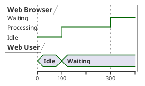

## Binary and Clock Signals

Binary signals are limited to `high`/`low` (or `0`/`1`). Clock signals repeat automatically based on period.

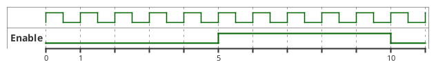

## Clock Parameters

Clock signals support `period`, `pulse` (high duration), and `offset` (start delay).

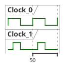

## State Changes Using @ Notation

Use `@<time>` to specify when state changes occur.

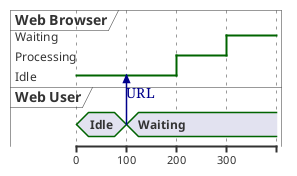

## Relative Time with @+

Use `@+<offset>` to specify time relative to the previous event.

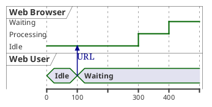

## Participant-Oriented Definition

Instead of time-oriented blocks, you can define all transitions for a single participant on one line.

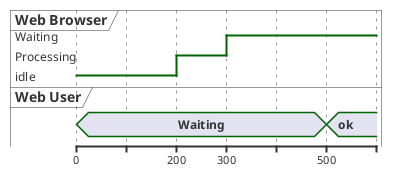

## Anchor Points

Name specific times for reuse with `as :label`. Reference them later with `@:label`.

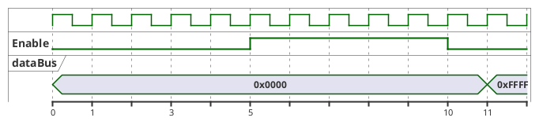

## Decimal Time Values

Time values can be decimal numbers.

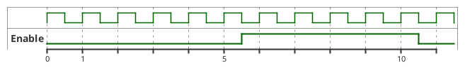

## Negative Time Values

Negative time values are supported.

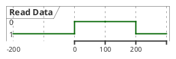

## Adding Messages Between Participants

Use `->` to draw a message arrow between participants. You can specify arrival time with `@+offset`.

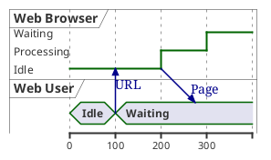

## Initial State

Set an initial state before any `@` time notation. This sets the state from the beginning of the diagram.

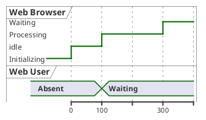

## Setting Scale

Use `scale` to control the horizontal size of the diagram.

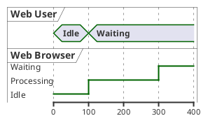

## Defining States by Clock Reference

Use `@<clock>*<tick>` to reference specific clock ticks.

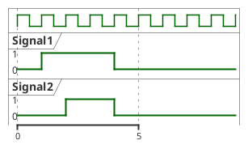

## Defining States by Signal Reference

Use `@<signal>` to group state changes relative to a signal.

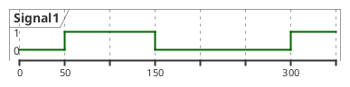

## Intricated (Undefined) Robust States

Show uncertain or transitional states by listing multiple values in braces `{a,b}`.

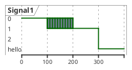

## Intricated Binary States

Binary signals can also show undefined/transitional states.

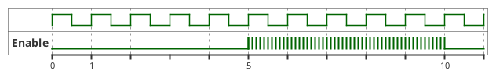

## Hidden States

Use `{-}` for a break in the signal and `{hidden}` to completely hide a section.

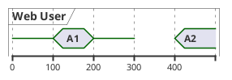

## Ordering Robust Signal States

Use `has` to declare and order the states for a robust signal.

**Without explicit ordering:**

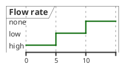

**With explicit ordering:**

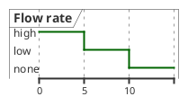

**With ordering and labels:**

```plantuml
@startuml
robust "Flow rate" as rate
rate has "35 gpm" as high
rate has "15 gpm" as low
rate has "0 gpm" as none

@0
rate is high

@5
rate is low

@10
rate is none
@enduml
```

## Analog Signals

Analog signals produce continuous waveforms with linear interpolation between values.

```plantuml
@startuml
analog "Analog" as A

@0
A is 0

@100
A is 350

@200
A is 200

@300
A is 400

@400
A is 0
@enduml
```

## Analog Signal Range

Use `between <min> and <max>` to set the Y-axis range.

```plantuml
@startuml
analog "Analog" between 0 and 500 as A

@0
A is 0

@100
A is 350

@200
A is 200

@300
A is 400

@400
A is 0
@enduml
```

## Analog Signal Customization

Use `ticks num on multiple` to control Y-axis tick marks and `is <n> pixels height` for height.

```plantuml
@startuml
analog "VCC" between -4.5 and 6.5 as VCC
VCC ticks num on multiple 3
VCC is 200 pixels height

@0
VCC is 0

@100
VCC is 5

@200
VCC is -3

@300
VCC is 5
@enduml
```

## Time Constraints and Delays

Show timing constraints between events using `<->` notation.

```plantuml
@startuml
robust "Web Browser" as WB
concise "Web User" as WU

@0
WU is Idle
WB is Idle

@100
WU is Waiting
WB is Processing

@300
WB is Waiting

WB@0 <-> @50 : {50 ms lag}
@200 <-> @+150 : {150 ms}
@enduml
```

## Highlighted Periods

Use `highlight` to shade a time region. Supports colors and captions.

```plantuml
@startuml
robust "Web Browser" as WB
concise "Web User" as WU

@0
WU is Idle
WB is Idle

@100
WU is Waiting
WB is Processing

@300
WB is Waiting

highlight 200 to 450 #Gold;line:DimGrey : This is my caption
highlight 500 to 600 : Another highlight
@enduml
```

## Adding Notes

Use `note top of` and `note bottom of` to add notes to participants at specific times.

```plantuml
@startuml
robust "Web Browser" as WB
concise "Web User" as WU

@0
WU is Idle
WB is Idle

@100
WU is Waiting
note top of WU : first note\non several\nlines
WB is Processing
note bottom of WB : second note\non several\nlines
@enduml
```

## Adding Colors to States

Append a color code after the state value to color individual states.

```plantuml
@startuml
concise "LR" as LR

LR is AtPlace #palegreen

@200
LR is Lowered #pink

@400
LR is Raised #palegreen

@600
LR is Lowered #pink
@enduml
```

## Annotating Signals with Comments

Add inline text annotations after a colon on state declarations.

```plantuml
@startuml
scale 5 as 150 pixels

clock clk with period 1
binary "D" as D

@-3
D is low: idle

@-1
D is high: start

@0
D is low: 1 lsb

@1
D is high: 0

@2
D is low: 0

@3
D is low: 0

@4
D is low: 0

@5
D is high: 1

@6
D is low: 0

@7
D is high: 1 msb

@0 <-> @8 : Serial data bits
@enduml
```

## Date Format Usage

Use dates instead of numeric time values.

```plantuml
@startuml
robust "Web Browser" as WB
concise "Web User" as WU

@2019/07/02
WU is Idle
WB is Idle

@2019/07/04
WU is Waiting : some note

@2019/07/05
WB is Processing
@enduml
```

## Time Format (HH:MM:SS)

Use clock time instead of numeric values.

```plantuml
@startuml
robust "Web Browser" as WB
concise "Web User" as WU

@1:15:00
WU is Idle
WB is Idle

@1:16:30
WU is Waiting : some note

@1:17:30
WB is Processing
@enduml
```

## Custom Date Format

Use `use date format` to specify how dates are parsed.

```plantuml
@startuml
use date format "YY-MM-dd"

robust "Web Browser" as WB
concise "Web User" as WU

@19-07-02
WU is Idle
WB is Idle

@19-07-04
WU is Waiting

@19-07-05
WB is Processing
@enduml
```

## Manual Time Axis

Use `manual time-axis` so labels appear only at state-change points instead of every tick.

```plantuml
@startuml
manual time-axis
scale 100 as 50 pixels

concise "Web User" as WU
robust "Web Browser" as WB

@0
WU is Idle
WB is Idle

@100
WU is Waiting
WB is Processing

@300
WB is Waiting
@enduml
```

## Hide Time Axis

Use `hide time-axis` to completely remove the time axis.

```plantuml
@startuml
hide time-axis
concise "Web User" as WU

WU is Absent

@0
WU is Waiting

@500
WU is ok
@enduml
```

## Compact Mode

Reduce vertical spacing between participants. Can be applied globally or per-participant.

**Global compact mode:**

```plantuml
@startuml
mode compact
robust "Web Browser" as WB
concise "Web User" as WU

@0
WU is Idle
WB is Idle

@100
WU is Waiting
WB is Processing

@300
WB is Waiting
@enduml
```

**Per-participant compact mode:**

```plantuml
@startuml
compact robust "Web Browser" as WB
compact concise "Web User" as WU

@0
WU is Idle
WB is Idle

@100
WU is Waiting
WB is Processing

@300
WB is Waiting
@enduml
```

## Title, Header, Footer, Legend, and Caption

Add document-level annotations.

```plantuml
@startuml
Title This is my title
header: some header
footer: some footer
legend
  Some legend
end legend
caption some caption

robust "Web Browser" as WB
concise "Web User" as WU

@0
WU is Idle
WB is Idle

@100
WU is Waiting
WB is Processing
@enduml
```

## Styling with `<style>`

Use CSS-like `<style>` blocks to customize appearance.

```plantuml
@startuml
<style>
timingDiagram {
  document {
    BackGroundColor SandyBrown
  }
  constraintArrow {
    LineStyle 2-1
    LineThickness 3
    LineColor Blue
  }
}
</style>

robust "Web Browser" as WB
concise "Web User" as WU

@0
WU is Idle
WB is Idle

@100
WU is Waiting
WB is Processing

@300
WB is Waiting

WB@0 <-> @50 : {50 ms lag}
@enduml
```

## Stereotypes for Per-Signal Styling

Apply named styles to individual signals using `<<stereotype>>`.

```plantuml
@startuml
<style>
timingDiagram {
  .red {
    LineColor red
  }
  .blue {
    LineColor blue
    LineThickness 5
  }
}
</style>

<<blue>> binary "Output Signal 1" as OS1
<<red>> binary "Input Signal 1" as IS1

@0
OS1 is low
IS1 is low

@5
OS1 is high
IS1 is high

@10
OS1 is low
IS1 is low
@enduml
```

## Complete Digital Hardware Example

Combines clock, binary, concise signals with anchors, highlights, and constraints.

```plantuml
@startuml
scale 5 as 150 pixels

clock clk with period 1
binary "enable" as en
binary "R/W" as rw
binary "data Valid" as dv
concise "dataBus" as db
concise "address bus" as addr

@6 as :write_beg
@10 as :write_end
@15 as :read_beg
@19 as :read_end

@0
en is low
db is "0x0"
addr is "0x03f"
rw is low
dv is 0

@:write_beg-3
en is high

@:write_beg-2
db is "0xDEADBEEF"

@:write_beg-1
dv is 1

@:write_beg
rw is high

@:write_end
rw is low
dv is low

highlight :write_beg to :write_end #Gold : Write

db@:write_beg-1 <-> @:write_end : setup time
@enduml
```

## Complete Web Caching Example

Demonstrates messages, relative time, and multi-participant interactions.

```plantuml
@startuml
concise "Client" as Client
concise "Server" as Server
concise "Response freshness" as Cache

Server is idle
Client is idle

@0
Client is send
Client -> Server@+25 : GET

@+25
Client is await

@+75
Client is recv

@+25
Client is idle

@+25
Client is send
Client -> Server@+25 : GET\nIf-Modified-Since: 150

@+25
Client is await

@+50
Client is recv

@+25
Client is idle

@100 <-> @275 : no need to re-request

@Server
25 is recv
+25 is work
+25 is send
Server -> Client@+25 : 200 OK\nExpires: 275
+25 is idle
+75 is recv
+25 is send
Server -> Client@+25 : 304 Not Modified
+25 is idle

@Cache
75 is fresh
+200 is stale
@enduml
```
