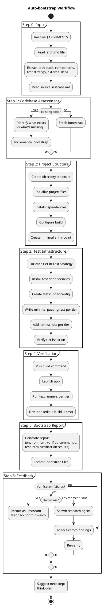

# auto-bootstrap

Takes an architecture document and sets up a working development base — project structure, dependencies, build configuration, and test infrastructure. Runs autonomously with no user interaction.

## Current Notes

- **Primary file:** `plugins/think/skills/auto-bootstrap/SKILL.md`
- **Current behavior:** Runs from an `.arch.md` input, writes a bootstrap report, and may launch the `api-researcher` agent only when environment-level verification failures need source-grounded fixes.

## Workflow

