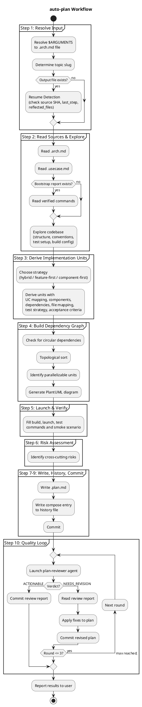

# auto-plan

Autonomously generates a complete implementation plan from an architecture document — no human interaction. Makes all decisions independently, records assumptions, and refines through quality review loops.

## Workflow

