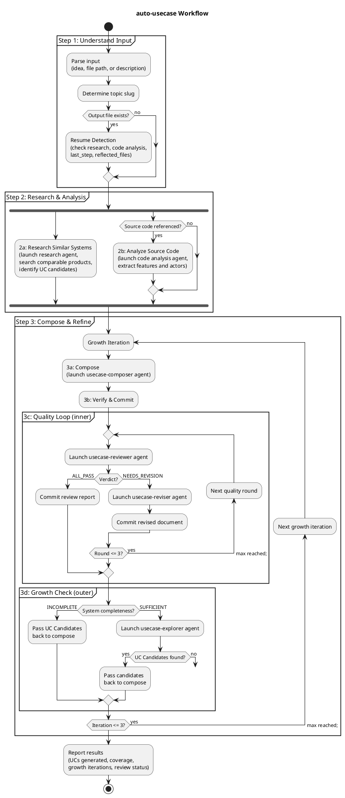

# auto-usecase

Autonomously generates a complete Use Case document from an idea or brainstorm input — no human interaction. Runs research, composes, reviews, and expands through iterative growth loops.

## Current Notes

- **Primary file:** `plugins/think/skills/auto-usecase/SKILL.md`
- **Current behavior:** Runs autonomously from an idea or source file, writes `A4/<slug>.usecase.md`, and coordinates research / review / exploration reports for incremental resume support.

## Workflow

