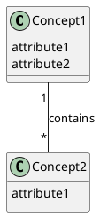
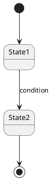
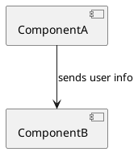
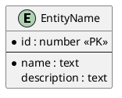
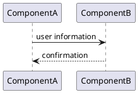

# Specification Output Template

## File Path

`A4/co-think/<topic-slug>.spec.md`

## Frontmatter

```yaml
---
type: spec
pipeline: co-think
topic: "<topic>"
created: <YYYY-MM-DD HH:mm>
revised: <YYYY-MM-DD HH:mm>
revision: 0
status: draft | final
sources:
  - file: <topic-slug>.usecase.md
    revision: <usecase revision at time of reading>
    sha: <git hash-object output at time of reading>
reflected_files: []
tags: []
---
```

## Template

```markdown
# Specification: <topic>
> Source: [<usecase-file-name>](./<usecase-file-name>)

## Overview
<Brief summary of what this software does, who it's for, and the key design decisions. Updated as the spec grows across phases.>

## Technology Stack

| Category | Choice | Rationale |
|----------|--------|-----------|
| Language | <e.g., TypeScript> | <why> |
| Framework | <e.g., Next.js> | <why> |
| <other category> | <choice> | <why> |

<Auto-detected from codebase in Step 0, or specified by the user. Must be filled before finalization.>

---

## Functional Requirements

### Use Case Reference
<List all Use Cases from the source file for traceability. If any were decomposed, show the sub-use-cases with a note referencing the original.>

### [FR-1]. <short title>
> Use Case: [UC-1]

<!-- For UI -->
**Type:** UI
**Screen/View:** <where this happens>
**User action:** <what the user does>
**System behavior:**
1. <step 1>
2. <step 2>
...
**Validation:** <input rules, constraints>
**Error handling:** <what happens when things go wrong>
**Mock:** <path to mock HTML file, if created>

<!-- For Non-UI -->
**Type:** Non-UI
**Trigger:** <what initiates this>
**Input:** <format, parameters, validation>
**Processing:** <business logic, rules, steps>
**Output:** <format, structure, response>
**Error handling:** <failure modes, error responses>

**Dependencies:** <other FRs this depends on, if any>

### [FR-2]. <short title>
> Use Case: [UC-1], [UC-2]
...

### UI Screen Groups

| Screen | FRs | Mock |
|--------|-----|------|
| <screen name> | FR-1, FR-3 | [mock](<path to mock HTML>) |

### Screen Navigation

```plantuml
@startuml
(*) --> Dashboard
Dashboard --> "Detail View" : clicks item
Dashboard --> Settings : clicks settings icon
"Detail View" --> Dashboard : clicks back
Settings --> Dashboard : clicks done
@enduml
```

<Text explanation of navigation transitions and entry points.>

### Authorization Rules

| FR | <Actor/Role 1> | <Actor/Role 2> | <System> |
|----|----------------|----------------|----------|
| FR-1. <title> | write | read | — |
| FR-2. <title> | write | — | — |
| FR-3. <title> | read | read | execute |

<Access levels: `read`, `write`, `execute`, `—` (no access). Text explanation of authorization model and any special rules.>

### Non-Functional Requirements

| NFR | Description | Affected FRs | Measurable Criteria |
|-----|-------------|-------------|---------------------|
| <e.g., Performance> | <description> | FR-1, FR-3 | <e.g., response time < 200ms> |

### Open Questions
<Unresolved decisions or ambiguities to revisit.>

---

## Domain Model

### Domain Glossary

| Concept | Definition | Key Attributes | Related FRs |
|---------|-----------|----------------|-------------|
| <name>  | <definition> | <1-2 key attributes> | [FR-1], [FR-3] |

### Concept Relationships



<Text explanation of each relationship>

### State Transitions

#### <Entity Name>



<Text explanation of states, transitions, and conditions>

---

## Architecture

### External Dependencies

| External System | Used By | Purpose | Fallback |
|----------------|---------|---------|----------|
| <e.g., OAuth Provider> | FR-1, FR-2 | <purpose> | <what happens if unavailable> |

<Text explanation of each dependency: what is sent/received, constraints, provider choice.>

### Technology Choices
<Additional technology decisions beyond the Technology Stack (e.g., database, ORM, testing framework). Only present if choices were made.>

| Choice | Decision | Rationale |
|--------|----------|-----------|
| Database | PostgreSQL | Relational data, team experience |

### Component Diagram



<Text explanation of components and their responsibilities.>

### Components

#### <Component Name>

**Responsibility:** <what this component does>
**Data store:** Yes / No

##### DB Schema *(only if Data store: Yes)*



<Text explanation of entities and relationships.>

##### Information Flow

###### Use Case: <UC reference>



<Text explanation of the flow for this use case.>

##### Interface Contracts

| Operation | Direction | Request | Response | Notes |
|-----------|-----------|---------|----------|-------|
| <operation name> | <ComponentA → ComponentB> | <request schema> | <response schema> | <e.g., event, sync, async> |

<Text explanation of the contracts. May be incomplete in early iterations — see Open Items for what remains.>

### Consistency Check
<Results of cross-diagram and cross-phase consistency check. Any gaps identified and how they were resolved.>

---

## Spec Feedback
- [FR-3], [FR-5]: <reason and explanation> → #<issue-number>

## Open Items

| Section | Item | What's Missing | Priority |
|---------|------|---------------|----------|
| <section> | <item reference> | <specific gap description> | High / Medium / Low |

## Next Steps
- <suggested work items for next iteration, derived from Open Items>
```

**Issue reference links:** See [issue-links.md](../../references/issue-links.md). FR and UC references use their canonical IDs (FR-1, UC-1) throughout the document.

## Required Sections

- Overview
- Technology Stack (must be filled before `status: final`)
- Functional Requirements (with Use Case Reference)
- Domain Model (Glossary, Concept Relationships)
- Open Items
- Next Steps

## Conditional Sections

- State Transitions — only if stateful entities exist
- Architecture — only if the session reaches this phase
- Technology Choices (Architecture) — only if additional choices beyond Technology Stack were made
- Authorization Rules — only if actors have different privilege levels
- Non-Functional Requirements — only if the user specifies NFRs
- UI Screen Groups — only if UI use cases exist
- Screen Navigation — only if UI Screen Groups exist
- External Dependencies — only if the system uses external services
- Interface Contracts (per component boundary) — progressively filled across iterations; required for `status: final`
- DB Schema (per component) — only if `Data store: Yes`
- Spec Feedback — only if feedback issues were created
- Open Questions — only if unresolved topics remain

## Diagram References

- **Class diagram (domain)**: [PlantUML Class Diagram](https://plantuml.com/class-diagram)
- **State diagram**: [PlantUML State Diagram](https://plantuml.com/state-machine-diagram)
- **Component diagram**: [PlantUML Component Diagram](https://plantuml.com/component-diagram)
- **Sequence diagram**: [PlantUML Sequence Diagram](https://plantuml.com/sequence-diagram)
- **IE diagram (DB schema)**: [PlantUML IE Diagram](https://plantuml.com/ie-diagram)
