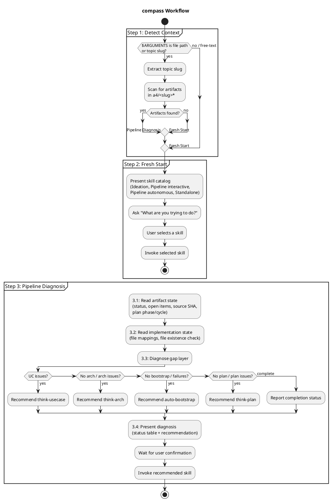

# compass

Pipeline navigator that helps users find the right skill or diagnose the next step in an ongoing pipeline. Acts as an entry point when the user doesn't know where to start or is stuck mid-pipeline.

## Current Notes

- **Primary file:** `plugins/think/skills/compass/SKILL.md`
- **Current behavior:** Acts as the navigation entry point for the think pipeline. It inspects existing `a4/` artifacts first and then recommends or invokes the next skill.

## Workflow

