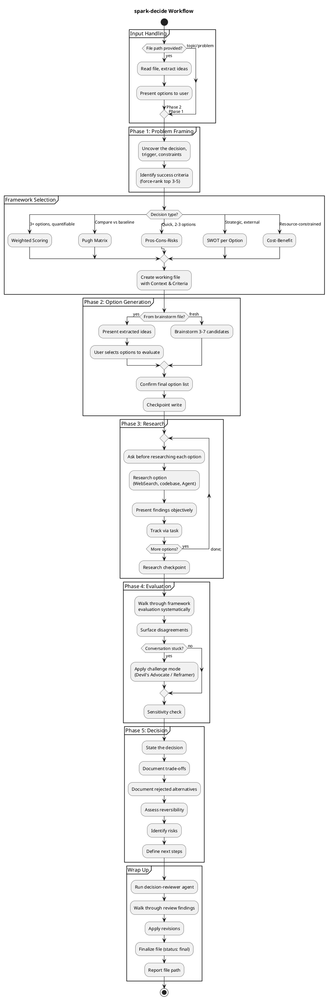

# spark-decide

A solution discovery facilitator that helps move from multiple options to a well-reasoned decision through structured research and evaluation. Produces an Architecture Decision Record (ADR) with rationale, rejected alternatives, and next steps.

## Workflow

